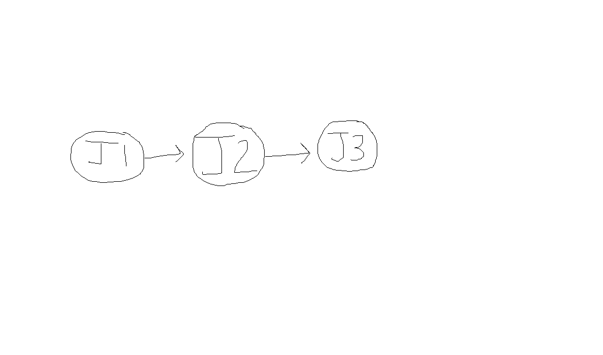

### {#section-14 .unnumbered}

### Control flow

- Much like programming languages, in GitHub Actions (GHA) you can conditionally allow steps or jobs to run based on conditions. Conditions are simply "if" statements that assert if a specified condition is true. For example, if the branch is equal to main, then therefore run this step, otherwise, skip it. While it is possible to write the "if" statements in the script block itself (assuming it is not a GHA), using "ifs" in the step block shows that the step is skipped on the UI, which is clearer when trying to debug an issue, as you know if the step definitely did not run.

- +-----------------------------------------------------------------------+
  | using System; |
  | |
  | using System.Collections.Generic; |
  | |
  | class Program |
  | |
  | { |
  | |
  | static void Main() |
  | |
  | { |
  | |
  | var steps = new List<Func<bool>> { Step1, Step2, Step3 }; |
  | |
  | for (int i = 0; i < steps.Count; i++) |
  | |
  | { |
  | |
  | bool stepDidSucceed = steps[i].Invoke()? |
  | |
  | if (!stepDidSucceed) |
  | |
  | { |
  | |
  | Console.WriteLine($"Step ${i} failed"); |
  | |
  | // optionally fail workflow here |
  | |
  | } |
  | |
  | } |
  | |
  | Console.WriteLine("Workflow succeeded"); |
  | |
  | } |
  | |
  | static bool Step1() => ExecuteStep("Step 1"); |
  | |
  | static bool Step2() => ExecuteStep("Step 2"); |
  | |
  | static bool Step3() => ExecuteStep("Step 3"); |
  | |
  | static bool ExecuteStep(string stepName) |
  | |
  | { |
  | |
  | try |
  | |
  | { |
  | |
  | Console.WriteLine($"{stepName} executed"); |
  | |
  | return true; // Assume success for simplicity |
  | |
  | } |
  | |
  | catch |
  | |
  | { |
  | |
  | Console.WriteLine($"{stepName} failed"); |
  | |
  | return false; |
  | |
  | } |
  | |
  | } |
  | |
  | } |
  +=======================================================================+
  +-----------------------------------------------------------------------+

-

- There are four states for steps and jobs: skipped, failed, success, and cancelled. These states are independent, and are used very carefully in the following text. If something is cancelled, it does not imply failure, and so on for the other steps. Cancelled occurs when the workflow is cancelled (manually, in the UI.)

- Error handling is very different in GHA than it is in other programming languages. If a step fails, it means that the other steps still have the eligibility to run, but by default, do not run should there be a failure in one of the previous steps. This is very different from other programming languages, where an exception or error (if unhandled) would terminate the program.

- In GitHub Actions workflows, every step implicitly carries a default "if" condition, which is `success()`. This condition means a step will only execute if all preceding steps in the job do not have a status of "failed" and do not have a status of "cancelled", otherwise, it will be marked as skipped and will not run. If a step fails, subsequent steps in the job, by default, will not run due to this implicit `success()` condition, although they are eligible to do so (we will see this later on.) Essentially, a failed step acts like a 'poison waterfall', preventing the execution of the following steps, unless they explicitly define a different "if" condition to override this default behavior.

- The benefits of using control flow (instead of relegating it to the script) is that if the step is skipped or canceled, it will show up as so on the UI. If you try to skip the step by wrapping your script in a huge "if" statement in the script block, then technically, your script did run, just not for very long (and so it might not be clear it was skipped.) This can be helpful for debugging.

- Here is an illustration of the implicit "success" conditions for all steps, if you do not specify an "if" condition.

+-------------------------------------------------------------------------------------------------------------------------------------------------------------------------------------------------------------------------------------------------------------------------------+
| name: Node.js CI |
| |
| on: |
| |
| push: |
| |
| branches: [ master ] |
| |
| pull_request: |
| |
| branches: [ master ] |
| |
| jobs: |
| |
| build: |
| |
| runs-on: ubuntu-latest |
| |
| strategy: |
| |
| matrix: |
| |
| node-version: [12.x, 14.x, 16.x] |
| |
| steps: |
| |
| - uses: actions/checkout@v2 |
| |
| - name: Use Node.js ${{ matrix.node-version }} |
| |
| uses: actions/setup-node@v1 |
| |
| with: |
| |
| node-version: ${{ matrix.node-version }} |
| |
| - name: Install Dependencies |
| |
| if: success() |
| |
| run: npm install |
| |
| - name: Run Tests |
| |
| if: success() # imagine that the "Install dependencies" step failed. Then, by default, this step (and all steps after this) would be skipped, and this job would be marked as a failure, which would cause the workflow to be marked as a failure. Exceptions bubble up. |
| |
| run: npm test |
| |
| - name: Compile Code |
| |
| if: success() # runs only if "Install Dependencies" and "Run Tests" was successful or skipped. |
| |
| run: npm run compile |
| |
| - name: Lint Code |
| |
| if: success() # runs only if "Install Dependencies", "Run Tests", "Compile Code" were successful or skipped. |
| |
| run: npm run lint |
+===============================================================================================================================================================================================================================================================================+
|-------------------------------------------------------------------------------------------------------------------------------------------------------------------------------------------------------------------------------------------------------------------------------|

- In this case, "Run Tests" will run if the subsequent step "Install Dependencies" was successful, and so on. If the previous step was not successful, i.e., it failed or was skipped, then the subsequent step will also be skipped, thus, the poison waterfall is started.

- The way that you can execute the step irregardless of whether you are in the poison waterfall, or for example when the prior steps failed, is with the "always()" if statement, which will always run the step. This protects this step against the poison waterfall, and is useful for cleanups if there was a failure in the workflow, or a few other things.

- +--------------------------------------------------------------------------------------------------------------------------------------------------------------------------------------------------------------------------------------------------------------------------------------------------------------------------------------------------------+
  | name: Node.js CI |
  | |
  | on: |
  | |
  | push: |
  | |
  | branches: [ master ] |
  | |
  | pull_request: |
  | |
  | branches: [ master ] |
  | |
  | jobs: |
  | |
  | build: |
  | |
  | runs-on: ubuntu-latest |
  | |
  | strategy: |
  | |
  | matrix: |
  | |
  | node-version: [12.x, 14.x, 16.x] |
  | |
  | steps: |
  | |
  | - uses: actions/checkout@v2 |
  | |
  | - name: Use Node.js ${{ matrix.node-version }} |
  | |
  | uses: actions/setup-node@v1 |
  | |
  | with: |
  | |
  | node-version: ${{ matrix.node-version }} |
  | |
  | - name: Install Dependencies |
  | |
  | if: success() |
  | |
  | run: npm ci |
  | |
  | - name: Run Tests |
  | |
  | if: success() |
  | |
  | run: npm test |
  | |
  | - name: Publish Test Results |
  | |
  | if: always() # imagine that one of the tests failed, causing the "Run Tests" step to fail. In this case, this step would still run because we're using an "always()" condition. You may want to use success() && !cancelled() here, otherwise, cancelling will interrupt the current step and will check if subsequent steps are eligible to run. |
  | |
  | run: <publish test results here> |
  | |
  | - name: Lint Code |
  | |
  | if: success() # This step would not run, because one of the previous steps (Run Tests) failed. |
  | |
  | run: npm run lint |
  +========================================================================================================================================================================================================================================================================================================================================================+
  +--------------------------------------------------------------------------------------------------------------------------------------------------------------------------------------------------------------------------------------------------------------------------------------------------------------------------------------------------------+

-

- When a step fails, it is usually something unexpected or unhandled. Failing is good: if you were to keep running, it might be possible to publish corrupted build artifacts for example, or it might not make sense to continue, for example, if npm ci failed, then no tests can run because the dependencies aren't installed. You have to know when to intervene.

- Sometimes, however, things are not really failures but just sort of ok. For example, say a cache key wasn't found. This is a failure, but it doesn't really matter because the cache can be regenerated. It isn't critical to the workflow, the workflow can still run and it might have to regenerate the cache. In this case, the step would be considered optional to the workflow. It's probably useful to report that it wasn't restored from cache, for example, if you're looking through the logs and are wondering why the build times are slower for example (or there is something wrong with the cache key.) A failure would be if there is an HTTP error on GitHub's side and one of the artifact endpoints was down, for example, or the transfer was interrupted.

- The step should succeed if its goal is satisfied at the end of the step. What is the goal for each step? For example, npm ci. If it had to retry five times, but it succeeded and installed the modules successfully, then therefore it was successful. It doesn't matter too much if it tries and fails a few times, the goal is met. This doesn't mean that you shouldn't log the fact that it took a few times to complete, rather, it just shouldn't fail the step because when a step fails, it causes all subsequent steps to fail. In order to go against this default behavior, you will have to make your workflow very verbose by explicitly allowing each step to continue if this specific step failed, plus, making sure that it fails on all of the other steps. This is very tedious, error prone, and requires significant adjustments if any steps are changed. Therefore, it makes sense to use the defaults and make the step pass.

- On the opposite side, "failure()" will run only if any of the previous steps has failed. This is useful for publishing diagnostic logs that would otherwise not be published (because they might be large, or it might be time consuming to generate them as you may have to run multiple debugging commands.)

- There are two more, which are a bit scary. always() will always execute the step, no matter what. And cancelled() will only execute if the workflow was cancelled. Both of these cannot be cancelled.

- Again, continuing with the poison metaphor, if one of the steps failed, then the entire workflow shows up as failed as well. So, the failure of the workflow is a cause for concern, and is also linked to different integrations, such as bringing attention to the workflow when it fails, because this is critical to operations and having a fast feedback loop.

- If you find yourself having to write a bunch of "if" statements to protect yourself from the poison waterfall, check if the step that you're running is truly critical if it fails. And on the opposite side, if you're having to do a bunch of checks to see if the previous step, was, indeed, successful, and having to check a bunch of files and such, then in that case, make sure that the step is actually failing when it is not able to complete its goal.

- "if" statements are not limited to control checks like these. They are much more powerful, for example, you can determine if the trigger was a push, a new tag push/code, which branch it was pushed to, etc. and also combine many together. Be careful to not overcomplicate the script, and instead, make sure that those higher-level checks are put in the trigger, workflow, or job instead if they make sense to prevent duplication and make it clearer which code or steps are running.--if an entire job was skipped, it is clearer than skipping all steps individually.

- **Warning: be very careful with always() and cancelled(), because these jobs cannot be cancelled through the UI.** You can use the [[https://github.blog/changelog/2023-09-21-github-actions-force-cancel-workflows/]{.underline}](https://github.blog/changelog/2023-09-21-github-actions-force-cancel-workflows/) to force cancel them.

- So, now we know how to set conditionals for steps. How do we do so for jobs?

- A job fails when any of its steps fails. This also means that a workflow will fail when any of its jobs fails, and any jobs that are dependent on that job that fails won't be executed, by default.

- We might want a workflow to continue, even if a job fails, for example, the job was optional.

- First, make sure that the statuses of each of the steps are correct. If a step shouldn't fail but it is, then make sure that it is reporting its correct status. You should first start at a very low level before changing larger error-handlers, like the job.

- There are a couple of ways to do this. If it doesn't matter at all what the error is, you always want to report it as a success, then use "continue-on-error: true". If you want to have more nuance, and you're writing a bash script, then you may want to emit different exit codes, depending on different conditions.

- continue-on-error: true will make the job report as if it was successful, always, but the logs will still say it was a failure.

- You can control when jobs or steps run, depending on many factors, such as based on the status of other jobs, steps, or whether a variable meets a condition.

- Recall that the github actions pipelines are merely computers, and can run scripts. Therefore, what we can do is to add a trigger that is narrow enough to trigger when the pipeline may need to be triggered, but it might trigger when it doesn't need to be triggered. Then, in our script, we can use an "if" block to make sure that we don't continue with the pipeline if it actually shouldn't have been triggered, by performing more checks. For example, say that you only want to run the pipeline on the last day of the month. This isn't possible by just using the crontab syntax, you have to specify which day(s) you want to run. Therefore, you can specify that you want to run every 30th and 31st, and then in your script, verify that that day is, indeed, the last day of the month.

- The always() statement is useful when you want to do things that should be done even if the previous step failed. For example, say you are running some tests and some of them failed. Then therefore you would still want to upload the coverage report, test status, etc. otherwise the step would not run and you wouldn't get those reports. Or, you want to report the status of the workflow somewhere else, for example to Slack, Discord, Teams, via a webhook, etc. because you have to "succeed" to get to the step where you report the failure, otherwise it would not run. Or, generic cleanup scripts.

- You might use cancelled() if you want to notify a third-party service of the cancellation, for example. Or, because of cleanups, or printing diagnostic output (that would normally not be printed out) to the runner so that you can access it. This is because if a workflow is cancelled, there is usually something wrong, it took too long, etc. so it is helpful to figure out what app/service/thing went wrong.

- The toJson() function might be useful for debugging GitHub events or if you are trying to see what they contain.

- always() always executes the step

- false never executes the step (not sure why you would want to use it, maybe debugging)

- success() always executes step except if cancelled

- cancelled() always executes step when workflow is cancelled

- Maybe good to have a historical note on success() || failure() since it's still pretty common, this was before always() was introduced.

- timeout-minutes: X useful if you want to consider the fact that a step took more than X minutes and didn't complete to be a failure (and thus fail the step), initiating the poison waterfall. Otherwise, you may want to use the "timeout" command which has a different behavior where you can run other items in the step, add the timeout per command, etc.

- +-------------------------------------------------------------------------------------------------------------------------------------------------------------------------------------------------------------------------------------------------------------+
  | The snippets provided show the `continue-on-error` flag used in various GitHub Actions workflows. This flag, when set to `true`, allows the workflow to continue executing subsequent steps even if the current step fails. |
  | |
  | Grouping the usage of `continue-on-error` by theme, here are some common scenarios where this flag is used, along with their approximate frequency based on the provided snippets: |
  | |
  | 1. **Testing and Linting Workflows** (High frequency) |
  | |
  | - Commonly used in steps that perform code linting, unit tests, integration tests, and other quality checks. |
  | |
  | - Rationale: Allows the workflow to continue and gather more information on potential issues across different tests or checks, even if some fail. |
  | |
  | 2. **Deployment Workflows** (Medium frequency) |
  | |
  | - Used in steps involved in deploying to various environments such as production, staging, or test environments. |
  | |
  | - Rationale: Deployment workflows often contain cleanup or rollback steps that should run regardless of the success or failure of the main deployment steps. |
  | |
  | 3. **Build Workflows** (Medium frequency) |
  | |
  | - Applied during steps that compile code, build artifacts, or generate documentation. |
  | |
  | - Rationale: Allows the workflow to continue and perform additional tasks (e.g., uploading build artifacts) even if the build encounters warnings or non-critical errors. |
  | |
  | 4. **Software Package Management** (Low frequency) |
  | |
  | - Used when installing or updating dependencies or software packages required for the workflow. |
  | |
  | - Rationale: Non-critical updates or installations that fail should not necessarily halt the entire workflow. |
  | |
  | 5. **Code Coverage and Static Analysis** (Low frequency) |
  | |
  | - Utilized in steps that send code coverage metrics or perform static analysis. |
  | |
  | - Rationale: To ensure additional actions such as notifications or reporting can proceed even if the analysis services are temporarily unavailable or fail. |
  | |
  | 6. **Docker and Container-Related Workflows** (Low frequency) |
  | |
  | - Appears in steps that build or push Docker images or interact with container registries. |
  | |
  | - Rationale: Allows workflows to continue when dealing with flaky Docker registries or non-essential Docker image builds. |
  | |
  | 7. **Miscellaneous Cleanup or Utility Tasks** (Rare frequency) |
  | |
  | - Found in various cleanup, configuration, setup, or utility steps not categorized in the above themes. |
  | |
  | - Rationale: Such tasks are often supplementary and do not necessarily determine the success or failure of the core workflow. |
  +=============================================================================================================================================================================================================================================================+
  +-------------------------------------------------------------------------------------------------------------------------------------------------------------------------------------------------------------------------------------------------------------+

- +-------------------------------------------------------------------------------------------------------------------------------------------------------------------------------------------------------------------------------------------------------------------------------------------------------------------------------------------------------------------------------------------------------------------------------------------------------------------------------------------------------------------------------------------------------------------------------------+
  | Using `success() || failure()` instead of `always()` in GitHub Actions might seem redundant since they essentially do the same thing --- ensure that a step is executed no matter the outcome of the previous steps. However, there are a few reasons why someone might choose to use `success() || failure()`: |
  | |
  | 1. **Explicit Intent**: By using `success() || failure()`, the author of the workflow is being very explicit about the conditions under which the step should run. It clearly states that the step should run if the previous step was either a success or a failure, which is a bit more descriptive than `always()`, even if the effect is the same. |
  | |
  | 2. **Historical Reasons**: Before the `always()` condition was introduced, users would have to use `success() || failure()` to achieve the same effect. Some workflows may still use this older style either because they were created before `always()` was available or because they were copied from older examples. |
  | |
  | 3. **Readability and Preference**: Some users may prefer `success() || failure()` for readability or due to personal coding preferences. What seems clearer or more intuitive can vary from person to person. |
  | |
  | 4. **Habit**: Users who are accustomed to writing conditional logic in programming may default to using logical operators out of habit. |
  | |
  | 5. **Template or Generated Code**: In some cases, the code for GitHub Actions could be templated or generated by tools that use `success() || failure()` as their default way of ensuring a step always runs. |
  | |
  | 6. **Lack of Knowledge**: Some users might not be aware of the `always()` condition, especially if they learned GitHub Actions by looking at other people's workflows that used the `success() || failure()` syntax. |
  | |
  | It's important to note that while `success() || failure()` will always evaluate to the same as `always()`, there is a subtle difference in a condition that GitHub Actions evaluates: `cancelled()`. If a job is cancelled, `success()` and `failure()` will not be true. In such a case, `always()` will still run, but `success() || failure()` would not. So, if someone explicitly includes `success() || failure()` without `cancelled()`, they may intend to skip execution on cancellation, though this is a very nuanced and less common scenario. |
  +=====================================================================================================================================================================================================================================================================================================================================================================================================================================================================================================================================================================================+
  +-------------------------------------------------------------------------------------------------------------------------------------------------------------------------------------------------------------------------------------------------------------------------------------------------------------------------------------------------------------------------------------------------------------------------------------------------------------------------------------------------------------------------------------------------------------------------------------+

- +-------------------------------------------------------------------------------------------------------------------------------------------------------------------------------------------------------------------------------------------------------------------------------------------------------------------------------------------------------------------------------------------------------------------------+
  | GitHub Actions' conditional syntax allows for a variety of expressions that can sometimes seem unintuitive at first glance. Here are some examples of conditionals that might appear "weird" or less obvious to beginners: |
  | |
  | 1. `if: success() && !cancelled()` |
  | |
  | - This condition means the step will run only if the previous steps were successful and the run was not cancelled. This might be used when you want to perform some actions when the job is successful but don't want those actions to run if the job was cancelled mid-run. |
  | |
  | 2. `if: failure() && !always()` |
  | |
  | - This might seem redundant because `always()` is meant to run irrespective of the outcome, so combining it with `failure()` using a negation doesn't change the behavior. It's not a meaningful condition and likely represents a misunderstanding. |
  | |
  | 3. `if: github.event_name == 'push' && github.ref == 'refs/heads/main'` |
  | |
  | - This checks if the event that triggered the workflow was a push to the main branch. While not weird, it is specific and might not be immediately clear to those unfamiliar with GitHub's event and ref system. |
  | |
  | 4. `if: contains(github.ref, 'refs/tags/')` |
  | |
  | - This runs the step only if the current ref is a tag. It's a way to trigger actions for tag events specifically. |
  | |
  | 5. `if: startsWith(github.ref, 'refs/heads/feature/')` |
  | |
  | - This condition is used to run steps only for branches that start with `feature/`, which is a common pattern for feature branch workflows. |
  | |
  | 6. `if: github.actor == 'octocat'` |
  | |
  | - The step will only run if the actor (the person or app that initiated the workflow) is `octocat`. |
  | |
  | 7. `if: github.event.pull_request.head.repo.fork == true` |
  | |
  | - This is a condition that would only be true for pull request events coming from a forked repository. |
  | |
  | 8. `if: toJson(github.event.client_payload)` |
  | |
  | - This will attempt to serialize the `client_payload` object of a `repository_dispatch` event to JSON. It might be used to ensure there is a `client_payload` before proceeding. |
  | |
  | 9. `if: ${{ env.MY_ENV_VAR }} == 'true'` |
  | |
  | - This checks an environment variable's value directly in the `if` condition, which might seem strange but is useful for dynamic conditions based on environment variables. |
  | |
  | These conditions allow for granular control over when steps run, which is powerful but can be complex. The use of GitHub's `github` context and functions like `contains()`, `startsWith()`, and `toJson()` provide robust tools for creating precise workflow behaviors. Understanding how these pieces fit together takes some time and experimentation, especially for those who are new to GitHub Actions. |
  +=========================================================================================================================================================================================================================================================================================================================================================================================================================+
  +-------------------------------------------------------------------------------------------------------------------------------------------------------------------------------------------------------------------------------------------------------------------------------------------------------------------------------------------------------------------------------------------------------------------------+

- [[Wayback Machine (archive.org)]{.underline}](https://web.archive.org/web/20171228232016/http://www.headlessbrick.org/mediawiki2/images/4/48/WorkflowPatterns-van_der-Aalst-2003.pdf) and [[aalst00:advanced_workflow_patterns.pdf (cliplab.org)]{.underline}](http://cliplab.org/Projects/S-CUBE/papers/aalst00:advanced_workflow_patterns.pdf)

- **Sequence**

- 

- Everything is done one-after the other. This is the default behavior.

- **If/then split**

- GitHub Actions does not have an "else" statement, so you have to invert the condition (i.e., specify it twice.) To make it more clear, you can make the condition a variable first, and then invert it, which will prevent accidentally changing the condition when you're inverting it and to make it clearer that this should be an if/else statement and not two pieces of separate logic.

- Try to use this logic sparingly, because it is difficult to reproduce this locally because GitHub Script is proprietary. In this case, GITHUB_ENV is a cleaner way to do this check. While they can be put on steps, they are more useful for jobs since they turn off large items at once and it is clear what is and isn't running for auditing purposes. It allows you to visually inspect the script and ensure that things are running and are not skipped, after all, if something is skipped then it is guaranteed that it didn't run, if it wasn't' skipped then theoretically it could have run in the script block.

+-----------------------------------------------------------------------+
| jobs: |
| |
| example_job: |
| |
| runs-on: ubuntu-latest |
| |
| steps: |
| |
| - name: Set variable |
| |
| id: set_var |
| |
| run: echo "is_condition_met=true" >> $GITHUB_ENV |
| |
| - name: If Condition is True |
| |
| if: ${{ env.is_condition_met == 'true' }} |
| |
| run: echo "This runs if is_condition_met is true" |
| |
| - name: Else Condition (if False) |
| |
| if: ${{ env.is_condition_met != 'true' }} |
| |
| run: echo "This runs if is_condition_met is false" |
+=======================================================================+
|-----------------------------------------------------------------------|

-

- 

-

- **Control flow, parallel split**

- 

- If you have a job, and you want to split it up into multiple jobs or you just want the other jobs to run after this job completes, then you have to do a few things.

- First, **if** you need to share data between the other jobs, then you can publish artifacts that can be downloaded from the other jobs, or you can share environment variables. The rule of thumb is, if the data is more than 1MB, then use artifacts. All subsequent jobs have access to the artifacts, so be careful about what information you're sharing. In some cases, it might make more sense to re-generate certain things, e.g., npm install is usually faster when executed instead of zipping up the node_modules folder and re-downloading it.

- If you don't care about the data, then you can skip that and instead just follow the instructions below.

- In GitHub Actions, you can set up multiple jobs that depend on each other using the `needs` keyword. This allows you to create a workflow where "Job B" and "Job C" only start after "Job A" has completed successfully. To share information between these jobs, you can use artifacts or output parameters.

- +--------------------------------------------------------------------------------------------------------------------------------------------------------------------------------------------------+
  | ### Setting up Dependent Jobs |
  | |
  | Here's a basic structure to define these dependencies: |
  | |
  | `yaml |
| |
| jobs: |
| |
| job_A: |
| |
| runs-on: ubuntu-latest |
| |
| # Steps for Job A... |
| |
| job_B: |
| |
| needs: job_A |
| |
| runs-on: ubuntu-latest |
| |
| # Steps for Job B... |
| |
| job_C: |
| |
| needs: job_A |
| |
| runs-on: ubuntu-latest |
| |
| # Steps for Job C... |
| |
| ` |
  | |
  | In this setup, both "Job B" and "Job C" have a `needs` attribute that points to "Job A", meaning they will wait for "Job A" to complete before starting. |
  | |
  | ### Sharing Information Between Jobs |
  | |
  | To share information between jobs, you have two main options: |
  | |
  | 1. **Artifacts**: You can use artifacts to share data between jobs in a workflow. Artifacts are files or directories that are uploaded by one job and can be downloaded by subsequent jobs. |
  | |
  | - **Uploading Artifacts in Job A**: |
  | |
  | `yaml |
| |
| steps: |
| |
| - name: Some steps |
| |
| run: # Your commands |
| |
| - name: Upload artifact |
| |
| uses: actions/upload-artifact@v2 |
| |
| with: |
| |
| name: my-artifact |
| |
| path: path/to/your/artifact |
| |
| ` |
  | |
  | - **Downloading Artifacts in Job B or C**: |
  | |
  | `yaml |
| |
| steps: |
| |
| - name: Download artifact |
| |
| uses: actions/download-artifact@v2 |
| |
| with: |
| |
| name: my-artifact |
| |
| - name: Other steps |
| |
| run: # Your commands |
| |
| ` |
  | |
  | 2. **Job Outputs**: You can pass outputs from one job to another. This is useful for passing small pieces of data like flags, version numbers, etc. |
  | |
  | - **Defining Outputs in Job A**: |
  | |
  | `yaml |
| |
| jobs: |
| |
| job_A: |
| |
| runs-on: ubuntu-latest |
| |
| outputs: |
| |
| myOutput: ${{ steps.my_step.outputs.my_output }} |
| |
| steps: |
| |
| - id: my_step |
| |
| run: echo "::set-output name=my_output::$(echo 'some data')" |
| |
| ` |
  | |
  | - **Using Outputs in Job B or C**: |
  | |
  | `yaml |
| |
| jobs: |
| |
| job_B: |
| |
| needs: job_A |
| |
| runs-on: ubuntu-latest |
| |
| steps: |
| |
| - run: echo "Received ${{ needs.job_A.outputs.myOutput }}" |
| |
| ` |
  +==================================================================================================================================================================================================+
  +--------------------------------------------------------------------------------------------------------------------------------------------------------------------------------------------------+

- Using these methods, you can effectively manage dependencies between jobs and share information in your GitHub Actions workflows. Remember, artifacts are suitable for larger data (like files, build artifacts, etc.), while job outputs are more suited for smaller, simple data.

- **Loop (until condition is met)**

- If it's in a script, you can use a while loop. But make sure that you're retrying because it's an expected error that you can't fix (e.g., npm is down from the public registry) and not something that is part of your application (e.g., flaky tests.)

- Theoretically, you could use a matrix build with concurrency 1, but it's getting a bit messy.

- **Call subprocess or external workflow**

- (From triggered workflow, will run immediately after "First Workflow Name" completes.)

+-----------------------------------------------------------------------+
| name: Second Workflow |
| |
| on: |
| |
| workflow_run: |
| |
| workflows: ["First Workflow Name"] |
| |
| types: |
| |
| - completed |
| |
| jobs: |
| |
| your-job: |
| |
| runs-on: ubuntu-latest |
| |
| steps: |
| |
| - name: Your Step |
| |
| run: echo "This runs after 'First Workflow Name' completes." |
+=======================================================================+
|-----------------------------------------------------------------------|

- If you want to run another workflow while you're running yours (e.g., in the middle of it, or at the beginning), then

- +-------------------------------------------------------------------------------------------+
  | jobs: |
  | |
  | wait-for-other-workflow: |
  | |
  | runs-on: ubuntu-latest |
  | |
  | steps: |
  | |
  | - name: Wait for Other Workflow to Complete |
  | |
  | run: | |
  | |
  | while :; do |
  | |
  | status=$(curl -s -H "Authorization: token ${{ secrets.GITHUB_TOKEN }}" \ |
  | |
  | https://api.github.com/repos/owner/repo/actions/runs \ |
  | |
  | | jq -r '.workflow_runs[] | select(.name=="Other Workflow Name") | .conclusion') |
  | |
  | if [[ "$status" == "success" ]]; then |
  | |
  | echo "Other workflow completed successfully." |
  | |
  | break |
  | |
  | elif [[ "$status" == "failure" ]]; then |
  | |
  | echo "Other workflow failed." |
  | |
  | exit 1 |
  | |
  | fi |
  | |
  | echo "Waiting for other workflow to complete..." |
  | |
  | sleep 60 |
  | |
  | done |
  +===========================================================================================+
  +-------------------------------------------------------------------------------------------+

- The rule of thumb is to wait for three different occurrences of (something) before you refactor it out into its own action or workflow. Try to use these sparingly as they are difficult to reproduce locally.

- **Synchronization (all prior jobs complete successfully)**

-

- 

+----------------------------------------------------------------------------------------------------------------------------------------------------------------------------------------------------------------------------------------------------------------------------------------------------------------------------------------------------------------------------------------------------------------+
| jobs: |
| |
| job_1: |
| |
| runs-on: ubuntu-latest |
| |
| # Steps for Job 1... |
| |
| job_2: |
| |
| runs-on: ubuntu-latest |
| |
| # Steps for Job 2... |
| |
| # ... More jobs ... |
| |
| job_n: |
| |
| runs-on: ubuntu-latest |
| |
| # Steps for Job N... |
| |
| final_job: |
| |
| needs: [job_1, job_2, job_n] |
| |
| runs-on: ubuntu-latest |
| |
| # Steps for the final job that needs to wait for all other jobs |
| |
| **Synchronization (any must complete)** |
| |
| I would advise against this, because although it is possible to use artifacts as a synchronization mechanism it is a bit weird. |
| |
| **Synchronization (all must complete but may have failed or were successful)** |
| |
| To configure a GitHub Actions workflow where `final_job` runs unconditionally but doesn't run if `job_2` fails, you can use the `if` conditional with the `success()` or `failure()` functions in combination with the `needs` keyword. This setup allows you to specify that `final_job` should only run if certain conditions are met regarding the success or failure of other jobs. |
| |
| Here's an example of how you might set up your workflow: |
| |
| `yaml |
| |
| jobs: |
| |
| job_1: |
| |
| runs-on: ubuntu-latest |
| |
| # Steps for Job 1... |
| |
| job_2: |
| |
| runs-on: ubuntu-latest |
| |
| # Steps for Job 2... |
| |
| job_n: |
| |
| runs-on: ubuntu-latest |
| |
| # Steps for Job N... |
| |
| final_job: |
| |
| needs: [job_1, job_2, job_n] |
| |
| if: ${{ always() && success('job_2') }} // success('job_2') depends on if you need a particular successful job |
| |
| runs-on: ubuntu-latest |
| |
| # Steps for the final job |
| |
| ` |
| |
| In this configuration: |
| |
| - `job_1`, `job_2`, ..., `job_n` are your initial jobs. |
| |
| - `final_job` needs all the jobs (`job_1`, `job_2`, `job_n`) to determine their completion status but only runs under certain conditions. |
| |
| - The `if` condition for `final_job` uses a combination of `always()` and `success('job_2')`. The `always()` function ensures that `final_job` considers running regardless of the success or failure of its dependencies. However, the `success('job_2')` condition adds a specific requirement that `job_2` must complete successfully. If `job_2` fails, `final_job` will not run. |
| |
| This approach provides a way to conditionally run `final_job` based on the success of a specific job (`job_2` in this case) while still allowing it to run irrespective of the outcomes of the other jobs it depends on. |
+================================================================================================================================================================================================================================================================================================================================================================================================================+
|----------------------------------------------------------------------------------------------------------------------------------------------------------------------------------------------------------------------------------------------------------------------------------------------------------------------------------------------------------------------------------------------------------------|

