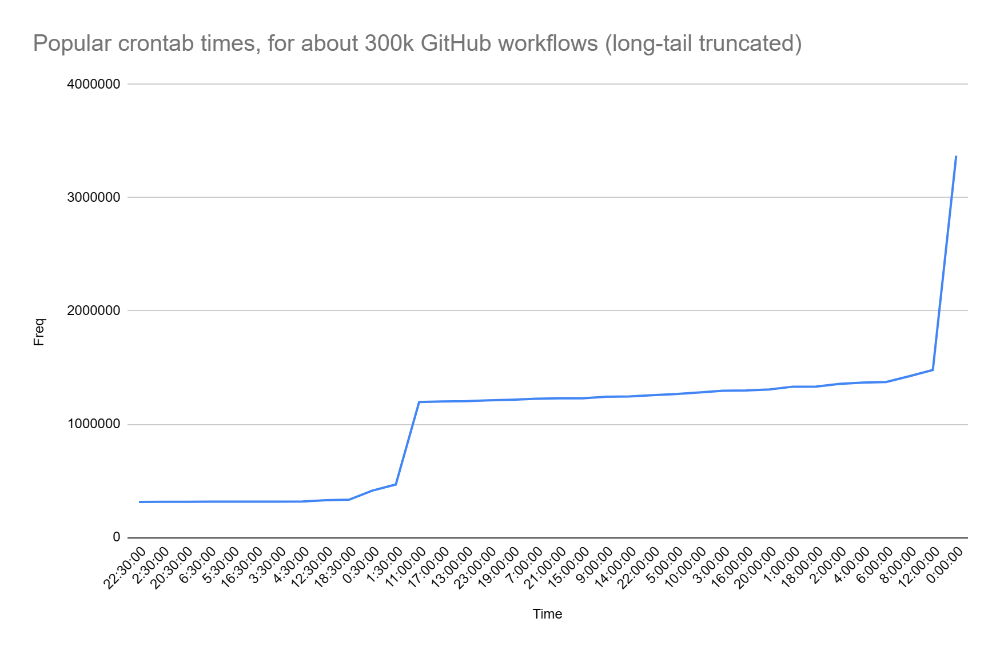

# Feature Flags and Toggles

## Feature Flags and Monitoring

### Feature flags {#feature-flags-2 .unnumbered}

Feature flags are tools that allow you to toggle specific parts of your application on and off at runtime. Think of them like remotely controlled if statements. Initially, we'll implement our feature flags using a simple JSON file stored in a storage container, though other platforms like LaunchDarkly are also viable options. We plan to explore more complex implementations in the future.

One potential use for feature flags is to enhance user experience by conditionally offering new features. For example, currently, customers can view basic weather information, but it might not be visually appealing. We could introduce a feature flag that allows some users to see weather forecasts presented in a more engaging image format. By applying a feature flag to the homepage, we can control who sees this new format and gather feedback.

Implementing feature flags effectively requires a modular application architecture that supports enabling and disabling components without issues. To illustrate this, consider a scenario where the application code is highly interdependent and complex---a common trait of legacy systems. We'll intentionally refactor another application to mimic these conditions, making it difficult to maintain and challenging to implement feature flags. Through this exercise, we'll demonstrate the importance of clean, high-quality code as a prerequisite for using advanced development techniques like feature flags, showcasing the pitfalls of attempting such integrations in poorly structured codebases.

### Scheduling Workflows and Resource Management {#scheduling-workflows-and-resource-management .unnumbered}

- Sometimes you may want to know if you can make some performance optimizations in your scripts. Therefore, it is helpful to measure the CPU usage, memory, disk space, etc. of your runners. This is because of a few reasons: knowing if you are using your resources effectively so that you can have a fast feedback loop, and, being able to proactively prevent runner issues (e.g., disk space is gradually filling up, therefore, you may want to optimize your jobs at some point because they might start failing.)

- When you want to schedule your workflow, you can use cron. Cron is a syntax that is used to specify the cadence for your workflow. It will run unattended at the time that you specify. Note that GitHub might not run your workflow at that time.

- Here are the popular times that workflows are scheduled. Try to avoid times (such as 12am) because they are very crowded. If you need a job to run at a specific time, instead, check if it is possible for the job to run prior to that time (so that it has a chance that, at that time, it will run), or consider using a webhook.

  - 

- If you need something that will run on the last day of the month, consider instead running it on the first day of the next month and then use the data (or commits) from the previous end of the month. This is because some months have 30 or 31 days, and some might have 29 (leap year) and it can't be specified cleanly in crontab syntax.

- If you absolutely need to run on the last day of the month, run on the 29th, 30th, and 31st and then add a script block that checks if the last day of the month is today and if so, continue, otherwise skip the script.

Let's explore monitoring in application management. Monitoring involves collecting various statistics such as CPU usage, hard drive utilization, memory bandwidth, swap space, and user activities like website visits and IP addresses. However, the challenge lies in determining the relevance and application of these statistics to understand user satisfaction and application performance.

### Understanding Logs and Their Purposes

Logs can be categorized into two main types:

1. **Analytical Logs**: These provide insights into application usage and user behavior, helping to gauge the effectiveness of the application.

2. **Diagnostic Logs**: These include basic information such as CPU usage and disk space, which, while useful, may not directly correlate with user satisfaction or application performance.

### Setting Clear Goals

For any application, such as a hypothetical weather app, defining clear goals is crucial. These could include metrics like monthly active users or user satisfaction rates. For instance, a goal might be to achieve 100 monthly active users or maintain a 99% adjusted customer experience score.

### Monitoring and Measuring Success

Effective monitoring goes beyond just collecting data; it involves:

- Setting clear definitions of success, such as specific user engagement metrics or performance standards.

- Using analytical tools like Google Analytics or custom scripts to track user interactions and satisfaction.

- Monitoring system performance and user experience through tools like Web Vitals to ensure the application loads efficiently and performs well across different devices.

### Importance of Performance Metrics

Understanding the detailed performance metrics helps in making informed decisions about the application's health and areas for improvement. These metrics should include:

- Load times and responsiveness of the application.

- Error rates and types, providing insights into potential issues that could affect user experience.

- Custom metrics tailored to specific actions within the application, like map interactions or search functions.

### Practical Application and Error Management

It's essential to set practical error budgets to allow for a certain amount of risk and innovation without compromising the user experience. Monitoring tools should be configured to alert developers to critical issues without overwhelming them with minor errors. This requires a balanced approach to setting alert thresholds based on the severity and frequency of issues.

Let's delve into some practical applications for a weather application to enhance user experience and potentially increase revenue.

### Enhancing User Experience with Subscriptions

For a weather application, an effective way to engage users might be through subscription services. Such subscriptions could offer extended forecasts or more detailed data, such as high-resolution models for different regions. Additionally, setting up personalized weather alerts via text message or email could significantly enhance user value, keeping them informed about specific weather scenarios.

### Focusing on Customer Experience Instead of Direct Revenue

When aiming to boost revenue, it's crucial not to focus solely on the numbers but to ensure customers are enjoying their experience on the site. A poor user experience, characterized by slow load times or inability to access the site, can drive users away. Instead of using average performance metrics, which can obscure individual bad experiences, it's more insightful to evaluate performance based on specific incidents, like failed requests.

### Measuring User Engagement

Understanding how users interact with the website can provide valuable insights. Metrics to consider include:

- The duration of the site visit

- Interactions with key features like search, map zoom, and weather forecasts

- User actions such as account creation, subscription sign-ups, and sharing links

These interactions can give a clear picture of how engaging and useful the site is to its users.

### Technical Performance Evaluation

To accurately assess the quality of the user experience, consider implementing tools like Web Vitals, which measure vital aspects of site performance, including load times and interactivity from the user's perspective. This front-end monitoring is crucial because issues like delayed JavaScript execution can significantly affect the perceived responsiveness of the site, yet might not be apparent from back-end metrics alone.

### Using Customer Feedback

Although customer surveys typically have low response rates, they can still provide critical insights into user satisfaction and areas for improvement. Monitoring error rates, such as 400 and 500 HTTP status codes, can also help identify technical problems that detract from user experience.

Creating effective dashboards is essential for successful project management and serves as a proxy for assessing project viability. Dashboards should be structured to address specific SQL queries effectively, accurately, and efficiently, ensuring they meet the informational needs of stakeholders to maintain project success. Like Service Level Agreements (SLAs), dashboards facilitate critical conversations about the service's purpose and objectives.

Each project must ensure its dashboards can adequately respond to stakeholder inquiries. Questions to consider include:

- Who are the stakeholders?

- What are their specific informational needs?

- Are these stakeholders present in meetings where the dashboard data is discussed?

Dashboards should align with the project's objectives and should be regularly reviewed to ascertain if modifications are necessary to reflect business KPIs accurately. It's crucial to confirm whether these KPIs are visible and whether the dashboard provides a comprehensive view of customer satisfaction.

Key considerations for dashboard implementation include:

- Integration of telemetry and analytics to support the metrics being tracked.

- Clarity on what constitutes sufficient data points, such as understanding whether having 100 users is indicative of success or not.

- Identification of any unexplained variations in user account activity.

Dashboards must also highlight any anomalies or errors clearly and should be designed to emphasize essential data:

- Use white space strategically to group related data.

- Include both quantitative and qualitative data, such as a list of outstanding customer issues.

- Avoid clutter and unnecessary decorations that detract from the main message.

- Ensure that critical data stands out, perhaps by using larger text or different colors.

- Design with consistency across similar charts and make meaningful comparisons easy to discern.

- Implement visual attributes like hue, orientation, and closure to draw attention to important data, using distinctive borders or markers to differentiate between charts.

Also, consider the fundamentals of service quality which include:

- Reliability: Consistency and lack of defects in service.

- Assurance: Mechanisms in place to maintain and address service quality issues.

- Tangibles: The physical or empathetic environment provided to customers.

- Responsiveness: The speed and effectiveness with which customer requests are handled.

Finally, the dashboard should support error budgeting metrics such as surplus, deficits, burn down, and recovery rates to help prioritize feature work and stability improvements. This ensures that dashboards not only serve as tools for monitoring but also as instruments for strategic decision-making.

---

## Feature Toggles: Key Points

## [**ep-3-feature-toggles.mp3**](https://1drv.ms/u/s!AOnf7tByrSaDkzI)

## **Key Points on Feature Toggles:**

**Benefits:**

- **Separation of deployment and release:** Enables deploying code without releasing the feature, allowing for controlled rollouts, A/B testing, and experimentation.

- **Reduced risk:** Allows for safer deployments by hiding incomplete features and enabling quick rollbacks if issues arise.

- **Increased development velocity:** Developers can integrate code more frequently without waiting for a feature to be fully complete.

- **Improved product quality:** Facilitates data-driven development by enabling experiments and collecting user feedback on new features.

- **Empowers product teams:** Gives product owners more control over feature releases and the ability to target specific user segments.

**Getting Started:**

- **Start small:** Choose a non-critical feature for your first experiment with feature toggles.

- **Focus on code structure:** Minimize the amount of code impacted by a toggle and aim for easy removal once the feature is fully released.

- **Collaborate with product:** Educate product owners on the benefits of feature toggles and work together to establish a comfortable workflow.

- **Collect baseline data:** Before introducing a new feature, gather data on existing user behavior to measure the impact of the change.

- **Don't overthink the framework:** Avoid building a complex framework upfront. Start simple and iterate as needed.

**Key Considerations:**

- **Data is crucial:** Use feature toggles to gather data and analyze user behavior to validate hypotheses and make informed product decisions.

- **Technical and business perspectives:** Understand the benefits of feature toggles from both a technical (risk reduction, code quality) and business (experimentation, product evolution) perspective.

- **Tooling can help:** Explore existing tools that can simplify feature toggle management, data collection, and experiment analysis.

**Overall, feature toggles are a powerful tool for continuous delivery, enabling faster and safer releases, data-driven development, and enhanced collaboration between development and product teams.**

