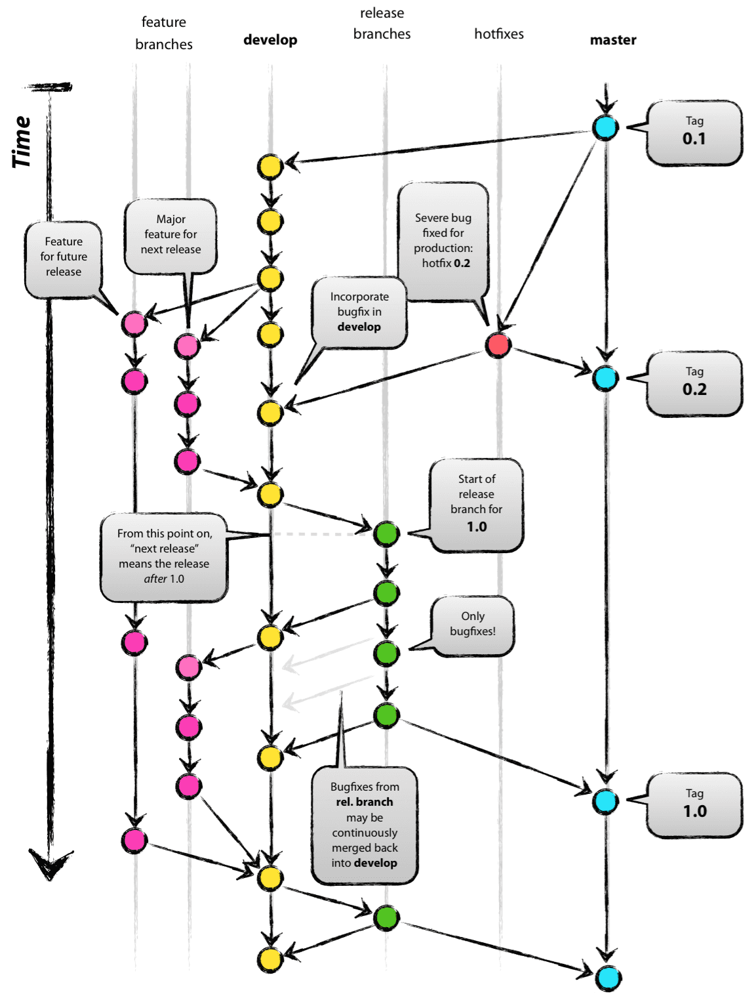

## Branching Strategies

#### Introduction

For code to be continuously integrated, it must be incorporated into the main application. This means that while developers' code becomes part of the unified application, it doesn't necessarily imply it's operational or visible to end-users. Integration ensures the code resides in a collective state, allowing other developers to build upon or amend it. You have to deploy it for people to be able to use it.

Part of being able to integrate code is through the use of PRs (pull requests.) This occurs when a developer is working on their copy of the code locally (i.e., a copy of the master, where all of the shared developers contributions are.) This allows the developer to have a stable workspace for just long enough to be able to work on their part. The expectation, however, is that it should be merged back into the master branch, where other developers have access to it and can work off of it. Features are normally complex, and multiple developers might have to work off of their code to build their feature.

#### Understanding Branching

Branching is a powerful mechanism to separate distinct lines of development work. When working on a pull request, for example, you isolate your changes on a separate branch to avoid interfering with others’ work. The integration of that work into the main codebase is accomplished later through a merge.

**Your branching strategy should mirror your internal business processes.** For instance, if you need to support multiple versions of an application, adopting long‐lived branches is sensible; each version becomes its own entity that is developed, tested, and maintained separately. Work is intentionally integration-deferred, and may never be integrated, e.g., v2 will never be merged into v1, albeit a few backports. Similarly, if your organization requires a thorough quality assurance process—perhaps due to regulatory concerns—a strategy like Git Flow, or the creation of dedicated release branches, can help manage the deferred integration of changes while allowing bug fixes to be backported as needed.

Continuous integration (CI) and continuous delivery (CD) practices further highlight the importance of how you manage branches. Regularly integrating work into a shared trunk ensures that your code remains cohesive and that issues arising from integration are caught early. Even if you maintain multiple long-lived branches, each branch can still benefit from CI/CD pipelines that validate and test changes continuously.

It is also important to recognize that branching itself is not problematic. A repository can comfortably house many branches—the challenge arises when integration is unnecessarily delayed. In environments where rapid delivery to customers is essential, long-lived feature branches can isolate changes for too long, reducing collaboration and hindering the overall responsiveness of the development process.

Finally, the evolution of development tooling has provided robust mechanisms to simulate production environments locally or via cloud automation. This enables early detection of integration issues, reduces reliance on extended QA cycles, and allows practices like feature flagging to gradually roll out new functionality. By aligning your branching strategy with both business objectives and modern CI/CD practices, you can ensure that changes are integrated efficiently and reliably into the production environment.

#### The Shift with Modern Development Tools

Historically, things were a bit different. Automated testing, linting, building, and having access to development environments was not as common. This meant that developers couldn't easily instill confidence in their changes, thus, they had to delay integration so that things could be tested. Let's look into the rationale behind trunk-based development by looking at what an older technique, GitHub Flow, provided and why it was so popular.

#### Trunk-Based Development Explained

One is trunk-based development, which encourages developers to merge everything into a single shared state, much like a puzzle. This branching strategy is normally preferred for new projects. **Working from a single, shared state (i.e., trunk-based development) will require a very different way of working, and trunk-based development is the primary method of development which can enable CI/CD.**

"Trunk-based" development (abbreviated as TBD) means to use the master branch as the main application. The branch is typically called "master" or "main", but the strategy is called "trunk-based". If something is merged into the "trunk", it is merged into the "master" or "main" branch.

Typical Developer's Workflow in Trunk-Based Development:

- Sync Up: The developer starts by pulling the latest changes from the trunk.

- Short-Lived Branch Creation (optional): If they choose to work in a branch, they create a short-lived branch off the trunk.

- Development: Make code changes, refactorings, or add new features.

- Commit Frequently: As they work, developers commit their changes frequently, even if the feature isn't complete.

- Use Feature Flags: If they're working on a new feature that's not ready to be made public, they use feature flags to hide this functionality.

- Merge to Trunk: Once they're ready, they merge their changes back to the trunk. Given the short-lived nature of their branches, this happens frequently, sometimes multiple times a day.

- Continuous Integration: Upon merging, automated build and test processes kick in to ensure the new changes integrate well with the existing codebase and that the trunk remains in a releasable state.

- Feedback Loop: If any issues arise from the integration, testing, or build processes, developers address them immediately to ensure the trunk remains stable.


[Beginners Guide to Trunk-Based Development (TBD) - StatusNeo](https://statusneo.com/trunk-based-development/)

- The branching strategy has become prevalent with the rise of web applications. For example, if a web app works in one browser, it's likely to work in others due to consistent environments. Most modern apps, like Amazon or Facebook, automatically show the latest version, without version selection. This method is especially effective when developers control the user's environment, such as with mobile apps. With master-based development, the development process is streamlined, continually integrating work into a shared state. The application should always be ready for release, easily verified through automated testing. Note that releasing does not mean that features are available to customers, only that they exist in the application (but are hidden.) Ready for release does not mean done.

- This is especially useful for web applications because their environment is tightly controlled: it is sandboxed within the user's web-browser, which itself is continuously updated. This means that one has many ways to test it locally before releasing.

#### Differences with Other Branching Strategies

- Git Flow, a branching strategy where it structures development into multiple branches: `main` for official releases, `develop` for integration, `feature` branches for new capabilities, `release` branches for preparing new releases, and `hotfix` branches for urgent fixes, designed for projects with scheduled release cycles, and GitHub Flow, are still in use today, still have relevant business cases, but are a less popular strategy. For example, say you are **deploying to an uncontrolled environment.** In the past, your own infra was considered an uncontrolled environment because it was probably messy. Nowadays, this can refer to environments that are highly diverse, such as desktop applications, specialized hardware, or where extreme-extreme stability is required (this will significantly decrease ability to release new features, where even controlled environments may not be fully controllable.) Therefore, a heavy-weight approach, such as GitHub Flow or Git Flow might make more sense. This is because the branching pattern better reflects the business use case: the act of integration _should be delayed_ because work is not truly integrated. Developers do not have confidence that their changes actually work, therefore, if other developers integrate on top of it, it could be a mess. Another situation are tasks that can't be broken down, such as large infrastructure changes or framework upgrades. This should be an exception to the norm, however.

- A user's web browser is much more of a sandboxed, controlled environment than a desktop app.

Typical Developer's Workflow in Git Flow:
-----------------------------------------------------------------------------------------------------------------------------------------------------------------------------------------------------------------------------
**Start from Develop:** Developers usually start by syncing up with the latest changes in the develop branch.
**Feature Development:** When starting work on a new feature, they create a new branch prefixed with `feature/`, branching off from develop. They make commits and changes to this feature branch during development.
**Integrate Feature:** Once the feature is complete, they merge the `feature/` branch into develop. The feature branch can then be deleted.
**Preparing for Release:** When it's time for a release (say a sprint end), a release branch is created off develop. This branch might be named something like `release/1.2.3`.
Any final adjustments, like bug fixes or documentation updates, are made in this branch.
**Release:** Once the release is ready, the release branch is merged into master and also back into develop to ensure that develop has all the changes. A tagged commit is created in master for the release, e.g., `v1.2.3`.
**Hotfixes:** If a critical bug arises in production, a `hotfix/` branch is created off master. Once the hotfix is complete, it's merged back into both master and develop.

[A successful Git branching model » nvie.com](https://nvie.com/posts/a-successful-git-branching-model/)

- In this case, it might be impossible to replicate the environment locally because it is a special environment procured by the vendor.

- Another reason is that the software might be incredibly complex, requiring significant QA time (such as with a physical hardware device) that cannot be automated or emulated or would be incredibly cost-prohibitive to do so. In this case, the act of integration is more ambiguous because the software has to run on the device in order to work. Normally, however, with advances in development tooling, it should be possible to emulate these devices locally such that it is possible to have a fast feedback loop, which CI/CD aims to promote. In this case, Git Flow or GitHub Flow might be preferred because significant rework may be required because changes cannot be validated. However, it is still possible to partially practice continuous integration and deployment (see HP case study.) This is a rare situation, and won't be discussed in depth in this book.

- Some branching strategies, like Git Flow or GitHub Flow, are designed to _delay_ or slow down integration.

Git Flow structures development into multiple branches: `main` for official releases, `develop` for integration, `feature` branches for new capabilities, `release` branches for preparing new releases, and `hotfix` branches for urgent fixes. It's designed for projects with scheduled release cycles.

- In the past, these strategies were especially popular because it wasn't clear if work was truly _integrated_ if it was merged because development environments were difficult to create, and automated testing was not as prevalent. Developers could not be confident that their changes worked. There still are a few situations where this branching strategy makes sense, such as when the environment that it is being deployed to cannot be de-complexified in advance (and you do not have control over it), but is much less common in CI/CD because of the need to rapidly integrate.

- The cloud was less dominant, and replicating on-premises hardware was prohibitive. Ensuring parity between production and development environments was challenging, leading to an increased testing burden. With manual testing being the primary method, it was costly to evaluate every commit. Consequently, larger, more infrequent releases were the norm, and they were introduced to production with much caution.

- Development tooling to set up environments, and automated testing were less prevalent, so therefore this strategy allowed for manual testing to take place. Additionally, organizations may have worked in silos, making collaboration more difficult, thus, the act of integration was necessary because of complex dependencies that were not known beforehand. Developers were not confident that their changes were ok because they can't test them easily. The end-environment didn't exist, was unknown, or was not possible to set up. It was less common to use feature flags to selectively enable features in production, thus, the act of knowing if something was _integrated_ was difficult. Therefore, it makes sense to delay integration: otherwise, the release might be totally broken perpetually as everyone keeps committing at break-neck speed with questionable commits--the state of the application's releasability is unknown. There wouldn't be any opportunities to pause and fix bugs otherwise, or to do a QA test pass as there would be more and more commits. One had to be very confident that their software worked, because rolling back or doing incremental deployments was more complex, and verifying your changes by sending them out to a few customers was difficult, thus, it was difficult to have a fast feedback loop. Given these constraints, i.e., not having access to a stable testing environment, not being able to experiment, limited monitoring, cultural things, it made sense to have a very comprehensive and careful approach to get changes into production. Developers don't know if their changes were integrated. A single bad change could cause production to go down, and would have been difficult to fix because rollbacks or infrastructure changes may be complicated. It may have impacted many thousands or hundreds of thousands of customers (depending on the application), resulting in significant downtime.

- Comparing trunk-based and Git Flow strategies

**Topic/Aspect** **Git Flow (Feature Branches)** **Trunk-Based (Master-Based)**

- Purpose Facilitates the separation of in-progress work and allows for different development stages. Encourages rapid, continuous integration into a unified mainline. Code is often deployment-ready.

- Pace Development can be paced based on feature completion and milestones. Promotes a faster development pace with smaller, frequent commits, enabling quicker feedback loops.

- Integration Work is maintained in distinct branches until deemed ready for integration. All developers integrate their changes frequently, fostering a shared understanding.

- Complex Changes Provides flexibility for handling extensive changes, e.g., framework upgrades, large database schema upgrades, or architectural overhauls. Can handle extensive changes, often with the use of feature flags for incremental development.

- Testing Code in feature branches can be tested independently before integration. Code is designed for continuous integration, allowing for frequent testing in shared environments.

- Feature Flags Can be utilized when integrating changes, with an emphasis on management and oversight. Commonly used for partial feature rollouts and incremental changes. Management is crucial.

- Merge Conflicts By keeping branches updated with the main branch, merge conflicts can be minimized. The nature of frequent integrations and smaller changes naturally minimizes merge conflicts.

- Visibility & Collaboration Work in branches allows for focused development; explosive collaboration occurs during merging. Continual visibility of ongoing work encourages immediate feedback and collaboration.

- Deployment & Testing in Prod Deployment to production is often milestone-driven, allowing for scheduled testing periods. Continuous integration permits immediate deployment and testing in production, often behind flags.

- If you're using a trunk-based strategy, it doesn't mean that you can _never_ ever create feature branches. Rather, it should be the default 99% of the time to stick with merging to the trunk, and then reaching out for a feature branch for complicated situations. If you are going to use a feature branch, make sure that you pull in changes regularly to keep it up to date.

- It is now possible to continually verify the changes because computing power has increased significantly, allowing for builds to be done per PR, sometimes in parallel. This contrasts with the concept of a "nightly" build, which occurred after hours because it was a blocking operation and was usually very slow and complex, due to the lack of computing power and tooling.

#### Conclusion

- Part of integrating continuously is acknowledging that software is messy, complicated, requires multiple dependencies and working with multiple people, all working on features that depend on each other implicitly. The act of integrating is much more than having changes from the master branch merged into your feature branch. It is about the act of integrating the ideas generated from the code, concepts, documentation, etc. with other developers. Developers have to be able to see and work with the code that others are working on in order for them to integrate this into their minds. Think back to the puzzle metaphor introduced earlier.

- This sounds a bit scary--how do I know if my changes are ok? This is where CI comes in: it emphasizes automated testing, code review, building, and linting, to instill confidence in your changes. This allows a fast feedback loop: developers are able to find out if their changes are bad right away before the other developers can build upon them through the use of a build pipeline that automatically runs. Features can also be behind developer-created feature flags, much like the curtain for the puzzle in the art gallery.

#### Everything is all over the place! How do I keep track of features if they're spread out over commits?

- Use an issue tracker/task tracker and attach tasks to each PR. Then, you can go to your user story and see a nice list of PRs. You can set up your PR software tool to force attaching a task prior to merging the PR. This would depend on your CI software.

- Name your PRs well, and include the feature number in the title if possible.

- Consider using feature branches if it's absolutely not possible to split up a feature. Note that you will not be able to benefit from feature flags.

#### When can I feature branch in trunk-based development?

- I hate working in absolutes. There are times when feature branch development makes sense when using trunk-based development. However, it's more of an exception to the rule rather than a sometime-often thing. If you make a feature branch while working in trunk-based development, the whole world will not come crashing down, _however_, do remember that the work will not be integrated with the trunk.

- In some cases, this is a desirable property. If you are doing a framework upgrade, and you have to change 1000 instances of a function call, for example, all over the place, over a period of, say a few months, then this might necessitate a feature branch. You don't want it merged with the customers, because a half-way done job is going to crash the application sometimes. And it might not be easily feature flag-able. You might want to deploy just that branch to a testing environment and do some tests on it. You might find it helps to not diverge too much from what's happening on the trunk, so consider merging things into it frequently. Really try and check with your colleagues on if it is possible to break it down, for example, by using the Strangler Pattern for example.

- Sometimes, however, the problem becomes a bit more ambiguous. When you're working on a large, legacy application, there might be times when the code is so tightly bound together that it is not possible to do things in increments. This means that you should instead need to do some refactoring, to make sure that the application can be testable and maintainable, and open to changes. There is a good book on Clean Code for this purpose.

- In other types of applications, such as embedded, the act of testing or releasing may necessitate an expensive endeavor, such as a single testing environment. There are some strategies on how to make this more palatable (see case study in Continuous Integration chapter for more information.)

#### If everything is a river, and keeps flowing, when can I interrupt the flow to do a QA test pass?

- Consider using continuous delivery instead of continuous deployment if you need a QA test pass. This allows for human intervention to occur before a release is made.

- Also consider shifting QA left (i.e., QA reviews some risky PRs.) This will make less work for QA in future stages and fixes the issues at the source.

#### Microservices

- Microservices are ways to divide a large application up into smaller ones. This is helpful for CI/CD pipelines, because larger applications normally take longer to build, thus compromising the fast feedback loop for developers. It may also take longer to deploy, because there is more stuff. It can be unclear how to deploy it, as multiple services have to be started in parallel.

- The downside is that it can add complexity, so therefore only transition to microservices once you are very comfortable with the build process.

#### References

- Source [Git Flow Is A Bad Idea - YouTube](https://www.youtube.com/watch?v=_w6TwnLCFwA) (very interesting YouTube comments)

### The way that features are written needs to change

- Just doing the same things that you were doing before is likely going to make it so that you're not able to test in production.

- Small PRs that change a few lines of code are still, technically, small changes but it doesn't mean that you can reliably test them in production, nor send them out. For example, making the login page perfect before working on the log in button makes it not possible to assess whether the backend works, because it's not integrated.

- Code can't be written in an untestable blob. In order to instill confidence in it, it has to be testable. It has to have integration points where other team members (including yourself) can inject into it. This overlaps significantly with having well-structured code.

- Consequently, a large, spaghetti codebase that needs many things to change to change a single thing is likely to be more risky than making small changes. It is also hard to flag it. Therefore, code quality is important, and you may need to do refactors.

### Example 1: Code Not Easily Integratable

**Context**: A web application feature that adds a new user profile page.

**Code Structure**: A single large file, `UserProfilePage.js`, which combines HTML, CSS, and JavaScript.

```javascript
// UserProfilePage.js

document.write(`
<html>
<head>
<style>
  /* CSS styles here */

  .profile-container { /* styling */ }
  .user-info { /* styling */ }

  /* More CSS... */
</style>
</head>
<body>
  <div class="profile-container">
    <div class="user-info">
      <!-- User information elements -->
    </div>
    <!-- More HTML content -->
  </div>

  <script>
    // JavaScript logic here

    function loadUserProfile() {
      // AJAX call to get user data
      // Direct DOM manipulation to render user data
    }

    loadUserProfile();

    // More JavaScript code...
  </script>
</body>
</html>
`);
```

// Additional logic for handling user interactions, etc.

**Issues**:

- **Monolithic Structure**: The entire feature is in a single file, making it hard to isolate changes.
- **Testing Complexity**: Testing individual aspects like AJAX calls or UI components is difficult due to the lack of modularity.
- **Integration Challenges**: Integrating this with other features can cause conflicts and require extensive re-testing of the entire page.

---

### Example 2: Code Easily Integratable

**Context**: The same user profile page feature, but designed for better integrability.

**Code Structure**: Separated into multiple files with clear responsibilities.

1. **HTML (UserProfile.html)**

```html
<div class="profile-container">
  <div class="user-info" id="userInfo">
    <!-- User information will be loaded here -->
  </div>
</div>
```

2. **CSS (UserProfile.css)**

```css
.profile-container {
  /* styling */
}
.user-info {
  /* styling */
}

/* More CSS... */
```

3. **JavaScript (UserProfile.js)**

```javascript
function loadUserProfile() {
  fetch('/api/user/profile')
    .then(response => response.json())
    .then(userData => renderUserInfo(userData));
}

function renderUserInfo(userData) {
  const userInfoDiv = document.getElementById('userInfo');
  userInfoDiv.innerHTML = /* Logic to create user info elements */;
}

document.addEventListener('DOMContentLoaded', loadUserProfile);
```

**Advantages**:

- **Modular Design**: Separate files for HTML, CSS, and JavaScript improve readability and maintainability.
- **Easier Testing**: Each function, like `loadUserProfile` or `renderUserInfo`, can be individually unit tested.
- **Smooth Integration**: Smaller, well-defined changes are less prone to merge conflicts and can be integrated more frequently.

---

### Key Takeaways

By comparing these two examples, it’s evident that the second approach aligns better with CI/CD practices. The modular and separated structure makes it easier to implement, test, review, and integrate changes, facilitating a more efficient and reliable development process in a team environment. This reflects the CI/CD focus on small, incremental, and testable changes that can be frequently integrated into the main codebase.

- What incremental changes allow you to do is to deliver customer value faster. The reason why you'd want to do that is because you need rapid feedback. It's sort of like pulling a thread at the end.

- And, if your code is not in a way where you can do that, that is, it is not modular, then continuous integration can't be performed. If I have to change 100 lines of code to change one thing, then it's not going to be easy to break down small features and get confidence on them.

- Similarly, if there's a big blob of code that has no entry points to test it, then it's going to be hard to get feedback on your code. It's going to be hard to create tests, and to integrate against, since the act of integration is the concept of interfacing. You need an interface to integrate against, not a huge smooth wall.

- Microservices might be helpful, but, it sort of depends. For example, if the two applications can be easily split apart, then do it. This literally forces an interface between the two components, and can also make them more scalable.

- The other way is to enforce the separation in code. There are various tools that will fail the build pipeline (purposefully) if one module uses another module in a way that it's not supposed to be used (i.e,. connected to it.) This can help you remove the strands that two modules are connected by, incrementally, and prevent new ones from coming up. It can also help with the transition to microservices.

- Microservices aren't all that good though. They can introduce complexity when deploying, as multiple versions have to be managed. Microservices are usually more useful when you have enough developers that justifies it, such as when you need to scale quickly, thus you hire more developers, thus, you transition to microservices.

### Misc

- Avoid scripts on the CI pipeline that mutate the branch (or make commits to it.) For example, a script that fixes linting issues and pushes the commits back to the branch. This is an issue because:

 - The code is no longer tested on a developer's machine. If the code is different from what the developer tested, even if the changes are small, then it means that the developer is unsure if the changes still work.

 - Linting is useful for developers working on the PR as well. For example, linting makes the code more readable, and so if it is done on a developer's computer, they are able to benefit from these improvements while they work.

 - If a developer does not have linting set up, do they have the rest of the environment set up? If there are linting failures on the CI, then this is a red flag: there is something misconfigured in the developer's environment. By auto fixing it, it doesn't promote the ability for a developer to know if they have an invalid environment, or a misconfiguration between what the CI is doing and what the developer's computer is doing.

 - This does not mean that the CI should not check, rather, it should not push code that the developer has not tested.

 - An example of how continuous integration can be adapted depending on the use case. CASE STUDY: This book was super interesting: [Practical Approach to Large-Scale Agile Development, A: How HP Transformed LaserJet FutureSmart Firmware (Agile Software Development Series) eBook : Gruver, Gary, Young, Mike, Fulghum, Pat: Amazon.ca: Kindle Store](https://www.amazon.ca/gp/product/B00A8IYB2W/ref=kinw_myk_ro_title). It is about HP and they have many levels of testing (L0 to L4.) The old system was that all of the tests had to run, and if something failed after it was merged (because the test suite is just too large to run per push), then the whole pipeline would break. The solution was to break apart the tests into layers. Each level in HP's testing is more comprehensive than the last and takes longer each time. L0 for example is fast but is required to merge the code; this catches lots of bugs. Then after it is merged, L1 tests run. If L1 tests fail, then the code is auto-reverted (after it is merged) and there are merge conflicts occasionally but not often. If everything is ok, L2 runs less often, until L4 comes which runs once a day. They have been able to get their pipeline uptime up from 80% to almost 100%. The issue is that the tests can't be sped up because they're emulated and in some cases require hardware. This is technically a nightly build, but it's hard to emulate everything with 100% accuracy. In this case, changes are incrementally integrated continuously by increasingly instilling confidence in build artifacts at every stage.

### The Power of CI/CD for Solo Developers

- After looking at CI/CD, including from the perspective of the puzzle (which is a shared activity), you might wonder why CI/CD would apply to single developers, given that CI/CD looks like it should be applied to teams, as there are multiple people integrating their changes early on. This is a completely valid question, given the complexity that CI/CD appears to entail. The foundational principles of CI/CD: ensuring that changes are tested, robust, and don't break existing functionality can make a solo's development workflow much more efficient. Let's look into why and how CI/CD is a valuable tool for solo developers.

**The Power of CI/CD for Solo Developers**
------------------------------------------

Often, when people hear about Continuous Integration and Continuous Deployment (CI/CD), they envision large teams with multiple developers collaborating on vast codebases. The immediate association is with complex projects requiring intricate workflows to integrate code changes from diverse sources. However, it's essential to recognize that CI/CD is not just for these large-scale scenarios.

**Yes, even if you're a solo developer, CI/CD can be incredibly beneficial for you!** Here's why:

1\. **Immediate Feedback**: As a solo developer, you might be wearing multiple hats. From coding to testing, deploying, and even handling user feedback. Having an automated CI/CD pipeline offers instant feedback on your code changes, ensuring you're always on the right track. This continuous feedback mechanism can significantly speed up your development process.

2\. **Code Quality and Consistency**: As a solo developer, it's tempting to think that consistent code quality might be easier to maintain since you're the only one coding. However, even individual developers can inadvertently introduce inconsistencies over time. By incorporating automated testing and linting into your CI process, you can ensure that your code consistently meets set quality standards and remains free from both common errors and stylistic inconsistencies.

3\. **Peace of Mind**: Each commit you push undergoes automatic testing and building, offering a level of assurance that manual processes can't provide. This validation minimizes the risk of unintentional regressions or bugs, granting you greater peace of mind with each update.

4\. **Efficient Problem Solving**: Mistakes are inevitable, no matter how experienced a developer you are. With CI/CD in place, if you introduce an error, the system alerts you immediately. This prompt notification allows you to quickly pinpoint the issue, often just by going back a few commits, saving you from potential hours of debugging down the line.

5\. **Preparation for Team Growth**: Today, you might be working solo, but what if you decide to expand your team in the future? Having a CI/CD setup in place makes this transition smoother. New team members can quickly get onboarded, with the assurance that the code they push meets the project's standards.

6\. **Better Version Control**: With regular integrations, it's easier to manage versions of your application. You can be confident that each version of your app, especially those that get deployed, have passed through rigorous automated checks. This makes rollbacks or feature flagging more straightforward and more reliable.

7\. **Time Savings**: While setting up CI/CD might seem like an upfront time investment, the long-term benefits in terms of time saved are significant. Automation reduces manual intervention, letting you focus on what you do best: writing great code.

In conclusion, CI/CD is not just a large team's tool. It's a robust framework that ensures efficiency, quality, and consistency, whether you're a team of one or one hundred. Embrace it, and watch your solo development journey become more streamlined and efficient! |
