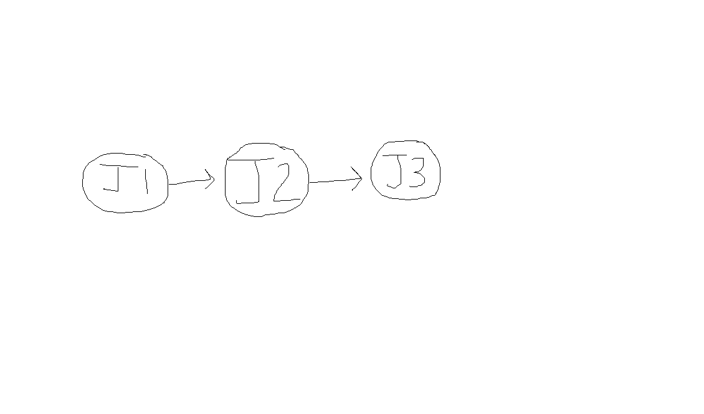
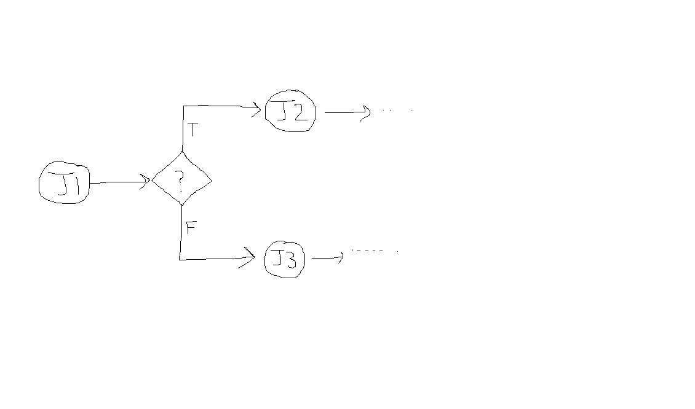
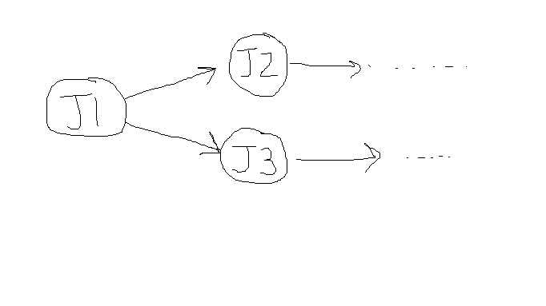
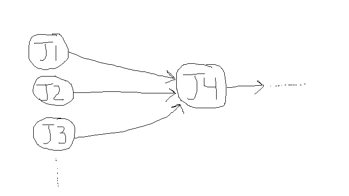
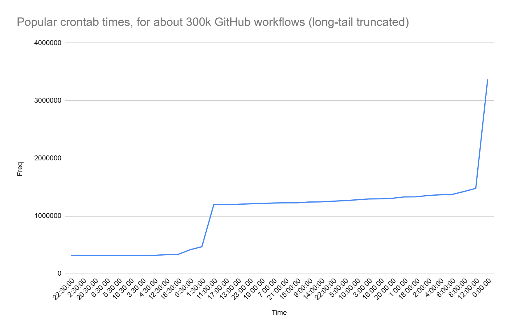

## {#section-13 .unnumbered}

### Continuous integration and development software {#continuous-integration-and-development-software .unnumbered}

Continuous Integration/Continuous Deployment (CI/CD) software represents a suite of tools designed to enhance the software development lifecycle. These platforms provide extensive functionalities that optimize the CI/CD process. Key features include automated builds, continuous testing, artifact management, deployment automation, and environment management. Furthermore, they allow for intricate pipeline orchestration, support a myriad of integrations, offer monitoring metrics, and include security scanning tools.

Constructing a CI/CD server in-house is not only challenging but also time-intensive. However, in this book we will be going over how to create a very small continuous integration and development system to show you that it really isn\'t that complicated and to also show you the benefits and why using an off the shelf on it\'s usually better most of the time.

### Why Choose Off-the-Shelf CI/CD Tools? {#why-choose-off-the-shelf-cicd-tools .unnumbered}

- Time Efficiency: Building a CI/CD server from scratch is time-consuming, and potentially error-prone. Using established tools like Jenkins, GitLab, and Azure DevOps saves significant time.

- Reliability and Scalability: These tools are tested and trusted by many organizations globally, ensuring reliability and scalability.

- Rich Feature Set: With features for build management, testing automation, security scanning, and more, these tools offer a comprehensive CI/CD solution.

- The following are all-in-one CI/CD providers. They provide the entire technical-side for CI/CD, and a select few may also provide infrastructure for hosting your application (e.g., Azure.) Note that you can deploy to third-party platforms that host your production environment.

- Each provider has significant documentation on how to get started with their platform. Including steps for all platforms might make this book very large.

- Research available CI/CD tools. These may include build servers, which can build your code. They can also host your code as well and allow other team members to access it. For example, Jenkins, GitLab, Azure DevOps, etc. You can use your new or revised onboarding guide to identify which providers might fit your needs. If you already deploy to one of those providers, then it might be easier to migrate to that provider, since other integrations will be much easier. For example, deploying to Azure.

How do I know which provided to select? Here\'s a breakdown of some of the concepts and.I framework to show you what to consider when choosing A continuous integration and development provider.

From CI/CD providers spreadsheet [[Wayback Machine (archive.org)]{.underline}](https://web.archive.org/web/20230101095803/https://www.centurion.link/w/_media/software/ci_feature_matrix.pdf):

- Key aspects here include whether the tool is open source, offers a free version, and the implementation language. The number of active developers can also provide insight into the tool\'s support and ongoing development.

- The support for popular SCM systems like Git, Subversion, Team Foundation Server, and Mercurial is crucial. Additionally, features such as SCM related support, multi-SCM, and the ability to create new SCM repositories are essential.

- Build management is a core feature of CI/CD tools. Key features include support for parallel and distributed builds, the ability to manually force builds, SCM triggered builds, and proactive measures to prevent build breakages. It\'s also important to have mechanisms for detecting new failing tests during a build process.

- Integration with other systems, such as your current plugins, service connections, identity, etc.

- Security is paramount in CI/CD tools. Essential features include robust user authentication and authorization schemes. Also, LDAP Integration, Kerberos, and Single Sign On are important for enterprise-level security.

- Key aspects in this category include email notifications and other communication tools like Slack/Teams.

- The ability to manage projects (add, delete, clone, modify), view changesets, access build artifacts, and support for multi-project views are significant in the web interface of a CI/CD tool. Self-updating web page is a useful feature for real-time updates.

- Direct support for commonly used build tools like Shell/Command Script, Maven, Ant, Make, and MsBuild is crucial for seamless operation.

- Integration with popular project management tools such as JIRA, Bugzilla, Confluence, Mingle, Rally, and VersionOne is important for tracking issues and coordinating work.

- Key aspects include support for common test frameworks like JUnit, NUnit, PHPUnit, and tools like Agitar, QualityCenter for test rendering.

- Ease of installation (such as Windows Installer or self-contained distribution) and configuration is crucial. It\'s also beneficial if the tool can automatically configure from a build script and doesn\'t require modifications to existing build scripts.

```{=html}
<!-- -->
```

- Pre-1960's: Early computing was exclusive to entities like governments and large corporations due to high costs and complex maintenance. This led to a risk-averse, bureaucratic software development culture, using the Waterfall methodology. Dr. Winston W. Royce critiqued the Waterfall model in 1970, yet its basic form was widely adopted for its structured approach, fitting the slow, tedious programming challenges of the time.

- 1960-1970s: The era\'s bureaucratic environment influenced the development of critical practices like Source Code Management (SCMs), vital for managing and auditing code changes. Key developments included the introduction of the Source Code Control System (SCCS) in 1975, as discussed in Marc J. Rochkind\'s paper, and B. L. Ryle\'s work on software configuration management. This period also saw increased focus on testing and established repeatable build processes to mitigate risks.

- 1980s: The late 20th century saw advancements with SCM systems like SCCS, RCS, and CVS, and the rise of Integrated Development Environments (IDEs). Notable developments included the GANDALF IDE, which integrated development with RCS, and Watts S. Humphrey\'s \"Managing the Software Process\" (1989), focusing on iterative development approaches and process improvement. Challenges included real-time testing for embedded systems, highlighted in Richard N. Taylor\'s 1984 study.

- 1980s-1990s: Increased computer accessibility led to a boom in the software industry, with startups like Amazon emerging. The period was marked by \"Integration Hell,\" a term possibly first formally introduced in Douglas Hackney\'s 1997 work. To combat this, the concept of nightly builds became popular. These are builds that are automatically triggered every night from the latest version of the codebase, allowing teams to detect and fix integration issues the next morning. Integration challenges were further analyzed by Nancy Staudenmayer and Michael A. Cusumano (MIT, 1998). Watts S. Humphrey emphasized the need for reproducible builds in \"Managing the Software Process.\" The early 2000s saw the rise of Extreme Programming (XP), addressing integration risks, and the emergence of the Capability Maturity Model (1991). Microsoft\'s daily builds in 1996, detailed in Steve McConnell\'s work, marked a significant shift towards more efficient development practices.

- 2000s: Continuous Integration (CI) revolutionized software development, popularized by Martin Fowler in 2000. CI\'s emphasis on regular integrations, automated builds, and fast feedback loops significantly improved development efficiency. Tools like CruiseControl, Jenkins, TeamCity, Bamboo, and GitLab CI further established CI/CD practices.

- 2010's onwards: The rise of Distributed Version Control systems like Git signaled a shift in software development, emphasizing continuous feedback and iterative processes. Jez Humble and David Farley\'s \"Continuous Delivery\" (2010) advocated for automation and ensuring software readiness for release, paving the way for the evolution of DevOps, which emphasized collaboration, automation, measurement, and sharing.

Now that you know what a build server is, let\'s use your computer as a build server. Don\'t worry, nothing bad will happen, it will just use. We will use the reapproved GitHub Actions template.Which is trustworthy?It will use the MSM.Version as well as all of the other applications that are on your computer in order to build the software similar to how you did previously.We\'ll also look at some of the directories and files that GitHub.Actions runner produces as well as some of the.Different statefulness, nature it has and the importance of having an affair about building environment, how to actually get that set U.If you\'re really concerned, you can start up a new virtual machine and install the GitHub Actions agent there.

1st.In GitHub Actions, create a new self hosted runner.Created the new Self hosted runner. You will have to set U the GitHub Actions agent on your local computer.To do that, there are instructions on the GitHub Actions website. In order to do that, you\'ll probably have to place a secret key and log in to GitHub to verify that and to associate your computer with this build pipeline. Make sure to delete.The self hosted runner IE your own computer before.You actually use it in production because normally self hosted computers are not used as build servers.

After you\'ve created a new self hosted runner, you can create a job now.After you.Around the pipeline in GitHub Actions, you can run it manually. We can create a new trigger so that you don\'t have to push to the branch every time that you want to start the pipeline. So there\'s a workflow trigger thing that we can add to that.We.Hand.Runners and see.What happens? So you\'d have to probably associate it to your pool. Now the complicated thing about this is it might.Nuts work the first time because the runs on field depends on a docker image I think, so I don\'t know if it will work for all environments.For example Windows. I don\'t think you could do that. I have to figure that out.So you may have to set the runs on to a.Your self hosted runner.Name or ID or something like that. Otherwise it will just sit in the queue because there are no runners available, but it might be good exercise to.Do that just to show you the capabilities and why some of them do and don\'t work and such like that.And yeah.Uh, I\'ll probably have to figure that at some point I guess.Um.

After you get the GitHub Actions set up as a self hosted runner, you can modify the GitHub Actions workflow file to run on the self hosted runner instead of Ubuntu latest.After you push a commit, for example modifying the reboot file, you\'ll notice that within about four or five seconds, the GitHub Actions runner will run that build script on your local computer.We will add another step that will.List the contents of your C drive to show you that this is a stateful environment and to prove that it is actually running on your own computer.Um.The goal what I\'m trying to show here, you can also peak in the GitHub Actions Runner folder under C Drive to kind of see how things are broken down and you could also see a copy of your repository that was downloaded too.You can also see the content of the GitHub Actions action, which is a checkout action and you can also look at its source code.It\'s simply just stayed note application that runs and checks out your code.Umm.So that\'s essentially what\'s doing it on a build server.It just has the agent running reconfigured.And that it does the same.Kind of thing.

The reason why the runs on Ubuntu latest.Just kept their job in the queue and didn\'t do anything.Well, I guess because.You\'d have to turn off sub posted. You have to turn on self hosted runners to turn off the GitHub Actions workflow for that to work, but.Umm.It looks.Whenever you have whenever you create a new vendor pool.Each runner has its own label, so for example in this case our runner has a self hosted labeled by default.And the ones on GitHub or preconfigured with Ubuntu latest as well as like much rather ones. So if we called ours Ubuntu latest.Technically that was be affect confusing because it\'s kind of a reserve for GitHub Actions, but it would run.On.Our server to label is just specifying what capabilities like Tiger I have.

Also notice that if you didn\'t have NPM install it would have thrown a command not found error, or if you did have MPN installed it just uses your version installed NPM. This is because it\'s literally just running the instructions on your computer.There\'s no real isolation other than having a bit of a work directory to kind of keep things organized.

+-----------------------------------------------------------------------------------------------------------------------------------------------------------------+
| PS C:\\actions-runner\> ./config.cmd \--url https://github.com/alexyorke/OptimaShot \--token token_here |
| |
| \-\-\-\-\-\-\-\-\-\-\-\-\-\-\-\-\-\-\-\-\-\-\-\-\-\-\-\-\-\-\-\-\-\-\-\-\-\-\-\-\-\-\-\-\-\-\-\-\-\-\-\-\-\-\-\-\-\-\-\-\-\-\-\-\-\-\-\-\-\-\-\-\-\-\-\-\-\-\-- |
| |
| \| \_\_\_\_ \_ \_ \_ \_ \_ \_ \_ \_ \| |
| |
| \| / \_\_\_(\_) \|\_\| \| \| \|\_ \_\| \|\_\_ / \\ \_\_\_\| \|\_(\_) \_\_\_ \_ \_\_ \_\_\_ \| |
| |
| \| \| \| \_\| \| \_\_\| \|\_\| \| \| \| \| \'\_ \\ / \_ \\ / \_\_\| \_\_\| \|/ \_ \\\| \'\_ \\/ \_\_\| \| |
| |
| \| \| \|\_\| \| \| \|\_\| \_ \| \|\_\| \| \|\_) \| / \_\_\_ \\ (\_\_\| \|\_\| \| (\_) \| \| \| \\\_\_ \\ \| |
| |
| \| \\\_\_\_\_\|\_\|\\\_\_\|\_\| \|\_\|\\\_\_,\_\|\_.\_\_/ /\_/ \\\_\\\_\_\_\|\\\_\_\|\_\|\\\_\_\_/\|\_\| \|\_\|\_\_\_/ \| |
| |
| \| \| |
| |
| \| Self-hosted runner registration \| |
| |
| \| \| |
| |
| \-\-\-\-\-\-\-\-\-\-\-\-\-\-\-\-\-\-\-\-\-\-\-\-\-\-\-\-\-\-\-\-\-\-\-\-\-\-\-\-\-\-\-\-\-\-\-\-\-\-\-\-\-\-\-\-\-\-\-\-\-\-\-\-\-\-\-\-\-\-\-\-\-\-\-\-\-\-\-- |
| |
| \# Authentication |
| |
| √ Connected to GitHub |
| |
| \# Runner Registration |
| |
| Enter the name of the runner group to add this runner to: \[press Enter for Default\] |
| |
| Enter the name of runner: \[press Enter for DESKTOP-7M8V9ET\] |
| |
| This runner will have the following labels: \'self-hosted\', \'Windows\', \'X64\' |
| |
| Enter any additional labels (ex. label-1,label-2): \[press Enter to skip\] |
| |
| √ Runner successfully added |
| |
| √ Runner connection is good |
| |
| \# Runner settings |
| |
| Enter name of work folder: \[press Enter for \_work\] |
| |
| √ Settings Saved. |
| |
| Would you like to run the runner as service? (Y/N) \[press Enter for N\] |
| |
| PS C:\\actions-runner\> ./run.cmd |
| |
| 1 file(s) copied. |
| |
| √ Connected to GitHub |
| |
| Current runner version: \'2.316.0\' |
| |
| 2024-05-06 05:19:09Z: Listening for Jobs |
| |
| 2024-05-06 05:20:12Z: Running job: build |
| |
| 2024-05-06 05:20:30Z: Job build completed with result: Succeeded |
+=================================================================================================================================================================+
+-----------------------------------------------------------------------------------------------------------------------------------------------------------------+

+---------------------------------------------------------------------------------------------------------------------------------------------------------------------------------------------------------------------------------------------------------------------------------------------------------------------------------------------------------------------------------------------------------------------------------------------------------------------------------+
| Detailed Breakdown of GitHub Actions Self-Hosted Agent Log File: |
| |
| 1\. Runner.Listener Startup: |
| |
| Credential and Configuration Reading: The listener process begins by accessing and reading the necessary credentials and configuration files. This likely includes information like the runner token, GitHub server URL, and work directory path. |
| |
| Runner.Worker.exe Launch: After initializing itself, the listener spawns a new process, Runner.Worker.exe. This worker process is responsible for executing the actual jobs assigned to the self-hosted runner. |
| |
| Diagnostic Logging: Throughout its operation, the listener logs relevant events and activities to a designated diagnostic log file. This provides valuable information for troubleshooting and understanding the runner\'s behavior. |
| |
| 2\. Runner.Worker Initialization: |
| |
| Library Loading: The worker loads essential libraries (DLLs) to function correctly. |
| |
| Runner.Worker.dll: Contains the core logic for the worker process. |
| |
| .NET Core Runtime Libraries: hostfxr.dll and coreclr.dll are crucial for running applications based on the .NET Core framework, indicating the self-hosted agent\'s dependence on this technology. |
| |
| Windows Defender Scans: As each DLL is loaded, the MsMpEng.exe process (Windows Defender) performs scans to ensure the files are safe and do not contain any malicious code. |
| |
| Configuration File Parsing: The worker then reads and parses various configuration files to understand the environment and job requirements. |
| |
| Runner.Worker.deps.json: Specifies the dependencies required by the worker and the actions it executes. |
| |
| Runner.Worker.runtimeconfig.json: Contains configuration details for the .NET Core runtime environment, like the framework version and garbage collector settings. |
| |
| Additional Library Loading: Based on the information gathered from the configuration files, the worker loads further system libraries for specific functionalities. |
| |
| System.Private.CoreLib.dll: Provides fundamental classes and utilities essential for .NET Core applications. |
| |
| clrjit.dll: Handles Just-In-Time (JIT) compilation, which translates intermediate language code into machine code for efficient execution. |
| |
| 3\. Job Preparation: |
| |
| Runner and Setup Information: The worker accesses files like .runner and .setup_info to gather details about the runner environment, its capabilities, and any setup scripts that need to be run before job execution. |
| |
| Working Directory and Pipeline Mappings: Based on the workflow and job requirements, the worker creates the necessary working directories within the work folder. It also manages pipeline mappings, associating workflow files with their corresponding directories, ensuring jobs run in isolated environments. |
| |
| Action Download and Extraction: The worker downloads the required action, in this case, the \"actions/checkout@v4\" action, as a zip file. It then extracts the contents of the zip file into a temporary directory within the \_work/\_actions folder, preparing the action for execution. |
| |
| 4\. Action Checkout: |
| |
| File Operations: A sequence of file operations unfolds as the checkout action is executed. |
| |
| Directory and File Creation: The worker creates directories and files as needed by the action. This includes creating folders for the repository, action scripts, and any necessary configuration files. |
| |
| File Attribute Management: The worker utilizes system calls to set file attributes, such as read-only or hidden, as required by the action or the runner environment. |
| |
| File Content Writing: Content, such as code, documentation, or configuration settings, is written to various files, including action.yml, README.md, and other relevant files for the checkout process. |
| |
| Process Collaboration: Both Runner.Worker.exe and bzserv.exe (a background process related to runner operations) participate in these file operations, indicating collaboration between processes during action execution. |
| |
| 5\. Workflow Execution: |
| |
| Workflow Event File Creation: The worker generates an \"event.json\" file within the \_work/\_temp/\_github_workflow directory. This file likely contains information about the workflow event that triggered the job, such as a push or pull request event, along with relevant details about the repository and commit. |
| |
| Runner File Command Preparation: The worker prepares a series of files within the \_work/\_temp/\_runner_file_commands directory. These files contain commands for managing the runner environment during job execution. This includes commands for adding paths to the system\'s PATH environment variable, setting environment variables with specific values, generating step summaries, saving state information, and setting outputs for subsequent steps in the workflow. |
| |
| Node.js Runtime Launch: A new process, node.exe (the Node.js runtime environment) is launched by the worker. This suggests that the checkout action or subsequent steps in the workflow utilize JavaScript code that needs to be executed within the Node.js environment. |
| |
| 6\. Node.js Execution: |
| |
| Repository Interaction: The Node.js process interacts with the git repository. |
| |
| Configuration Management: It reads and writes git configuration files like .gitconfig and config files within the .git folder to ensure the repository is set up correctly and to configure authentication details. |
| |
| Git Operations: The process likely performs git operations like fetching, cloning, or checking out specific branches or commits as required by the workflow. |
| |
| Workflow Event File Processing: Node.js accesses and reads the \"event.json\" file created earlier, utilizing the information about the workflow event to determine appropriate actions and configure the environment accordingly. |
| |
| System Tool Usage: Node.js interacts with various system tools to perform tasks like text processing and information gathering. |
| |
| sh.exe: The shell is used to execute shell commands, potentially for setting up the environment or running scripts. |
| |
| basename.exe and sed.exe: These tools are likely used for text manipulation tasks like extracting filenames or modifying content within files. |
| |
| uname.exe: This tool helps gather information about the operating system, which can be useful for making decisions or customizing the environment based on the runner platform. |
| |
| 7\. Job Completion: |
| |
| Diagnostic File Writing and Closure: The worker writes any final summary information or logs to the relevant diagnostic files before closing them. This ensures that all pertinent information about the job execution is captured for future reference or troubleshooting. |
| |
| Temporary File Cleanup: The worker removes temporary files and directories that were created during job execution. This helps maintain a clean working environment and prevents unnecessary disk space usage. |
| |
| Worker Process Exit: After completing all tasks and cleanup, the worker process exits, signaling the end of the job execution on the self-hosted runner. |
| |
| Additional Considerations: |
| |
| The log file does not explicitly reveal the specific logic within the checkout action or the workflow steps. However, the file and process interactions provide valuable clues about the actions being performed. |
| |
| The log focuses on a single job execution, and the details may vary significantly depending on the specific workflow and the actions involved. |
| |
| I hope this expanded breakdown provides a clearer understanding of the processes and activities involved in the GitHub Actions self-hosted agent\'s operation. |
+=================================================================================================================================================================================================================================================================================================================================================================================================================================================================================+
+---------------------------------------------------------------------------------------------------------------------------------------------------------------------------------------------------------------------------------------------------------------------------------------------------------------------------------------------------------------------------------------------------------------------------------------------------------------------------------+

Challenges with Poor Work Structuring:

- Broken features: Removing old features before creating new ones can leave the application unusable during development.

- Difficult testing: Tightly coupled code with dependencies across features makes testing and isolation challenging.

- Feature flag complexity: Lack of modularity complicates feature flag implementation and rollouts.

Strategies for Effective Work Structuring:

- Modular architecture: Design the application with well-defined modules and clear separation of concerns.

- Small, independent tasks: Break down features into manageable units that can be developed and tested independently.

- Feature flags: Use feature flags to hide incomplete features and control their rollout without affecting the main application.

Example: In the weather app, a modular design allows for developing a new receipt generation method without impacting existing functionality, simplifying testing and feature flag implementation.

By structuring work effectively, you can ensure a smooth CI/CD process while maintaining a usable and continuously deployable application.

+----------------------------------------------------------------------------------------------------------------------------------------------------------------------------------------------------------------------------------------------------------------------------------------------------------------------------------------------------------------------------------------------------------------------------------+
| In software development, features should be modular and loosely coupled to allow for flexibility and independent scaling or modification. When features are unnecessarily tied together, changes to one feature can inadvertently affect the other, making it difficult to implement feature flags or make isolated changes. Below is an example of Java code that demonstrates two features that are unnecessarily intertwined: |
| |
| `java |
| |
| public class PaymentProcessor { |
| |
| // Feature 1: Process credit card payment |
| |
| // Feature 2: Generate receipt for the payment |
| |
| public void processPaymentAndGenerateReceipt(String creditCardNumber, double amount) { |
| |
| // Process the credit card payment |
| |
| if (!validateCreditCard(creditCardNumber)) { |
| |
| throw new IllegalArgumentException(\"Invalid credit card number.\"); |
| |
| } |
| |
| System.out.println(\"Processing credit card payment for amount: \" + amount); |
| |
| // \... (Payment processing logic) |
| |
| // Generate a receipt after processing payment |
| |
| String receipt = \"Receipt: Credit Card Payment of \$\" + amount + \" processed.\"; |
| |
| System.out.println(receipt); |
| |
| // Send an email with the receipt |
| |
| // This logic is tightly coupled with payment processing. |
| |
| sendReceiptEmail(receipt); |
| |
| } |
| |
| private boolean validateCreditCard(String creditCardNumber) { |
| |
| // Validation logic for the credit card number |
| |
| return creditCardNumber.startsWith(\"4\"); // Simplistic check for a Visa card |
| |
| } |
| |
| private void sendReceiptEmail(String receipt) { |
| |
| // Email sending logic |
| |
| System.out.println(\"Sending receipt via email: \" + receipt); |
| |
| } |
| |
| } |
| |
| public class Main { |
| |
| public static void main(String\[\] args) { |
| |
| PaymentProcessor processor = new PaymentProcessor(); |
| |
| processor.processPaymentAndGenerateReceipt(\"4111111111111111\", 100.0); |
| |
| } |
| |
| } |
| |
| ` |
| |
| In this example, the `processPaymentAndGenerateReceipt` method ties together the payment processing logic and receipt generation, including sending the receipt via email. These features should be separate to allow for changes such as modifying the receipt format or payment processing logic independently. |
| |
| Here\'s how you might refactor this to decouple the features and make it easier to put behind feature flags: |
| |
| `java |
| |
| public class PaymentProcessor { |
| |
| // Feature 1: Process credit card payment |
| |
| public boolean processPayment(String creditCardNumber, double amount) { |
| |
| if (!validateCreditCard(creditCardNumber)) { |
| |
| return false; |
| |
| } |
| |
| System.out.println(\"Processing credit card payment for amount: \" + amount); |
| |
| // \... (Payment processing logic) |
| |
| return true; |
| |
| } |
| |
| // Feature 2: Generate receipt for the payment |
| |
| public String generateReceipt(double amount) { |
| |
| // Receipt generation logic can be changed independently |
| |
| return \"Receipt: Credit Card Payment of \$\" + amount + \" processed.\"; |
| |
| } |
| |
| private boolean validateCreditCard(String creditCardNumber) { |
| |
| // Validation logic for the credit card number |
| |
| return creditCardNumber.startsWith(\"4\"); // Simplistic check for a Visa card |
| |
| } |
| |
| } |
| |
| public class EmailService { |
| |
| public void sendReceiptEmail(String receipt) { |
| |
| // Email sending logic is separate |
| |
| System.out.println(\"Sending receipt via email: \" + receipt); |
| |
| } |
| |
| } |
| |
| public class Main { |
| |
| public static void main(String\[\] args) { |
| |
| PaymentProcessor processor = new PaymentProcessor(); |
| |
| EmailService emailService = new EmailService(); |
| |
| // Feature flags could be used to control the flow here |
| |
| boolean paymentSuccess = processor.processPayment(\"4111111111111111\", 100.0); |
| |
| if (paymentSuccess) { |
| |
| String receipt = processor.generateReceipt(100.0); |
| |
| // The email feature can be toggled on or off |
| |
| boolean emailReceiptFeatureFlag = true; // This could be driven by external config |
| |
| if (emailReceiptFeatureFlag) { |
| |
| emailService.sendReceiptEmail(receipt); |
| |
| } |
| |
| } |
| |
| } |
| |
| } |
| |
| ` |
| |
| By decoupling the payment processing from the receipt generation and email sending, we can now easily add a feature flag for sending receipts via email without affecting the payment processing logic. Each component can be developed, tested, and changed independently, allowing for more flexible development and deployment workflows. |
+==================================================================================================================================================================================================================================================================================================================================================================================================================================+
+----------------------------------------------------------------------------------------------------------------------------------------------------------------------------------------------------------------------------------------------------------------------------------------------------------------------------------------------------------------------------------------------------------------------------------+

### Important terms

- Build pipelines (or just pipelines) are simply scripts that developers maintain to perform useful work, such as building your application, generating build artifacts, or deploying your application. It is called a pipeline because the way it is structured encourages a one-way dataflow, and a set of goals that are or are not achieved.

- They are central to CI/CD, and developers will be maintaining them constantly, and updating them. Therefore, it's very important that you know the right terminology for them, how they work, and how to create them. If, for example, the deployment pipeline fails, then it must be fixed quickly, because this is usually the only route to production. Therefore, it is important to know what they are, how to create them, and how to debug them quickly and effectively.

#### Disambiguation of terms between CI providers

- This book is somewhat focused on GitHub Actions, but tries to provide a provider-agnostic view. Some of the terms might be a bit different depending on your CI/CD provider. Here is a table that helps clarify.

- ***

  **Definition** **Generic Term** **Jenkins** **GitHub Actions** **GitLab CI/CD** **CircleCI**

  ***

Build Step: A build step is a single task or command within a CI/CD pipeline. It\'s a specific action to be executed, such as compiling code, running tests, or deploying software. Build Step Build Step Job Job Job

Environment: In software development, an environment refers to a setup where software runs. This can include factors like the operating system, available software and tools, system variables, and network access. Different environments (like development, testing, and production) mimic different stages of the software lifecycle. Environment Node Runner Runner Executor

Workflow: A workflow is a sequence of tasks that process a set of data. In CI/CD, a workflow is a set of rules for defining the build process, typically comprising multiple jobs or build steps. Workflow Pipeline Workflow Pipeline Workflow

Trigger: In CI/CD, a trigger is an event that initiates the execution of a workflow or pipeline. Common triggers include code commits, pull requests, scheduled times, or manual intervention. Trigger Build Trigger Event Trigger Trigger

Secrets: Secrets are sensitive data, such as passwords, tokens, or keys, essential for the operation of applications and the security of resources. In CI/CD pipelines, secrets are used to access resources without exposing them in the code or workflow definitions. Secrets Credentials Secrets Variables Environment Variables

Container: A container is a lightweight, executable package that includes everything needed to run a piece of software, including the code, runtime, system tools, libraries, and settings. Containers are isolated from each other and the host system, ensuring consistency across different environments. Container Agent/Docker Agent Container Docker Executor Docker

Configuration: Configuration in software development refers to the settings and parameters that define how software or hardware operates. In the context of CI/CD, configuration files (like YAML files in GitHub Actions) specify the parameters and settings of the build process. Configuration Jenkinsfile .github/workflows/\* .gitlab-ci.yml .circleci/config.yml

Artifacts: Artifacts are files or data that are produced as a result of a build step or job in a CI/CD pipeline. These can include compiled code, binaries, libraries, containers, and documentation. Artifacts Build Artifacts Artifacts Artifacts Artifacts

Cache: In CI/CD, caching refers to the practice of storing a part of the build process, like dependencies or compiled code, so that it can be reused in subsequent runs, improving build speed and efficiency. Cache Workspace Cache Cache Cache

Parallelism: Parallelism in CI/CD is the execution of multiple build steps or jobs simultaneously. It is used to speed up the build process by dividing the workload across multiple runners or agents. Parallelism Parallel Builds Matrix Builds Parallel Matrix Parallel Jobs

Build Status: Build status is an indicator of whether a build or integration process in a CI/CD pipeline succeeded or failed. It provides immediate feedback on the health and success of a change or a set of changes made in the repository. Build Status Build Status Check Pipeline Status Build Status

---

- Some testing environments might have different terms. These might be called "Development Environment", Dev, QA, Staging, UAT, PPE, Testing, Experimental, or Beta. These terms may have different connotations, depending on which environments you are using, and for which purpose.

### What steps should my workflow have? {#what-steps-should-my-workflow-have .unnumbered}

+--------------------------------------------------------------------------------------------------------------------------------------------------------------------------------------------------------------------------------------------------------------------------------------------------------------------------------+
| The steps can be grouped by major themes such as Release Management, Build Process, Docker and Container Management, Version Control, Testing, Caching, Environment and Setup, and Miscellaneous Tools. Each sub-theme under these major themes is based on the actions that the steps are implied to perform. |
| |
| Each major theme will be annotated with its summed frequency and ordered according to the sum. Sub-themes will be described along with speculative actions they might be performing. |
| |
| ### Release Management (Total: 5308) |
| |
| Total frequency calculated by summing all frequencies in this theme. |
| |
| \- Release Creation and Publication (Total: 3417) |
| |
| \- Creating GitHub releases, identifying upload URLs, and handling release drafts. |
| |
| \- Tag Management (Total: 936) |
| |
| \- Handling version tags, extracting tag information, and managing release versions. |
| |
| \- Version Bumping and Semantic Versioning (Total: 572) |
| |
| \- Managing version increments and providing semantic versioning guidance. |
| |
| \- Changelog and Release Notes (Total: 383) |
| |
| \- Generating and organizing changelog entries, and managing release notes. |
| |
| ### Build Process (Total: 1462) |
| |
| Total frequency calculated by summing all frequencies in this theme. |
| |
| \- Compilation and Assembly (Total: 455) |
| |
| \- Compiling code and managing compilation status. |
| |
| \- Build Utilities (Total: 373) |
| |
| \- Handling various build utilities and helpers. |
| |
| \- Continuous Integration (Total: 634) |
| |
| \- Managing CI processes, organizing build artifacts, and preparing environments. |
| |
| ### Docker and Container Management (Total: 1321) |
| |
| Total frequency calculated by summing all frequencies in this theme. |
| |
| \- Docker Image Handling (Total: 879) |
| |
| \- Building, tagging, naming, and pushing docker images. |
| |
| \- Container and Platform Configuration (Total: 292) |
| |
| \- Setting up container and platform specifics such as platforms and labels. |
| |
| \- Miscellaneous Docker Related (Total: 150) |
| |
| \- Other Docker-related tasks and cache management. |
| |
| ### Version Control (Total: 2048) |
| |
| Total frequency calculated by summing all frequencies in this theme. |
| |
| \- Version and Release Information (Total: 1064) |
| |
| \- Retrieving and setting version data, including semantic versioning. |
| |
| \- Branch Management (Total: 577) |
| |
| \- Extracting and managing branch information. |
| |
| \- Commit and Repository Info (Total: 407) |
| |
| \- Checking repository states, managing commit data. |
| |
| ### Testing (Total: 267) |
| |
| Total frequency calculated by summing all frequencies in this theme. |
| |
| \- Test Execution and Reporting (Total: 267) |
| |
| \- Executing tests and outputting results or statuses. |
| |
| ### Caching (Total: 953) |
| |
| Total frequency calculated by summing all frequencies in this theme. |
| |
| \- General Caching (Total: 520) |
| |
| \- Managing cache entries and directory paths. |
| |
| \- Specialized Caching (Total: 433) |
| |
| \- Caching specific tools or environments such as Node modules or Composer. |
| |
| ### Environment and Setup (Total: 1323) |
| |
| Total frequency calculated by summing all frequencies in this theme. |
| |
| \- Environment Configuration (Total: 851) |
| |
| \- Populating environment variables, managing configurations. |
| |
| \- Project and System Setup (Total: 472) |
| |
| \- Preparing the build environment, checking system states. |
| |
| ### Miscellaneous Tools (Total: 405) |
| |
| Total frequency calculated by summing all frequencies in this theme. |
| |
| \- Utility Tools (Total: 405) |
| |
| \- Varied utilities such as timestamp retrieval, setup of tools like GPG, or workflow operation utilities. |
| |
| Please note that this is an approximation based on the step names. Actual actions performed by these steps would depend on the specific configurations and logic within the GitHub Actions definitions. |
| |
| ===================================================================================================== |
| |
| For the **Version and Release Information** sub-theme, we can further break it down into: |
| |
| \- **Version Extraction and Parsing (Total: 839)** |
| |
| \- Operations that focus on extracting version strings, parsing, or converting version notation. |
| |
| \- **Version Management (Total: 237)** |
| |
| \- Actions associated with incrementing a version, checking version alignment, or managing version-related metadata. |
| |
| \- **Release Versioning (Total: 65)** |
| |
| \- Handling the versioning related to the releases specifically. |
| |
| For the **Build Process** sub-theme, we can further categorize into: |
| |
| \- **Code Compilation (Total: 455)** |
| |
| \- The process that involves taking source code and converting it into an executable binary, library, or another output type. |
| |
| \- **Artifact Assembly (Total: 50)** |
| |
| \- Steps involved in assembling, packaging, or preparing build artifacts for deployment or distribution. |
| |
| \- **Build Assistance (Total: 227)** |
| |
| \- This includes setting arguments for the build, handling build numbers, or other secondary operations that support the main build process. |
| |
| \- **Build Environment Preparation (Total: 730)** |
| |
| \- These steps encompass preparing the build environment, setting up necessary dependencies or tools, configuring platforms, etc. |
| |
| These categorizations are estimated based on the names of the steps and the frequencies at which they occur. They indicate the granularity of actions taken within Version and Release Information management and the Build Process, which would typically be configured within a GitHub Actions workflow for CI/CD pipelines. |
+================================================================================================================================================================================================================================================================================================================================+
+--------------------------------------------------------------------------------------------------------------------------------------------------------------------------------------------------------------------------------------------------------------------------------------------------------------------------------+

### Environments and environment variables {#environments-and-environment-variables .unnumbered}

- I've mentioned a few times that steps are self-contained and they run in their own environment. What exactly is "their own environment?" Each step runs in its own process, and all steps within a job share the same filesystem. For example, say I'm running npm install in one step, and then the next step is "npm test". The command "npm install" would modify the filesystem, do useful work, and then quit. Then, the npm test command, in another step, would run and see that the node_modules are installed and continue. It's sort of like when you're running the commands locally: you open up a new terminal window for each command instead of running everything inside of the same terminal window. What this means, is for example, say you were to "cd" into a directory, then if you were to open up a new terminal window, it doesn't have that context, so therefore it is reset. It also doesn't have any environment variables shared (by default) between steps.

- **The word "environment" is a heavily overloaded term.** They can refer to GitHub's "environments" feature, environment variables, or just the environment (e.g., OS) that the script runs. This section will help disambiguate the terms.

- You can also think of steps like small functions. This can be a helpful metaphor to understand what isn't and is retained between steps. In Python, I might write a function like:

+-----------------------------------------------------------------------------------------------------------------------------------+
| z = 4 |
| |
| def step_1(): |
| |
| x = 2 |
| |
| y = 6 |
| |
| def step_2(): |
| |
| print(x) // won't work, I have to return it from step_1() |
| |
| print(z) // will work, this is sort of like the github context because it is defined outside of the functions in the global scope |
| |
| step_1() |
| |
| step_2() |
+===================================================================================================================================+
+-----------------------------------------------------------------------------------------------------------------------------------+

- If I do something else, such as set a variable, then this won't be available to the next step (by default.) Think of steps like little functions with locals as variables: if I define function "A", and put some variables in it, then I have to return them to make them available outside of the function. If I change some items on my filesystem, then they will be available to the other functions because it is a stateful procedure. The reason why the steps are isolated like this is because they run in processes. Very important to know that filesystem changes between steps are retained. Each step gets access to the global github context, which may contain your secrets and other variables, as well as variables set as outputs from the previous step.

- There are a few ways to share information between steps. One is to use the filesystem, but it can get a bit messy, especially if the data is structured.

- Say I wanted to share data between functions. How would I do that? Well, I would have to make the functions have inputs, like parameters. And I would also have to capture their outputs, much like steps.

+-----------------------------------------------------------------------+
| def step_1(input): |
| |
| x = 2 |
| |
| y = 6 |
| |
| return y |
| |
| def step_2(input): |
| |
| print(input) |
| |
| step_1_output = step_1() |
| |
| step_2(step_1_output) |
+=======================================================================+
+-----------------------------------------------------------------------+

- I have to explicitly do this, otherwise the language won't know what I'm trying to access.

- In GitHub actions, you would write your string to the GITHUB_OUTPUT variable which would transfer it to all subsequent steps. Then you can use it as normal. Note that you will have to give your steps ids, these are similar to ids that you might give an element in JavaScript or react for example: it can't contain spaces or special characters. Similar to functions, you can set the inputs via "env" and then grab it from the step.

- I know that beginners could do this inline. However, there are some weird caveats with sharing passwords and such, plus if everything is written to GITHUB_ENV then it's no longer stateless and it's hard to keep track of what's happening. Plus it might not be clear which variables are auto-imported, for example, GITHUB_ENV injects everything that the user has ever written from all steps which might be confusing because each step is sort of its own little environment. It also might not be clear to the user if they set their own environment variables in the script, as those will take precedence over the GITHUB_ENV stuff. Using the github_output makes it clear which step you want the information from and makes it so that you don't have to read every single step backwards to figure out where the variables are coming from, in case some steps overwrite the values, etc.

- Notice that the steps need ids, this is because it needs to know which output from which step that you want to access.

- So, there are different environments for environment variables, some have different scopes, some can be shifted to and from bash scripts, and some, like secrets, can't be referenced directly in "if" statements. So, it's helpful to determine where and when these can be used.

- When you start a workflow, GitHub will inject some variables into your script. You can use these variables wherever you want. This is called the "context".

  - Some variables come with a pre-calculated value. You can't change this. For example, \${{ github.repository }}. They just appear and there's nothing you can do about it. You can use them anywhere you want.

  - Some are variables that you can set yourself before you start the action. For example, \${{ var.myVariable }}. You can manage these on the GitHub website for your repository in your account. Note that you can access these variables anywhere in the script. Just call \${{ var.myVariable }}. They should not be used for confidential values--the values may show up in the logs. They are available to all workflows within your repository where you set the variable. It gets the variable from whatever value is stored in there.

  - Some are called secrets, for example \${{ secrets.SuperSecret }}. These secrets are also values you can set in the GitHub website for your own repository. You should use secrets for, well, secret information. These include passwords, api keys, ssh keys, etc. These cannot be used within "if" statements. In order to use them within "if" statements, you have to set an env variable specific to the GitHub workflow context within that workflow.

  - There are also environment variables, specific to bash scripts. These variables are specific to each script, or each step. Once the step or script is done, then the variable is erased and not accessible to other steps, unless you specifically set the GITHUB_ENV variable. For example, echo "x=2" \>\> \$GITHUB_ENV. Bash scripts can also access the workflow variables, such as those in the "github", "var", and "secret" context. Think of it like a waterfall.

- First, typically, environment variables are used to store secrets. For example, if you want to publish an image to Docker, or a container to your registry, then it needs credentials. The build server doesn't have your password already stored, much like your CLI might do if you were to push a docker container. Therefore, you have to set up a secret environment variable, which will be injected into your runner, and then you can use it and pass it to docker to allow it to authenticate and then push your image.

- Some items are environment variables, some items are template strings, and you can set environment variables via template strings. Template strings are just pieces of text that are inserted exactly as-is after expansion and after being JSON stringified. Environment variables are similar to variables in a programming language: if they are numbers, you can add one to them, concatenate them, parse them, etc.

- Template strings and environment variables have different uses. Template strings are automatically converted into their GitHub-value counterpart once expanded, and are usually GitHub specific. For example, \${{ github.token }} is first evaluated inside as a JS variable (the property token on the object github), and then it is replaced as-is, wherever it may exist. These might also be secrets (e.g., \${{ secrets.XYZ }}) or references for the github workflow, or output from steps (sometimes.) All they do is expand as a string, and you can't change their value in the script, they are read-only. The content of the template string is evaluated as "GitHub Script", which is a subset of JavaScript. You can do specific things in GitHub script, like contains() or equals().

- Which one you use depends on how you want to use it, the level of scoping required, and what information you're trying to get.

+------------------------------------------------------------------------------------------------------------------------------------------------------------------------------------------------------------------------------------------------------------------------------+----------------------------------------------------------------------------------------------------------------------------------------------+
| I have a variable declared in my bash script and I only want to keep it to just the bash script to all inline scripts, and I want to make the variable disappear once the step is complete. This variable will be set for all commands in this step from this point forward. | x=2; |
| | |
| | mycommand; |
| | |
| | You can also read variables via \${x} which looks similar to GitHub template strings but are completely different. |
+==============================================================================================================================================================================================================================================================================+==============================================================================================================================================+
| I have a variable that I only want to provide to a single command, or to an external script, and I want to override that variable, if it is defined outside of the script. | (x=2; y=3; mycommand) |
+------------------------------------------------------------------------------------------------------------------------------------------------------------------------------------------------------------------------------------------------------------------------------+----------------------------------------------------------------------------------------------------------------------------------------------+
| What variables are set at the beginning of each step? | \- Anything that is in the specific workflow context (env) |
| | |
| | \- Everything in the GitHub "environments", only if you specify an "environment" |
| | |
| | \- Anything in the job context (env). Which gets precedence, the job env or the environment? |
| | |
| | \- Anything declared in the step's env |
| | |
| | \- Anything declared in GITHUB_ENV? Which gets precedence over the step's env? |
| | |
| | \- Anything manually declared in the script will change that environment variable for the rest of the steps in the script |
| | |
| | \- Anything in sub-shells (overrides it per command) |
| | |
| | \- Anything done internally within the command |
+------------------------------------------------------------------------------------------------------------------------------------------------------------------------------------------------------------------------------------------------------------------------------+----------------------------------------------------------------------------------------------------------------------------------------------+
| When you're writing to GITHUB_ENV, all it is, is a temporary file with a list of key value pairs. When you start a new step, it is as if you are setting the variables all over again at the beginning of each step. | (For each variable set in the file located at path GITHUB_ENV, set them in the shell.) This occurs at the beginning of all subsequent steps. |
| | |
| This means that you can override the values with whatever you want in each step, after all, it is equivalent to simply setting those variables manually at the start of the step. | |
+------------------------------------------------------------------------------------------------------------------------------------------------------------------------------------------------------------------------------------------------------------------------------+----------------------------------------------------------------------------------------------------------------------------------------------+
| | The environment thing that you set up in the web interface and can use for each job |
+------------------------------------------------------------------------------------------------------------------------------------------------------------------------------------------------------------------------------------------------------------------------------+----------------------------------------------------------------------------------------------------------------------------------------------+
| | Environment variables in Node |
+------------------------------------------------------------------------------------------------------------------------------------------------------------------------------------------------------------------------------------------------------------------------------+----------------------------------------------------------------------------------------------------------------------------------------------+
| | Environment variables scoped to a job |
+------------------------------------------------------------------------------------------------------------------------------------------------------------------------------------------------------------------------------------------------------------------------------+----------------------------------------------------------------------------------------------------------------------------------------------+
| | Environment variables scoped to a workflow |
+------------------------------------------------------------------------------------------------------------------------------------------------------------------------------------------------------------------------------------------------------------------------------+----------------------------------------------------------------------------------------------------------------------------------------------+
| | Environment variables scoped to a job, passed to a script |
+------------------------------------------------------------------------------------------------------------------------------------------------------------------------------------------------------------------------------------------------------------------------------+----------------------------------------------------------------------------------------------------------------------------------------------+

### {#section-14 .unnumbered}

### Control flow

- Much like programming languages, in GitHub Actions (GHA) you can conditionally allow steps or jobs to run based on conditions. Conditions are simply "if" statements that assert if a specified condition is true. For example, if the branch is equal to main, then therefore run this step, otherwise, skip it. While it is possible to write the "if" statements in the script block itself (assuming it is not a GHA), using "ifs" in the step block shows that the step is skipped on the UI, which is clearer when trying to debug an issue, as you know if the step definitely did not run.

- +-----------------------------------------------------------------------+
  | using System; |
  | |
  | using System.Collections.Generic; |
  | |
  | class Program |
  | |
  | { |
  | |
  | static void Main() |
  | |
  | { |
  | |
  | var steps = new List\<Func\<bool\>\> { Step1, Step2, Step3 }; |
  | |
  | for (int i = 0; i \< steps.Count; i++) |
  | |
  | { |
  | |
  | bool stepDidSucceed = steps\[i\].Invoke()? |
  | |
  | if (!stepDidSucceed) |
  | |
  | { |
  | |
  | Console.WriteLine(\$\"Step \${i} failed\"); |
  | |
  | // optionally fail workflow here |
  | |
  | } |
  | |
  | } |
  | |
  | Console.WriteLine(\"Workflow succeeded\"); |
  | |
  | } |
  | |
  | static bool Step1() =\> ExecuteStep(\"Step 1\"); |
  | |
  | static bool Step2() =\> ExecuteStep(\"Step 2\"); |
  | |
  | static bool Step3() =\> ExecuteStep(\"Step 3\"); |
  | |
  | static bool ExecuteStep(string stepName) |
  | |
  | { |
  | |
  | try |
  | |
  | { |
  | |
  | Console.WriteLine(\$\"{stepName} executed\"); |
  | |
  | return true; // Assume success for simplicity |
  | |
  | } |
  | |
  | catch |
  | |
  | { |
  | |
  | Console.WriteLine(\$\"{stepName} failed\"); |
  | |
  | return false; |
  | |
  | } |
  | |
  | } |
  | |
  | } |
  +=======================================================================+
  +-----------------------------------------------------------------------+

-

- There are four states for steps and jobs: skipped, failed, success, and cancelled. These states are independent, and are used very carefully in the following text. If something is cancelled, it does not imply failure, and so on for the other steps. Cancelled occurs when the workflow is cancelled (manually, in the UI.)

- Error handling is very different in GHA than it is in other programming languages. If a step fails, it means that the other steps still have the eligibility to run, but by default, do not run should there be a failure in one of the previous steps. This is very different from other programming languages, where an exception or error (if unhandled) would terminate the program.

- In GitHub Actions workflows, every step implicitly carries a default \"if\" condition, which is `success()`. This condition means a step will only execute if **all** preceding steps in the job do not have a status of "failed" and do not have a status of "cancelled", otherwise, it will be marked as skipped and will not run. If a step fails, subsequent steps in the job, by default, will not run due to this implicit `success()` condition, although they are eligible to do so (we will see this later on.) Essentially, a failed step acts like a \'poison waterfall\', preventing the execution of the following steps, unless they explicitly define a different \"if\" condition to override this default behavior.

- The benefits of using control flow (instead of relegating it to the script) is that if the step is skipped or canceled, it will show up as so on the UI. If you try to skip the step by wrapping your script in a huge "if" statement in the script block, then technically, your script did run, just not for very long (and so it might not be clear it was skipped.) This can be helpful for debugging.

- Here is an illustration of the implicit "success" conditions for all steps, if you do not specify an "if" condition.

+-------------------------------------------------------------------------------------------------------------------------------------------------------------------------------------------------------------------------------------------------------------------------------+
| name: Node.js CI |
| |
| on: |
| |
| push: |
| |
| branches: \[ master \] |
| |
| pull_request: |
| |
| branches: \[ master \] |
| |
| jobs: |
| |
| build: |
| |
| runs-on: ubuntu-latest |
| |
| strategy: |
| |
| matrix: |
| |
| node-version: \[12.x, 14.x, 16.x\] |
| |
| steps: |
| |
| \- uses: actions/checkout@v2 |
| |
| \- name: Use Node.js \${{ matrix.node-version }} |
| |
| uses: actions/setup-node@v1 |
| |
| with: |
| |
| node-version: \${{ matrix.node-version }} |
| |
| \- name: Install Dependencies |
| |
| **if: success()** |
| |
| run: npm install |
| |
| \- name: Run Tests |
| |
| **if: success()** \# imagine that the "Install dependencies" step failed. Then, by default, this step (and all steps after this) would be skipped, and this job would be marked as a failure, which would cause the workflow to be marked as a failure. Exceptions bubble up. |
| |
| run: npm test |
| |
| \- name: Compile Code |
| |
| **if: success()** \# runs only if "Install Dependencies" and "Run Tests" was successful or skipped. |
| |
| run: npm run compile |
| |
| \- name: Lint Code |
| |
| **if: success()** \# runs only if "Install Dependencies", "Run Tests", "Compile Code" were successful or skipped. |
| |
| run: npm run lint |
+===============================================================================================================================================================================================================================================================================+
+-------------------------------------------------------------------------------------------------------------------------------------------------------------------------------------------------------------------------------------------------------------------------------+

- In this case, "Run Tests" will run if the subsequent step "Install Dependencies" was successful, and so on. If the previous step was not successful, i.e., it failed or was skipped, then the subsequent step will also be skipped, thus, the poison waterfall is started.

- The way that you can execute the step irregardless of whether you are in the poison waterfall, or for example when the prior steps failed, is with the "always()" if statement, which will always run the step. This protects this step against the poison waterfall, and is useful for cleanups if there was a failure in the workflow, or a few other things.

- +--------------------------------------------------------------------------------------------------------------------------------------------------------------------------------------------------------------------------------------------------------------------------------------------------------------------------------------------------------+
  | name: Node.js CI |
  | |
  | on: |
  | |
  | push: |
  | |
  | branches: \[ master \] |
  | |
  | pull_request: |
  | |
  | branches: \[ master \] |
  | |
  | jobs: |
  | |
  | build: |
  | |
  | runs-on: ubuntu-latest |
  | |
  | strategy: |
  | |
  | matrix: |
  | |
  | node-version: \[12.x, 14.x, 16.x\] |
  | |
  | steps: |
  | |
  | \- uses: actions/checkout@v2 |
  | |
  | \- name: Use Node.js \${{ matrix.node-version }} |
  | |
  | uses: actions/setup-node@v1 |
  | |
  | with: |
  | |
  | node-version: \${{ matrix.node-version }} |
  | |
  | \- name: Install Dependencies |
  | |
  | **if: success()** |
  | |
  | run: npm ci |
  | |
  | \- name: Run Tests |
  | |
  | **if: success()** |
  | |
  | run: npm test |
  | |
  | \- name: Publish Test Results |
  | |
  | **if: always()** \# imagine that one of the tests failed, causing the "Run Tests" step to fail. In this case, this step would still run because we're using an "always()" condition. You may want to use success() && !cancelled() here, otherwise, cancelling will interrupt the current step and will check if subsequent steps are eligible to run. |
  | |
  | run: \<publish test results here\> |
  | |
  | \- name: Lint Code |
  | |
  | **if: success()** \# This step would not run, because one of the previous steps (Run Tests) failed. |
  | |
  | run: npm run lint |
  +========================================================================================================================================================================================================================================================================================================================================================+
  +--------------------------------------------------------------------------------------------------------------------------------------------------------------------------------------------------------------------------------------------------------------------------------------------------------------------------------------------------------+

-

- When a step fails, it is usually something unexpected or unhandled. Failing is good: if you were to keep running, it might be possible to publish corrupted build artifacts for example, or it might not make sense to continue, for example, if npm ci failed, then no tests can run because the dependencies aren't installed. You have to know when to intervene.

- Sometimes, however, things are not really failures but just sort of ok. For example, say a cache key wasn't found. This is a failure, but it doesn't really matter because the cache can be regenerated. It isn't critical to the workflow, the workflow can still run and it might have to regenerate the cache. In this case, the step would be considered optional to the workflow. It's probably useful to report that it wasn't restored from cache, for example, if you're looking through the logs and are wondering why the build times are slower for example (or there is something wrong with the cache key.) A failure would be if there is an HTTP error on GitHub's side and one of the artifact endpoints was down, for example, or the transfer was interrupted.

- The step should succeed if its goal is satisfied at the end of the step. What is the goal for each step? For example, npm ci. If it had to retry five times, but it succeeded and installed the modules successfully, then therefore it was successful. It doesn't matter too much if it tries and fails a few times, the goal is met. This doesn't mean that you shouldn't log the fact that it took a few times to complete, rather, it just shouldn't fail the step because when a step fails, it causes all subsequent steps to fail. In order to go against this default behavior, you will have to make your workflow very verbose by explicitly allowing each step to continue if this specific step failed, plus, making sure that it fails on all of the other steps. This is very tedious, error prone, and requires significant adjustments if any steps are changed. Therefore, it makes sense to use the defaults and make the step pass.

- On the opposite side, "failure()" will run only if any of the previous steps has failed. This is useful for publishing diagnostic logs that would otherwise not be published (because they might be large, or it might be time consuming to generate them as you may have to run multiple debugging commands.)

- There are two more, which are a bit scary. always() will _always_ execute the step, no matter what. And _cancelled()_ will only execute if the workflow was cancelled. Both of these cannot be cancelled.

- Again, continuing with the poison metaphor, if one of the steps failed, then the entire workflow shows up as failed as well. So, the failure of the workflow is a cause for concern, and is also linked to different integrations, such as bringing attention to the workflow when it fails, because this is critical to operations and having a fast feedback loop.

- If you find yourself having to write a bunch of "if" statements to protect yourself from the poison waterfall, check if the step that you're running is truly critical if it fails. And on the opposite side, if you're having to do a bunch of checks to see if the previous step, was, indeed, successful, and having to check a bunch of files and such, then in that case, make sure that the step is actually failing when it is not able to complete its goal.

- "if" statements are not limited to control checks like these. They are much more powerful, for example, you can determine if the trigger was a push, a new tag push/code, which branch it was pushed to, etc. and also combine many together. Be careful to not overcomplicate the script, and instead, make sure that those higher-level checks are put in the trigger, workflow, or job instead if they make sense to prevent duplication and make it clearer which code or steps are running.\--if an entire job was skipped, it is clearer than skipping all steps individually.

- **Warning: be very careful with always() and cancelled(), because these jobs cannot be cancelled through the UI.** You can use the [[https://github.blog/changelog/2023-09-21-github-actions-force-cancel-workflows/]{.underline}](https://github.blog/changelog/2023-09-21-github-actions-force-cancel-workflows/) to force cancel them.

- So, now we know how to set conditionals for steps. How do we do so for jobs?

- A job fails when any of its steps fails. This also means that a workflow will fail when any of its jobs fails, and any jobs that are dependent on that job that fails won't be executed, by default.

- We might want a workflow to continue, even if a job fails, for example, the job was optional.

- First, make sure that the statuses of each of the steps are correct. If a step shouldn't fail but it is, then make sure that it is reporting its correct status. You should first start at a very low level before changing larger error-handlers, like the job.

- There are a couple of ways to do this. If it doesn't matter at all what the error is, you always want to report it as a success, then use "continue-on-error: true". If you want to have more nuance, and you're writing a bash script, then you may want to emit different exit codes, depending on different conditions.

- continue-on-error: true will make the job report as if it was successful, always, but the logs will still say it was a failure.

- You can control when jobs or steps run, depending on many factors, such as based on the status of other jobs, steps, or whether a variable meets a condition.

- Recall that the github actions pipelines are merely computers, and can run scripts. Therefore, what we can do is to add a trigger that is narrow enough to trigger when the pipeline may need to be triggered, but it might trigger when it doesn't need to be triggered. Then, in our script, we can use an "if" block to make sure that we don't continue with the pipeline if it actually shouldn't have been triggered, by performing more checks. For example, say that you only want to run the pipeline on the last day of the month. This isn't possible by just using the crontab syntax, you have to specify which day(s) you want to run. Therefore, you can specify that you want to run every 30th and 31st, and then in your script, verify that that day is, indeed, the last day of the month.

- The always() statement is useful when you want to do things that should be done even if the previous step failed. For example, say you are running some tests and some of them failed. Then therefore you would still want to upload the coverage report, test status, etc. otherwise the step would not run and you wouldn't get those reports. Or, you want to report the status of the workflow somewhere else, for example to Slack, Discord, Teams, via a webhook, etc. because you have to "succeed" to get to the step where you report the failure, otherwise it would not run. Or, generic cleanup scripts.

- You might use cancelled() if you want to notify a third-party service of the cancellation, for example. Or, because of cleanups, or printing diagnostic output (that would normally not be printed out) to the runner so that you can access it. This is because if a workflow is cancelled, there is usually something wrong, it took too long, etc. so it is helpful to figure out what app/service/thing went wrong.

- The toJson() function might be useful for debugging GitHub events or if you are trying to see what they contain.

- always() always executes the step

- false never executes the step (not sure why you would want to use it, maybe debugging)

- success() always executes step except if cancelled

- cancelled() always executes step when workflow is cancelled

- Maybe good to have a historical note on success() \|\| failure() since it's still pretty common, this was before always() was introduced.

- timeout-minutes: X useful if you want to consider the fact that a step took more than X minutes and didn't complete to be a failure (and thus fail the step), initiating the poison waterfall. Otherwise, you may want to use the "timeout" command which has a different behavior where you can run other items in the step, add the timeout per command, etc.

- +-------------------------------------------------------------------------------------------------------------------------------------------------------------------------------------------------------------------------------------------------------------+
  | The snippets provided show the `continue-on-error` flag used in various GitHub Actions workflows. This flag, when set to `true`, allows the workflow to continue executing subsequent steps even if the current step fails. |
  | |
  | Grouping the usage of `continue-on-error` by theme, here are some common scenarios where this flag is used, along with their approximate frequency based on the provided snippets: |
  | |
  | 1\. **Testing and Linting Workflows** (High frequency) |
  | |
  | \- Commonly used in steps that perform code linting, unit tests, integration tests, and other quality checks. |
  | |
  | \- Rationale: Allows the workflow to continue and gather more information on potential issues across different tests or checks, even if some fail. |
  | |
  | 2\. **Deployment Workflows** (Medium frequency) |
  | |
  | \- Used in steps involved in deploying to various environments such as production, staging, or test environments. |
  | |
  | \- Rationale: Deployment workflows often contain cleanup or rollback steps that should run regardless of the success or failure of the main deployment steps. |
  | |
  | 3\. **Build Workflows** (Medium frequency) |
  | |
  | \- Applied during steps that compile code, build artifacts, or generate documentation. |
  | |
  | \- Rationale: Allows the workflow to continue and perform additional tasks (e.g., uploading build artifacts) even if the build encounters warnings or non-critical errors. |
  | |
  | 4\. **Software Package Management** (Low frequency) |
  | |
  | \- Used when installing or updating dependencies or software packages required for the workflow. |
  | |
  | \- Rationale: Non-critical updates or installations that fail should not necessarily halt the entire workflow. |
  | |
  | 5\. **Code Coverage and Static Analysis** (Low frequency) |
  | |
  | \- Utilized in steps that send code coverage metrics or perform static analysis. |
  | |
  | \- Rationale: To ensure additional actions such as notifications or reporting can proceed even if the analysis services are temporarily unavailable or fail. |
  | |
  | 6\. **Docker and Container-Related Workflows** (Low frequency) |
  | |
  | \- Appears in steps that build or push Docker images or interact with container registries. |
  | |
  | \- Rationale: Allows workflows to continue when dealing with flaky Docker registries or non-essential Docker image builds. |
  | |
  | 7\. **Miscellaneous Cleanup or Utility Tasks** (Rare frequency) |
  | |
  | \- Found in various cleanup, configuration, setup, or utility steps not categorized in the above themes. |
  | |
  | \- Rationale: Such tasks are often supplementary and do not necessarily determine the success or failure of the core workflow. |
  | |
  | The frequencies mentioned are approximate and determined based on the occurrence of `continue-on-error` in the provided snippets. In practice, the actual frequency may vary depending on the project, repository, and the specific workflows being used. |
  +=============================================================================================================================================================================================================================================================+
  +-------------------------------------------------------------------------------------------------------------------------------------------------------------------------------------------------------------------------------------------------------------+

- +-------------------------------------------------------------------------------------------------------------------------------------------------------------------------------------------------------------------------------------------------------------------------------------------------------------------------------------------------------------------------------------------------------------------------------------------------------------------------------------------------------------------------------------------------------------------------------------+
  | Using `success() \|\| failure()` instead of `always()` in GitHub Actions might seem redundant since they essentially do the same thing --- ensure that a step is executed no matter the outcome of the previous steps. However, there are a few reasons why someone might choose to use `success() \|\| failure()`: |
  | |
  | 1\. **Explicit Intent**: By using `success() \|\| failure()`, the author of the workflow is being very explicit about the conditions under which the step should run. It clearly states that the step should run if the previous step was either a success or a failure, which is a bit more descriptive than `always()`, even if the effect is the same. |
  | |
  | 2\. **Historical Reasons**: Before the `always()` condition was introduced, users would have to use `success() \|\| failure()` to achieve the same effect. Some workflows may still use this older style either because they were created before `always()` was available or because they were copied from older examples. |
  | |
  | 3\. **Readability and Preference**: Some users may prefer `success() \|\| failure()` for readability or due to personal coding preferences. What seems clearer or more intuitive can vary from person to person. |
  | |
  | 4\. **Habit**: Users who are accustomed to writing conditional logic in programming may default to using logical operators out of habit. |
  | |
  | 5\. **Template or Generated Code**: In some cases, the code for GitHub Actions could be templated or generated by tools that use `success() \|\| failure()` as their default way of ensuring a step always runs. |
  | |
  | 6\. **Lack of Knowledge**: Some users might not be aware of the `always()` condition, especially if they learned GitHub Actions by looking at other people\'s workflows that used the `success() \|\| failure()` syntax. |
  | |
  | It\'s important to note that while `success() \|\| failure()` will always evaluate to the same as `always()`, there is a subtle difference in a condition that GitHub Actions evaluates: `cancelled()`. If a job is cancelled, `success()` and `failure()` will not be true. In such a case, `always()` will still run, but `success() \|\| failure()` would not. So, if someone explicitly includes `success() \|\| failure()` without `cancelled()`, they may intend to skip execution on cancellation, though this is a very nuanced and less common scenario. |
  +=====================================================================================================================================================================================================================================================================================================================================================================================================================================================================================================================================================================================+
  +-------------------------------------------------------------------------------------------------------------------------------------------------------------------------------------------------------------------------------------------------------------------------------------------------------------------------------------------------------------------------------------------------------------------------------------------------------------------------------------------------------------------------------------------------------------------------------------+

- +-------------------------------------------------------------------------------------------------------------------------------------------------------------------------------------------------------------------------------------------------------------------------------------------------------------------------------------------------------------------------------------------------------------------------+
  | GitHub Actions\' conditional syntax allows for a variety of expressions that can sometimes seem unintuitive at first glance. Here are some examples of conditionals that might appear \"weird\" or less obvious to beginners: |
  | |
  | 1\. `if: success() && !cancelled()` |
  | |
  | \- This condition means the step will run only if the previous steps were successful and the run was not cancelled. This might be used when you want to perform some actions when the job is successful but don\'t want those actions to run if the job was cancelled mid-run. |
  | |
  | 2\. `if: failure() && !always()` |
  | |
  | \- This might seem redundant because `always()` is meant to run irrespective of the outcome, so combining it with `failure()` using a negation doesn\'t change the behavior. It\'s not a meaningful condition and likely represents a misunderstanding. |
  | |
  | 3\. `if: github.event_name == \'push\' && github.ref == \'refs/heads/main\'` |
  | |
  | \- This checks if the event that triggered the workflow was a push to the main branch. While not weird, it is specific and might not be immediately clear to those unfamiliar with GitHub\'s event and ref system. |
  | |
  | 4\. `if: contains(github.ref, \'refs/tags/\')` |
  | |
  | \- This runs the step only if the current ref is a tag. It\'s a way to trigger actions for tag events specifically. |
  | |
  | 5\. `if: startsWith(github.ref, \'refs/heads/feature/\')` |
  | |
  | \- This condition is used to run steps only for branches that start with `feature/`, which is a common pattern for feature branch workflows. |
  | |
  | 6\. `if: github.actor == \'octocat\'` |
  | |
  | \- The step will only run if the actor (the person or app that initiated the workflow) is `octocat`. |
  | |
  | 7\. `if: github.event.pull_request.head.repo.fork == true` |
  | |
  | \- This is a condition that would only be true for pull request events coming from a forked repository. |
  | |
  | 8\. `if: toJson(github.event.client_payload)` |
  | |
  | \- This will attempt to serialize the `client_payload` object of a `repository_dispatch` event to JSON. It might be used to ensure there is a `client_payload` before proceeding. |
  | |
  | 9\. `if: \${{ env.MY_ENV_VAR }} == \'true\'` |
  | |
  | \- This checks an environment variable\'s value directly in the `if` condition, which might seem strange but is useful for dynamic conditions based on environment variables. |
  | |
  | These conditions allow for granular control over when steps run, which is powerful but can be complex. The use of GitHub\'s `github` context and functions like `contains()`, `startsWith()`, and `toJson()` provide robust tools for creating precise workflow behaviors. Understanding how these pieces fit together takes some time and experimentation, especially for those who are new to GitHub Actions. |
  +=========================================================================================================================================================================================================================================================================================================================================================================================================================+
  +-------------------------------------------------------------------------------------------------------------------------------------------------------------------------------------------------------------------------------------------------------------------------------------------------------------------------------------------------------------------------------------------------------------------------+

- [[Wayback Machine (archive.org)]{.underline}](https://web.archive.org/web/20171228232016/http://www.headlessbrick.org/mediawiki2/images/4/48/WorkflowPatterns-van_der-Aalst-2003.pdf) and [[aalst00:advanced_workflow_patterns.pdf (cliplab.org)]{.underline}](http://cliplab.org/Projects/S-CUBE/papers/aalst00:advanced_workflow_patterns.pdf)

- **Sequence**

- {width="5.526042213473316in" height="3.2569411636045493in"}

- Everything is done one-after the other. This is the default behavior.

- **If/then split**

- GitHub Actions does not have an "else" statement, so you have to invert the condition (i.e., specify it twice.) To make it more clear, you can make the condition a variable first, and then invert it, which will prevent accidentally changing the condition when you're inverting it and to make it clearer that this should be an if/else statement and not two pieces of separate logic.

- Try to use this logic sparingly, because it is difficult to reproduce this locally because GitHub Script is proprietary. In this case, GITHUB_ENV is a cleaner way to do this check. While they can be put on steps, they are more useful for jobs since they turn off large items at once and it is clear what is and isn't running for auditing purposes. It allows you to visually inspect the script and ensure that things are running and are not skipped, after all, if something is skipped then it is guaranteed that it didn't run, if it wasn\'t' skipped then theoretically it could have run in the script block.

+-----------------------------------------------------------------------+
| jobs: |
| |
| example_job: |
| |
| runs-on: ubuntu-latest |
| |
| steps: |
| |
| \- name: Set variable |
| |
| id: set_var |
| |
| run: echo \"is_condition_met=true\" \>\> \$GITHUB_ENV |
| |
| \- name: If Condition is True |
| |
| if: \${{ env.is_condition_met == \'true\' }} |
| |
| run: echo \"This runs if is_condition_met is true\" |
| |
| \- name: Else Condition (if False) |
| |
| if: \${{ env.is_condition_met != \'true\' }} |
| |
| run: echo \"This runs if is_condition_met is false\" |
+=======================================================================+
+-----------------------------------------------------------------------+

-

- {width="5.515625546806649in" height="3.2508016185476816in"}

-

- **Control flow, parallel split**

- {width="6.5in" height="3.6527777777777777in"}

- If you have a job, and you want to split it up into multiple jobs or you just want the other jobs to run after this job completes, then you have to do a few things.

- First, **if** you need to share data between the other jobs, then you can publish artifacts that can be downloaded from the other jobs, or you can share environment variables. The rule of thumb is, if the data is more than 1MB, then use artifacts. All subsequent jobs have access to the artifacts, so be careful about what information you're sharing. In some cases, it might make more sense to re-generate certain things, e.g., npm install is usually faster when executed instead of zipping up the node_modules folder and re-downloading it.

- If you don't care about the data, then you can skip that and instead just follow the instructions below.

- In GitHub Actions, you can set up multiple jobs that depend on each other using the `needs` keyword. This allows you to create a workflow where \"Job B\" and \"Job C\" only start after \"Job A\" has completed successfully. To share information between these jobs, you can use artifacts or output parameters.

- +--------------------------------------------------------------------------------------------------------------------------------------------------------------------------------------------------+
  | ### Setting up Dependent Jobs |
  | |
  | Here\'s a basic structure to define these dependencies: |
  | |
  | `yaml |
| |
| jobs: |
| |
| job_A: |
| |
| runs-on: ubuntu-latest |
| |
| \# Steps for Job A\... |
| |
| job_B: |
| |
| needs: job_A |
| |
| runs-on: ubuntu-latest |
| |
| \# Steps for Job B\... |
| |
| job_C: |
| |
| needs: job_A |
| |
| runs-on: ubuntu-latest |
| |
| \# Steps for Job C\... |
| |
| ` |
  | |
  | In this setup, both \"Job B\" and \"Job C\" have a `needs` attribute that points to \"Job A\", meaning they will wait for \"Job A\" to complete before starting. |
  | |
  | ### Sharing Information Between Jobs |
  | |
  | To share information between jobs, you have two main options: |
  | |
  | 1\. **Artifacts**: You can use artifacts to share data between jobs in a workflow. Artifacts are files or directories that are uploaded by one job and can be downloaded by subsequent jobs. |
  | |
  | \- **Uploading Artifacts in Job A**: |
  | |
  | `yaml |
| |
| steps: |
| |
| \- name: Some steps |
| |
| run: \# Your commands |
| |
| \- name: Upload artifact |
| |
| uses: actions/upload-artifact@v2 |
| |
| with: |
| |
| name: my-artifact |
| |
| path: path/to/your/artifact |
| |
| ` |
  | |
  | \- **Downloading Artifacts in Job B or C**: |
  | |
  | `yaml |
| |
| steps: |
| |
| \- name: Download artifact |
| |
| uses: actions/download-artifact@v2 |
| |
| with: |
| |
| name: my-artifact |
| |
| \- name: Other steps |
| |
| run: \# Your commands |
| |
| ` |
  | |
  | 2\. **Job Outputs**: You can pass outputs from one job to another. This is useful for passing small pieces of data like flags, version numbers, etc. |
  | |
  | \- **Defining Outputs in Job A**: |
  | |
  | `yaml |
| |
| jobs: |
| |
| job_A: |
| |
| runs-on: ubuntu-latest |
| |
| outputs: |
| |
| myOutput: \${{ steps.my_step.outputs.my_output }} |
| |
| steps: |
| |
| \- id: my_step |
| |
| run: echo \"::set-output name=my_output::\$(echo \'some data\')\" |
| |
| ` |
  | |
  | \- **Using Outputs in Job B or C**: |
  | |
  | `yaml |
| |
| jobs: |
| |
| job_B: |
| |
| needs: job_A |
| |
| runs-on: ubuntu-latest |
| |
| steps: |
| |
| \- run: echo \"Received \${{ needs.job_A.outputs.myOutput }}\" |
| |
| ` |
  +==================================================================================================================================================================================================+
  +--------------------------------------------------------------------------------------------------------------------------------------------------------------------------------------------------+

- Using these methods, you can effectively manage dependencies between jobs and share information in your GitHub Actions workflows. Remember, artifacts are suitable for larger data (like files, build artifacts, etc.), while job outputs are more suited for smaller, simple data.

- **Loop (until condition is met)**

- If it's in a script, you can use a while loop. But make sure that you're retrying because it's an expected error that you can't fix (e.g., npm is down from the public registry) and not something that is part of your application (e.g., flaky tests.)

- Theoretically, you could use a matrix build with concurrency 1, but it's getting a bit messy.

- **Call subprocess or external workflow**

- (From triggered workflow, will run immediately after "First Workflow Name" completes.)

+-----------------------------------------------------------------------+
| name: Second Workflow |
| |
| on: |
| |
| workflow_run: |
| |
| workflows: \[\"First Workflow Name\"\] |
| |
| types: |
| |
| \- completed |
| |
| jobs: |
| |
| your-job: |
| |
| runs-on: ubuntu-latest |
| |
| steps: |
| |
| \- name: Your Step |
| |
| run: echo \"This runs after \'First Workflow Name\' completes.\" |
+=======================================================================+
+-----------------------------------------------------------------------+

- If you want to run another workflow while you're running yours (e.g., in the middle of it, or at the beginning), then

- +-------------------------------------------------------------------------------------------+
  | jobs: |
  | |
  | wait-for-other-workflow: |
  | |
  | runs-on: ubuntu-latest |
  | |
  | steps: |
  | |
  | \- name: Wait for Other Workflow to Complete |
  | |
  | run: \| |
  | |
  | while :; do |
  | |
  | status=\$(curl -s -H \"Authorization: token \${{ secrets.GITHUB_TOKEN }}\" \\ |
  | |
  | https://api.github.com/repos/owner/repo/actions/runs \\ |
  | |
  | \| jq -r \'.workflow_runs\[\] \| select(.name==\"Other Workflow Name\") \| .conclusion\') |
  | |
  | if \[\[ \"\$status\" == \"success\" \]\]; then |
  | |
  | echo \"Other workflow completed successfully.\" |
  | |
  | break |
  | |
  | elif \[\[ \"\$status\" == \"failure\" \]\]; then |
  | |
  | echo \"Other workflow failed.\" |
  | |
  | exit 1 |
  | |
  | fi |
  | |
  | echo \"Waiting for other workflow to complete\...\" |
  | |
  | sleep 60 |
  | |
  | done |
  +===========================================================================================+
  +-------------------------------------------------------------------------------------------+

- The rule of thumb is to wait for three different occurrences of (something) before you refactor it out into its own action or workflow. Try to use these sparingly as they are difficult to reproduce locally.

- **Synchronization (all prior jobs complete successfully)**

-

- {width="6.5in" height="3.6527777777777777in"}

+----------------------------------------------------------------------------------------------------------------------------------------------------------------------------------------------------------------------------------------------------------------------------------------------------------------------------------------------------------------------------------------------------------------+
| jobs: |
| |
| job_1: |
| |
| runs-on: ubuntu-latest |
| |
| \# Steps for Job 1\... |
| |
| job_2: |
| |
| runs-on: ubuntu-latest |
| |
| \# Steps for Job 2\... |
| |
| \# \... More jobs \... |
| |
| job_n: |
| |
| runs-on: ubuntu-latest |
| |
| \# Steps for Job N\... |
| |
| final_job: |
| |
| needs: \[job_1, job_2, job_n\] |
| |
| runs-on: ubuntu-latest |
| |
| \# Steps for the final job that needs to wait for all other jobs |
| |
| **Synchronization (any must complete)** |
| |
| I would advise against this, because although it is possible to use artifacts as a synchronization mechanism it is a bit weird. |
| |
| **Synchronization (all must complete but may have failed or were successful)** |
| |
| To configure a GitHub Actions workflow where `final_job` runs unconditionally but doesn\'t run if `job_2` fails, you can use the `if` conditional with the `success()` or `failure()` functions in combination with the `needs` keyword. This setup allows you to specify that `final_job` should only run if certain conditions are met regarding the success or failure of other jobs. |
| |
| Here\'s an example of how you might set up your workflow: |
| |
| `yaml |
| |
| jobs: |
| |
| job_1: |
| |
| runs-on: ubuntu-latest |
| |
| \# Steps for Job 1\... |
| |
| job_2: |
| |
| runs-on: ubuntu-latest |
| |
| \# Steps for Job 2\... |
| |
| job_n: |
| |
| runs-on: ubuntu-latest |
| |
| \# Steps for Job N\... |
| |
| final_job: |
| |
| needs: \[job_1, job_2, job_n\] |
| |
| if: \${{ always() && success(\'job_2\') }} // success(\'job_2\') depends on if you need a particular successful job |
| |
| runs-on: ubuntu-latest |
| |
| \# Steps for the final job |
| |
| ` |
| |
| In this configuration: |
| |
| \- `job_1`, `job_2`, \..., `job_n` are your initial jobs. |
| |
| \- `final_job` needs all the jobs (`job_1`, `job_2`, `job_n`) to determine their completion status but only runs under certain conditions. |
| |
| \- The `if` condition for `final_job` uses a combination of `always()` and `success(\'job_2\')`. The `always()` function ensures that `final_job` considers running regardless of the success or failure of its dependencies. However, the `success(\'job_2\')` condition adds a specific requirement that `job_2` must complete successfully. If `job_2` fails, `final_job` will not run. |
| |
| This approach provides a way to conditionally run `final_job` based on the success of a specific job (`job_2` in this case) while still allowing it to run irrespective of the outcomes of the other jobs it depends on. |
+================================================================================================================================================================================================================================================================================================================================================================================================================+
+----------------------------------------------------------------------------------------------------------------------------------------------------------------------------------------------------------------------------------------------------------------------------------------------------------------------------------------------------------------------------------------------------------------+

#### Continuous Integration (CI) {#continuous-integration-ci-1 .unnumbered}

The first step is continuous integration. Breaking this down, continuous means often or as frequently as possible in integration means the act of combining multiple disparate pieces into a whole. **Integration is the act of constantly merging your changes with other developers', and vice-versa. It's the act of combining multiple changes, from multiple developers, into a single, cohesive whole, regularly.** All developers work on a shared codebase. Integration (i.e., snapping the puzzle pieces together) occurs regularly.

Normally in CI/CD, long-lived branches are discouraged because it means that work is not integrated and testable with the rest of the application. Separate branches are normally considered developer workspaces. So, we need a way to make sure that integration work is done, well, continuously. Work is only integrated if it exists as part of the application.

Trunk-based development is a software development strategy that emphasizes frequent merges to a single branch known as the \"trunk.\" This approach can be likened to the structure of a tree. In this analogy, the trunk represents the main codebase, which is central and robust, continually growing as new changes are integrated. The branches, on the other hand, represent smaller, temporary code changes or features that developers work on. These branches are merged back into the trunk, ensuring that they become part of the main/master branch. This method promotes a continuous integration environment where updates are made regularly and incrementally to the central codebase, minimizing the complexity of merges and reducing the risk of significant conflicts.

To support integration the tasks themselves have to be small and integrable, and must be done in an intelligible order. Simply making the PRs small isn't sufficient. At every point after you finish your task, you should be able to validate whether your work is getting closer to being fully integrated. This is because if the PR\'s are too small, there might not be any functionality to test, so it might be unclear if the work is actually integrated.An anti pattern in this case would be to commit one line of code that creates A variable but the variable is not used.It\'s unclear if this code is actually integrated, because simply writing the code assigns it to the variable, but the variable is not used. This means that the code is likely removed at runtime by the compiler.And has no effect on the application.

This means that you should be able to integrate against others' work, that is, you should be able to know if you're making progress towards your goal, and have concrete evidence (i.e., tests pass and these tests are related to what the user can do.) You should be able to know, very early on, if part of your feature is working with the other parts of the application. It doesn't have to be finished super fast, rather, that you are aware that things are fitting together properly, and you're able to test it in production. Say for example, we're working on the weather application. We would like to create a new user interface for this weather application. If we start with removing the existing weather overlay, well, then the customers can't use it in the meantime, so we can't integrate these changes--this is a problem. Instead, we should develop the newer features alongside the current overlay and provide the capability to remove and replace the old weather overlay with the new one. This is normally made much easier through modular application approaches (and good application architecture.) This may require a bit of refactoring initially, as the application may not be built with every possible business requirement in mind.

#### Continuous Deployment (CD) and Continuous Development (CD) {#continuous-deployment-cd-and-continuous-development-cd-1 .unnumbered}

**Continuous Deployment** (often confused with Continuous Delivery) is the practice where every change that passes the automated tests is **automatically deployed** into the production environment With little to no human intervention.This also encompasses CI and is a superset of CI. The work has to be integrated first with continuous integration before it is deployed to the production environment.

**Continuous Delivery**, on the other hand, ensures that the code is always in a deployable state, but **it may not be deployed to production automatically. Instead, it might require manual approval.** It provides the business with the opportunity to deploy at any point. Further tests, often user acceptance testing (UAT) or other types of end-to-end tests, are run in this environment. Therefore, in organizations with low risk tolerance, continuous delivery might be a safer approach. Continuous Deployment is a superset of continuous deployment. It just extends continuous delivery to make sure that the code is always in a deployable state and also deploys it.

This should be the only route to deploy to production because otherwise the point of having the continuous delivery pipeline is compromised because changes external to it can be non-idempotent, thus, making using the pipeline more brittle as manual configuration changes aren't reflected in the automation. The goal is to create artifact(s) that can be deployed as close as possible with minimal modifications. Do use the artifacts created by the continuous integration pipeline as inputs. Failure to do so means there is no trust in the continuous integration pipeline's ability to generate usable artifacts that can be used as-is for continuous deployment.

**Note:** how do I remember the difference between continuous delivery and continuous deployment? Continuous _Deployment_ means to _Deploy (i.e., a ship)_, and Deploy is getting it out to production.

#### CI/CD {#cicd-1 .unnumbered}

CI/CD is a software development methodology optimizing for frequent and efficient deployment of small changes. It is a combination of Continuous Integration and either Continuous Deployment or Continuous Delivery, depending on where this term is used.

CI/CD aims to avoid \"integration hell\" by ensuring continuous integration and either continuous delivery or deployment. Work is constantly merged into the main/master branch after it has been verified via code review and the continuous integration pipeline. This involves practices like trunk-based development, where all developers work on a shared branch, promoting constant integration and minimizing merge conflicts. While CI/CD emphasizes readily deployable code, it allows flexibility in release schedules to align with business needs and customer expectations.

It requires both technical and cultural shifts, including:

- Smaller work units: Breaking down features into independently deployable and testable components.

- Modular codebase: Facilitating localized changes without impacting the entire application.

- Focus on rapid feedback: Prioritizing quick delivery of changes and gathering customer insights.

Here is what the software development process looks like when using CI/CD. Note that many of these processes are automated.

### {width="6.546875546806649in" height="4.348610017497813in"} {#section-15 .unnumbered}

Here\'s a description of what\'s going on in the diagram.

- After tasks are broken down, then they can be worked on by the developers. Once completed, they create a Pull Request (PR). This automatically triggers a Continuous Integration (CI) pipeline that includes building, testing, and linting the PR. Your CI/CD provider should have detailed instructions on how to get the pipeline set up for the first time, and can automatically run it when developers create PRs. The pipeline, maintained by developers, must succeed before the PR is merged. This is a critical part of CI/CD, because the pipeline builds and runs the automated tests, which allow developers to gain confidence in their changes, and ensures that the work meets a quality threshold prior to merging (and thus becoming available for other developers to work on the changes, and for them to be available to the customers.)

- If it is not successful, then developers have to fix their changes before they are merged--this also includes code review. A successful pipeline run results in build artifacts being published to an artifact repository. However, at this stage, the artifacts remain unused in the repository and are not yet accessible to customers. Therefore, we need to have a way to release these to production.

- In the past, releasing software meant that changes were available to customers immediately, or via a death-march rollout that was difficult to undo. This mimicked the real world closely, which meant that it was easy to understand the process. For example, say I am writing a newspaper. If I hit print, and distribute all of the newspapers to everyone, and there is a typo, then it's going to be costly to fix. I can't easily pull the newspapers back into my office and change them.

- This is a very scary prospect, and so code was withheld until it was thoroughly tested. This makes sense: It was difficult to quickly deploy a new version of your application with the fix and tooling was not as mature as it was today.

- Deployments are managed via a \"deployment pipeline\" similar to the build pipeline but tailored for deployment. The specific deployment steps and commands vary based on the cloud provider, but all require the build artifacts and relevant credentials to access production environments. Deployments utilize infrastructure as code, using predefined templates to dictate resource provisioning and application setup, ensuring configurations are standardized and rebuilt from scratch to avoid nonstandard \"snowflake\" machines.

- When we do CD, we can deliver code that sometimes is still a work in progress. Normally, this would be of great concern: the feature isn't done yet, so customers would be negatively impacted because the feature would be buggy or wouldn't work. However, we can safely hide it behind a feature flag. This means that customers are not impacted by the work that is in progress. The application looks the same, and functions the same. Instead of it being integrated on a develop branch internally, it is in production, but just inactive.

- There are many strategies for deploying the new changes. One way is to put the new change behind a feature flag, which means that it is only enabled once the feature flag is turned on. This approach is useful if you're developing a small-to-large sized feature, and need multiple PRs to create it. If it's a very small change, then it's not as useful to put behind a feature flag, as the overhead is likely too high. Additionally, any changes, even if they are behind a feature flag, have a risk to production. For example, upgrading dependencies.

- Therefore, we need a way to make sure that we can gradually incorporate changes to production without interrupting existing users. There are two main strategies we can use to do this. One is called blue-green deployments: Maintain two production environments (blue for the current version and green for the new version) to achieve zero-downtime deployments. Another is called incremental deployments, or canary deployments: Release updates to a subset of users initially, gradually increasing the reach, allowing early feedback and risk mitigation.

- Blue-green deployments are useful when there are major changes, or if customer traffic cannot be served by two different nodes running different versions of the application. Think large infrastructure upgrades, database refactorings, etc. Most changes can be serviced via incremental deployments, where old copies of the application are destroyed, and newer copies are deployed in its place. This allows for a gradual introduction of new changes to production, and traffic is drained from the nodes before they go into service.

- Note that the act of moving changes to production does not necessarily mean that they are "released." Deploying, Delivering, and Releasing take on different definitions. This requires a very different way of thinking about how you approach releasing changes to customers, and is a very large paradigm shift.

- Over time, as we work on the feature, it might become ready for customers. In this case, we can gradually enable the feature flag to make it available to customers.

- To mitigate risk, we adopt a two-pronged approach. First, we slowly enable the feature flag. This means that the feature is not available to all customers yet. Second, we write monitors for our feature (much like the canary in the coal mine.)

- This stage ends once the application is available to the customer. This means that there are some post-deployment checks that occur, however, they are short in nature and only represent a snapshot of time.

- After (and during release), the application is closely monitored using continuous monitoring. This ensures that if the application goes down, that the deployment is quickly rolled back.

Performance Monitoring and Telemetry

- Data Collection: Collect and analyze telemetry from builds to monitor performance and other key metrics such as build ID, correlation ID, tool usage, repository names, and the status of builds.

- Maintenance Strategies

- Agent Lifespan: Limit the operational duration of self-hosted agents, preferably to less than seven days, to facilitate regular updates.

- Linting: Extend linting to cover a wide array of potential issues beyond simple syntax errors, including concurrency and dependency issues.

Here are the common steps that normally exist within workflow files (that contain build-related commands).

- Trigger: Automatically runs the build pipeline given an event, such as on a pull quest or on a merge to a branch. This is important because otherwise the pipeline would not run.

- Checkout and Dependencies: The build server downloads your repository and installs dependencies from trusted sources.

- Compilation: Translates code into an executable format, ensuring syntactic correctness. This depends on your programming language--for example, Python is an interpreted language and may not have a "build" step.

- Linting/Static Analysis (Optional): Enhances code readability and maintainability, potentially catching bugs early.

- Automated tests execute predefined checks to verify functionality and provide rapid feedback to developers. Developers are responsible for writing these tests. There are multiple levels of automated tests, including:

  - Unit tests: These tests verify individual functions or components.

  - Integration tests: These tests check the interaction between two or more components.

  - End-to-end tests: These tests, often UI-based, validate the entire workflow from start to finish, ensuring high-level functionality.

- Artifact Publishing: Stores build outputs in a secure repository for deployment, ensuring consistency and readiness. Artifacts are not stored within the same repository as your code. Instead it is stored in the artifact repository where versions of the artifacts are immutable.

- Deployment: Artifacts are selected from the repository and deployed to the desired environment, potentially including additional tests or packaging.

This book will primarily focus on GitHub Actions for demonstrating CI/CD practices. However, it\'s important to recognize that other popular CI/CD platforms like GitLab, CircleCI, and Jenkins also play significant roles in the industry. Each of these platforms uses slightly different terminology for similar concepts and processes. To aid in understanding and to facilitate the application of these concepts across different CI/CD tools, I will provide a comparative table. This table will map out the equivalent terms used across these various platforms.

---

**Generic Term** **Definition** **Jenkins** **GitHub Actions** **GitLab CI/CD** **CircleCI**

---

Build Step A single task or command that is part of the build process. Build Step Job Job Job

Environment The computing environment where the build and tests run, often defined by the OS, programming language, and tools. Node Runner Runner Executor

Workflow The sequence of steps or jobs that define the continuous integration process. Pipeline Workflow Pipeline Workflow

Trigger The event or condition that initiates the CI/CD process. Build Trigger Event Trigger Trigger

Secrets Sensitive data used during the build process that must be kept secure, such as passwords or API keys. Credentials Secrets Variables Environment Variables

Container An isolated environment where applications can run in a predictable way, independent of the host system. Agent/Docker Agent Container Docker Executor Docker

Configuration The file or set of files that define how the CI/CD process should operate. Jenkinsfile .github/workflows/\* .gitlab-ci.yml .circleci/config.yml

Artifacts The files that are generated as a result of the build process, often including the compiled code. Build Artifacts Artifacts Artifacts Artifacts

Cache Temporary storage used to speed up subsequent builds by reusing data from previous build steps. Workspace Cache Cache Cache

Parallelism The ability to run build steps or jobs simultaneously to decrease build times. Parallel Builds Matrix Builds Parallel Matrix Parallel Jobs

Build Status The outcome of the CI/CD process, often indicating success, failure, or in-progress status. Build Status Check Pipeline Status Build Status

---

[[samples/framework/libraries/migrate-library at main · dotnet/samples (github.com)]{.underline}](https://github.com/dotnet/samples/tree/main/framework/libraries/migrate-library/) basically but this has some more info on the names of the folders and what they do.

Sure, here\'s a more concise version:

### **C# Project Layout:**

### **Deployment:**

- **`/bin`**: Compiled binaries.

- **`/bin/Debug`**: Debug build.

**- **`/bin/Release`**: Release build for deployment.**

For deployment, use `/bin/Release` or the appropriate build configuration. It is highly recommended that you **create a publish profile** and use that instead, however, and then wherever the publish path publishes to, then publish those artifacts.

--\-\-\-\-\-\-\-\-\-\-\-\-\-\-\-\-\-\-\-\-\-\-\-\-\-\-\-\-\-\-\-\-\-\-\-\-\-\-\-\-\-\-\-\-\-\-\-\-\-\-\-\-\-\-\-\-\-\-\-\-\-\-\-\-\-\-\-\-\-\-\-\-\-\-\-\-\-\-\-\-\-\-\-\-\-\-\-\-\-\-\-\-\-\-\-\-\-\-\-\-\-\-\-\-\-\-\-\-\-\-\-\-\-\-\-\-\-\-\-\-\-\-\-\-\-\-\-\-\-\--

Python applications can be packaged in different ways. If you want for other people to consume it then the instructions are pretty straightforward and standardized. If you want to publish it to a server, it depends. ChatGPT says this is a common project layout but I can't really verify it, it doesn't look like there are standard Python project layouts.

Python applications don\'t have as strict a structure as something like a C# solution, but there are certain conventional project layouts that developers commonly follow. Here\'s a concise overview of a typical Python project structure:

### **Python Project Layout:**

**- **`/src`**: Main source code (optional, but can make things tidy).**

**- **`your_package_name`**: Main package folder with `.py` files.**

**- **`/data`**: Data files (e.g., datasets, configurations).**

### **Deployment:**

- Deploy source code and install dependencies from `requirements.txt` using a package manager like `pip`.

- Virtual environments (`/venv` or `/env`) should never be deployed. Instead, use the `requirements.txt` on the deployment server or target environment to recreate the necessary dependencies.

Note: Depending on the nature of the Python application (web app, CLI tool, library, etc.), the actual project structure can vary. Always consider the requirements and nature of your specific project.

--\-\-\-\-\-\-\-\-\-\-\-\-\-\-\-\-\-\-\-\-\-\-\-\-\-\-\-\-\-\-\-\-\-\-\-\-\-\-\-\-\-\-\-\-\-\-\-\-\-\-\-\-\-\-\-\-\-\-\-\-\-\-\-\-\-\-\-\-\-\-\-\-\-\-\-\-\-\-\-\-\-\-\-\-\-\-\-\-\-\-\-\-\-\-\-\-\-\-\-\-\-\-\-\-\-\-\-\-\-\-\-\-\-\-\-\-\-\-\-\-\-\-\-\-\-\-\-\-\-\--

Warning: this depends a lot lot lot on which type of JavaScript/TypeScript project you are creating. Normally, however, the dist folder is what you should be publishing. This ecosystem is very complex and changes rapidly.

Sure, here\'s a concise overview of a common JavaScript or TypeScript project structure, especially for web projects or Node.js applications:

### **JavaScript/TypeScript Project Layout:**

**- **`/dist`** or **`/build`**: Compiled/transpiled code (e.g., from TypeScript to JavaScript). This directory is typically what you\'d deploy for a web app.**

### **Deployment:**

- **For web applications: Deploy the `/dist` or `/build` directory contents.**

**- For Node.js apps: Depending on the build process, you might deploy the transpiled output in `/dist` or the raw `/src` if not using a transpiler.**

- Always exclude `node_modules` from source control. Instead, rely on `package.json` and `package-lock.json` (or `yarn.lock`) to recreate dependencies during deployment.

Remember that JavaScript and TypeScript projects can vary significantly based on the frameworks and tools being used (e.g., Angular, React, Vue, Express, etc.), so the above is a general guide and might not fit all scenarios. Always adapt based on the specific project\'s needs.

--\-\-\-\-\-\-\-\-\-\-\-\-\-\-\-\-\-\-\-\-\-\-\-\-\-\-\-\-\-\-\-\-\-\-\-\-\-\-\-\-\-\-\-\-\-\-\-\-\-\-\-\-\-\-\-\-\-\-\-\-\-\-\-\-\-\-\-\-\-\-\-\-\-\-\-\-\-\-\-\-\-\-\-\-\-\-\-\-\-\-\-\-\-\-\-\-\-\-\-\-\-\-\-\-\-\-\-\-\-\-\-\-\-\-\-\-\-\-\-\-\-\-\-\-\-\-\-\-\-\--

[[Maven -- Introduction to the Standard Directory Layout (apache.org)]{.underline}](https://maven.apache.org/guides/introduction/introduction-to-the-standard-directory-layout.html)

[[Organizing Gradle Projects]{.underline}](https://docs.gradle.org/current/userguide/organizing_gradle_projects.html)

Certainly! Java projects, especially when using build tools like Maven or Gradle, have a conventional directory structure. Here\'s a concise overview:

### **Java Project Layout:**

**- **`/target`** or **`/build`**: Compiled bytecode, JARs, WARs, etc. (the output of the build process). This is where the build artifacts that should be deployed are usually found.**

### **Deployment:**

- For standalone applications: JARs from the `/target` or `/build` directory.

- For web applications: WARs or EARs (found in the same build directories).

Always remember to exclude the `/target` or `/build` directories from version control since these contain compiled bytecode and other artifacts. Instead, rely on the build tool (Maven, Gradle) to produce these during the CI/CD process.

As always, these guidelines can be adapted based on the specifics of the project, framework, or tooling in use.

- When deploying your site, multiple deployments over time are likely, making it crucial to track your artifacts and the version of the application deployed across various environments such as integration, pre-production, and production.

- There are two main version control strategies: feature branches and tagging. Feature branches are suitable for maintaining legacy versions or parallel development streams, allowing for continued development and independent deployment of different versions, such as a V1 or V2 branch. On the other hand, tagging provides a simpler, linear history ideal for evergreen applications like many web apps, where only the latest version is actively supported.

- Artifact management is vital for ensuring consistency and traceability. Artifacts generated by the CI/CD pipeline are immutable, meaning each version corresponds to a specific build of the application, preventing confusion and aiding in troubleshooting production issues. It\'s essential to retain artifacts for a reasonable duration, typically 1-2 years, to diagnose past issues and to set expiration dates based on auditing, security, and storage considerations. Artifacts should be stored in private repositories when necessary for security and control, acting as a single source of truth.

- Different deployment strategies, such as release trains, offer scheduled releases, such as bi-weekly. This method involves automated tests and deployments to pre-production environments for QA testing. It\'s important to involve QA early in the development process to prevent them from becoming a bottleneck, allowing for ongoing development and frequent, incremental deployments. This approach aids in catching bugs early and avoids halting development for extensive QA periods.

- Version management also involves deciding on versioning strategies, like semantic versioning, and ensuring application manifests are automatically updated with each release to reflect the new version numbers. When publishing artifacts, especially libraries, attaching metadata is crucial for downstream applications to identify and use the correct versions. These artifacts should be immutable in the repository and accessible based on set permissions.

- Finally, generating changelogs automatically and understanding changes between releases can be streamlined by tools and practices that track version differences and integrate this information directly into the release process, supporting efficient management and communication of updates.

+---------------------------------------------------------------------------------------------------------------------------------------------------------------------------------------------------------------------------------------------------------------------------------------------------------------------------------------------------------------------------------+
| The image you provided shows a global weather map with interactive elements for viewing temperature, pressure, wind speed, clouds, and precipitation data across various regions. To create a React application similar to this, we need to integrate a mapping library alongside weather data API integration. Below is a detailed guide on how to set up such an application: |
| |
| ### Step 1: Set Up the React Application |
| |
| \- Open your terminal. |
| |
| \- Create a new React project named `weather-map-app`: |
| |
| `bash |
| |
| npx create-react-app weather-map-app |
| |
| ` |
| |
| \- Navigate into the project directory: |
| |
| `bash |
| |
| cd weather-map-app |
| |
| ` |
| |
| ### Step 2: Run the Application Locally |
| |
| \- Start the development server: |
| |
| `bash |
| |
| npm start |
| |
| ` |
| |
| \- The app will be available at `http://localhost:3000` in your browser. |
| |
| ### Step 3: Install Necessary Libraries |
| |
| \- Install Axios for API requests and a suitable mapping library, such as Leaflet: |
| |
| `bash |
| |
| npm install axios leaflet react-leaflet |
| |
| ` |
| |
| \- Leaflet will be used to create interactive maps, while Axios will handle HTTP requests to fetch weather data. |
| |
| ### Step 4: Obtain API Keys |
| |
| \- Sign up for weather data APIs such as \[OpenWeatherMap\](https://openweathermap.org/api) to access global weather data. |
| |
| \- Obtain an API key after registration. |
| |
| ### Step 5: Create a Map Component |
| |
| \- In the `src` folder, create a new component `WeatherMap.js`. |
| |
| \- Set up the map using Leaflet and integrate weather data: |
| |
| `` jsx |
| |
| import React, { useState, useEffect } from \'react\'; |
| |
| import { MapContainer, TileLayer, useMap } from \'react-leaflet\'; |
| |
| import axios from \'axios\'; |
| |
| function WeatherLayer() { |
| |
| const map = useMap(); |
| |
| useEffect(() =\> { |
| |
| axios.get(`http://api.openweathermap.org/data/2.5/weather?q=London&appid=YOUR_API_KEY`) |
| |
| .then(response =\> { |
| |
| // Process weather data and add layers or markers to the map |
| |
| // Example: Create a marker for the temperature |
| |
| L.marker(\[response.data.coord.lat, response.data.coord.lon\]) |
| |
| .addTo(map) |
| |
| .bindPopup(`Temperature: \${response.data.main.temp}°C`) |
| |
| .openPopup(); |
| |
| }) |
| |
| .catch(error =\> console.error(\'Error fetching weather data\', error)); |
| |
| }, \[map\]); |
| |
| return null; |
| |
| } |
| |
| function WeatherMap() { |
| |
| return ( |
| |
| \<MapContainer center={\[51.505, -0.09\]} zoom={13} style={{ height: \'100vh\', width: \'100%\' }}\> |
| |
| \<TileLayer |
| |
| url=\"https://{s}.tile.openstreetmap.org/{z}/{x}/{y}.png\" |
| |
| attribution=\'&copy; \<a href=\"https://www.openstreetmap.org/copyright\"\>OpenStreetMap\</a\> contributors\' |
| |
| /\> |
| |
| \<WeatherLayer /\> |
| |
| \</MapContainer\> |
| |
| ); |
| |
| } |
| |
| export default WeatherMap; |
| |
|  `` |
| |
| ### Step 6: Integrate the WeatherMap Component |
| |
| \- Modify `src/App.js` to include the new `WeatherMap` component: |
| |
| `jsx |
| |
| import React from \'react\'; |
| |
| import WeatherMap from \'./WeatherMap\'; |
| |
| function App() { |
| |
| return ( |
| |
| \<div className=\"App\"\> |
| |
| \<header className=\"App-header\"\> |
| |
| \<h1\>Global Weather Map\</h1\> |
| |
| \<WeatherMap /\> |
| |
| \</header\> |
| |
| \</div\> |
| |
| ); |
| |
| } |
| |
| export default App; |
| |
| ` |
| |
| ### Conclusion |
| |
| This setup creates an interactive global weather map application using React, Axios for API calls, and Leaflet for mapping. Adjust the weather API endpoints and parameters according to your needs to display different weather parameters on the map. |
+=================================================================================================================================================================================================================================================================================================================================================================================+
+---------------------------------------------------------------------------------------------------------------------------------------------------------------------------------------------------------------------------------------------------------------------------------------------------------------------------------------------------------------------------------+

### Feature flags {#feature-flags-2 .unnumbered}

Feature flags are tools that allow you to toggle specific parts of your application on and off at runtime. Think of them like remotely controlled if statements. Initially, we\'ll implement our feature flags using a simple JSON file stored in a storage container, though other platforms like LaunchDarkly are also viable options. We plan to explore more complex implementations in the future.

One potential use for feature flags is to enhance user experience by conditionally offering new features. For example, currently, customers can view basic weather information, but it might not be visually appealing. We could introduce a feature flag that allows some users to see weather forecasts presented in a more engaging image format. By applying a feature flag to the homepage, we can control who sees this new format and gather feedback.

Implementing feature flags effectively requires a modular application architecture that supports enabling and disabling components without issues. To illustrate this, consider a scenario where the application code is highly interdependent and complex---a common trait of legacy systems. We\'ll intentionally refactor another application to mimic these conditions, making it difficult to maintain and challenging to implement feature flags. Through this exercise, we\'ll demonstrate the importance of clean, high-quality code as a prerequisite for using advanced development techniques like feature flags, showcasing the pitfalls of attempting such integrations in poorly structured codebases.

### Scheduling Workflows and Resource Management {#scheduling-workflows-and-resource-management .unnumbered}

- Sometimes you may want to know if you can make some performance optimizations in your scripts. Therefore, it is helpful to measure the CPU usage, memory, disk space, etc. of your runners. This is because of a few reasons: knowing if you are using your resources effectively so that you can have a fast feedback loop, and, being able to proactively prevent runner issues (e.g., disk space is gradually filling up, therefore, you may want to optimize your jobs at some point because they might start failing.)

- When you want to schedule your workflow, you can use cron. Cron is a syntax that is used to specify the cadence for your workflow. It will run unattended at the time that you specify. Note that GitHub might not run your workflow at that time.

- Here are the popular times that workflows are scheduled. Try to avoid times (such as 12am) because they are very crowded. If you need a job to run at a specific time, instead, check if it is possible for the job to run prior to that time (so that it has a chance that, at that time, it will run), or consider using a webhook.

  - {width="6.359375546806649in" height="4.149761592300963in"}

- If you need something that will run on the last day of the month, consider instead running it on the first day of the next month and then use the data (or commits) from the previous end of the month. This is because some months have 30 or 31 days, and some might have 29 (leap year) and it can't be specified cleanly in crontab syntax.

- If you absolutely need to run on the last day of the month, run on the 29th, 30th, and 31st and then add a script block that checks if the last day of the month is today and if so, continue, otherwise skip the script.

Let\'s explore monitoring in application management. Monitoring involves collecting various statistics such as CPU usage, hard drive utilization, memory bandwidth, swap space, and user activities like website visits and IP addresses. However, the challenge lies in determining the relevance and application of these statistics to understand user satisfaction and application performance.

### Understanding Logs and Their Purposes

Logs can be categorized into two main types:

1\. **Analytical Logs**: These provide insights into application usage and user behavior, helping to gauge the effectiveness of the application.

2\. **Diagnostic Logs**: These include basic information such as CPU usage and disk space, which, while useful, may not directly correlate with user satisfaction or application performance.

### Setting Clear Goals

For any application, such as a hypothetical weather app, defining clear goals is crucial. These could include metrics like monthly active users or user satisfaction rates. For instance, a goal might be to achieve 100 monthly active users or maintain a 99% adjusted customer experience score.

### Monitoring and Measuring Success

Effective monitoring goes beyond just collecting data; it involves:

- Setting clear definitions of success, such as specific user engagement metrics or performance standards.

- Using analytical tools like Google Analytics or custom scripts to track user interactions and satisfaction.

- Monitoring system performance and user experience through tools like Web Vitals to ensure the application loads efficiently and performs well across different devices.

### Importance of Performance Metrics

Understanding the detailed performance metrics helps in making informed decisions about the application\'s health and areas for improvement. These metrics should include:

- Load times and responsiveness of the application.

- Error rates and types, providing insights into potential issues that could affect user experience.

- Custom metrics tailored to specific actions within the application, like map interactions or search functions.

### Practical Application and Error Management

It's essential to set practical error budgets to allow for a certain amount of risk and innovation without compromising the user experience. Monitoring tools should be configured to alert developers to critical issues without overwhelming them with minor errors. This requires a balanced approach to setting alert thresholds based on the severity and frequency of issues.

Let\'s delve into some practical applications for a weather application to enhance user experience and potentially increase revenue.

### Enhancing User Experience with Subscriptions

For a weather application, an effective way to engage users might be through subscription services. Such subscriptions could offer extended forecasts or more detailed data, such as high-resolution models for different regions. Additionally, setting up personalized weather alerts via text message or email could significantly enhance user value, keeping them informed about specific weather scenarios.

### Focusing on Customer Experience Instead of Direct Revenue

When aiming to boost revenue, it's crucial not to focus solely on the numbers but to ensure customers are enjoying their experience on the site. A poor user experience, characterized by slow load times or inability to access the site, can drive users away. Instead of using average performance metrics, which can obscure individual bad experiences, it's more insightful to evaluate performance based on specific incidents, like failed requests.

### Measuring User Engagement

Understanding how users interact with the website can provide valuable insights. Metrics to consider include:

- The duration of the site visit

- Interactions with key features like search, map zoom, and weather forecasts

- User actions such as account creation, subscription sign-ups, and sharing links

These interactions can give a clear picture of how engaging and useful the site is to its users.

### Technical Performance Evaluation

To accurately assess the quality of the user experience, consider implementing tools like Web Vitals, which measure vital aspects of site performance, including load times and interactivity from the user's perspective. This front-end monitoring is crucial because issues like delayed JavaScript execution can significantly affect the perceived responsiveness of the site, yet might not be apparent from back-end metrics alone.

### Using Customer Feedback

Although customer surveys typically have low response rates, they can still provide critical insights into user satisfaction and areas for improvement. Monitoring error rates, such as 400 and 500 HTTP status codes, can also help identify technical problems that detract from user experience.

Creating effective dashboards is essential for successful project management and serves as a proxy for assessing project viability. Dashboards should be structured to address specific SQL queries effectively, accurately, and efficiently, ensuring they meet the informational needs of stakeholders to maintain project success. Like Service Level Agreements (SLAs), dashboards facilitate critical conversations about the service\'s purpose and objectives.

Each project must ensure its dashboards can adequately respond to stakeholder inquiries. Questions to consider include:

- Who are the stakeholders?

- What are their specific informational needs?

- Are these stakeholders present in meetings where the dashboard data is discussed?

Dashboards should align with the project's objectives and should be regularly reviewed to ascertain if modifications are necessary to reflect business KPIs accurately. It\'s crucial to confirm whether these KPIs are visible and whether the dashboard provides a comprehensive view of customer satisfaction.

Key considerations for dashboard implementation include:

- Integration of telemetry and analytics to support the metrics being tracked.

- Clarity on what constitutes sufficient data points, such as understanding whether having 100 users is indicative of success or not.

- Identification of any unexplained variations in user account activity.

Dashboards must also highlight any anomalies or errors clearly and should be designed to emphasize essential data:

- Use white space strategically to group related data.

- Include both quantitative and qualitative data, such as a list of outstanding customer issues.

- Avoid clutter and unnecessary decorations that detract from the main message.

- Ensure that critical data stands out, perhaps by using larger text or different colors.

- Design with consistency across similar charts and make meaningful comparisons easy to discern.

- Implement visual attributes like hue, orientation, and closure to draw attention to important data, using distinctive borders or markers to differentiate between charts.

Also, consider the fundamentals of service quality which include:

- Reliability: Consistency and lack of defects in service.

- Assurance: Mechanisms in place to maintain and address service quality issues.

- Tangibles: The physical or empathetic environment provided to customers.

- Responsiveness: The speed and effectiveness with which customer requests are handled.

Finally, the dashboard should support error budgeting metrics such as surplus, deficits, burn down, and recovery rates to help prioritize feature work and stability improvements. This ensures that dashboards not only serve as tools for monitoring but also as instruments for strategic decision-making.

wget \--random-wait \--wait=5 \"https://api.github.com/repos/alexyorke/oss_rss/actions/runs?status=success&per_page=100&page=\"{1..10} -O- \| jq -c \'.workflow_runs\[\] \| {id: .id, name: .name, run_number: .run_number, conclusion: .conclusion, created_at: .created_at, updated_at: .updated_at, logs_url: .logs_url, duration_seconds: ((.updated_at \| fromdateiso8601) - (.created_at \| fromdateiso8601))}\' \> runs.ljson

(need to go over every page.) Don\'t worry about overshooting the page number because duplicate entries won\'t be downloaded. Note how long run logs last for.

You can instead start with your desired page if you know when the log message started appearing, and then use it to narrow down how many logs are downloaded.

Download all logs from repo from start to end date. HTTP 410 means that no logs exist, so you may have to think about your retention policies.

#!/bin/bash

REPO=\"alexyorke/oss_rss\" \# Replace with your repository

LOG_DIR=\"logs\" \# Directory to save logs

\# Create the log directory if it doesn\'t exist

mkdir -p \"\$LOG_DIR\"

\# Fetch run IDs and loop through them

gh run list \--json databaseId,createdAt \--limit 100 -R \$REPO \| jq -r \'.\[\] \| select(.createdAt \>= \"2023-04-01T00:00:00Z\" and .createdAt \<= \"2023-10-01T00:00:00Z\") \| .databaseId\' \| while read -r run_id; do

echo \"Downloading logs for run ID: \$run_id\"

gh run view \"\$run_id\" \--log -R \"\$REPO\" \> \"\$LOG_DIR/\$run_id\";

done

### Security {#security-3 .unnumbered}

+-------------------------------------------------------------------------------------------------------------------------------------------------------------------------------------------------------------------------------------------------------------------------------------------------------------------------------------------------------------------------------------------------------------------------------------------------------------------------------------------------+
| Gradle Wrapper Validation is a security step used to ensure that the Gradle Wrapper script (`gradlew`) and its associated `gradle-wrapper.jar` file are legitimate and have not been tampered with. The Gradle wrapper is a script that invokes a declared version of Gradle, downloading it if necessary. As such, it\'s possible for a malicious actor to modify the `gradlew` script or the `gradle-wrapper.jar` to execute arbitrary code. |
| |
| To prevent this, the Gradle Wrapper Validation action compares the checksum of the wrapper files against a public database of known checksums. If the checksums do not match, the GitHub Action will fail, indicating potential security issues with the wrapper in the repository. |
| |
| Including Gradle Wrapper Validation is especially important for open-source projects that accept pull requests from external contributors, as they might introduce malicious changes to the wrapper files. However, it is a sound security practice for any project to use this validation step to ensure integrity. |
| |
| Here\'s the snippet from the workflow showing the Gradle Wrapper Validation step: |
| |
| `yaml |
| |
| \- name: Validate the Gradle wrapper |
| |
| uses: gradle/wrapper-validation-action@v1 |
| |
| ` |
| |
| This step is placed in the workflow after checking out the code and before running any Gradle tasks. By validating the wrapper early in the CI process, it prevents potentially dangerous code from running and ensures that the build process is using the correct and secure version of Gradle. |
| |
| Using the `gradle/wrapper-validation-action` is straightforward; it doesn\'t require you to configure any additional settings since it\'s a pre-made action designed specifically for this purpose. When this action runs, it checks the signature of the `gradle-wrapper.jar` and the `gradlew`/`gradlew.bat` scripts. If there\'s an issue with any of these files, the action will fail and prevent the workflow from proceeding to later steps that could execute compromised code. |
+=================================================================================================================================================================================================================================================================================================================================================================================================================================================================================================+
+-------------------------------------------------------------------------------------------------------------------------------------------------------------------------------------------------------------------------------------------------------------------------------------------------------------------------------------------------------------------------------------------------------------------------------------------------------------------------------------------------+

1.

+-------------------------------------------------------------------------------------------------------------------------------------------------------------------------------------------------------------------------------------------------------------------------------------------------------------------------------------------+
| The Docker CI Release workflow you\'ve provided is fairly complex and has several components that are tailored to Docker image building and multi-architecture builds, along with security scanning and Docker Hub interactions. Let\'s break down the different parts and highlight what might be especially useful for other workflows. |
| |
| Here are some features of the workflow: |
| |
| 1\. **Triggers**: The workflow triggers on pull requests and pushes to the `master` branch, as well as on tags that follow the semantic versioning pattern (e.g., `v1.0.0`). |
| |
| 2\. **Path Filtering**: Uses the `dorny/paths-filter@v2` action to determine which Dockerfiles have changes. This is useful for monorepos or projects where you want to build or test only the parts that have been modified. |
| |
| 3\. **Multi-Job Strategy**: The workflow defines separate jobs for various architectures (`netflow`, `nginx`, `siridb`, `ucrm`, `unms`). This modular approach makes the CI process more parallel and efficient. |
| |
| 4\. **Conditional Job Execution**: Each job has a condition that uses the outputs of the `changes` job to determine whether to run, based on whether there were changes to the specific Dockerfile or if a new version tag is being pushed. |
| |
| 5\. **Multi-Architecture Builds**: Through the `docker/setup-buildx-action@v1` and `docker/setup-qemu-action@v1` actions, the workflow is set up to build Docker images for multiple architectures, such as `amd64`, `arm64`, and more. This is critical for supporting Docker images on various hardware platforms. |
| |
| 6\. **Build Arguments**: The workflow dynamically creates build arguments to pass to Docker builds, including a version label, build date, and Git SHA for traceability of image builds. |
| |
| 7\. **Security Scanning**: Uses `anchore/scan-action@v2` to scan the built image for vulnerabilities, and `github/codeql-action/upload-sarif@v1` to upload the scan results to GitHub. Security scanning is critical for maintaining trust in the Docker images you are publishing. |
| |
| 8\. **Docker Hub Interaction**: The jobs log into Docker Hub using secrets and push the built images there, updating the repository description with `peter-evans/dockerhub-description@v2`. This automation of Docker Hub interactions is a time-saver and ensures that your Docker images and descriptions are always up-to-date. |
| |
| 9\. **Cleanup**: Ensures that Docker credentials are removed after the workflow run, which is a security best practice. |
| |
| 10\. **Tagging Logic**: There there is specific logic for assigning tags to the built images based on branch, tag name, or commit information, which can be extremely useful for automating the release and tagging process in a consistent manner. |
| |
| Components that might be useful for other workflows: |
| |
| \- The use of path filters to determine if a job should run based on the files changed. |
| |
| \- Automated multi-architecture builds using Buildx and QEMU. |
| |
| \- Security scanning of built images and reporting of results for Continuous Security Integration. |
| |
| \- Automating Docker Hub interactions such as image pushing and description updates, particularly valuable in continuous delivery/deployment scenarios. |
| |
| \- The tagging and environment preparation logic for Docker images can be adapted to other building/packaging workflows where similar granularity and customization are required. |
| |
| Each of these features and strategies can be individually applied or adapted to enhance other GitHub Actions workflows that require similar functionalities, even if not used all together as in this instance. |
+===========================================================================================================================================================================================================================================================================================================================================+
+-------------------------------------------------------------------------------------------------------------------------------------------------------------------------------------------------------------------------------------------------------------------------------------------------------------------------------------------+

### Unanswered questions

1.  What about code formatting and linting tasks?

2.  [[fkirc/skip-duplicate-actions: Save time and cost when using GitHub Actions]{.underline}](https://github.com/fkirc/skip-duplicate-actions)

3.  [[corretto-8/.github/workflows/submit.yml at 92a88d5bd8087f15f18222d87ddacf3a076628c0 · corretto/corretto-8]{.underline}](https://github.com/corretto/corretto-8/blob/92a88d5bd8087f15f18222d87ddacf3a076628c0/.github/workflows/submit.yml#L39)

4.  [[prisma/.github/workflows at main · prisma/prisma]{.underline}](https://github.com/prisma/prisma/tree/main/.github/workflows)

5.  GitHub bots to post on comments with test reports

6.  Ignore paths for pushes such as README.md and other paths (is there a template for this?)

7.  [[yplatform/.github/workflows/main.yml at c4c188e21215efab824a3f14d80494c0071567e7 · ysoftwareab/yplatform]{.underline}](https://github.com/ysoftwareab/yplatform/blob/c4c188e21215efab824a3f14d80494c0071567e7/.github/workflows/main.yml#L33)

8.  [[arm-oraclelinux-wls-cluster/.github/workflows/build.yml at develop · wls-eng/arm-oraclelinux-wls-cluster]{.underline}](https://github.com/wls-eng/arm-oraclelinux-wls-cluster/blob/develop/.github/workflows/build.yml)

9.  Lots of people use "working-directory"

10. Make sure that if you're running scripts, that someone who makes a PR can't just stick a script in that folder and have it run

11. "There\'s a convention for tagging built images with metadata including the run id, CI event type, and commit sha."

12. Updating dockerhub description

13. Docker container security scanning

14. The use of actions like `jaywcjlove/create-tag-action` and `ncipollo/release-action` to automate version bumping, tagging, and creating GitHub releases based on changes in `package.json`.

15. Changelog generation

16. buildx?

17. You're allowed to use Python instead of Bash if you want to do more advanced scripting in your workflow

18. Uploading logs as compliance to github artifacts, BOMs?

19. Bats for bash script testing

20. Publishing debug symbols to private server

21. [**[GitTools/GitVersion: From git log to SemVer in no time (github.com)]{.underline}**](https://github.com/GitTools/GitVersion)

22. [**[https://stackoverflow.com/a/69123272/220935]{.underline}**](https://stackoverflow.com/a/69123272/220935)

23. https://github.com/GitTools/GitVersion

24. https://github.com/conventional-changelog/standard-version

25. https://github.com/semantic-release/semantic-release

26. https://github.com/dotnet/Nerdbank.GitVersioning

27. https://github.com/adamralph/minver

28. https://github.com/conventional-changelog/conventional-changelog

29. https://github.com/googleapis/release-please

30. https://github.com/changesets/changesets

31. [[https://github.com/release-it/release-it]{.underline}](https://github.com/release-it/release-it)

### Workflow design {#workflow-design .unnumbered}

- Error propagation and separation of responsibilities will dictate how you should make your workflows, and when it makes sense to separate them out into different workflows.

- Creating a workflow. Understand what its goals are. What is it trying to do? Is it trying to deploy to production? Is it trying to build some code? Is it trying to build the documentation?

- If there are two things which are not related at all, then it makes sense to have them in different workflows. For example, if such and such fails (e.g., another workflow), does this workflow care?

- For example, if I'm building an application on multiple architectures, and one of them fails to build. Should I fail all of the other builds, i.e., are they useless unless all builds complete? What is the goal?

- The workflow sort of wants you to do things in a certain way. For example, data flow is a single direction, and errors propagate forward. Try to avoid pushing things into the future and making a mess. It's like a stream, or a river. If you try to go backwards, it makes it very difficult to do things.

- Parallelization is useful as well.Especially useful in multiple jobs that don\'t depend on each other. For example building for multiple architectures or building the documentation.In some situations you may have a static analysis scanner that can also run parallel.

GitHub Actions is a CI/CD platform that automates software development tasks within GitHub repositories. It uses \"workflow files,\" which are YAML-based instructions that define the steps of a CI/CD pipeline, similar to a project manager for your build scripts.

These workflows are triggered by specific events in your repository, like pushing code or creating a pull request. When triggered, they run on virtual build servers provided by GitHub, executing tasks such as building, testing, and deploying your application. These servers are ephemeral -- they\'re created for each workflow run and deleted afterward, ensuring a clean and consistent environment.

Workflows are organized into \"jobs,\" each containing multiple \"steps.\" Each step represents a discrete action, like running a script or using a pre-built action from the GitHub Marketplace.

Benefits of this structured approach:

- **C** Named steps improve readability and make it easier to track progress, debug issues, and set up notifications.

- **S** Steps run in isolated environments, protecting sensitive information like secrets and environment variables.

- **E** GitHub Actions provides features for parallelization, triggering, resource management, and secret management, simplifying complex tasks.

- **S** The workflow syntax promotes consistency across projects and teams, facilitating collaboration and knowledge sharing.

### Getting started {#getting-started .unnumbered}

- Set up PR notifications (or make sure that others know how to send PR links to others to get them to approve). Make sure that the PR is blocked unless one person reviews it. If there is only one person on the team, then remove this check. If there are conflicting vacation schedules, then this might cause fewer people in the team to be available to review and approve code. Code reviews usually take place during or after the build server has completed. Code reviews are designed to catch higher-level issues that automated tools cannot detect.

#### Setting Up Developer Identity

- Each developer should have an identity, that is, some sort of way to identify them when contributing to the repository. This normally requires creating an account for each developer, or, depending on your CI software, might be able to be linked to another identity provider. Instructions vary. The developer's identity must be set up prior to cloning the repo, otherwise, developers would not be able to clone it. This normally requires setting up SSH Keys with your CI/CD provider. Your provider will have more instructions on how to set this up.

- It is important that each developer has their own identity, because one has to be able to track their changes. This is useful for example for security purposes, and having the ability to know who to ask if more information is required on a change. It ensures only those authorized and authenticated can contribute.

#### Get a repository (or multiple, if there are multiple projects)

- This will eventually contain everything that your application needs to run. All developers must be able to access this repository. This means that the server (in this case the Git server) has to be accessible to all of the developers. If you are already working from a repository, then you can skip this step. Usually, CI/CD software will host it for you automatically, and you don't have to manage or host it, all you have to do is go through a wizard on a webpage to set one up for your project.

- Second, you will need to store all of your application code in the repository. Usually, this includes application-specific dependency specifications but does not usually include the actual dependencies themselves. It also includes application source code, configuration files, database migrations, documentation, tests, resources, localizations, etc. (everything that your application needs to run.) If your code is hosted somewhere else, then it will have to be copied to this repository and then pushed to the main branch.

- If you already have a repository, then you'll have to import it into the provider.

### Creating a .gitignore {#creating-a-.gitignore .unnumbered}

---

A .gitignore file is a special file used by Git, the version control system, to determine which files and directories should be excluded (or ignored) from version control. This means that the specified files and directories will not be tracked by Git, even if they exist in your working directory.

---

---

The .gitignore file goes in the root of your repository, and is shared by all developers.

Not _all_ build artifacts are necessary to run the application, and some files are necessary but shouldn't be part of VCS because they should be injected through the environment at runtime (e.g., credentials and sensitive data.) For example, when building an application, it might produce build artifacts such as its executable or final build artifacts. These are necessary to run the application, but shouldn't be committed to version control because they are published as part of the build process. If they were part of version control, then it would be difficult to know how they were generated--were they generated on the build server, or someone's development machine? It would also make working with the repository very, very slow, as Git and other VCSes are not designed to work with large binary files. It would also take up a lot of disk space, too.

---

**Type of File/Folder** **Commonly Stored in VCS** **Not Commonly Stored in VCS**

---

Source Code Files ✓

Documentation ✓

Configuration Files ✓

Build Scripts ✓

Unit Test Files ✓

Images & Other Media (if essential to the project) ✓

Dependency Files (e.g., package.json, requirements.txt) ✓

Large Binary Files (e.g., videos, large images) ✓

Generated Files (e.g., compiled binaries) ✓

Temporary Files ✓

User-specific Configuration ✓

Credentials & Sensitive Data ✓

Log Files ✓

---

- There are some general principles on whether to version control something or not.

  - Is it reproducible and what is the effort for reproducing it? If I run the same command(s) on the same set of file(s) later on, will I get the same output/same changed state? How is it generated, is it generated via a script?

  - How large are the files? Are they significantly larger than the files in the repo? Does it generate many thousands of files at once? Many tools are not designed to work with thousands or tens of thousands of changed files at once.

  - Are these file(s) not meant to be shared among developers? For example, do developers gain a benefit by having these files version controlled? Should they be shared?

  - Are these changes not feasible to be reviewed during code review? For example, thousands of changed files, or a binary blob could be anything. Does a criteria exist to review it or are the changes overwhelming where it is not possible to efficiently do so?

  - Answering yes to all questions means that it is likely that the file(s) should not be version controlled and vice-versa.

- In this example, let's go through the node_modules folder.

  - Is it reproducible? Yes, through package-lock.json.

  - How large are the files? The node_module folder can be very large, up to 600MB. This is usually much larger than the source code in the repo.

  - Are the files not meant to be shared among developers? The node_modules folder is specific to an OS and package-lock.json file. Each developer has their own node_modules folder.

- In this example, let's go through a common counter-example: source-code.

  - Is it reproducible? In theory, yes but it is highly unlikely to be 100% reproducible and takes a lot of effort to reproduce. There are many ways to solve a problem, similar to writing a book. Even small variations can change program behavior.

  - The files are likely to be of similar size.

  - The files are meant to be shared among developers, as other developers will be working on the source code.

  - The number of files is likely to be able to be modified by the programmer by working on a smaller feature. Thus, they should be able to be reviewed during code review.

- Link to gitignore templates: [[GitHub - github/gitignore: A collection of useful .gitignore templates]{.underline}](https://github.com/github/gitignore)

### Creating your local dev environment (i.e., make sure that you can build it reliably first on your computer) {#creating-your-local-dev-environment-i.e.-make-sure-that-you-can-build-it-reliably-first-on-your-computer .unnumbered}

- When you're working on multiple projects (or a single project) it can be useful to containerize your development setup. What this allows you to do is to come back to a consistent development environment, and also make sure that other people on the team have a consistent environment. The advantages here is that it can help minimize debugging time (and toil) because everything is set up exactly the way that you want it to be. Since containers are ephemeral, then any changes that you might accidentally make to the environment are not saved. This allows for faster development time, because you are able to easily start up an environment with a couple, simple commands that might have complicated instructions to set up the environment.

- The best part is that it is set up the same time every time, so it is always consistent. Since it is isolated, it doesn't matter what other software is on your computer, it is isolated. This means that if you have other versions of software installed, then they won't conflict. If you know that the software dependencies are the same between your environment and CI, then you have greater confidence that your changes are correct, and match what the customers will see. This is because it is technically possible to run different versions of the software on CI and your local testing environment--it is possible that the application will still build and run fine, however, there might be strange issues that weren't covered by tests, for example.

- How do you make other people use those settings/containers/dev containers to build your software? Is there a way to enforce that particular IDE extensions are installed on each developer's computer? There doesn't appear to be a way to have the extensions force-installed, but you can add them to devcontainer json and it'll prompt as recommendations

+----------------------------------------------------------------------------------------------------------------------------------------------------------------------------------------------------------------------------------------------------------------------------------------------------------------------------------------------------------------+
| **Creating Your Local Environment: Codespaces, Dev Containers, and More** |
| |
| Setting up a local development environment can be time-consuming and challenging, especially when working on complex projects or collaborating with multiple teams. Today, there are several tools and platforms designed to streamline this process, ensuring that developers can start coding with minimal setup. Let\'s delve into some of these solutions. |
| |
| 1\. **GitHub Codespaces**: |
| |
| \- **Overview**: Codespaces provides a complete, configurable dev environment on top of GitHub. It enables developers to work from anywhere, on any device, without lengthy setup. |
| |
| \- **Features**: |
| |
| \- **Browser-Based IDE**: Develop directly within your browser without any setup. |
| |
| \- **Visual Studio Code Integration**: Offers the same features and extensions as VS Code. |
| |
| \- **Customizable**: Use a `devcontainer.json` file to specify the tools, extensions, and configurations needed. |
| |
| \- **Use Cases**: Ideal for open-source contributors, remote teams, or any situation where setting up a local environment might be cumbersome. |
| |
| 2\. **Dev Containers**: |
| |
| \- **Overview**: Development containers, or \"dev containers\", provide a consistent environment for development, which can be shared across a team. They\'re powered by Docker and can be used with platforms like Visual Studio Code. |
| |
| \- **Features**: |
| |
| \- **Isolated Environment**: Ensure that all developers are working within the same setup, reducing the \"it works on my machine\" syndrome. |
| |
| \- **Reproducibility**: Easily recreate the environment, making onboarding new team members smoother. |
| |
| \- **Integration with IDEs**: Visual Studio Code, for example, has a Remote - Containers extension that integrates seamlessly with dev containers. |
| |
| \- **Use Cases**: Suitable for teams looking for consistency across development environments, or for projects with complex setup requirements. |
| |
| 3\. **Docker Compose**: |
| |
| \- **Overview**: Docker Compose is a tool for defining and running multi-container Docker applications. Developers can use a `docker-compose.yml` file to configure application services. |
| |
| \- **Features**: |
| |
| \- **Multiple Services**: Easily define and run applications comprised of multiple containers. |
| |
| \- **Networks and Volumes**: Create shared networks, storage volumes, and more. |
| |
| \- **Easy Scaling**: Scale specific services with a single command. |
| |
| \- **Use Cases**: Great for local development and testing of microservices architectures or any multi-container app. |
| |
| 4\. **Virtual Machines (VMs)**: |
| |
| \- **Overview**: VMs allow developers to run another operating system within their primary OS, creating isolated environments for testing or development. |
| |
| \- **Features**: |
| |
| \- **Full OS Isolation**: Run multiple OS instances on a single physical machine. |
| |
| \- **Snapshotting**: Save the current state and roll back to it as needed, which is useful for testing. |
| |
| \- **Network Configurations**: Create complex network topologies for testing distributed systems. |
| |
| \- **Use Cases**: Useful for OS-specific development, testing applications on different OS versions, or simulating production environments locally. |
| |
| **Conclusion**: |
| |
| The landscape of tools and platforms for setting up local development environments is diverse, catering to various needs and complexities. By choosing the right tools, developers can ensure a smooth, consistent, and efficient workflow, regardless of where they are or what device they\'re using. |
+================================================================================================================================================================================================================================================================================================================================================================+
+----------------------------------------------------------------------------------------------------------------------------------------------------------------------------------------------------------------------------------------------------------------------------------------------------------------------------------------------------------------+

### Setting up your dev environment {#setting-up-your-dev-environment .unnumbered}

[[TheNEXUS \| A Community Project (sonatype.com)]{.underline}](https://books.sonatype.com/mvnref-book/reference/profiles-sect-what.html#profiles-sect-portability)

+----------------------------------------------------------------------------------------------------------------------------------------------------------------------------------------------------------------------------------------------------------------------------------------+
| Certainly! GitHub Codespaces provides a complete, configurable development environment in the cloud directly within GitHub. Here\'s a step-by-step guide to get started with GitHub Codespaces: |
| |
| 1\. **Prerequisites**: |
| |
| \- Ensure you have a GitHub account. If not, sign up at \[GitHub.com\](https://github.com/). |
| |
| \- Currently, GitHub Codespaces is a paid service, so you\'ll need to have billing set up or be part of a team that has access to Codespaces. |
| |
| 2\. **Access Codespaces**: |
| |
| \- Navigate to the GitHub website and sign in. |
| |
| \- Once logged in, click on your profile picture in the top right corner and select \"Codespaces\" from the dropdown. |
| |
| 3\. **Create a New Codespace**: |
| |
| \- Click the \"New codespace\" button. |
| |
| \- Choose a repository from your existing ones, or use a public repository\'s URL. This repository will be the base for your Codespace. |
| |
| \- GitHub will prepare the Codespace and start up a virtual machine. This may take a few minutes the first time. |
| |
| 4\. **Setting Up The Environment**: |
| |
| \- GitHub Codespaces will attempt to automatically configure the environment based on the repository. If the repository contains a `.devcontainer/devcontainer.json` file, it will use it to configure the Codespace environment. Otherwise, it will provide a standard environment. |
| |
| \- You can customize the environment by modifying the `devcontainer.json` file, allowing you to specify software, extensions, and settings for the Codespace. |
| |
| 5\. **Using the Codespace**: |
| |
| \- Once your Codespace is ready, it will open in the browser using the Visual Studio Code (VS Code) interface. |
| |
| \- Use it just like you would use VS Code locally. You can write code, run commands in the integrated terminal, debug, use Git, and install extensions. |
| |
| 6\. **Committing Changes**: |
| |
| \- Make changes to your code and files as you would in a local development environment. |
| |
| \- Commit your changes directly from Codespaces to the GitHub repository. |
| |
| 7\. **Suspending or Deleting a Codespace**: |
| |
| \- If you\'re done with your work session, you can close the Codespace tab. It will automatically be suspended after a period of inactivity, saving your work and state. |
| |
| \- To delete a Codespace, navigate to the Codespaces section on GitHub, hover over the Codespace you want to delete, click on the \"\...\" (more options) button, and select \"Delete\". |
| |
| 8\. **Accessing Codespace on Different Devices**: |
| |
| \- You can access your Codespace from any device with a web browser. Just navigate to GitHub, go to the Codespaces section, and select the one you wish to work on. |
| |
| 9\. **Local Development** (Optional): |
| |
| \- If you prefer, you can also connect to your Codespace using the local VS Code application on your machine, ensuring a seamless transition between local and cloud development. |
| |
| 10\. **Stay Updated**: |
| |
| \- As GitHub continues to refine and expand the Codespaces feature, it\'s a good idea to check the official documentation and GitHub blog for updates, new features, and best practices. |
| |
| Remember, while Codespaces provides a powerful cloud development environment, always be conscious of the associated costs, especially if you\'re working with a large team or on multiple projects. |
+========================================================================================================================================================================================================================================================================================+
+----------------------------------------------------------------------------------------------------------------------------------------------------------------------------------------------------------------------------------------------------------------------------------------+

+------------------------------------------------------------------------------------------------------------------------------------------------------------------------------------------------------------------------------------------------------------------------------------------------------------------------------------------------------------------------------------------------------+
| Certainly! Development containers in Visual Studio Code, also known as \"Dev Containers,\" are a part of the Remote Development extension pack. They allow developers to define consistent, reproducible, and isolated development environments encapsulated within Docker containers. This ensures that everyone on the team has the same setup and tools, regardless of their local machine setup. |
| |
| Here\'s a step-by-step guide to get started with Dev Containers in VS Code: |
| |
| 1\. **Prerequisites**: |
| |
| \- Install \[Visual Studio Code\](https://code.visualstudio.com/). |
| |
| \- Install \[Docker Desktop\](https://www.docker.com/products/docker-desktop) and ensure it\'s running on your machine. |
| |
| \- Inside VS Code, go to the Extensions view by clicking on the square icon in the sidebar or pressing `Ctrl+Shift+X`. |
| |
| \- Search for and install the `Remote - Containers` extension. |
| |
| 2\. **Open or Create a Project**: |
| |
| \- Open an existing project in VS Code or create a new one. |
| |
| 3\. **Add Dev Container Configuration**: |
| |
| \- Press `F1` to open the command palette. |
| |
| \- Type and select `Remote-Containers: Add Development Container Configuration Files\...`. |
| |
| \- A list of predefined container configurations will appear, based on the detected type of your project. Choose a configuration that matches your project or select a base one (like `Node.js` or `Python 3`). |
| |
| \- This action will add a `.devcontainer` directory to your project with a `devcontainer.json` file (and possibly a `Dockerfile`). |
| |
| 4\. **Customize the Dev Container** (Optional): |
| |
| \- Edit the `Dockerfile` if you want to customize the container\'s base image, install additional software, or change settings. |
| |
| \- Modify the `devcontainer.json` to adjust various settings like forwarded ports, mount points, extensions to be installed, etc. |
| |
| 5\. **Open Project in Dev Container**: |
| |
| \- Press `F1` to open the command palette again. |
| |
| \- Type and select `Remote-Containers: Reopen in Container`. |
| |
| \- VS Code will build the Docker image (this might take some time during the first run), start a container, and then reopen your project inside the container. |
| |
| 6\. **Develop Inside the Container**: |
| |
| \- Once inside, you can code, run, debug, and use the terminal just like you would locally. Any tools, SDKs, or configurations you defined for the container are immediately available. |
| |
| \- Extensions defined in `devcontainer.json` are installed within the container, ensuring everyone on the team has the same development setup. |
| |
| 7\. **Managing the Container**: |
| |
| \- To stop or start the Dev Container, use the `Remote-Containers: Stop Container` and `Remote-Containers: Start Container` commands from the command palette. |
| |
| \- If you make changes to the `Dockerfile` or `devcontainer.json`, use the `Remote-Containers: Rebuild Container` command to apply them. |
| |
| 8\. **Returning to Local Development**: |
| |
| \- To go back to local development, click on the green remote indicator in the bottom left corner and select `Close Remote Connection`. |
| |
| 9\. **Sharing the Setup**: |
| |
| \- Commit the `.devcontainer` directory to your version control system (e.g., git). This allows other team members to check out the project and immediately get the same development environment by reopening the project in a container. |
| |
| 10\. **Advanced Configurations**: |
| |
| \- As you become more familiar with Dev Containers, you can take advantage of advanced configurations like using Docker Compose to set up multi-container environments, setting post-create scripts, and more. |
| |
| By following these steps, you\'ll have a consistent and isolated development environment that can be shared and reproduced across your team, helping eliminate the \"it works on my machine\" problem. |
+======================================================================================================================================================================================================================================================================================================================================================================================================+
+------------------------------------------------------------------------------------------------------------------------------------------------------------------------------------------------------------------------------------------------------------------------------------------------------------------------------------------------------------------------------------------------------+

+---------------------------------------------------------------------------------------------------------------------------------------------------------------------------------------------------------------------------------------------------------+
| Certainly! Docker Compose is a powerful tool for defining and running multi-container Docker applications. In this guide, we\'ll use Docker Compose to set up a simple web server as an example. |
| |
| **1. Prerequisites:** |
| |
| \- Install \[Docker Desktop\](https://www.docker.com/products/docker-desktop) for Windows or Mac. For Linux, install Docker and Docker Compose separately. |
| |
| \- Ensure Docker is running on your machine. |
| |
| **2. Create a new directory:** |
| |
| `bash |
| |
| mkdir my-webserver && cd my-webserver |
| |
| ` |
| |
| **3. Create a Dockerfile:** |
| |
| Inside the `my-webserver` directory, create a file named `Dockerfile` with the following content to set up a basic Nginx web server: |
| |
| `Dockerfile |
| |
| FROM nginx:alpine |
| |
| COPY ./html /usr/share/nginx/html |
| |
| ` |
| |
| **4. Create a directory for your HTML files:** |
| |
| `bash |
| |
| mkdir html |
| |
| ` |
| |
| **5. Create a sample HTML page:** |
| |
| Inside the `html` directory, create a file named `index.html` with the following content: |
| |
| `html |
| |
| \<!DOCTYPE html\> |
| |
| \<html\> |
| |
| \<head\> |
| |
| \<title\>My Test Server\</title\> |
| |
| \</head\> |
| |
| \<body\> |
| |
| \<h1\>Welcome to the Test Server powered by Docker Compose!\</h1\> |
| |
| \</body\> |
| |
| \</html\> |
| |
| ` |
| |
| **6. Create a docker-compose.yml file:** |
| |
| Inside the `my-webserver` directory, create a file named `docker-compose.yml` with the following content: |
| |
| `yaml |
| |
| version: \'3\' |
| |
| services: |
| |
| webserver: |
| |
| build: . |
| |
| ports: |
| |
| \- \"8080:80\" |
| |
| ` |
| |
| This file tells Docker Compose to build the Dockerfile in the current directory and map port 8080 on your host machine to port 80 on the container. |
| |
| **7. Build and start the services using Docker Compose:** |
| |
| In the terminal or command prompt, navigate to the `my-webserver` directory and run: |
| |
| `bash |
| |
| docker-compose up |
| |
| ` |
| |
| This command will build the Docker image and start a container with the Nginx web server. |
| |
| **8. Access the test server:** |
| |
| Open your web browser and navigate to `http://localhost:8080`. You should see the \"Welcome to the Test Server powered by Docker Compose!\" message. |
| |
| **9. Stopping the test server:** |
| |
| Press `Ctrl+C` in your terminal where Docker Compose is running to stop the containers. Alternatively, you can run `docker-compose down` in another terminal window to stop and remove the containers. |
| |
| **10. Cleanup (Optional):** |
| |
| If you want to remove the built Docker images, you can do so using: |
| |
| `bash |
| |
| docker-compose down \--rmi all |
| |
| ` |
| |
| That\'s it! Using Docker Compose, you\'ve set up a local test server with a basic web page. This example can be extended by adding database services, backend APIs, and other components as needed by defining them in the `docker-compose.yml` file. |
+=========================================================================================================================================================================================================================================================+
+---------------------------------------------------------------------------------------------------------------------------------------------------------------------------------------------------------------------------------------------------------+

### Working with environments and environment variables {#working-with-environments-and-environment-variables .unnumbered}

- Environment variables are key-value pairs that can be accessed from system processes and are especially useful in CI/CD workflows.

  - They allow developers to configure and customize pipelines without altering the code or primary configuration files.

  - They play a pivotal role in maintaining security by offering a way to store sensitive information, such as API keys or database credentials, outside the codebase.

  - Environment variables help prevent hardcoding values, making pipelines more flexible and adaptable to different environments or conditions.

- The reason why you'd want to use environment variables are:

  - Being able to customize the pipeline without having to modify configuration files means that it is more flexible. This allows the pipeline to automatically "adapt" to its environment, since the scripts inside the pipeline now have access to the outside environment provided by the build runner. This means that you can set up scripts that execute different code when the environment variables change.

- Common use cases are,

  - Matrix builds, for example, changing the version of a dependency or framework that the application is built with. This allows for multiple jobs to run in parallel using different configurations. This would be very complex without environment variables.

  - Changing the output of the artifacts, or tooling. This helps the script run on different platforms, for example, you might be able to re-use the script in your local environment (i.e., by changing the path at runtime.) This is a big part of having a consistent development environment, and allows opening a "port hole" into the script to do a small modification, rather than having two different scripts which may become more and more distant from each other, thus, not ensuring environment parity.

  - When you are using a CI provider, your build script may require using CI/CD-specific tooling, such as interacting with pull requests or commenting on PRs, or requesting secrets. In this case, the provider will inject environment variables that you can access to perform those actions. For example, you may want to post an automated comment on the PR with the testing coverage.

  - Since the CI server is running on a different environment, and thus different hardware, you may want to provide options to restrict (or unrestrict) how much resources it can allocate. For example, if the memory on the CI runner is small, then you might want an environment variable that tells the script to use less memory (you would have to program the logic yourself.) Note! This is a risky practice, because this would mean there is no longer parity between the development machines and CI, thus, there could be different results.

  - Another use case is the fact that it is running on CI at all. The reason why this is important is because you want to adjust your logging (for example, to remove color output) as some CI software does not remove the ANSI color coding, which makes grepping through logs very challenging.

  - They can be used to store information securely. Since environment variables are provided at run-time, this means that you do not hardcode your script with secrets, rather, you use a special type of environment variable (normally called a "secret environment variable") that is provided by your CI software. What this does is replaces your environment variable with the secret value. Since the CI runner knows that it is a secret, then it can redact it from the logs if it appears in the log output. It also means that it exists _only_ on the CI runner, which allows for tighter access control, and won't end up in backups, or accidently shared.

  - This is useful when you want to use external services, for example to set up a testing environment via IaC/deploy an ARM template. Or, if you want to run E2E tests on a specialized testing server (e.g., SauceLabs.)

+----------------------------------------------------------------------------------------------------------------------------------------------------------------------------------------------------------------------------------+
| (I pasted in a lot of GitHub Actions Workflow files, about 1000 lines worth of variables and then got chat gpt to categorize them) |
| |
| From the given snippets, the GitHub Actions environment variables and related configurations can be grouped into the following broad themes: |
| |
| 1\. **Platform & Environment Setup** |
| |
| \- Setting up Python environment: `\$PYTHON = \$env:PYTHON`, `\$PYTHON_ARCH -eq 32`. |
| |
| \- Environment types or modes: `env: production`, `env:`, `global:`. |
| |
| \- Specific environment settings: `CTEST_OUTPUT_ON_FAILURE: 1`, `PERL_USE_UNSAFE_INC: 0`. |
| |
| 2\. **Source Code & Build Directories** |
| |
| \- Source code location: `SOURCE_HOME: \$(Build.SourcesDirectory)`. |
| |
| \- Tooling directories: `TOOLTOOL_MANIFEST`, `MOZ_FETCHES_DIR`, `WORKSPACE: \"/builds/worker/workspace\"`. |
| |
| \- Test directories: `JUNIT_FILE: \$(TEST_DIR)/\$(JUNITXML)`. |
| |
| 3\. **Compiler & Language Versions** |
| |
| \- GHC and Cabal versions for Haskell: `CABALVER=1.22 GHCVER=7.10.3`, `CABALVER=1.24 GHCVER=8.0.1`. |
| |
| \- Compiler specification: `compiler: \": #GHC 7.10.3\"`, `compiler: \": #GHC 8.0.1\"`. |
| |
| \- Addons for different versions: `addons: {apt: {packages: \[ghc-ppa-tools,cabal-install-2.0,ghc-7.0.4\], sources: \[hvr-ghc\]}}`. |
| |
| 4\. **External Tools & Dependencies** |
| |
| \- Tooling configurations: `TOOLTOOL_MANIFEST: \"/builds/worker/checkouts/gecko/browser/config/tooltool-manifests/macosx64/cross-releng.manifest\"`. |
| |
| \- Downloading and installing tools on Windows with curl: `curl.exe -SL \--output \...`. |
| |
| \- Specific packages installed on a Cygwin setup: `\--packages autoconf,automake,\...`. |
| |
| 5\. **GitHub & Authentication** |
| |
| \- GitHub-specific environment variables: `GITHUB_TOKEN: \${{ secrets.PROJECT_TOKEN }}`, `ISSUE_OR_PR_ID: \${{ github.event.issue.node_id \|\| github.event.pull_request.node_id }}`, `GITHUB_USER: \${{ github.actor }}`. |
| |
| \- Organization and team-related: `ORGANIZATION: ohmyzsh`, `TeamName: \$(\_TeamName)`. |
| |
| 6\. **Miscellaneous & Utility** |
| |
| \- Utility functions/settings: `d_clearenv: \~`, `d_closedir: define`, `RUST_BACKTRACE: \'full\'`. |
| |
| \- Other configurations: `bosh:`, `ccache:`, `CODECOV_TOKEN: \$(CODECOV_TOKEN)`. |
| |
| \- Miscellaneous outputs and commands: `Write-Host \"PATH: \$env:PATH\"`. |
| |
| The above themes provide a structured overview of the configuration snippets, but a deeper understanding would require a complete context from the original configuration files. |
| |
| - |
+==================================================================================================================================================================================================================================+
+----------------------------------------------------------------------------------------------------------------------------------------------------------------------------------------------------------------------------------+

- Certainly, here\'s an outline for a section on working with environment variables based on the provided text:

- Environment variables are injected at runtime, providing flexibility and prevents secrets from being added to artifacts, since the artifacts are not part of the repository or source code. Secrets that are leaked to production would be very bad. Also, it provides an agile-approach to quickly renewing the secret, in case it was leaked (since they are all in a single place.)

- \## Section Title: Working with Environment Variables in CI/CD

-

- ### Introduction to Environment Variables

- \- Define what environment variables are in the context of CI/CD.

- \- Explain their significance in configuring and customizing CI/CD pipelines.

- \- Mention how environment variables are used to store sensitive information securely.

-

- ### Setting Environment Variables

- \- Describe how to set environment variables in different CI/CD tools (e.g., Jenkins, GitLab CI, Azure Pipelines).

- \- Provide step-by-step instructions on setting environment variables via the CI/CD platform\'s user interface.

- \- Show examples of setting variables for common use cases, such as API keys and deployment targets.

-

- ### Using Environment Variables in CI/CD Pipelines

- \- Explain how environment variables can be accessed and utilized within CI/CD pipeline scripts.

- \- Demonstrate how to reference environment variables within build scripts or configuration files.

- \- Showcase practical examples of environment variable usage, such as passing version numbers or credentials to deployment scripts.

-

- ### Securing Sensitive Data

- \- Discuss best practices for securing sensitive data stored in environment variables.

- \- Cover techniques like encryption, masking, or using secret management tools provided by CI/CD platforms.

- \- Emphasize the importance of not exposing sensitive data in logs or build artifacts.

-

- ### Environment Variable Scope

- \- Explain the scope of environment variables in CI/CD, including global, job-specific, and branch-specific variables.

- \- Provide guidance on when to use global variables vs. job-specific ones.

- \- Show how to override or extend variables for specific pipeline stages or branches.

-

- ### Handling Environment Variables for Multiple Environments

- \- Discuss strategies for managing environment variables when deploying to multiple environments (e.g., development, staging, production).

- \- Present solutions like environment-specific variable files or conditionally loading variables based on the target environment.

-

- ### Troubleshooting Environment Variable Issues

- \- Offer troubleshooting tips for common environment variable-related problems in CI/CD.

- \- Explain how to diagnose issues like missing variables or incorrect values.

- \- Provide examples of error messages and their potential resolutions.

-

- ### Conclusion

- \- Summarize the key takeaways from the section.

- \- Emphasize the importance of proper environment variable management in CI/CD for flexibility, security, and automation.

- \- Encourage readers to apply the knowledge gained to enhance their CI/CD pipelines.

- Best practices and tips

  - Environment variables are data that are injected into the runner via the environment (i.e., based on where your runner is running.) Your application or build script can use this information so that it can modify its behavior specific to this build.

  - It's important to keep the pipeline simple as possible, unless complexity is warranted. This is because adding too much complexity early on, especially when learning how CI/CD works, can make it difficult to debug the pipeline and what it is doing. It also might be difficult to communicate it to stakeholders. If you want to add new features to the pipeline, consider making a copy of it first and performing the changes there (in another branch) so that it can be discarded without impacting the core development pipeline. This doesn't mean that one shouldn't change the pipeline, rather, you should have the ability to explore and try out new features in an isolated environment that does not impact the core development process.

  - Debugging with logs (or print statements) is very scrappy but surprisingly effective.

  - It's important that the build server is able to run the build script without errors. If there are errors, then it means that there is something wrong with the inputs (i.e., the code that was committed), and therefore confidence can no longer be instilled in the build artifacts, and work is not integrated. This is a cause for concern, therefore, to prevent this from occurring, sometimes the build scripts are run before code is merged to provide a fast feedback loop for potential bugs.

  - While CI/CD is normally used within teams, it can still be very useful for single developers. It is very helpful to be able to track changes and have a fast feedback loop on your changes so that you (in this case you are the business) can deploy at any point, especially if you are deploying frequently.

  - Set up the PR template to make users tick a box that they have built and run the tests locally. This will be automated in the next few steps.

  - Make the build process very simple. A single build script only needs to be used to pull in the right dependencies, and build the application (and run it.)

  - Normally, you do not want to store application passwords in the source code, or credentials. These should be removed prior to migrating your code to a repository because repository history is usually permanent and thus credentials will be written to disk in plaintext on each developer who clones the repo. You can dynamically inject these via environment variables which only live during the build process and are then deleted. This is discussed in more detail in the security chapter.

  -
