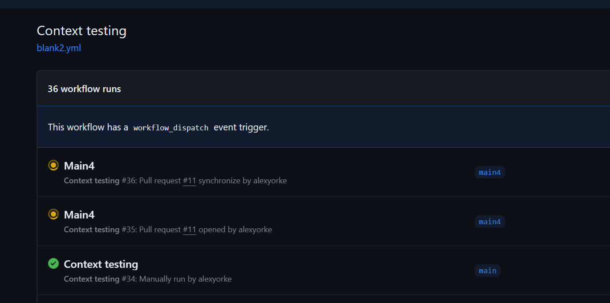

## **Comparison of Versioning Solutions** {#comparison-of-versioning-solutions .unnumbered}

---

Tool Description Versioning Scheme Automation Language/Framework Pros Cons

---

**GitVersion** Derives semantic version based on Git history, branches, and tags. Semantic Versioning Build-time .NET, CLI Flexible configuration options, supports complex branching strategies. Can be complex to configure, requires understanding of Git branching strategies.

**standard-version** Automates version bumps, changelogs, and Git tags based on Conventional Commits. Semantic Versioning Commit-time, Release JavaScript Easy to use, enforces consistent commit messages. Less flexible configuration, requires adherence to Conventional Commits.

**semantic-release** Fully automates releases, changelog generation, and publishing based on Conventional Commits. Semantic Versioning Continuous Deployment JavaScript Highly automated, ensures consistent releases. Requires strong commitment to Continuous Deployment, can be challenging to set up initially.

**Nerdbank.GitVersioning** Embeds version metadata directly in the code using an MSBuild task. Semantic Versioning Build-time .NET Lightweight, good for simple projects. Limited configuration options, less flexible than GitVersion.

**minver** Infers semantic version from Git tags, supporting pre-release versions. Semantic Versioning Build-time .NET Minimal configuration, easy to get started. Limited control over versioning logic.

**conventional-changelog** Generates changelogs from commit messages formatted according to Conventional Commits. N/A N/A JavaScript Useful for generating changelogs independently from versioning. Requires adherence to Conventional Commits.

**release-please** Automates release PR creation based on Conventional Commits and labels. Semantic Versioning GitHub Actions JavaScript Streamlines the release process, integrates well with GitHub. Relies on GitHub Actions, requires adherence to Conventional Commits.

**changesets** Manages version bumps and changelogs for monorepos, using a separate file for change descriptions. Semantic Versioning Release JavaScript Good for managing complex monorepos, allows for granular versioning decisions. Requires additional steps for managing changesets, can be more complex for smaller projects.

**release-it** General-purpose release automation tool that supports various versioning schemes and plugins. Customizable Release JavaScript Highly customizable, supports various workflows and integrations. Can require more configuration compared to simpler tools.

---

**Choosing the Right Tool:**

- **Complexity:** For simpler projects with basic branching strategies, **minver** or **Nerdbank.GitVersioning** might be sufficient.

- **Conventional Commits:** If you are committed to using Conventional Commits, **standard-version**, **semantic-release**, or **release-please** are good choices.

- **Continuous Deployment:** For fully automated releases, **semantic-release** is the optimal choice.

- **Monorepos:** **changesets** is designed for managing versioning in monorepos.

- **Flexibility:** **GitVersion** and **release-it** offer high levels of customization and flexibility.

Consider your project\'s specific needs and your team\'s workflow to select the most appropriate versioning solution.

name: Deployment

on:

workflow_dispatch:

inputs:

releaseType:

type: environment

required: true

concurrency:

group: \${{ github.workflow }}-\${{ github.ref }}

cancel-in-progress: false

jobs:

create_release:

permissions:

id-token: write \# This is required for requesting the JWT

contents: write \# This is required for actions/checkout

runs-on: ubuntu-latest

if: \${{ github.event.inputs.releaseType == \'production\' }}

outputs:

release_id: \${{ steps.create_release.outputs.release_id }}

steps:

\- name: Create Release

id: create_release

uses: actions/github-script@v6

with:

script: \|

const release = await github.rest.repos.createRelease({

owner: context.repo.owner,

repo: context.repo.repo,

tag_name: `v\${Date.now()}`, // This is an example tag format. Customize as needed.

name: \'Production Release\',

body: \'New production release\',

draft: false,

prerelease: false

});

return release.data.id;

staging:

needs: \[create_release\]

runs-on: ubuntu-latest

environment:

name: staging

url: https://github.com

steps:

\- name: Check out repository

uses: actions/checkout@v3

\- name: Deploy to Staging

run: \|

echo \"Pretending to deploy to staging environment\"

sleep 30

production:

needs: \[staging\]

if: \${{ github.event.inputs.releaseType == \'production\' }}

runs-on: ubuntu-latest

environment:

name: production

url: https://github.com

steps:

\- name: Check out repository

uses: actions/checkout@v3

\- name: Deploy to Production

run: \|

echo \"Deploying to production environment with release ID \${{ needs.create_release.outputs.release_id }}\"

sleep 30

### Setting up user accounts on GitHub {#setting-up-user-accounts-on-github .unnumbered}

+-------------------------------------------------------------------------------------------------------------------------------------------------------------------------------------------------------------------------------------------------------------------------+
| Setting up user accounts in GitHub Enterprise and ensuring secure access involves several steps. Here's a comprehensive guide to help you manage user accounts and enforce security measures like two-factor authentication (2FA) for accessing your GitHub repository. |
| |
| ### Step 1: Create and Configure User Accounts |
| |
| #### **For GitHub Enterprise Server (Self-Hosted)**: |
| |
| 1\. **Login as an Administrator**: |
| |
| \- Sign in to your GitHub Enterprise Server as an administrator. |
| |
| 2\. **Navigate to the Admin Dashboard**: |
| |
| \- Click on the upper-right profile or organization icon, then select \"Enterprise settings.\" |
| |
| 3\. **Manage Users**: |
| |
| \- Under the "Users" menu in the sidebar, click on "All users." |
| |
| \- Here, you can add new users by clicking "Invite user" and entering their email addresses. Users will receive an invitation to join your GitHub Enterprise environment. |
| |
| #### **For GitHub Enterprise Cloud**: |
| |
| 1\. **Organization Setup**: |
| |
| \- As an organization owner, go to your organization\'s page. |
| |
| \- Click \"People\" and select \"Invite member\" to add new users by entering their GitHub usernames or their email addresses. |
| |
| ### Step 2: Configure Permissions |
| |
| 1\. **Assign Roles and Teams**: |
| |
| \- Assign users to specific teams within your organization to manage repository access effectively. |
| |
| \- Teams can be created from the \"Teams\" tab in your organization settings. After creating a team, you can manage repository access and permissions through the team settings. |
| |
| 2\. **Set Repository Permissions**: |
| |
| \- For each repository, you can specify who has read, write, or admin access. Navigate to the repository settings, click on \"Collaborators & teams,\" and then add the teams or individuals with the appropriate access levels. |
| |
| ### Step 3: Enforce Security Policies |
| |
| 1\. **Enable Two-Factor Authentication (2FA)**: |
| |
| \- For enhanced security, enforce two-factor authentication for all users. |
| |
| \- In GitHub Enterprise Cloud, go to your organization\'s settings, select \"Security,\" then under \"Authentication security,\" choose "Require two-factor authentication for everyone in your organization." |
| |
| \- For GitHub Enterprise Server, navigate to the admin dashboard, select "Settings," find the "Authentication" section, and enforce 2FA by checking "Require two-factor authentication for all users." |
| |
| ### Step 4: Secure Connections |
| |
| 1\. **Use HTTPS or SSH for Repository Access**: |
| |
| \- Ensure that all users access repositories using HTTPS or SSH. |
| |
| \- Encourage users to set up SSH keys for a secure connection without needing to supply username and password each time. This can be done under their personal account settings by selecting \"SSH and GPG keys\" and adding a new SSH key. |
| |
| ### Step 5: Audit and Compliance |
| |
| 1\. **Regular Audits**: |
| |
| \- Regularly audit user access and permissions to ensure compliance with your organization's policies. |
| |
| \- Use the audit log feature to monitor activities. Access this in GitHub Enterprise Server by going to the admin dashboard and selecting "Audit log." For GitHub Enterprise Cloud, find it under your organization settings. |
| |
| 2\. **Continuous Training**: |
| |
| \- Continually educate users on security best practices, including the importance of strong passwords, recognizing phishing attacks, and securely managing their authentication credentials. |
| |
| ### Additional Recommendations |
| |
| \- **Review Third-Party Access**: Regularly review and manage third-party application access from your organization's settings to ensure that only trusted applications have access to your data. |
| |
| \- **IP Whitelisting**: If using GitHub Enterprise Server, consider configuring IP allow lists to control which IP addresses are permitted to access your instance. |
| |
| By following these steps, you can effectively set up and manage user accounts in GitHub Enterprise, ensuring secure access to your repositories and compliance with security policies. |
+=========================================================================================================================================================================================================================================================================+
+-------------------------------------------------------------------------------------------------------------------------------------------------------------------------------------------------------------------------------------------------------------------------+

### Dependabot and updating your dependencies {#dependabot-and-updating-your-dependencies .unnumbered}

Setting up Dependabot in your GitHub repository helps automate the process of dependency updates, ensuring that your project regularly receives the latest patches and versions of libraries and packages, which can improve security and performance.

Typically, the alerts have a priority associated with them, for example critical and high. You can start by addressing the critical and high priority alerts if you are receiving a lot of alerts initially.

+----------------------------------------------------------------------------------------------------------------------------------------------------------------------------------------------------------------------+
| You\'re right, Dependabot alerts can definitely contribute to toil in GitHub Actions, especially if not managed effectively. Here are some other potential sources of toil in GitHub Actions, along with Dependabot: |
| |
| **High Toil Tasks:** |
| |
| - **Managing Dependabot Alerts:** |
| |
| - **High Volume:** Many repositories, especially those with numerous dependencies, can be flooded with Dependabot alerts, making it difficult to triage and address them efficiently. |
| |
| - **False Positives:** Sometimes Dependabot flags updates that aren\'t actually necessary or compatible, leading to unnecessary investigations. |
| |
| - **Manual Merging:** Even if an update is desired, manually reviewing and merging every Dependabot PR can be tedious. |
| |
| - |
| |
| - **Troubleshooting Failing Workflows:** |
| |
| - **Unclear Error Messages:** Cryptic error messages can make it difficult to pinpoint the root cause of a failure, leading to time-consuming debugging. |
| |
| - **Inconsistent Environments:** Differences between development, testing, and production environments can cause unexpected workflow failures that are hard to reproduce and fix. |
| |
| - **Lack of Monitoring/Logging:** Insufficient logging or monitoring can make it difficult to track down the source of errors and understand workflow behavior. |
| |
| - |
| |
| - **Maintaining Self-Hosted Runners:** |
| |
| - **Infrastructure Management:** Setting up, maintaining, and securing self-hosted runners requires ongoing effort, especially for complex or distributed environments. |
| |
| - **Resource Scaling:** Manually scaling runner resources to meet fluctuating demands can be tedious and inefficient. |
| |
| - **Software Updates:** Keeping runners up-to-date with the latest software and security patches can be time-consuming. |
| |
| - |
| |
| - **Managing Secrets and Credentials:** |
| |
| - **Manual Rotation:** Regularly rotating secrets and credentials manually can be error-prone and time-consuming. |
| |
| - **Insecure Storage:** Storing secrets insecurely or hardcoding them into workflows creates significant security risks. |
| |
| - **Auditing and Access Control:** Monitoring access to secrets and ensuring proper auditing can be challenging without robust tooling. |
| |
| - |
| |
| **Reducing Toil:** |
| |
| Here are strategies to mitigate toil in GitHub Actions: |
| |
| - **Dependabot Automation:** |
| |
| - **Auto-merge:** Configure Dependabot to automatically merge updates for certain dependencies or version ranges that are considered low-risk. |
| |
| - **Ignore Rules:** Define ignore rules to filter out unwanted Dependabot alerts for specific dependencies or versions. |
| |
| - Make sure that they are merged frequently. This will help prevent major versions from being upgraded which could likely introduce breaking changes. |
| |
| - **Grouped Updates:** Enable Dependabot to group related updates into a single PR to reduce the number of PRs to review. |
| |
| - Sometimes upgrading a single package will upgrade many. There are some more instructions later on in the next chapters. |
| |
| - |
| |
| - **Improved Troubleshooting:** |
| |
| - **Structured Logging:** Implement standardized logging practices to capture useful information for debugging. |
| |
| - **Centralized Monitoring:** Use monitoring tools to get real-time visibility into workflow performance and identify issues quickly. |
| |
| - **Environment Standardization:** Minimize differences between environments to reduce the likelihood of unexpected errors. |
| |
| - |
| |
| - **Self-Hosted Runner Management:** |
| |
| - **Containerization:** Use containers to simplify runner setup and management, ensuring consistent environments. |
| |
| - **Infrastructure-as-Code:** Manage runner infrastructure with code (e.g., Terraform) for automation and reproducibility. |
| |
| - **Autoscaling:** Implement autoscaling solutions to dynamically adjust runner capacity based on demand. |
| |
| - |
| |
| - **Secrets Management:** |
| |
| - **Dedicated Secrets Manager:** Use a dedicated secrets management solution for secure storage, access control, and automated rotation. |
| |
| - **Environment Variables:** Leverage environment variables to inject secrets into workflows securely. |
| |
| - **GitHub Actions Secrets:** Use GitHub\'s built-in secrets management functionality for simple use cases. |
| |
| - |
| |
| By proactively addressing these potential sources of toil, you can significantly improve the efficiency and manageability of your GitHub Actions workflows. |
+======================================================================================================================================================================================================================+
+----------------------------------------------------------------------------------------------------------------------------------------------------------------------------------------------------------------------+

Here\'s how you can set up Dependabot for your repository:

### Step 1: Access Your GitHub Repository

Navigate to the GitHub repository where you want to enable Dependabot.

### Step 2: Create a Dependabot Configuration File

You need to create a `.github/dependabot.yml` file in your repository to configure Dependabot settings.

1\. **Create a New File**:

\- Navigate to your repository on GitHub.

\- Click on \"Add file\" \> \"Create new file\".

\- Set the path to `.github/dependabot.yml`.

2\. **Add Configuration to the File**:

Dependabot configuration needs to be defined in YAML format. Here's a basic example configuration for a JavaScript project using npm:

```yaml

version: 2

updates:

\- package-ecosystem: \"npm\" \# See documentation for other package ecosystems

directory: \"/\" \# Location of package manifests

schedule:

interval: \"weekly\" \# Options: \"daily\", \"weekly\", \"monthly\"

open-pull-requests-limit: 10 \# Maximum number of open pull requests

commit-message:

prefix: \"chore\" \# Prefix for the commit message and pull request title

include: \"scope\" \# Include the scope of the dependency in the commit message

ignore:

\- dependency-name: \"express\" \# Example: ignore updates for express

versions: \[\"4.x.x\"\]

```

Modify the `package-ecosystem`, `directory`, and other fields as per your project\'s requirements.

### Step 3: Commit the Configuration File

\- After entering your configuration into the `dependabot.yml` file:

\- Scroll down to the \"Commit new file\" section at the bottom of the page.

\- Enter a commit message and description if needed.

\- Choose whether to commit directly to the main branch or create a new branch and pull request.

\- Click "Commit new file" or \"Propose new file\" if you're creating a pull request.

### Step 4: Dependabot Activation

Once the `dependabot.yml` file is committed, GitHub automatically recognizes and activates Dependabot based on the settings you've defined. Dependabot will begin checking for updates and will open pull requests according to the schedule you\'ve set.

### Step 5: Review and Merge Pull Requests

\- Dependabot will raise pull requests when it finds updates.

\- Review these pull requests to ensure compatibility and test them as per your project\'s standards.

\- Merge the pull requests to update the dependencies in your project.

### Additional Configurations

You can customize Dependabot to ignore certain dependencies, apply labels automatically to pull requests, configure assignees, and more. For advanced configurations and specific settings for different ecosystems (like Maven, NuGet, Docker, etc.), refer to the \[Dependabot documentation\](https://docs.github.com/en/code-security/supply-chain-security/keeping-your-dependencies-updated-automatically/configuration-options-for-dependency-updates).

Setting up Dependabot not only helps maintain your project's dependency health but also improves security by ensuring that vulnerabilities are patched promptly through dependency updates.

### Budgeting and cost management {#budgeting-and-cost-management .unnumbered}

{width="4.564397419072616in" height="2.2688713910761154in"}

Make sure that your workflows don\'t run it necessarily long by frequently checking how long they run. There\'s some actions and ways to monitor how long your workflows typically run. It\'s normal that day will take longer to run as the project gets larger as more code to compile.The other one is you can limit the total length of time on your workflow from the default 12 hours to potentially one or two hours depending on how long they normally take to run. This is because they get stuck, then you\'ll be wasting a lot of money. Second one, you may want to set concurrency to one if.The workflow might be running multiple times in the same PR, which case there\'s only one job that will.Be used for its output?Umm.Also you may want to second currency to one if.You\'re doing a deployment. You don\'t have multipliers be happening concurrently, so this would be like a race condition for example.

Additionally, you want to make sure that you compress your artifacts when you upload them. To get artifacts, make sure that they\'re not retained for too long or too short. So for your pull requests, normally the artifacts retained for a day or even maybe even less. Because you do get charged for the amount of storage space that you\'re spending for GitHub actions, you may want to be careful about what you\'re actually storing in the artifacts.Is anything that\'s not required for deployment. Just don\'t include it basically, or just log it to the.The logs. If it\'s really important, you may want to potentially improve.Some of the artifacts that.Haven\'t been deployed if.You\'re really running out of.Space and body and such, but otherwise it should be fun.
