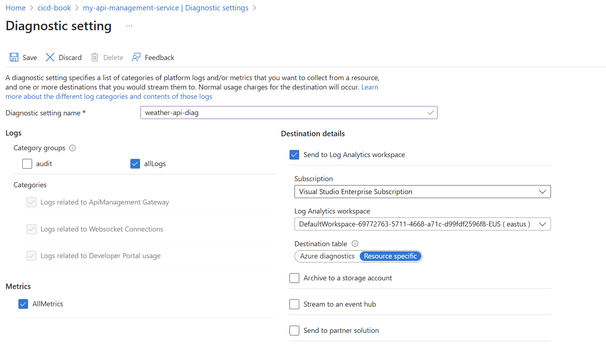
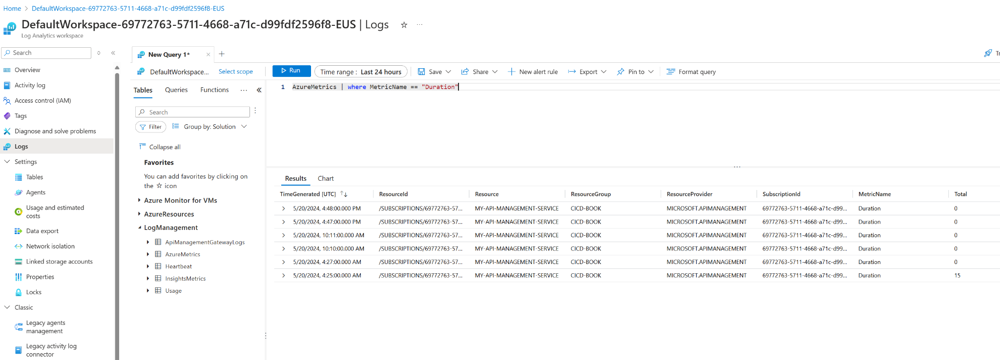

## **Cost-Effective CI/CD Workflow Management: Quick Tips** {#cost-effective-cicd-workflow-management-quick-tips .unnumbered}

**Workflow Optimization:**

- **Concurrency Control:** Limit concurrent builds per Pull Request (PR) to one. Auto-cancel older builds on new commits.

- **Timeout Optimization:** Set workflow timeouts based on doubled median workflow time, adjusting upwards as the project grows.

- **Dependabot Management:**

  - Trigger Dependabot PRs manually or conditionally.

  - Limit the number of open Dependabot PRs.

  - Balance limiting PRs with potential missed alerts.

**Resource Management:**

- **Branch Selection:** Avoid running CI on branches without PRs (except main/master).

- **Fast Fail:** Prioritize quick-failing tests to optimize feedback loops.

- **Caching Strategy:** Employ caching strategically, ensuring effectiveness and avoiding potential security risks.

- **Selective Testing:** Utilize multi-threaded test execution and focus on testing affected code.

- **Tool Usage:** Only employ static analysis tools if their output is actively used.

**Developer Experience:**

- **Balanced Approach:** Prioritize developer efficiency and quick feedback loops without compromising cost effectiveness.

- **Hardware Considerations:** Invest in adequate infrastructure to minimize wait times, especially for critical production deployments.

[[Build monitor for Github Actions, Gitlab CI, Travis CI, Bitrise and Buddy! \| Meercode]{.underline}](https://meercode.io/) interesting (use free version)

+-------------------------------------------------------------------------------------------------------------------------------------------------------------------------------------------------------------------------------------------------------------------------------------------------------------------------------------------------------------------------------------------------------------------------------------------------------------------------------------------------------------------------------------------------------------------------------------------------------------------------------------------------------------------------------------------------------------------------------------------------------------------------------------------------------------------------------------------------------------------------------------------------------------------------------------------------------------------------------------------------------------------------------------------------------------------------------------------------------------------------------------------------------------------------------------+
| Adding to the previous groupings, here\'s how the additional file path globs can be categorized by theme: |
| |
| ### Documentation |
| |
| \- `**.md`, `\*.md`, `**/\*.md`, `**.adoc`, `**/\*.txt`, `\*.txt`, `**.rst`, `**/\*.rst`, `docs/**`, `doc/**`, `docs/`, `docs/\*`, `Docs/\*`, `documentation/**`, `README.md`, `README\*`, `README.\*`, `readme.md`, `CHANGELOG.md`, `changelog.txt`, `CONTRIBUTING.md`, `LICENSE.md`, `LEGAL`, `NOTICE`, `CODEOWNERS`, `Vision.md`, `ToUpgrade.md`, `ToTest.md`, `TestEnv.md`, `README.ko.md`, `HowToSetProject.md`, `HowToSetProject.ko.md`, `Example.md`, `CODE_OF_CONDUCT.md`, `**/\*.markdown`, `\*.rst`, `**/\*.rst` |
| |
| ### Project Configuration and Setup |
| |
| \- `.gitignore`, `.gitattributes`, `.editorconfig`, `.travis.yml`, `.all-contributorsrc`, `.vscode/**`, `.github/**`, `.github/ISSUE_TEMPLATE/**`, `.github/workflows/**`, `.gitmodules`, `.gitlab-ci.yml`, `.dependabot/**`, `.cirrus.yml`, `.dockerignore`, `.circleci/**`, `.codecov.yml`, `.clang-format`, `.yamllint`, `.vscode`, `.spellcheck.dict.txt`, `.devcontainer`, `.ansible-lint`, `.prettierrc`, `.prettierignore`, `.lintstagedrc.js`, `config/**`, `package.json`, `appveyor.yml`, `Dockerfile`, `docker-compose.yml`, `docker/**`, `data/**`, `site/**`, `examples/**`, `build/**`, `snap/**`, `scripts/**`, `**/.gitignore`, `**/\*.yml`, `\*.yml`, `**.yml`, `\*.sh`, `**/\*.sh`, `**.nix`, `**.txt`, `**/\*.txt`, `Makefile`, `**.png`, `**/\*.png`, `\*.png`, `\*.html`, `\*.bat`, `\*.ini`, `**/\*.org`, `**.org`, `lombok.config`, `requirements.txt`, `Brewfile`, `**/argoDeploy.json`, `**/\*.rst`, `**.rst` |
| |
| ### License and Legal |
| |
| \- `LICENSE`, `LICENCE`, `LICENSE.txt`, `**/LICENSE` |
| |
| ### Continuous Integration and Continuous Deployment (CI/CD) |
| |
| \- `.github/workflows/macos.yml`, `.github/workflows/TagBot.yml`, `.github/workflows/pages.yml`, `.github/labels.yml`, `.github/workflows/test.yml`, `.github/workflows/windows.yml`, `.github/workflows/dockerhub-description.yml`, `.github/CONTRIBUTING.md`, `.github/dependabot.yml`, `.github/CODEOWNERS`, `.github/ISSUE_TEMPLATE/\*`, `.github/ISSUE_TEMPLATE`, `.github/renovate.json`, `.github/\*.yml`, `.github/\*`, `.github/workflows/generate.yml`, `.github/workflows/verify-pages.yml`, `.github/workflows/no-response.yml`, `.github/workflows/labels.yml`, `.github/workflows/ubuntu.yml`, `.github/workflows/release.yml`, `.github/workflows/buildx-release.yml`, `.github/workflows/buildx-latest.yml`, `.github/release.yml`, `.github/FUNDING.yml`, `.github/workflows/mingw-w64.yml`, `.github/workflows/docker.yml`, `./github/**`, `!./github/workflow/test.yml`, `!**/\*.yml`, `!**/\*.sh`, `!**/\*.png`, `!**/\*.html`, `!**/\*.bat`, `!**/\*.ini`, `!**/\*.org`, `!\*\*/\*.rst`, `ci/subst-release-info.py`, `ci/generate-docs.py`, `ci/build-docs.sh` |
+=====================================================================================================================================================================================================================================================================================================================================================================================================================================================================================================================================================================================================================================================================================================================================================================================================================================================================================================================================================================================================================================================================================================================================================================================+
+-------------------------------------------------------------------------------------------------------------------------------------------------------------------------------------------------------------------------------------------------------------------------------------------------------------------------------------------------------------------------------------------------------------------------------------------------------------------------------------------------------------------------------------------------------------------------------------------------------------------------------------------------------------------------------------------------------------------------------------------------------------------------------------------------------------------------------------------------------------------------------------------------------------------------------------------------------------------------------------------------------------------------------------------------------------------------------------------------------------------------------------------------------------------------------------+

### Outputs (and common outputs) {#outputs-and-common-outputs .unnumbered}

Sharing information between steps and jobs in a CI/CD pipeline is crucial for maintaining continuity and consistency across the workflow. Here\'s how it works more coherently explained:

### Information Sharing Between Steps

1\. **In-Memory Structures**: Information that isn\'t persisted to the file system, like variables or environment variables, can be passed between steps within the same job.

2\. **Outputs as Inputs**: Outputs from one step can be used as inputs in subsequent steps. For example, generating a version number in one step and using it in subsequent steps for tasks like stamping the version into source code, resource files, or naming artifacts.

### Job-to-Job Communication

1\. **Sequential Job Execution**: To pass information from one job to another, the first job must complete before the next starts if the subsequent job relies on outputs from the first.

2\. **Using Outputs Across Jobs**: Outputs from one job can be set as inputs for the next job. This is particularly useful for sharing configuration data, such as release numbers or outcomes of tests.

### Practical Usage of Outputs

1\. **Version Control**: A common use of outputs is to generate a version number that can be utilized across multiple steps, ensuring all parts of the application and its artifacts are version-coordinated.

2\. **Conditional Steps Based on Outputs**: Outputs can determine workflow logic, such as skipping software installation steps if caches were successfully restored.

### Technical Implementation

1\. **Unique Step Identification**: Ensure each step that generates outputs has a unique \"id\" so its outputs can be specifically referenced.

2\. **Passing Data**: Data is passed to the next step by writing to a temporary file located at `\$GITHUB_OUTPUT`. This file is then re-sourced at the start of each subsequent step, injecting the exported environment variables into the step.

3\. **Environment Variables Integration**: By exporting the required outputs into environment variables, each subsequent step can access these values seamlessly.

You only need ids for steps if you want to share data between different steps. Adding ids don't hurt anything if you add them and you don't use the ids, however.

+-----------------------------------------------------------------------+
| name: Context testing |
| |
| on: push |
| |
| jobs: |
| |
| job1: |
| |
| runs-on: ubuntu-latest |
| |
| steps: |
| |
| \- id: step1 |
| |
| name: Step 1 |
| |
| run: echo \"TESTING=hello sample text\" \>\> \$GITHUB_OUTPUT; |
| |
| \- id: step2 |
| |
| name: Step 2 |
| |
| run: echo \"\$TESTING\" |
| |
| env: |
| |
| TESTING: \${{steps.step1.outputs.TESTING}} |
+=======================================================================+
+-----------------------------------------------------------------------+

If you need to share large amounts of information, such as files, then you can use the upload-artifacts action to upload the artifacts, and then download them in the next job.

You can also specify outputs via the "output" mapping. This is especially useful if you want to share information specific to GitHub actions (i.e., those with the "using:" mapping) as those do not have a run block where you can export information via GITHUB_OUTPUT.

If you need information from a step in another job, make sure that it runs before your job runs. Otherwise, the output will be undefined because the job did not run yet. This has to be explicitly defined.

**Note!** If you try to access an output that does not exist from a step, you'll get back an empty string and no error. To prevent this, use actionlint which is a third-party tool that lints your workflow files. It will catch this error.

+-----------------------------------------------------------------------+
| jobs: |
| |
| job1: |
| |
| runs-on: ubuntu-latest |
| |
| \# Map a step output to a job output |
| |
| outputs: |
| |
| output1: \${{ steps.step1.outputs.test }} |
| |
| output2: \${{ steps.step2.outputs.test }} |
| |
| steps: |
| |
| \- id: step1 |
| |
| run: echo \"test=hello\" \>\> \"\$GITHUB_OUTPUT\" |
| |
| \- id: step2 |
| |
| run: echo \"test=world\" \>\> \"\$GITHUB_OUTPUT\" |
| |
| job2: |
| |
| runs-on: ubuntu-latest |
| |
| needs: job1 |
| |
| steps: |
| |
| \- env: |
| |
| OUTPUT1: \${{needs.job1.outputs.output1}} |
| |
| OUTPUT2: \${{needs.job1.outputs.output2}} |
| |
| run: echo \"\$OUTPUT1 \$OUTPUT2\" |
+=======================================================================+
+-----------------------------------------------------------------------+

### {#section-1 .unnumbered}

#### What are outputs commonly used for? {#what-are-outputs-commonly-used-for .unnumbered}

- [[actions/create-release: An Action to create releases via the GitHub Release API]{.underline}](https://github.com/actions/create-release#outputs) where the output is the release_url and then it is used in the upload-release-asset task as an input to add things to the release, potentially use output release URL in other integrations such as posting the release URL to teams, tags are grabbed in one step and then re-used in many others, tagging docker images with the version. If you're using timestamps, then you have to have it as a variable because otherwise if you re-evaluate it then it will change.

- Version numbers and references and such have to be stamped everywhere, all over the tags, docker images, source code, etc. so these are commonly re-used as outputs in the workflows. They are also difficult to compute sometimes, so therefore it makes sense to have them in their own step.

- Output from tests, so for example, success/failure/how many tests passed, etc. I suppose it is because people don't know that you can continue a failing step, or, that technically, failing tests might cause the rest of the workflow to fail, therefore in order to publish the testing results then you have to make sure that you continue on because otherwise the workflow would stop (and you want to publish the test failures.)

Sometimes, however, outputs might still be available from your steps but might not be explicitly defined. For example, GitHub Actions actions may define outputs, even though they are not in the workflow file.Find out if this is the case for your action. You have to check the GitHub Actions documentation.

+-----------------------------------------------------------------------------------+
| \- name: Restore Cache |
| |
| id: cache |
| |
| uses: actions/cache@v2 |
| |
| with: |
| |
| path: node_modules |
| |
| key: \${{ runner.os }}-node-\${{ hashFiles(\'**/package-lock.json\') }} |
| |
| \- name: Report Cache Status |
| |
| if: **steps.cache.outputs.cache-hit != \'true\' \# not defined in previous step** |
| |
| run: echo \"Cache key not found. Regenerating cache.\" |
+===================================================================================+
+-----------------------------------------------------------------------------------+

### Security {#security-1 .unnumbered}

+-------------------------------------------------------------------------------------------------------------------------------------------------------------------------------------------------------+
| ## **Key Points from Defending Continuous Integration/Continuous Delivery (CI/CD) Environments** {#key-points-from-defending-continuous-integrationcontinuous-delivery-cicd-environments .unnumbered} |
| |
| **Focus:** Recommendations and best practices for securing CI/CD pipelines within DevSecOps environments, regardless of the specific tools used. |
| |
| **Context:** CI/CD pipelines are increasingly targeted by malicious actors due to their role in rapidly building and deploying software. Compromise can lead to:\ |
| \* Injection of malicious code\ |
| \* Intellectual property theft\ |
| \* Denial of service attacks |
| |
| **Threat Landscape:** |
| |
| - **Insecure Code:** Bugs in first or third-party code can create exploitable vulnerabilities. |
| |
| - **Poisoned Pipeline Execution:** Injecting malicious code into the build process to compromise later stages. |
| |
| - **Insufficient Access Control:** Unauthorized access enables code manipulation and other attacks. |
| |
| - **Insecure Configuration:** Misconfigurations in infrastructure, network, or applications create vulnerabilities. |
| |
| - **Insecure Third-Party Services:** Vulnerabilities in externally developed services can compromise the pipeline. |
| |
| - **Exposed Secrets:** Compromise of keys, passwords, and other credentials grants access to sensitive resources. |
| |
| **Recommendations:** |
| |
| - **Authentication and Access Control:** |
| |
| - Strong cryptography (CNSA Suite for NSS, NIST for others) |
| |
| - Minimize long-term credentials, utilize temporary and ephemeral credentials |
| |
| - Implement code signing and verification throughout the pipeline |
| |
| - Two-person rule for all code updates |
| |
| - Least privilege access control, separation of duties |
| |
| - Secure user accounts, regularly audit admin accounts |
| |
| - |
| |
| - **Secrets Management:** |
| |
| - Never expose secrets in plaintext |
| |
| - Utilize dedicated secrets management solutions within CI/CD tools |
| |
| - |
| |
| - **Network Security:** |
| |
| - Robust network segmentation and traffic filtering |
| |
| - |
| |
| - **Development Environment Hardening:** |
| |
| - Keep software and operating systems updated |
| |
| - Update CI/CD tools regularly |
| |
| - Remove unnecessary applications |
| |
| - Implement endpoint detection and response (EDR) tools |
| |
| - |
| |
| - **Development Process Security:** |
| |
| - Integrate security scanning early in the process (SAST, DAST, registry scanning) |
| |
| - Use only trusted libraries, tools, and artifacts |
| |
| - Analyze committed code for vulnerabilities |
| |
| - Remove temporary resources after use |
| |
| - Maintain detailed audit logs |
| |
| - Implement SBOM and SCA to track components and vulnerabilities |
| |
| - |
| |
| - **Resiliency:** |
| |
| - Design for high availability and disaster recovery |
| |
| - Ensure scalability for emergency patch updates |
| |
| - |
| |
| **Overall Approach:** |
| |
| - Zero trust approach, assuming no element is fully trusted. |
| |
| - Leverage MITRE ATT&CK and D3FEND frameworks for threat modeling and mitigation strategies. |
| |
| **Outcomes:** |
| |
| - Reduce attack surface and exploitation vectors. |
| |
| - Create a challenging environment for malicious actors. |
| |
| - Improve cybersecurity posture for a wide range of organizations. |
| |
| **Call to Action:** Implement the recommended mitigations to secure CI/CD environments and strengthen overall software supply chain security. |
| |
| [[CSI_DEFENDING_CI_CD_ENVIRONMENTS.PDF (defense.gov)]{.underline}](https://media.defense.gov/2023/Jun/28/2003249466/-1/-1/0/CSI_DEFENDING_CI_CD_ENVIRONMENTS.PDF) |
+=======================================================================================================================================================================================================+
+-------------------------------------------------------------------------------------------------------------------------------------------------------------------------------------------------------+

+--------------------------------------------------------------------------------------------------------------------------------------------------------------------------------------------------------------+
| ## **Implementing Security Measures in GitHub Actions Enterprise (Cloud-hosted) -- Practical Guide** {#implementing-security-measures-in-github-actions-enterprise-cloud-hosted-practical-guide .unnumbered} |
| |
| This guide provides detailed, practical steps for implementing the security recommendations using GitHub Actions Enterprise. |
| |
| **Authentication and Access Control:** |
| |
| 1. **Strong cryptography:** |
| |
| - No action required. GitHub Actions Enterprise automatically utilizes industry-standard cryptography for data transmission and storage. |
| |
| 2. |
| |
| 3. **Minimize long-term credentials:** |
| |
| - **Utilize GitHub\'s built-in secret management:** |
| |
| - Go to your repository\'s \"Settings\" -\> \"Secrets\" -\> \"Actions\". |
| |
| - Click \"New repository secret\". |
| |
| - Name your secret meaningfully (e.g., DOCKER_HUB_TOKEN). |
| |
| - Paste the secret value (e.g., your Docker Hub personal access token) and click \"Add secret\". |
| |
| **Access your secret securely within a workflow file:\ |
| ** jobs: |
| |
| my_job: |
| |
| runs-on: ubuntu-latest |
| |
| steps: |
| |
| \- name: Login to Docker Hub |
| |
| run: docker login -u \${{ secrets.DOCKER_HUB_TOKEN }} |
| |
| - content_copyUse code [[with caution]{.underline}](https://support.google.com/legal/answer/13505487).Yaml |
| |
| `{=html}                                                                                                                                                                                                   |
| <!-- -->                                                                                                                                                                                                     |
| ` |
| - |
| |
| - **Use temporary OpenID Connect (OIDC) tokens:** |
| |
| **Enable OIDC in your workflow file:\ |
| ** permissions: |
| |
| id-token: write |
| |
| contents: read |
| |
| jobs: |
| |
| deploy: |
| |
| runs-on: ubuntu-latest |
| |
| permissions: |
| |
| aws: sts:AssumeRole |
| |
| - content_copyUse code [[with caution]{.underline}](https://support.google.com/legal/answer/13505487).Yaml |
| |
| - **Create a dedicated IAM role in your cloud provider:** |
| |
| - **AWS Example:** |
| |
| - Open the IAM console in your AWS account. |
| |
| - Create a new role with \"Web Identity\" as the trusted entity. |
| |
| - For \"Web Identity provider\", select \"GitHub Actions\" and input your organization and repository URLs. |
| |
| - Configure permissions for this role (e.g., allow access to specific S3 buckets). |
| |
| - Note the generated role ARN (Amazon Resource Name). |
| |
| - |
| |
| - |
| |
| **Reference the IAM role ARN in your workflow:\ |
| ** jobs: |
| |
| deploy: |
| |
| runs-on: ubuntu-latest |
| |
| environment: production |
| |
| permissions: |
| |
| aws: sts:AssumeRole |
| |
| steps: |
| |
| \- uses: aws-actions/configure-aws-credentials@v1 |
| |
| with: |
| |
| role-to-assume: arn:aws:iam::123456789012:role/GitHubActionsDeployRole |
| |
| role-session-name: GitHubActionsSession |
| |
| \- name: Deploy to S3 |
| |
| run: aws s3 cp my-app.zip s3://my-bucket/ |
| |
| - content_copyUse code [[with caution]{.underline}](https://support.google.com/legal/answer/13505487).Yaml |
| |
| `{=html}                                                                                                                                                                                                   |
| <!-- -->                                                                                                                                                                                                     |
| ` |
| - |
| |
| 4. |
| |
| 5. **Implement code signing and verification:** |
| |
| - **Use GitHub\'s code signing feature (available with GitHub Advanced Security):** |
| |
| - Navigate to your repository\'s \"Settings\" -\> \"Code security and analysis\". |
| |
| - Enable \"Code signing\" and choose your preferred key management method. |
| |
| **Configure your workflow to sign artifacts:\ |
| ** jobs: |
| |
| build: |
| |
| runs-on: ubuntu-latest |
| |
| steps: |
| |
| \- uses: actions/checkout@v3 |
| |
| \- name: Build and sign the artifact |
| |
| run: \| |
| |
| make build |
| |
| cosign sign my-app.zip |
| |
| - content_copyUse code [[with caution]{.underline}](https://support.google.com/legal/answer/13505487).Yaml |
| |
| **Verify signatures before deployment:\ |
| ** jobs: |
| |
| deploy: |
| |
| runs-on: ubuntu-latest |
| |
| steps: |
| |
| \- uses: actions/download-artifact@v3 |
| |
| with: |
| |
| name: my-app |
| |
| \- name: Verify the signature |
| |
| run: cosign verify my-app.zip |
| |
| \- name: Deploy the artifact |
| |
| run: \| |
| |
| \# Deploy your application\... |
| |
| - content_copyUse code [[with caution]{.underline}](https://support.google.com/legal/answer/13505487).Yaml |
| |
| `{=html}                                                                                                                                                                                                   |
| <!-- -->                                                                                                                                                                                                     |
| ` |
| - |
| |
| 6. |
| |
| 7. **Two-person rule for all code updates:** |
| |
| - **Enable branch protection rules:** |
| |
| - Navigate to your repository\'s \"Settings\" -\> \"Branches\". |
| |
| - Click \"Add rule\" and select your protected branch (e.g., main or release). |
| |
| - **Require pull request reviews before merging:** |
| |
| - Check \"Require pull request reviews before merging\". |
| |
| - Set \"Required approving reviews\" to 2 or more. |
| |
| - Optionally, select \"Dismiss stale pull request approvals when new commits are pushed\". |
| |
| - |
| |
| - **Enable \"Require linear history\" to prevent force pushes:** |
| |
| - This ensures a clean and auditable commit history. |
| |
| - |
| |
| - |
| |
| 8. |
| |
| 9. **Least privilege access control, separation of duties:** |
| |
| - **Utilize GitHub\'s granular permission system:** |
| |
| - Go to your organization\'s \"Settings\" -\> \"Teams\". |
| |
| - Create teams based on roles (e.g., \"Developers\", \"Operations\"). |
| |
| - Add users to corresponding teams. |
| |
| - **Assign repository permissions for each team:** |
| |
| - In your repository settings, under \"Collaborators & teams\", grant appropriate permissions (read, write, maintain) to each team. |
| |
| - |
| |
| - |
| |
| - **Define environment protection rules:** |
| |
| - Navigate to your repository\'s \"Settings\" -\> \"Environments\". |
| |
| - Click \"New environment\" and give it a meaningful name (e.g., staging, production). |
| |
| - **Configure protection rules:** |
| |
| - Under \"Required reviewers\", add required reviewers for deployments to this environment. |
| |
| - Define branch protection rules similar to the \"Two-person rule\" above for deployments. |
| |
| - |
| |
| - **Require approvals before deployment:** |
| |
| - Check \"Required reviewers\" and specify the required number of reviewers for deployments. |
| |
| - |
| |
| - |
| |
| 10. |
| |
| 11. **Secure user accounts, regularly audit admin accounts:** |
| |
| - **Enforce two-factor authentication (2FA) for all users:** |
| |
| - In your organization\'s \"Settings\" -\> \"Security\", enable \"Require two-factor authentication for all users\". |
| |
| - |
| |
| - **Regularly review and revoke access for inactive users and external collaborators:** |
| |
| - Periodically review the \"People\" tab in your organization settings and remove users who no longer require access. |
| |
| - |
| |
| - **Implement audit logging:** |
| |
| - Navigate to your organization\'s \"Settings\" -\> \"Audit log\". |
| |
| - Analyze logs for suspicious activity, including login attempts, repository modifications, and access changes. |
| |
| - Integrate audit log data with your SIEM or log management system for centralized monitoring and analysis. |
| |
| - |
| |
| 12. |
| |
| **Secrets Management:** |
| |
| 1. **Never expose secrets in plaintext:** |
| |
| - **Always utilize GitHub\'s built-in secrets management as described in section 2 above.** |
| |
| - **Never hardcode secrets directly in workflow files or source code.** |
| |
| 2. |
| |
| 3. **Utilize dedicated secrets management solutions within CI/CD tools:** |
| |
| - **Integrate with a dedicated secrets management tool like HashiCorp Vault:** |
| |
| **Install the Vault CLI on your runners:\ |
| ** jobs: |
| |
| my_job: |
| |
| runs-on: ubuntu-latest |
| |
| steps: |
| |
| \- name: Install Vault CLI |
| |
| run: \| |
| |
| apt-get update |
| |
| apt-get install -y vault |
| |
| - content_copyUse code [[with caution]{.underline}](https://support.google.com/legal/answer/13505487).Yaml |
| |
| - **Authenticate with Vault within your workflow:** |
| |
| - Use a method like AppRole authentication to obtain a Vault token. |
| |
| - Configure your Vault server to allow access from GitHub Actions based on OIDC or other authentication mechanisms. |
| |
| - |
| |
| **Fetch secrets from Vault during runtime:\ |
| ** jobs: |
| |
| deploy: |
| |
| runs-on: ubuntu-latest |
| |
| steps: |
| |
| \- name: Authenticate with Vault |
| |
| run: vault login token=\$VAULT_TOKEN |
| |
| \- name: Read secret from Vault |
| |
| run: \| |
| |
| export MY_SECRET=\$(vault read -field=password secret/data/my-app/credentials) |
| |
| \# Use \$MY_SECRET in your deployment commands\... |
| |
| - content_copyUse code [[with caution]{.underline}](https://support.google.com/legal/answer/13505487).Yaml |
| |
| - Store the Vault token securely as a GitHub secret or through environment variables. |
| |
| - |
| |
| `{=html}                                                                                                                                                                                                   |
| <!-- -->                                                                                                                                                                                                     |
| ` |
| - |
| |
| 4. |
| |
| **Network Security:** |
| |
| 1. **Robust network segmentation and traffic filtering:** |
| |
| - **Utilize GitHub\'s self-hosted runners for granular control:** |
| |
| - Follow GitHub\'s documentation to set up self-hosted runners within your private network. |
| |
| - **Implement network segmentation:** |
| |
| - Use VLANs, subnets, or firewalls to isolate your runners from other parts of your network. |
| |
| - |
| |
| - **Define strict firewall rules:** |
| |
| - Only allow necessary traffic between runners and other resources (e.g., source code repositories, artifact registries, deployment targets). |
| |
| - |
| |
| - |
| |
| - **Leverage your cloud provider\'s network security features for cloud-hosted runners:** |
| |
| - **Utilize Virtual Private Clouds (VPCs):** |
| |
| - Define dedicated VPCs for your GitHub Actions workloads. |
| |
| - Use Network Access Control Lists (NACLs) to restrict inbound and outbound traffic to the VPC. |
| |
| - |
| |
| - **Configure security groups:** |
| |
| - Limit access to your runners based on IP addresses, ports, and protocols. |
| |
| - Use security groups to enforce least privilege access to other cloud resources used by your workflows. |
| |
| - |
| |
| - |
| |
| 2. |
| |
| **Development Environment Hardening:** |
| |
| 1. **Keep software and operating systems updated:** |
| |
| - **Utilize actions to ensure updates are applied:** |
| |
| **Update the codebase:\ |
| ** jobs: |
| |
| build: |
| |
| runs-on: ubuntu-latest |
| |
| steps: |
| |
| \- uses: actions/checkout@v3 |
| |
| - content_copyUse code [[with caution]{.underline}](https://support.google.com/legal/answer/13505487).Yaml |
| |
| **Update dependencies and system packages:\ |
| ** jobs: |
| |
| build: |
| |
| runs-on: ubuntu-latest |
| |
| steps: |
| |
| \- name: Update system packages |
| |
| run: apt-get update && apt-get upgrade -y |
| |
| \- name: Update dependencies |
| |
| run: npm install |
| |
| - content_copyUse code [[with caution]{.underline}](https://support.google.com/legal/answer/13505487).Yaml |
| |
| `{=html}                                                                                                                                                                                                   |
| <!-- -->                                                                                                                                                                                                     |
| ` |
| - |
| |
| 2. |
| |
| 3. **Update CI/CD tools regularly:** |
| |
| - **Subscribe to GitHub\'s update notifications and security advisories.** |
| |
| - **Schedule regular maintenance windows for applying updates to GitHub Actions and related tools.** |
| |
| 4. |
| |
| 5. **Remove unnecessary applications:** |
| |
| - **Utilize minimal base images for your runners:** |
| |
| - Use Docker images designed for CI/CD environments, such as ubuntu:latest or alpine:latest. |
| |
| - Avoid images with unnecessary software pre-installed. |
| |
| - |
| |
| - **Avoid installing unnecessary software on runners:** |
| |
| - Install only the essential tools required for your workflows. |
| |
| - |
| |
| 6. |
| |
| 7. **Implement endpoint detection and response (EDR) tools:** |
| |
| - **Install EDR agents on self-hosted runners:** |
| |
| - Follow your chosen EDR vendor\'s instructions to install and configure agents on your runner machines. |
| |
| - |
| |
| - **Integrate EDR solutions with your cloud provider\'s security monitoring tools:** |
| |
| - Use your EDR\'s API or integrations to forward security events and alerts to your cloud provider\'s security information and event management (SIEM) system. |
| |
| - |
| |
| 8. |
| |
| **Development Process Security:** |
| |
| 1. **Integrate security scanning early in the process:** |
| |
| - **Utilize actions for SAST, DAST, and registry scanning:** |
| |
| **SAST (Static Application Security Testing):\ |
| ** jobs: |
| |
| build: |
| |
| runs-on: ubuntu-latest |
| |
| steps: |
| |
| \- uses: actions/checkout@v3 |
| |
| \- name: Run SAST with CodeQL |
| |
| uses: github/codeql-action/analyze@v2 |
| |
| - content_copyUse code [[with caution]{.underline}](https://support.google.com/legal/answer/13505487).Yaml |
| |
| **DAST (Dynamic Application Security Testing):\ |
| ** jobs: |
| |
| test: |
| |
| runs-on: ubuntu-latest |
| |
| steps: |
| |
| \- uses: actions/checkout@v3 |
| |
| \- name: Run DAST with OWASP ZAP |
| |
| uses: zaproxy/action-baseline@v0.4.0 |
| |
| with: |
| |
| target: https://my-application.com |
| |
| - content_copyUse code [[with caution]{.underline}](https://support.google.com/legal/answer/13505487).Yaml |
| |
| **Container Registry Scanning:\ |
| ** jobs: |
| |
| scan: |
| |
| runs-on: ubuntu-latest |
| |
| steps: |
| |
| \- name: Scan container image |
| |
| uses: anchore/scan-action@v2 |
| |
| with: |
| |
| image: my-registry/my-image:latest |
| |
| - content_copyUse code [[with caution]{.underline}](https://support.google.com/legal/answer/13505487).Yaml |
| |
| `{=html}                                                                                                                                                                                                   |
| <!-- -->                                                                                                                                                                                                     |
| ` |
| - |
| |
| 2. |
| |
| 3. **Use only trusted libraries, tools, and artifacts:** |
| |
| - **Define clear policies for approving third-party dependencies:** |
| |
| - Establish criteria for evaluating open source libraries and tools, considering factors like popularity, maintenance, security track record, and license compatibility. |
| |
| - |
| |
| - **Utilize dependency scanning tools to identify vulnerabilities in libraries:** |
| |
| - Integrate tools like Snyk or Dependabot into your workflows to continuously monitor dependencies for known vulnerabilities. |
| |
| - |
| |
| 4. |
| |
| 5. **Analyze committed code for vulnerabilities:** |
| |
| - **Integrate SAST solutions into the development workflow:** |
| |
| - Run SAST tools as part of your CI/CD pipeline to identify vulnerabilities early in the development cycle. |
| |
| - |
| |
| - **Perform manual code reviews with a focus on security:** |
| |
| - Train developers to recognize common security vulnerabilities and best practices during code reviews. |
| |
| - |
| |
| 6. |
| |
| 7. **Remove temporary resources after use:** |
| |
| - **Utilize workflow cleanup scripts to delete temporary files and resources:** |
| |
| - Use the run step to execute cleanup commands at the end of your workflow jobs, only if your workflow is not stateless. |
| |
| - For example, delete temporary files, remove cloud resources provisioned during testing, or **revoke temporary credentials.** |
| |
| - |
| |
| 8. |
| |
| 9. **Maintain detailed audit logs:** |
| |
| - **Analyze GitHub Actions audit logs for suspicious activity:** |
| |
| - Regularly review audit logs, paying attention to events like user logins, permission changes, and secret access. |
| |
| - |
| |
| - **Integrate logging with your SIEM or log management system:** |
| |
| - Configure GitHub Actions to forward audit logs to your centralized logging system for enhanced analysis and monitoring. |
| |
| - |
| |
| 10. |
| |
| 11. **Implement SBOM and SCA to track components and vulnerabilities:** |
| |
| - **Use actions to generate and manage SBOMs (Software Bill of Materials):** |
| |
| - Integrate tools like Syft or CycloneDX into your workflows to generate SBOMs for your software artifacts. |
| |
| - Store SBOMs in a secure location for future reference and auditing. |
| |
| - |
| |
| - **Integrate with SCA tools for continuous vulnerability monitoring:** |
| |
| - Use tools like Snyk, Dependency-Track, or OWASP Dependency-Check to analyze SBOMs and identify potential vulnerabilities. |
| |
| - |
| |
| 12. |
| |
| **Resiliency:** |
| |
| 1. **Design for high availability and disaster recovery:** |
| |
| - **Utilize multiple self-hosted runners in different geographic locations:** |
| |
| - Distribute your self-hosted runners across multiple availability zones or regions to ensure redundancy and resilience against regional outages. |
| |
| - |
| |
| - **Implement failover mechanisms for runners:** |
| |
| - Configure your workflow to automatically failover to available runners in case of individual runner failures. |
| |
| - |
| |
| 2. |
| |
| This comprehensive guide provides practical steps for implementing security measures in GitHub Actions Enterprise (Cloud-hosted), enhancing the security and reliability of your CI/CD pipeline. |
+==============================================================================================================================================================================================================+
+--------------------------------------------------------------------------------------------------------------------------------------------------------------------------------------------------------------+

### Application monitoring {#application-monitoring .unnumbered}

Deploying your application successfully doesn\'t always guarantee it\'s functioning as expected, especially in complex setups with a backend. For instance, refreshing the browser could reset the application since it doesn\'t maintain state server-side. Errors can also arise from other areas like backend server failures that require restarts, problematic builds that prevent the app from displaying content, or external API issues like the weather data endpoint failing.

{width="9.378940288713911in" height="5.472442038495188in"}

2\. **Identifying Potential Errors**:

\- **Deployment Errors**: Check if the application is loading correctly. A blank page or a failure to load could indicate issues with file deployment or script errors within the application.

\- **API Dependencies**: If your application relies on external APIs (like a weather API), these can fail, be blocked, reach rate limits, or return unexpected responses.

\- **Performance Issues**: Slow load times can degrade user experience, indicating the need for performance optimization.

{width="10.151042213473316in" height="3.6629002624671916in"}

### A note on software... {#a-note-on-software .unnumbered}

- The reason why the commands above work (e.g., npm ci) is because there is some software pre-installed on the runner (in this case, ubuntu-latest.) You can find out more about which software is pre-installed here: [[runner-images/images/ubuntu/Ubuntu2204-Readme.md at main · actions/runner-images (github.com)]{.underline}](https://github.com/actions/runner-images/blob/main/images/ubuntu/Ubuntu2204-Readme.md)

- **This application will soon require a backend to host the map data. This means that it is very useful for a Docker container to potentially exist to host this back end application and to help encapsulate our dependencies.**

#### Installing software {#installing-software .unnumbered}

- When examining dependencies in our script, we need to consider npm, which is pre-installed in the \"ubuntu-latest\" GitHub Actions environment. However, since the ubuntu-latest image is updated periodically, the npm version may change, Addition to other pre installed packages on the runner, impacting the reproducibility of builds. If reproducibility is compromised extensively, what this means is sometimes there might be errors on the CI CD runner that may suddenly be unexpected given that there is no code changes or the results do not match what is on the developers machines, compromising its integrity and usefulness.However, on the other side, not upgrading software at all means that there is a risk that there could be security vulnerabilities.Therefore, it is important that the software is stable and consistent, but upgraded regularly.

- In scenarios where additional software or specific versions are required, installation can be managed through several methods:

  - 1\. **Official Repositories:** Use commands like `sudo apt-get install \<package\>` to install software directly from Ubuntu\'s repositories. For specific versions, specify the version, e.g., `sudo apt-get install nodejs=16`. The advantage of this approach is that it allows for more people to review it and allows packages to remove quickly if there\'s malicious code, because it\'s part of a repository that\'s controlled by a very large community. Disadvantage however is if you need a more recent version then you may have to get it through alternative manners. This is because the Ubuntu repositories usually keep packages for a long time to maintain stability.

  - 2\. **Bash\|Curl Scripts:** Software can be installed via bash scripts executed with curl. However, this method poses risks such as unverified script integrity and potential partial execution, leading to unpredictable system states.This also can potentially compromise the reproducibility of your build, because it is unclear if the package maintainer will keep the scripts the same or may make modifications to it, or the script may become unavailable.In contrast with using the official repositories, the official repositories are dependent upon by many people and so the packages usually remain in the old versions for quite some time.Even back to the Ubuntu versions from 5 or 10 years ago. Unfortunately, some of the scripts may not be written with integrity in mind.It is possible for a.Script to be partially downloaded or potentially redirect to a malicious website and the script might or the server might time out halfway through the requests. This means that the script will be sent or potentially successful.Status code, but the script will not be executed in its entirety because it will be cut off.This is frequently remedied using legitimate software repositories that normally back the script in a function to make sure that partial execution is not possible.

  - 3\. **Private Package Repositories:** These are useful when needing trust and security in your software supply chain, though they lack the broad security scanning and community oversight found in public repositories.Vantage is it\'s very easy to get the latest version of the software or another version by simply changing the version inside of the package string.The disadvantage is again, this is controlled by a third party, and this may not necessarily have all of the auditing requirements commonly found in large package or public package repositories. However, if you can use GPG keys, then you could have at least some semblance of security to make sure that it is published by.The intended publisher.Mr. only requires trusting the GPG keys beforehand.

  - 4\. **Docker Images:** Using docker images, either public or private, ensures a consistent environment with pre-installed software, ideal for complex dependencies or ensuring build reproducibility.The disadvantage with this approach is it can become very complicated to mimic the dependencies that your software requires.It could also be potentially difficult to.Upgrade some of these dependencies as a docker image is essentially a operating system whose kernel is shared by the host.This means that multiple versions of packages could coexist, or this could be a combination of state from many layers or many package revisions over time.This speaks at a stage 4 environment and we have to be careful to make sure that the same image is used locally when building software.

- It is also possible to bring your own environment, such as a custom Docker image, to tailor the development environment to specific needs. For some bundled software like curl or apt-get, the version is less critical, provided it is not outdated. However, the primary focus should remain on ensuring that key components in the build script are up-to-date and secure.

- [[Updating dependencies sucks, so let's do more of that - Depfu Blog]{.underline}](https://depfu.com/blog/updating-dependencies-sucks)

- [[https://unix.stackexchange.com/a/544434/6737]{.underline}](https://unix.stackexchange.com/a/544434/6737) apt packages are apparently pretty stable per release so unsure if sticking to a specific version is ok (given that it will be subsequently removed.) Perhaps [[snapshot.debian.org]{.underline}](https://snapshot.debian.org/) could be useful if you were to go back in time and had to reproduce an older build for example.

- Here is a table to show how you can adapt your commands that you might run in your local environment, to those on a CI.

---

**Language** **Local Development Command** **CI Environment Command** **Explanation**

---

JavaScript (Node.js) yarn install or npm install yarn install \--frozen-lockfile or npm ci In CI, yarn install \--frozen-lockfile and npm ci ensure reproducible builds by respecting exact versions in yarn.lock or package-lock.json.

Python pip install -r requirements.txt pip install \--no-deps -r requirements.txt CI might use \--no-deps to avoid installing unnecessary dependencies, relying on an accurately populated requirements.txt.

Ruby bundle install bundle install \--deployment The \--deployment flag in Bundler ensures dependencies are locked to those in Gemfile.lock, similar to yarn install \--frozen-lockfile for JavaScript.

Java (Maven) mvn install mvn -B package \--file pom.xml In CI, Maven might use batch mode (-B) for non-interactive builds and focus on packaging (package) rather than installing (install).

Java (Gradle) gradle build gradle build -x test In CI, Gradle might skip certain tasks like testing (-x test) if the tests are run separately in the pipeline.

Go go get ./\... go build or go test Locally, developers might use go get to fetch dependencies, but in CI, explicit build or test commands are used to ensure compilation and test execution.

Rust cargo build cargo build \--locked The \--locked flag ensures that CI uses the exact versions specified in Cargo.lock.

PHP (Composer) composer install composer install \--no-interaction \--prefer-dist CI environments use flags like \--no-interaction and \--prefer-dist for non-interactive installs and to prefer distribution packages.

---

Some commands may require access to private package repositories, such as a company-specific NPM repository. Setting this up on CI systems typically involves obtaining a Personal Access Token (PAT) specific to the CI. Once obtained, it\'s crucial to treat the PAT as a secret. Later in this chapter, we\'ll discuss the preference for using managed identities over PATs wherever possible.

When managing resources on GitHub, you have several strategies depending on your needs. For handling artifacts like packages or executables, using GitHub Packages is advisable for easier access and streamlined authentication, beneficial for both GitHub Actions and remote developers.

For resources such as special servers or shared file drives typically hosted on-premises, consider using a self-hosted GitHub runner or deploying a GitHub agent on your cloud.

For example, if migrating Docker images or local server packages to GitHub, the process typically involves re-tagging and pushing them to GitHub. Post-migration, setting up access for your team involves configuring authentication methods, possibly using OAuth, and managing permissions for public and private packages, which may require GitHub Enterprise for enhanced control.

Additionally, proxying public registries like npmjs.org with your own server can provide control over package updates and enhance security by allowing you to monitor package usage and identify potentially malicious downloads, ensuring a secure development environment.

To create and publish a new NPM package to GitHub Artifacts (assuming you want to use GitHub Packages as your artifact repository), follow these detailed instructions. This guide will also show you how to create three versions of your package.

### Step 1: Set Up Your Project

1\. **Create a New Directory for Your Project:**

```bash

mkdir my-npm-package

cd my-npm-package

```

2\. **Initialize a New NPM Package:**

Initialize your project with `npm init`. This command will prompt you to enter several pieces of information (like the package name, version, description, etc.), or you can use `npm init -y` to accept default values.

```bash

npm init -y

```

3\. **Create Your Package:**

Write the code for your package. Create a new file (e.g., `index.js`) and add your code logic:

```javascript
// Example function in index.js

function greet(name) {
  return `Hello, \${name}!`;
}

module.exports = greet;
```

### Step 2: Configure GitHub Packages

1\. **Authenticate to GitHub Packages:**

You need to authenticate with GitHub Packages to publish your package. Create a `.npmrc` file in your project root:

```

//npm.pkg.github.com/:\_authToken=TOKEN

\@YOUR-USERNAME:registry=https://npm.pkg.github.com

```

Replace `TOKEN` with your personal access token (PAT) from GitHub (make sure it has the appropriate scopes for package publication), and `YOUR-USERNAME` with your GitHub username.

2\. **Update `package.json`:**

Add a `publishConfig` section to your `package.json` to specify the GitHub Packages registry:

```json

\"publishConfig\": {

\"registry\": \"https://npm.pkg.github.com/@YOUR-USERNAME\"

},

\"name\": \"@YOUR-USERNAME/my-npm-package\",

\"version\": \"1.0.0\"

```

Replace `YOUR-USERNAME` with your GitHub username.

### Step 3: Publish Your Package

1\. **Publish the Package:**

Ensure you are logged into NPM configured to use your GitHub token, then publish your package:

```bash

npm publish

```

2\. **Verify Publication:**

Check your GitHub repository under the \'Packages\' section to see your newly published npm package.

### Step 4: Update and Publish New Versions

To publish new versions of your package, you will make changes, update the version in your `package.json`, and then run `npm publish` again. Here's how to create three versions:

1\. **Version 1.1.0 (Minor Update):**

Make some changes to your code. Then update the version in `package.json`:

```json

\"version\": \"1.1.0\"

```

Publish the updated version:

```bash

npm publish

```

2\. **Version 1.1.1 (Patch Update):**

Make minor changes or fixes. Update the version:

```json

\"version\": \"1.1.1\"

```

Publish the patch:

```bash

npm publish

```

3\. **Version 2.0.0 (Major Update):**

Make significant changes that might break backward compatibility. Update the version:

```json

\"version\": \"2.0.0\"

```

Publish the new major version:

```bash

npm publish

```

How do I consume this package on GitHub on my developer's machines? They would also need to create their .npmrc file (not committed to Git) with the aforementioned content. You may not want to give all developers package publish permissions.
