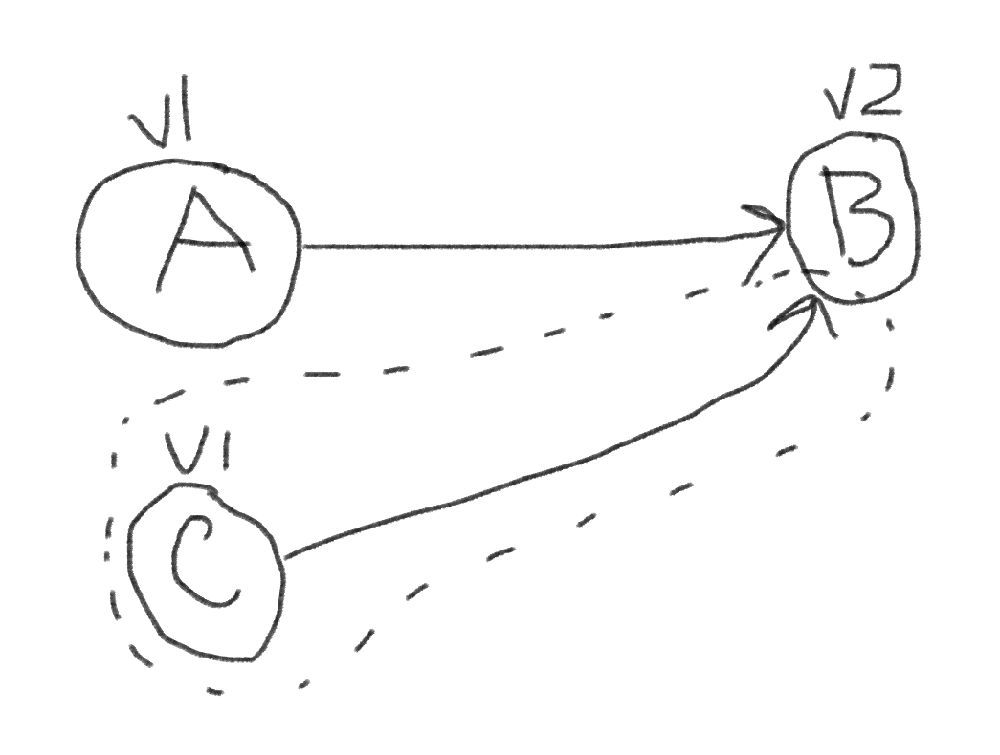
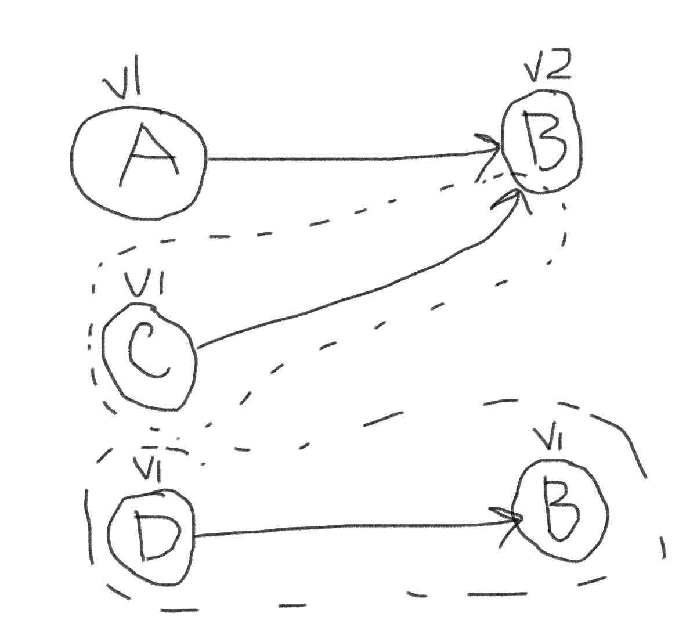

## Dependency management

### [[How npm resolves dependency hell \| Must know!]{.underline}](https://www.youtube.com/watch?v=9AyfXGHu56Y)

- [[Real-World Strategies for Continuous Delivery with Maven and Jenkins - YouTube]{.underline}](https://www.youtube.com/watch?v=McTZtyb9M38)

- [[Software Engineering at Google (abseil.io)]{.underline}](https://abseil.io/resources/swe-book/html/ch21.html)

### Introduction to Dependency Management

#### What are dependencies?

- Dependencies are artifacts that your application requires to function.

- For example, say I am baking a cake. A dependency I would need for the cake are eggs.

#### Precedent

+---------------------------------------------------------------------------------------------------------------------------------------------------------------------------------------------------------------------------------------------------------------------+
| 1950s: |
| |
| Assembly Languages: The advent of assembly languages allowed developers to program in a somewhat higher-level language than raw machine code. But, managing dependencies wasn\'t a major concern yet, as software was generally custom-built for specific hardware. |
| |
| 1960s: |
| |
| High-level Languages: The emergence of languages like FORTRAN and COBOL meant that software could be more easily shared between machines. But there were still no dedicated dependency management systems. |
| |
| Operating Systems: The rise of operating systems like UNIX introduced the idea of shared libraries, which could be thought of as an early form of dependency. |
| |
| 1970s-1980s: |
| |
| Linkers: Tools like linkers were developed to combine object files and libraries into executables, managing the early dependencies. |
| |
| Version Control: Tools like SCCS and later RCS in the late 1970s and early 1980s introduced version control, which indirectly helped in managing dependencies by keeping track of software versions. |
| |
| 1990s: |
| |
| Package Managers: This era saw the rise of package managers in various forms. RPM (Red Hat Package Manager) and Debian\'s dpkg are examples from the Linux world. These tools were designed to manage dependencies at the operating system level. |
| |
| Build Tools: Tools like make matured and became widespread, helping developers manage build dependencies. |
| |
| 2000s: |
| |
| Language-specific Dependency Managers: Tools like npm for JavaScript, Maven for Java, pip for Python, and Bundler for Ruby, to name just a few, made it easier to manage dependencies for specific programming languages. |
| |
| Versioning Strategies: Semantic versioning (SemVer) was introduced, providing a systematic approach to version numbering and dependency management. |
| |
| 2010s-Present: |
| |
| Containerization: Technologies like Docker introduced containerization, encapsulating an application and its dependencies into a single object. |
| |
| Service Dependencies: With the rise of microservices architecture, managing service dependencies became crucial, and tools/platforms like Kubernetes have come to the fore. |
| |
| Dependency Scanning and Security: With an increasing emphasis on software security, tools were developed to scan dependencies for vulnerabilities. |
+=====================================================================================================================================================================================================================================================================+
+---------------------------------------------------------------------------------------------------------------------------------------------------------------------------------------------------------------------------------------------------------------------+

-

#### Stuff

- Shouldn't have to regularly go back in time to check historical versions if using trunk-based development, because the new stuff is just on the trunk [[https://web.archive.org/web/20150227204444/http://maven.40175.n5.nabble.com/Continuous-Delivery-and-Maven-td3245370.html#:\~:text=Interestingly%20enough%2C%20I,mole%20hill%20here]{.underline}](https://web.archive.org/web/20150227204444/http://maven.40175.n5.nabble.com/Continuous-Delivery-and-Maven-td3245370.html#:~:text=Interestingly%20enough%2C%20I,mole%20hill%20here).

- However, useful for auditing (how long a security bug has existed in production), how long a bug has existed for. If you're not supporting older versions then just repro it on the new version (trunk.)

- Useful when trying to find origins of bug (e.g., git bisecting.) For example, I am now able to find out when the bug was introduced (as I can run that historical version), find the commit, etc., and then improve our development processes. It might have clearer context since it would be the first commit when it was introduced, and isn't part of other features that might be interacting with it as it might get all smashed in with other stuff so hard to debug it. For example, a library function call returns the wrong answer, so find out when it was first introduced, get more context on it (via the PR), and then since you have the artifacts then you can go back in time and build it.

- At some point however, the context like 10 years ago might not provide much insight because it's too far away and too many things have changed since then.

  - Introduction

    1.  To add:

        1.  [[API Extractor (api-extractor.com)]{.underline}](https://api-extractor.com/)

        2.  How can you ensure that all team members are using the same versions of dependencies?One of the things I guess with regards to like the developer workspace you could have suggested.Suggestions. Uh, workspaces in Visual Studio Code?They can get to fill uppers to do it otherwise.You may.Want to either use things like manage solution for example, maybe like a code space, I don\'t even know if those support required extensions or you can just use a little bit of game theory and say well.Given that a developer doesn\'t comply, then they should. It should be less effort.To.Comply did not comply.The way you do this is you add the checks that continuous integration development pipeline.And if they fail, then the pipeline fails. Were not able to measure no code, so they\'re incentivized to run these checks locally or while they\'re ready to code, so that when they get to merging it, there isn\'t any failures.

        3.  Organize dependencies into dependencies and devDependencies. This is because it will help prioritize which security issues or upgrades are needed because devDependencies are not as critical as dependencies (because devDependencies are only used locally versus in production.) Is there an easy way to know which dependencies are required for production?

        4.  strace -ff -e trace=open,openat pnpm run build 2\> ../strace.log

        5.  cut -d \'\"\' -f 2 ../strace.log \| grep -E \'\^/run/shm/test3/vue/\' and then combine with all files in folder, remove files that are in the build log. This shows the files that were not read as part of the build process (and thus might be devDependencies if they are not used in production since the files cannot have been read)

  - Dependency Management Tools and Package Managers

    1.  Discussion of different tools and package managers (e.g. npm, yarn, pip, etc.)

        1.  venv for managing Python dependencies, although can't have multiple different versions of dependencies installed at the same time.

        2.  [[Python Dependencies - Everything You Need to Know - ActiveState]{.underline}](https://www.activestate.com/resources/quick-reads/python-dependencies-everything-you-need-to-know/)

        3.  [[PEP 440 -- Version Identification and Dependency Specification \| peps.python.org]{.underline}](https://peps.python.org/pep-0440/)

        4.  pnpm, npm, yarn, nuget, etc.

        5.  Use a centralized repository for dependencies

        6.  1.  [Look into how a package manager is faster, what technologies they are using, what tradeoffs they are making, etc.]{.mark}

            2.  [Make sure to profile for yourself and fully understand the package manager's features to determine if they are worth it, including any drawbacks. Go deeper into what "hardlinks" mean, when they are applicable, and in what situations they might not be as useful.]{.mark}

            3.  [npm could theoretically have more support, since the packages that it installs are from npmjs.org, so if there are any breaking changes then npm would be the first to know]{.mark}

            4.  [[[https://pnpm.io/next/npmrc#:\~:text=Cloning%20is%20the%20best%20way%20to%20write%20packages%20to%20node_modules.%20It%20is%20the%20fastest%20way%20and%20safest%20way.%20When%20cloning%20is%20used%2C%20you%20may%20edit%20files%20in%20your%20node_modules%20and%20they%20will%20not%20be%20modified%20in%20the%20central%20content%2Daddressable%20store]{.underline}](https://pnpm.io/next/npmrc#:~:text=Cloning%20is%20the%20best%20way%20to%20write%20packages%20to%20node_modules.%20It%20is%20the%20fastest%20way%20and%20safest%20way.%20When%20cloning%20is%20used%2C%20you%20may%20edit%20files%20in%20your%20node_modules%20and%20they%20will%20not%20be%20modified%20in%20the%20central%20content%2Daddressable%20store).]{.mark}

            5.  [Also for debugging purposes (e.g., changing a file changes it everywhere, good to know if something goes wrong)]{.mark}

            6.  [Monkey Patching a local node_modules folder might cause issues with other projects on the filesystem]{.mark}

            7.  [Dependency resolution strategies: do the package managers prefer newer versions or older versions?]{.mark}

            8.  [What features do they have?]{.mark}

    2.  [Examples and use cases of how to implement dependency management in practice, such as using npm pack and diffoscope to determine changes in dependencies.]{.mark} How can you manage and track changes to dependencies over time?

        1.  [diffoscope on npm pack on angular version and then the other angular version (both as tgz files) which will reveal changes. You may also want to exclude directory metadata and/or just show the d.ts files if you want to see public api changes. There might be better diffing programs for typescript though.]{.mark}

        2.  Use npm pack to get the upgraded version (and the current version) of the package, then use diffoscope to determine what changed. Only useful if the package version has a minor update (and you want to check if it will break things, although still difficult as code changes might be complex, esp. dependencies). This would be if you want to force-update the package.

        3.  [[siom79/japicmp: Comparison of two versions of a jar archive (github.com)]{.underline}](https://github.com/siom79/japicmp)

        4.  [[rust-lang/rust-semverver: Automatic checking for semantic versioning in library crates (github.com)]{.underline}](https://github.com/rust-lang/rust-semverver)

  - Debugging

  - Dependency and package management

  - Checking the uptime status of the dependencies. For example, npmjs.com has a status page (could include status in CI pipeline perhaps, or some other dashboard, maybe a link to it)

  - How to verify if an app is adhering to semver (programmatically parse command line flags using explainshell perhaps) and then check for discrepancies. Maybe check Typescript types for differences for node apps.

  - Download the entire pipeline workspace before and after, then do a diff to see which paths change. This can help debug issues where files are not found anymore.

    1.  Trying to install software already installed in a container

        1.  See [[Testing Perl on Windows with github actions - Stack Overflow]{.underline}](https://stackoverflow.com/questions/72367353/testing-perl-on-windows-with-github-actions)

    2.  Non-pinned dependencies and deprecated flags

    3.  Pinning dependencies

        1.  npm

        2.  apt-get vs apt and parsing apt-get's output

        3.  other package managers

        4.  on the docker image itself (e.g., ubuntu-2020)

        5.  proactively checking if executables will be incompatible (parsing manpages)

    4.  Deprecated flags, commands, and patterns

    5.  apt-get with fixed versions

    6.  Dependency resolution

        1.  Help, my npm project doesn't build (but it built a long time ago) and I do not have a package-lock.json file

            1.  Run while read pkg; do npm view \"\$pkg\" time \--json \| jq -r .created; done \< \<(jq -r \'.dependencies \| keys\[\]\' package.json) \| cut -d \'T\' -f 1 \| sort -rn -t\"-\" -k1 -k2 -k3 \| head -1 to get the most recent published version (from all packages)

            2.  Reinstall since that above date, as the project must have built successfully since then if the package was installed. so run npm install --before "\$above" (might not work for npm versions earlier than v8)

        2.  [[python - pip not properly resolving child/grandchild dependencies - Stack Overflow]{.underline}](https://stackoverflow.com/questions/60926223/pip-not-properly-resolving-child-grandchild-dependencies)

    7.  [[hvanbakel/CsprojToVs2017: Tooling for converting pre 2017 project to the new Visual Studio 2017 format. (github.com)]{.underline}](https://github.com/hvanbakel/CsprojToVs2017)

    8.  [[Tell HN: Archive.ubuntu.com repositories appear to be down \| Hacker News (ycombinator.com)]{.underline}](https://news.ycombinator.com/item?id=33380584) is down occasionally (large issue because pipelines require packages)

  - --no-install-recommends and software dependency incompatibilities

    1.  When running apt-get with --no-install-recommends, apt-get does not install recommended packages. Sometimes, applications require recommended packages to run. These errors may not be immediately obvious because missing dependency errors can manifest in many forms.

  - Automatically knowing if you have to run npm install via npm ls \--all \--json 2\>/dev/null \| jq .problems and check if there is any output

- High-level best practices in software configuration management. Lecture Notes in Computer Science, 57--66 \| 10.1007/BFb0053878

- [[workspace.pdf (berczuk.com)]{.underline}](https://berczuk.com/pubs/PLoP2K/workspace.pdf) workspace patterns

#### The role of package managers

- Package managers should not be seen as bureaucratic tooling, rather, they are designed to help manage dependencies, and ensure that the correct versions of software are installed, up to date, correct, and don't conflict with other installed software. In some cases, they can isolate the dependencies from other projects, allowing you to have two different versions of a package installed on a computer, which allows you to run many different projects at once.

- Package managers offer less control over your dependencies. But that's a good thing, you don't want to install anything you want, because there is likely to be conflicting versions and it is difficult to manage. Errors from the package manager (e.g., incompatible versions) are a useful tool to have. Sometimes, however, it might be difficult to understand what the output from the package manager is trying to say, and how to fix it.

- What does a package manager do? Let's start with a metaphor.

  - Let's say you are making a recipe to make a chocolate cake and some cookies.

  - Here are the ingredients for the cake:

    1.  All-purpose flour

    2.  Cocoa powder

    3.  Baking powder & baking soda

    4.  Sugar

    5.  Eggs

    6.  Milk

    7.  Butter

    8.  Vanilla extract

  - Here are the ingredients for the cookies:

    1.  All-purpose flour

    2.  Cocoa powder

    3.  Baking powder

    4.  Baking soda

    5.  Butter, softened

    6.  Sugar

    7.  Eggs

    8.  Vanilla extract

    9.  Milk

    10. Chocolate chips

  - Say that I already have lots of flour at home. If I was going to the grocery store, I wouldn't buy two separate sets of ingredients, because I already have many of the others' recipe ingredients. For example, Cocoa powder is shared by both the cake and the cookies. Similarly, if I didn't buy sugar, then the cake and cookies would taste very different. Therefore, it is important that I have sugar, and not pickle juice for example.

  - Also, the grocery store already has these products made for me, ready to consume. For example, I don't need to buy a cow to get milk, or churn the milk to make butter. This makes it easier to make the cake and cookies, because I don't have to do these things myself. In the case of sugar, I don't have to plant some sugarcane seeds and grow it--this would be complicated and time consuming.

  - Now, imagine instead of myself going to the grocery store, I had an assistant that made sure that, if I said I wanted to cook a recipe, they would go to the grocery store and figure out what I needed, bought the ingredients, and made sure that my pantry was stocked.

  - Dependency managers operate in a similar way.

- Say I would like to install package "A" in my project. How would I do that? Well, I would normally go to a website, click on download, it downloads maybe a zip file containing the package's source code.

- After I do that, there might be some instructions on the website or in the package to build the package. I need to build the dependency so that it can be used by my project. It depends on how the dependency is set up, the author may have built it, or not, or provided some instructions. It's possible that, if it's not built, then the dependency might require other dependencies to exist on your computer. This means that you have to find out which dependencies those are, install them, and then retry building that dependency. This is sort of like having to grow sugarcane to make the sugar.

- After a while, this becomes very tedious and complicated. You now have multiple versions of software on your computer that might conflict with some of the other software. This means that you may have to uninstall other software to install new software, thereby breaking older projects.

- It is also very time consuming. You have to go to the website, click on download, read the build instructions, and try to figure out how to build it. When you want to upgrade, then you have to repeat the same process, but you also have to check regularly for the new versions of the software, and verify, each time, whether they are compatible with your software. If you make a mistake, well, you better keep a good set of instructions on how to rollback, as it is usually complex.

- This also makes it difficult to get a reproducible build environment. Since there are so many steps to installing dependencies, all with different versions, some changing, each development environment is different, this means that it is possible that other people on the team likely have different environments or dependencies installed at any one time. This makes it difficult to know whose environment is "correct", and you can't verify your changes locally if you can't build the software, or worse, are using the wrong versions (which might cause seemly correct output, but slightly different.)

- Having manual dependency management also makes building on the CI pipeline much more complex. Each dependency might have a special way to build it, might require other dependencies to be installed, might have a special way to download it, all requiring special scripting. There isn't really much standardization, so the author of the dependency could change how it is built every time, which would necessitate you changing the build pipeline to fix it.

- Let's look at what a dependency manager would do instead.

- Dependency managers operate on dependency repositories, that is, there is a standardized way on how the dependencies are presented. This means that the instructions for downloading, building, or consuming the dependencies must be written in a precise way that can be understood by a computer. This makes it possible for dependency managers to quickly download the software and to verify its versions, or check for updates.

- Let's see what likely happens when you install a few packages using a dependency manager.

- Let's say I want to install package "A".

- The dependency manager would go to its dependency repositories, and see if package "A" exists. If it does, then it will verify which packages are currently installed and select a version of package "A" that is compatible with the existing packages, including "A"'s dependencies. This is called dependency resolution, and is a complex topic, and so the mathematics won't be covered in great detail.

- In this case, the package "A" depends on version 1.0 of B, or version 2.0 of B. Package "B" depends on version 1.0 of A, or version 1.2 of A.

- Depending on your package manager, you may want to install package "A". This will install "A", and also "B", without you having to manually install it. This process is transparent to you.

- 

- If I install package "A", then "B" also gets installed. Now, if I install C, which depends on B, then since B is already installed, then it's ok.

- 

- A dependency conflict occurs when you try to install another package that depends on the same package installed, but of a different version. Depending on your package manager, this might not be possible to do if dependencies cannot be isolated per project. This would mean that it would not be possible to install package "D".

- Since the packages must be in a standardized format when they go into the dependency manager's repository, then therefore they are straightforward to install and don't require special tooling. The package authors must bundle their packages such that they are compatible with the dependency manager. Since they are consumed by (usually) many other developers, this is ultimately a more efficient system: the author, who is experienced with the software, bundles it once, and then it is consumed by many others, thousands or millions of times, without extra effort on their part.

#### Understanding dependency hierarchy and version conflicts

- This chapter is important because issues with dependencies can prohibit continuous integration due to unnecessary time spent debugging.

- Create a graph that shows an incompatible version being installed alongside another version. This is "ok" in npm however in some package managers this is not ok. This means it is difficult to generalize dependency management across different applications or platforms.

- Understand dependency resolution strategies to get yourself out of bad and complicated situations.

-

- Identify which commands can help create the dependency graph, and how you can trace it by hand to identify what would happen or why a certain dependency is causing issues and how to fix it.

- Consider a partial re-org for internal dependencies which are only being used by a few or just a single team. If it takes too long to update a dependency, try to identify bottlenecks in the process.

```{=html}
<!-- -->
```

- The role of dependencies in software development

  - Help reduce code duplication

  - Helps manage new versions of software

  - Can increase security, as security info can be propagated to other software

- Understanding dependency types and classification

  - Direct dependencies: primary libraries and packages

  - Transitive dependencies: dependencies of dependencies

  - Dev dependencies: used for development and testing

  - Peer dependencies: shared between multiple packages

- The need for managing dependencies

  - Dependency management can introduce complexity (because it doesn't allow conflicting dependencies.) The goal is to allow you to work with multiple versions of a library which can be independently updated outside of the normal development flow.

  - For example, inlining the dependency would require manually updating it in the source. If the functions are spread out across multiple files, it is difficult to keep track of it. Additionally, it could be subject to accidental modifications.

  - The versioning restriction on dependencies is intended to avoid lower-level issues such as code not compiling or invalid outputs (which are more difficult to diagnose.) It also promotes code reusability and can benefit from modular security updates.

- Importance of dependency management

  - Ensuring application stability

  - Keeping dependencies up-to-date

  - Simplifying the development process

  - Managing security vulnerabilities

  - Facilitating collaboration and communication

### Working with concepts of package managers

#### Creating a package feed

#### Uploading new packages

#### Working with private and external repositories

#### Authentication and package publishing/consuming

### Challenges of dependency management

#### **Very important to pin dependencies to a certain version, with a version range where they can be upgraded to, use package-lock, etc.**

#### Identifying suitable dependencies

- The first step in identifying whether a dependency is suitable is, well, do you need it as a dependency?

  - [[Brian Vermeer on X: \"For a demo, I created a simple application with the Spring Boot scaffolder. Unpacked all the jars, de-compiling all the classes, and counted the lines of code in my application. Result: Lines of code written: 4 Jars: 33 Class files: 9917 Lines of code: 518772\" / X (twitter.com)]{.underline}](https://twitter.com/BrianVerm/status/1276175013327056896?s=20&t=vSpgdqnFXC0H59iMkO-DSg)

  - [[Selecting dependencies. Open source software is everywhere... \| by Marit van Dijk \| Medium]{.underline}](https://medium.com/@mlvandijk/selecting-dependencies-9b1766a50a67)

  - [[Selecting the Right Dependencies: A Comprehensive Practical Guide \| HackerNoon]{.underline}](https://hackernoon.com/selecting-the-right-dependencies-a-comprehensive-practical-guide) license, code quality, security issues

  - [[Dependency management: Versions choice and the software supply chain (sonatype.com)]{.underline}](https://blog.sonatype.com/dependency-management-versions-choice-and-the-software-supply-chain) (which version of dependency to use)

  - [[Component Analysis \| OWASP Foundation]{.underline}](https://owasp.org/www-community/Component_Analysis) has lots of interesting points

- Suitable dependencies are dependencies that, well, typically are in the same programming language that you are developing in.

- Normally, they should be well-supported or have somewhat frequent updates. This doesn't mean that they always need new features, rather, they should be upgrading their transitive dependencies and dependencies to fix any security issues or maintaining compatibility with some of the best-practices or other software that you have installed.

- They should be somewhat popular, which means that they are likely to be in use by multiple developers. All bugs become shallow with many eyes.

- What is the documentation situation? Being able to know how to use the package is important.

- Are they consumable via your dependency manager? This will allow you to receive updates easily, manage it with your other dependencies, and also receive security warnings or updates.

- If it is part of a popular package repository, then it has the capability to be security scanned by other security scanners. This potentially might make it more secure.

- The dependency has to be useful, or do its purpose.

- Consider trialing multiple dependencies if unsure of which one to use. Create a couple of branches and do some experimentation. Is there one dependency that does something much better than the other one? Is it more flexible, or easier to use?

#### Microservices

- Sometimes, people might want to migrate to microservices because it allows different parts of the project to be updated more frequently than the other parts. There isn't any technical issue with simply updating other files, rather, there are usually legacy procedures or dependencies that might be intertwined with everything else. This makes it challenging to update a component, if another component (that moves at a slower development cadence) is also upgraded, as this slows development progress, usually because the slow-moving project takes a long time to test because it is very large and complex. It is difficult to determine how a small change will impact the entire application. What are some ways we can make this faster?

  - There are certain software development patterns that you can adopt to make separating something from something else a bit easier. One is the adapter pattern, which provides a proxy in-between the component you want to update. Or, the decorator pattern, which allows the legacy item that moves at a slower speed, to be wrapped with something that is more up-to-date or can expose more up-to-date methods on the object. The original application remains unaffected.

  - If it is something that is legacy and is trying to be removed, the adapter pattern is also useful. You can slowly switch out the old implementation with a new one. It is sometimes called "choking."

  - The goal with using the following projects is to help enforce architectural constraints within your projects. Entire books have been written about migrating to microservices, and while they can be useful, it is also useful to take one step at a time and to make sure that the business can continue with the current architecture, while enforcing a baseline to prevent the divisions from collapsing in on itself if there is time to migrate to microservices.

  - Even if you don't plan on migrating, this allows for a clear division of modules, which could, in theory, allow for testing to be made more efficient, or some modules decoupled from others. It can help identify which components are tied together so that transitioning to microservices will be easier. The application still remains a monolith, however, but if there are clear interfaces and boundaries, it can increase the velocity of changes because it is clearer where the area of impact is.

  - [[BenMorris/NetArchTest: A fluent API for .Net that can enforce architectural rules in unit tests. (github.com)]{.underline}](https://github.com/BenMorris/NetArchTest)

  - [[seddonym/import-linter: Import Linter allows you to define and enforce rules for the internal and external imports within your Python project. (github.com)]{.underline}](https://github.com/seddonym/import-linter)

  - [[Shopify/packwerk: Good things come in small packages. (github.com)]{.underline}](https://github.com/Shopify/packwerk)

  - [[qossmic/deptrac: Keep your architecture clean. (github.com)]{.underline}](https://github.com/qossmic/deptrac)

  - [[hello2morrow - Sonargraph]{.underline}](https://www.hello2morrow.com/products/sonargraph)

  - There are also many, many ways to visualize dependencies in many languages. These tools can be useful, even if you can't enforce architectural constraints, as they can provide a glimpse on what new code might be "tangled up" with things that it should not be.

#### Managing version conflicts

- [[npm/node-semver: The semver parser for node (the one npm uses) (github.com)]{.underline}](https://github.com/npm/node-semver#prerelease-tags) ordering of versions is very important (e.g., upgrading)

- Good for communication as well (e.g., breaking changes), maybe there are libraries that will auto-identify potential breaking changes

- Good to find out what version of a command you're running locally (e.g., curl) by normally using the --version flag or the -v flag when invoking the cli.

- The project might be too big if the dependency conflicts are not resolvable

- How to ensure that the application is always using the correct versions of its dependencies

- Understand the core concept of dependency managers

  - They are designed to make dependency management easier by allowing people to specify if their dependency works with other dependencies.

  - It is possible that the dependency authors were too conservative and specified their dependency ranges too conservatively.

  - This means that it can introduce more complexities, because it is unclear if the dependency authors were too conservative (and the dependency works without errors), or, the dependency does not work. This is because the dependency may not have been tested with the future versions of the dependencies when the dependent was created. It might be unclear if it "works", but the data output might be invalid or corrupted, or there are runtime errors.

  - This means that it is a dilemma on the dependency consumer on how to perform higher-level dependency management.

  - If the dependency does not work with the newer version (outside of the range), and it is confirmed not to work, then the dependency may have changed too much for it to be useful in its current state. It might not be the same program anymore, and the dependent may require changes in order to work with it.

  - If the dependency is so different as to be something completely new, then it could make sense to inline it and then manage it yourself as your own code. This can be useful for small dependencies or simple dependencies.

  - Inlining dependencies doesn't remove the security issues and may defeat the purpose of security scanning (as a disclaimer.)

  - If it's a popular dependency, then search for its public API in other packages (and see if another package has forked the older copy and has begun maintaining it) for backwards compatibility for other folks

  - If the dependency is no longer receiving updates (and thus is stuck on an old version range of an old dep), then it might be at-risk to security issues and other issues, so it might make sense to switch it out for another one that is more modern and supported

  - Use the facade pattern to chain multiple dependencies together if some support different things that others need, or, create a package that depends on those dependencies.

  - Dependencies can be managed differently. It mostly depends on the peerDependencies (usually) and the top level dependencies. If they are isolated from one another and don't pollute the global namespace, then they are usually ok.

- How to manage conflicts between different dependencies

  - Use a conflict resolution strategy to determine the best version of a dependency to use when conflicts arise.

  - Use a dependency management API to programmatically manage dependencies and resolve conflicts in a controlled and automated way.

  - Use a dependency management API to integrate with other tools and systems, such as issue tracking, security scanning, and continuous integration.

  - Use a dependency management API to support multiple languages and package managers.

  - Use a dependency management API to support different deployment environments, such as development, staging, and production.

  - Search all of the types of all packages for the type that you want and then try to find a similar API?

  - Dependency graph tool

```{=html}
<!-- -->
```

- Do npm ls \--json and then do a json diff across both, maybe a GUI to show the diff in a nicer way?

- Export dep graph to json either way

- [[Selective dependency resolutions \| Yarn (yarnpkg.com)]{.underline}](https://classic.yarnpkg.com/en/docs/selective-version-resolutions/)

- npm shrinkwrap?

- npm install --force and then check the dep graph after to see what is wrong?

- [[dependency-cruiser - npm (npmjs.com)]{.underline}](https://www.npmjs.com/package/dependency-cruiser)

- [[Unsatisfiable core - Wikipedia]{.underline}](https://en.wikipedia.org/wiki/Unsatisfiable_core) for dep graph to isolate bad deps?

- [[madge - npm (npmjs.com)]{.underline}](https://www.npmjs.com/package/madge) look at CLI section, it can find deps inside of files (useful for finding out which file uses a dep)

- "An unsatisfiable core can be useful in identifying the root cause of a version conflict, and can aid in resolving the conflict by identifying which packages need to be modified or upgraded." from ChatGPT

- To simplify the dep graph (or possible versions for each package), first flatten or materialize the versions that a certain package must have. For example, remove version ranges and special star syntax and replace it with a list of versions that are ok to use. This will provide an interface so that it can be used by generic solvers.

- [[How does version resolution work in Maven and Gradle? (jlbp.dev)]{.underline}](https://jlbp.dev/how-does-version-resolution-work-in-maven-and-gradle)

- Lots of good stuff in here: [[c# - View NuGet package dependency hierarchy - Stack Overflow]{.underline}](https://stackoverflow.com/questions/6653715/view-nuget-package-dependency-hierarchy)

- [[nuget-tree - npm (npmjs.com)]{.underline}](https://www.npmjs.com/package/nuget-tree)

- depvis (Java)

- gradle-dependency-analyze-plugin (Java)

- dotnet-outdated (C#)

- go-dep-parser (Go)

- pipdeptree (Python)

- lein-ancient (Clojure)

- bundle-visualizer (Ruby)

- php-dependency-checker (PHP)

- cargo-tree (Rust)

- depgraph (Scala)

- sbt-dependency-graph (Scala)

  - Overriding dependencies

    - [[rfcs/0036-overrides.md at main · npm/rfcs · GitHub]{.underline}](https://github.com/npm/rfcs/blob/main/accepted/0036-overrides.md)

    - [[Overriding Dependencies - The Cargo Book (rust-lang.org)]{.underline}](https://doc.rust-lang.org/cargo/reference/overriding-dependencies.html)

    - [[Package dependencies \| Dart]{.underline}](https://dart.dev/tools/pub/dependencies#dependency-overrides)

    - Another option is to force the transitive dependency to be of a specific version. However, the downside is that that package may have not been tested with that new version. This could cause the dependencies to break. Show example here with a sample package that has been overridden in npm.

    - When you use.A transitive dependency override. The issue with this is it is force using a certain package that the package maintainer likely didn\'t test with their package, and you also lose out on the benefit of having that package.Being tested by a bunch of other people as well.So.This is because when you force upgraded transitive dependency, this means that you\'re locking it.Or forcing it to be have a specific version and then you\'re overriding. You\'re saying, well, I know what this version of this dependency is and I can verify its compatibility. Sometimes this is required because the package maintainer may not necessarily release a new version of the package with the security update in one of its dependencies.Yeah.You know you do have to upgrade it to make sure that you\'re compliance.Now the security update might be very small. For example, say if you have a.You know, small change that doesn\'t impact the output of the program or very unlikely to do so that\'s probably safe. For example, maybe like a minor point update. Now sometimes you can set it to anything you want to. That\'s the whole point of the transitive dependency overrides.And you could set it to a version that\'s not compatible.And the issue is.The it\'s overriding what the package manager wants you to do, so you may encounter some compatibility issues. These may only present themselves at runtime because while the patch retainer didn\'t wasn\'t able to test it, you\'re changing something. You\'re changing the version of the dependencies that.We\'re not parts packaged, so we\'re kind of missing out on the package maintainers tests.As well as their CI CD pipeline that would check this package as well.So it\'s a little bit risky. You do have to kind of weigh the.Pros and cons in the situation?Um, and also important, if you are doing with this Pence override, make sure not to only do it for the dependencies that need to be upgraded and the packages, not for the whole project if it\'s not necessary. So for example, if.You know version 0.1.2 is bad or something like that. In package A for example or package B then make sure only to do that depends override within that package and not globally. The reason is because.You may already.Have that transitive dependency.Already.already upgraded into

  - Managing dependencies for different environments and architectures

    - How can you manage dependencies for different languages and frameworks?

    - How can you manage dependencies for different operating systems?

    - How can you manage dependencies for different architectures?

    - How do you handle dependencies that have different licensing?

    - How can you use dependency management tools to ensure the reproducibility of your application?

    - How can you use dependency management tools to ensure that your application is running in a consistent environment?

    - If you need to override a transitive dependency, consider running its tests with its dependencies upgraded (so that you can verify if the library is ok with you upgrading its own dependencies.)

  - Second order effects for getting dependencies upgraded on a timely schedule due to security issues

    - Some deps will be force upgraded, causing application incompatibilities. It will be increasingly difficult to troubleshoot where these application compatibilities stem from, as the libraries move and shift data between many different layers. The layers are bundled up together, so there isn't a good traceback from the actual dependency that called it or where it was being originally processed from. There might need to be more tracking or a better data flow model for how dependencies work together to understand where in the flow that the data was mishandled or corrupted.

    - Some might be inline by the author so that they don't have to support updating their deps (and bypasses the security scanner)

    - Open-sourcing something will be much more work and effort, increasing the bar. This may or may not be a good thing (more quality is usually better though.)

    - People will get used to force upgrading their deps, and the dep ranges won't be as useful anymore. This means that peerDeps and other front-end frameworks might be stuck from innovating because it might break backwards compatibility. Front-end frameworks will be continually evolving and there might be a lot of changes.

    - Deps will change to a "capabilities" structure where the capabilities of the transitive dependencies is assessed. This will supersede semver because a capability doesn't need to have the same public api to use the same functionality.

    - Dependency managers will become increasingly complex and blackbox as they will be driven by AI. This is because the dependencies can have multiple versions, and there are multiple solutions. However, with security requirement upgrades, some versions of the dependencies might be compatible with other combinations of versions, especially if overridden. This is because outside of the version range, there isn't a clean solution (you have to pick a version that fixes the security vulns, but you are allowed to pick a higher version.) That higher version may or may not be compatible.

    - We will need a quick way of finding similar libraries or those with a similar API in case we need to quickly change to another library. A quick way to find the public interface of a new library.

    - Applications may have to be broken down into smaller and smaller pieces so that they can have their dependencies resolved.

  - Strategies for upgrading and managing transitive dependencies

    - Check which transitive dependencies have install scripts (messy because it does a contains so many false positives) yarn list \--depth 999 \--only-lockfile \| tr -d \'├\' \| tr -d \'─\' \| tr -cd \'\\11\\12\\15\\40-\\176\' \| tr -d \' \' \| sort -u \| grep -vF \'\^\' \| grep -vF \'=\' \| parallel -P16 -q -I{} bash -c \'npm view \--silent {} dist.tarball\' \| grep \'\^http\' \| xargs -I{} bash -c \'curl \"{}\" \| tar -Ozxf - \-- package/package.json \| jq -c \"{name: .name, scripts: \[.scripts\|keys\[\]\]}\"\' \> ../pkg_scripts.txt

    - How to de-risk upgrading transitive dependencies

      1.  Find the transitive dependency that will be overridden. For example, package X depends on package Y, but I need to force upgrade package Y. Therefore, I would download package X.

      2.  Find the GitHub repo that contains the code for the transitive dependency. Usually it is on npmjs.com but you may have to search GitHub for it. You may have to search for it: [[Code search results · GitHub]{.underline}](https://github.com/search?q=path%3A%2F%5Epackage.json%24%2F+%22%5C%22name%5C%22%3A+%5C%22%40angular%2Fcli%5C%22%22+language%3AJSON&type=code&l=JSON)

      3.  Go through GitHub releases and find the corresponding release to the version that is currently in use. You can write a script to go through the titles of the releases and match it again the current version of your dep.

      4.  Download the repo source code at that version.

      5.  Make sure that a package-lock.json file exists. If it does not, then you will have to create it. You can use npm install --since XYZ to narrow down what packages would have been available at the time of package publish. This won't be precise, however. Not sure if there is a way to narrow this down further.

      6.  Run npm install or yarn install, then npm run test or yarn test. You might need a special npm and/or node version for this, it is specified in the package.json file usually. There might be an automatic way to auto-identify that and change the version of node depending on the package.json. Use nohup when running npm install so that the log output is piped to a file and can be diff'd.

      7.  Check the output of the tests. If they fail, then try to fix them (because no changes were made to the package yet.)

      8.  When they succeed, then upgrade this repo's dependency or dependencies. Diff the log from the previous installation to check if there are any new warnings.

      9.  Run the tests again. Check if they pass, If there are no tests, then it is ambiguous whether it could have passed before or not.

    - How can you automate the process of updating dependencies?

    - How can you test that your application still works after updating dependencies?

    - Look at the valleys in download count and avoid those versions. This is because it is possible that a critical bug was found and a new release was quickly issued, and so not many people downloaded it.

    - How can you handle breaking changes in dependencies?

      1.  Use a package manager that supports semantic versioning, which allows you to identify breaking changes in dependencies.

      2.  Use a continuous integration (CI) system to automatically build and test your application with new versions of dependencies, and catch breaking changes before they reach production.

      3.  Use a staging environment to test new versions of dependencies before deploying to production, and catch breaking changes early.

      4.  Use an issue tracking system to track and manage any issues related to dependencies, including breaking changes.

      5.  Check the release notes or changelogs of the dependencies for any breaking changes.

  - Preventing malicious packages

    - How does one prevent using malicious packages to begin with (even though scripts can be disabled?)

    - When there is a security issue in a transitive dependency (a dependency of a dependency), and you need to upgrade it, then there are a few options. One is to upgrade the root dependency, which will trigger a chain reaction and (usually) upgrade the transitive dependencies, thereby resolving the issue.

  - Alternative methods for installing software securely

#### Handling deprecated or unmaintained dependencies

#### Handling manual dependencies

- Avoiding the \"curl \| bash\" pitfalls

  - [[AptGet/Howto - Community Help Wiki (ubuntu.com)]{.underline}](https://help.ubuntu.com/community/AptGet/Howto#auto-apt) auto-apt?

  - Add alternative methods for installing software securely, including digital signature verification

  - Security in depth and in layers

  - curl \| bash bypasses repository management, versioning, and digital signatures. The source itself may not be trusted due to DNS takeovers (see Microsoft incident.)

  - [["Curl Bash piping" wall of shame \| Hacker News (ycombinator.com)]{.underline}](https://news.ycombinator.com/item?id=12766049)

    1.  scripts hosted on your local website don't have to be scripts, they could be html pages (and thus getting bash to execute an html page doesn't make any sense)

    2.  If the application is entirely self-contained within the installer, then you can verify the downloaded file by hand. Then, take the hash of it and if it changes then it will require re-auditing. If curl\|bash is used, then the copy of the installer is erased. This would depend on if the application uses external resources or not.

    3.  Clicking on a download button on a website may redirect you to an http link, thus being insecure (or might download a file that redirects to an http link.)

    4.  Downloaded files can be scanned via clamscan.

    5.  deb files have to go through a build process? maybe? to land in the Ubuntu/Debian repos, self-hosted files do not and may not be under the same security controls, or, certs might expire (e.g., https certs) and it is unclear if there is an https downgrade attack possible with curl\|bash. This would mean that the files have to be executable and thus aren't garbage.

    6.  it is possible to redirect to an HTTP webpage even when the original is served over https

    7.  linux repos (probably) have much more security built-in than your average website

    8.  website domain can be unregistered in the future

    9.  Installing via package manager provides more convenience, and the ability to upgrade it automatically (e.g., with apt-get update) or with dependencies. You can also remove it with a more familiar interface.

    10. Assumes you have curl installed

#### Addressing security risks

#### Keeping up with updates and changes

- Fixing bugs and improving performance

- Implementing new features and enhancements

- Maintaining compatibility with other dependencies

- Staying up-to-date with industry standards and best practices

- Keeping Dependencies Up-to-Date

  - Best practices for updating dependencies

    1.  How can you ensure that your application is always using the correct versions of its dependencies?

        1.  Check if node_modules is same as lockfile prior to starting app, otherwise run install

    2.  Use of a centralized repository

    3.  Adopting semantic versioning

    4.  Use of lock files

    5.  Managing different dependencies for different environments

    6.  Automated dependency updates and vulnerability scanning

    7.  Dedicated pipeline for dependency updates

    8.  Rollback plan for dependencies

    9.  Security-first approach

### Managing Dependencies and Resolving Conflicts

#### How to read a dependency graph to find conflicts

#### Understanding dependency resolution

- How package managers resolve dependency versions

- Version ranges and semantic versioning (semver)

- Dependency trees and lockfiles

- How package managers handle conflicts

- The impact of dependency resolution on your project

#### How to resolve conflicts

- Identifying the root cause of conflicts

- Using package manager features to resolve conflicts

- Manual resolution of dependency conflicts

- Updating or modifying configurations to address issues

- Ensuring project stability after resolving conflicts

#### Common dependency issues

- Compatibility issues

  - This occurs when different packages or libraries have incompatible versions of a shared dependency. This often results in runtime errors, build failures or security vulnerabilities. For example, in question #694874, a user encountered an UnsatisfiableError while installing packages because they were incompatible with each other.

- Private repository access issues

  - This occurs when dependencies are located in private repositories and access is not properly configured or granted. This often results in build failures or runtime errors. For example, in question #34336673, a user encountered errors when trying to install dependencies from a private Bitbucket repository in Jenkins.

  - For beginners: when you are trying to use a dependency that is federated (i.e., requires auth to access), it may appear that you can access it in your web browser, but the dependency manager cannot access it. This is because the dependency manager does not use your browser's cookies, and usually does not use your credentials when downloading dependencies (if it did, then it wouldn't be possible to download them on CI because otherwise it would be a security issue.) Therefore, one has to create credentials, or link an identity, to the pipeline or the dependency manager to allow it to download (or receive permission) to download those artifacts. Normally, this permission is tightly scoped, and only permits the dependency manager to read access for a certain repository, much less access than what a regular user would have (for example, a regular user might be able to browse repositories, push code, etc.)

- NuGet package dependency issues

  - This occurs when there are issues with dependencies when using the NuGet package manager. This often results in build failures or runtime errors. For example, in question #38239573, a user encountered errors when trying to update NuGet packages because of a conflict in dependencies.

- Build tool configuration issues

  - This occurs when build tools are not configured correctly or missing important configuration files. This often results in build failures or runtime errors. For example, in question #11569660, a user encountered a ClassNotFoundException while running a Jenkins build due to a misconfiguration of the build tool.

- Parsing package manifest issues

  - This occurs when there are issues parsing package manifests like package.json or pom.xml. This often results in build failures or runtime errors. For example, in question #70189694, a user encountered errors when trying to update dependencies because of issues parsing the package.json file.

- SSL issues

  - This occurs when there are issues with SSL certificates when fetching dependencies. This often results in build failures or runtime errors. For example, in question #66220849, a user encountered SSLHandshakeException errors while running an OWASP dependency check because of issues with SSL certificates.

- Docker dependency issues

  - This occurs when there are issues with dependencies in Docker containers. This often results in build failures or runtime errors. For example, in question #68054863, a user encountered std::bad_alloc errors while building a Gatsby app in a GitLab CI/CD pipeline because of issues with Docker dependencies.

- Private registry dependency issues

  - This occurs when there are issues with dependencies located in private registries. This often results in build failures or runtime errors. For example, in question #66887854, a user encountered errors when trying to install dependencies from a private NPM registry in a Firebase Function.

- CI/CD pipeline dependency issues

  - This occurs when there are issues with dependencies in CI/CD pipelines. This often results in build failures or runtime errors. For example, in question #66358620, a user encountered errors when trying to install Composer dependencies in a GitLab CI/CD pipeline.

#### Strategies for upgrading dependencies

- Deciding between automated and manual upgrades

- Planning and scheduling dependency upgrades

- Testing application functionality after upgrades

- Managing breaking changes in dependencies

- Rolling back upgrades if necessary

#### What are transitive dependencies?

- Why should transitive dependencies not be overridden? When should they?

- Discuss the risks associated with transitive dependencies and provide guidelines on when and how to override them. This can help readers make informed decisions about managing transitive dependencies in their projects.

#### Semver: the good and the bad

#### Versioning Ranges

- Explanation of version ranges

  - When a package depends on another package, it depends on a specific version or version range of the package. If semver is followed, then no breaking changes will occur within a semver boundary. Therefore, it should be "ok" for a dependent package to use a version range. It also allows flexibility when upgrading the package.

  - Theseus\'s ship analogy for knowing when a dependency is no longer itself anymore

  - Some package managers handle dependencies differently. For example, ruby and python force all of the dependencies to be top level. This means that you cannot have multiple versions of the same dependency installed. They also do dependency resolution based on the order that the dependencies are installed.

- The concept of semver

  - [Don't change your public api in-between semvers (unless it is a 0.\* release.) This can be checked using some API verification tools (some exist for .NET.)]{.mark}

- Package managers handling dependencies differently

  - Use a lock file to ensure consistency

    1.  [Use lock files because packages can be upgraded to the latest semver version if using the range operator which may introduce compatibility issues]{.mark}

  - A package may be auto-downgraded in an npm project for several reasons:

    1.  The package has a semantic version range specified in the dependencies or devDependencies section of the package.json file, which allows for automatic updates within a certain range of versions.

    2.  The package has a version conflict with another package in the project. In this case, npm will automatically resolve the conflict by downgrading one of the packages to a compatible version.

    3.  The package has a security vulnerability that has been discovered, and npm has automatically downgraded the package to a version that addresses the vulnerability.

    4.  The package has been deprecated and removed from the npm registry, and npm has automatically downgraded the package to the last version that is still available.

    5.  One of the dependencies of the package is requesting a different version of the package, and npm is using the version that satisfies the most dependencies.

- [[https://repository.tudelft.nl/islandora/object/uuid:56e646dc-d5c7-482b-8326-90e0de4ea419/datastream/OBJ/download]{.underline}](https://repository.tudelft.nl/islandora/object/uuid:56e646dc-d5c7-482b-8326-90e0de4ea419/datastream/OBJ/download) to show that semver isn't the panacea

### Dependency security scanning

#### Preventing malicious packages and security risks

- There are some dependency management tools, like Dependabot, that can automatically upgrade your dependencies.

- However, it's important to understand what it's doing, because there are numerous ways to upgrade your dependencies that may or may not cause conflicts in the future.

  - For example, say you have package "Z", and it is a top-level dependency. It has a security issue, thus, it must be upgraded to the next version. This might be somewhat straightforward, assuming that the public API remains the same.

  - However, the issue becomes more complex when there are security issues in transitive dependencies.

  - Imagine you\'re using a software package named "A". This package doesn't work alone; it relies on another package named "Z" to function properly. In this context, package "Z" is what we call a \"transitive dependency\" of "A" -- it\'s a behind-the-scenes helper.

  - Now, let\'s say package "Z" has a security flaw. How do you address it?

  - Override the Dependency:

    1.  You can force an update only to the transitive dependency "Z" without touching package "A".

    2.  Pros: Quick fix to address the flaw in "Z".

    3.  Cons:

    4.  It might cause compatibility issues. Package "A" was built and tested with a specific version of "Z". Using a new version might bring unexpected behavior.

    5.  Future updates to package "A" might be tricky. If you\'ve locked "Z" to a specific version, future versions of "A" might conflict with it.

  - Upgrade the Main Package:

    1.  You can update the main package "A", hoping that its newer version uses an updated, secure version of "Z". You can usually do an upgrade locally and verify this, and if not, do a rollback.

    2.  Pros:

    3.  This method is more natural. By updating "A", other associated transitive dependencies might also get updated.

    4.  It ensures compatibility since package authors usually test their software with specific versions of their dependencies.

    5.  This means it is unlikely that you will have future transitive dependency conflicts in the future.

    6.  Cons:

    7.  The newer version of "A" might come with changes you didn\'t anticipate, affecting its functionality or how you use it.

    8.  If many parts of your project rely on "Z", updating it might affect other packages, potentially introducing instability to your application.

#### Verifying authenticity and security (signatures, checksums)

- Normally, package managers will automatically verify your dependencies' checksums and signatures when you request them.

- However, there are some situations where you need to retrieve third-party dependencies that are not part of a package manager. Therefore, it is useful to verify their integrity to make sure that they were not compromised or corrupted.

- Note: checksums don't verify if a package itself is malicious, only if it is the same content as when it was hashed (within a margin of error that is astronomically small.)

- Make sure to get a link to the software that points to a specific, immutable version. This will allow you to see if there were changes. If allowed by the package license, host it yourself in your private package repository. This will help prevent malicious attackers from changing it, although nothing is truly safe. It can increase the level of control over the dependency, such that, for example, if the vendor's website is unavailable or deletes the version, then you still have a copy of it. It helps makes builds more reproducible.

- When retrieving software from third-party sources, make sure to get a hardcoded hash that you can compare the downloaded file against. If it does not match the hash, then it is likely that the file was changed and you should not use it.

- Use a strong hashing algorithm to make sure that the hashes match. Algorithms such as SHA1 can be easily broken.

- Use HTTPS when downloading packages.

- Typosquatting is a practice where malicious authors name a package that is similar to another package, but has a character changed. The goal is to get developers to accidently install a copy of their malicious software, if they were to mistype it when installing. Therefore, make sure that you are always using official versions of packages, and check the download and star count as an extra step (or check if it is a verified source.)

#### Avoiding and mitigating risks (known vulnerabilities, untrusted sources)

#### Working with private and external repositories

#### Setting up authentication and access control

### Avoiding anti-patterns

- "An empirical characterization of bad practices in continuous integration"

#### Dependency management is not used (BP18)

- "Inadequate/wrong dependency management is also felt like a very important problem (BP18, BP19). Previous studies reported how the majority of build failures is due to these kinds of problems (Kerzazi et al., 2014; Seo et al., 2014; Vassallo et al., 2017)."

- Many repos don't manage Ubuntu-based packages with versioning. They just do apt-get wget for example and it just installs whichever copy is in the repo, which might be any version.

- "Transitive dependencies between libraries are not specified in the build files and hence cause unforeseen inconsistencies. The interviewees have observed a difference in behavior when building using the automatic CI system compared to building manually within the IDE: "It's always building on my machine before I checked-in. However, the server build does not behave the same way as Local build. The major problems that I have relates to library dependencies." For instance, assume three libraries A, B and C, with A referencing B, which in turn references C. Since A just needs B (directly), the developer will specify this dependency in her IDE, which will cause the build of A to succeed. However, since the transitive dependency between B and C did not need to be specified in the IDE, the automatic build system is not aware of this and might end up with a different version of C during the build than the one used by the developer on her local machine. This in turn will fail the build." [[http://ieeexplore.ieee.org/document/6976070/]{.underline}](http://ieeexplore.ieee.org/document/6976070/)

#### Missing artifacts' repository (D2)

- "Delivery Process This category of bad smells concerns the storage of artifacts related to a project release. As reported in Table 9, they are related to poor/lack of usage of artifact repositories giving the possibility of rollback of deployed artifacts (D2, D3), or to the adoption of bad deployment strategies (D1), e.g. deployment of locally-generated artifacts."

- If there isn't an artifacts repository, then versions can quickly get mixed up, and there can be multiple conflicting copies of many versions. Additionally, it is very difficult to do dependency management.

### Exercises

#### How to resolve circular dependencies

#### Visualizing dependency graphs
