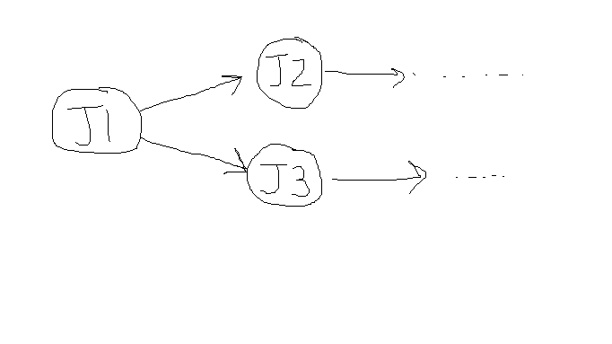

# Extra Content (Draft)

> This is a super super early version of some extra content that needs to be reorganized and put into other chapters. Most is likely duplicates from what is already included.


## Frequent logging data types in Google GitHub Actions workflows

Okay, let's break down the *specific kinds* of information frequently logged in the `run` steps of these workflows, going beyond just the actions performed:

1.  **Versions:**
    *   **Tool Versions:** Explicit checks like `cmake --version`, `bazel version`, `bazelisk --version`, `clang --version`, `go version`, `magika --version`, `clang-format --version`. Implicitly logged when tools like `setup-java`, `setup-python`, `setup-go`, `rustup`, `actions/setup-node` run or during installation (`apt install`, `pip install`, etc.).
    *   **Dependency Versions:** Logged during installation steps (`pip install`, `npm install`, `apt install`, `cargo build`/`update`, `mvn dependency:go-offline`, `conan install`). Checks like `cargo outdated` explicitly log version differences. Specific versions are often pinned in `uses:` lines (e.g., `actions/checkout@v4`, `golangci/golangci-lint-action@v6.5.2`).
    *   **OS/Platform Versions:** Implicit in the `runs-on:` directive (e.g., `ubuntu-22.04`, `macos-14`). Android API levels (`matrix.api-level`) are logged.
    *   **Language Standard Versions:** Explicitly set C++ standards (`-std=c++17`, `-std=c++20`).
    *   **Build/Release Versions:** Calculated from Git tags (`${GITHUB_REF#refs/tags/v}`, `${REF:10}`) or commit SHAs (`${GITHUB_SHA}`) and often logged via `echo` or used in artifact names/paths. Tools like `goreleaser` log the version being released.

2.  **Hashes:**
    *   **Commit SHAs:** Frequently logged for checkout actions, determining base refs (`${{ github.event.pull_request.base.sha }}`, `git merge-base`), identifying the commit being built/tested (`${{ github.sha }}`, `${{ github.event.pull_request.head.sha }}`), generating build versions, or reporting status (`statuses/${{ github.sha }}`). Explicitly logged with `git rev-parse HEAD` or `git describe`.
    *   **File Hashes:** Used in cache keys (`hashFiles(...)`).
    *   **Checksums:** Logged by Gradle Wrapper validation (`wrapper-validation-action`). GoReleaser generates checksum files, which are then often logged (e.g., base64 encoded). SLSA verification steps involve checksums.
    *   **Container Image Digests:** Logged by GoReleaser and used in SLSA provenance generation/verification for images.

3.  **Configuration & Flags:**
    *   **Build Types:** `Release`, `Debug`, `RelWithDebInfo` (often via `matrix.build_type` or `CMAKE_BUILD_TYPE`).
    *   **Compiler/Build Flags:** `CMAKE_CXX_FLAGS`, `CXXFLAGS`, `-march=`, `-fsanitize=`, `-DBUILD_SHARED_LIBS=ON/OFF`, `-DDRACO_TRANSCODER_SUPPORTED=ON/OFF`, `-DSNAPPY_REQUIRE_AVX=...`, CMake presets (`--preset`).
    *   **Tool Arguments:** Arguments passed to scripts (`./script.sh arg`), linters (`golangci-lint-action` args), tests (`pytest -n auto`), build tools (`bazel build --config=...`), `osv-scanner` args (`scan-args`), `cibuildwheel` env vars (`CIBW_...`).
    *   **Environment Variables:** Explicitly set via `echo "VAR=value" >> $GITHUB_ENV` or logged via `env:` blocks in steps.
    *   **Targets/Architectures:** `TARGET: ${{ matrix.targets[0] }}`, `matrix.arch`, `--config=android_arm64`, `--platform=...`.

4.  **File Paths & Names:**
    *   Paths added to `$GITHUB_PATH`.
    *   Paths specified in `actions/cache` or `actions/upload-artifact`.
    *   Output directories (`out/dist`, `build`, `wheelhouse`).
    *   Specific config files being used (`.github/labeler.yml`, `debian/control`).
    *   Lists of changed files (`git diff --name-only`).
    *   Artifact names (often including versions/platforms).
    *   Source/test directories targeted by commands (`./src`, `./test`, `po/*.po`).

5.  **Test Results & Diagnostics:**
    *   Pass/Fail status of individual tests and suites.
    *   Verbose test output (e.g., `test_output=errors`, `CTEST_OUTPUT_ON_FAILURE=1`).
    *   Specific test names being run or filtered (`--gtest_filter=...`, `-E IntegrationTest`).
    *   Code coverage upload status (Codecov, Coveralls).
    *   JUnit XML report paths/generation (`make junit-regtest`).
    *   Flaky test run counts (`--runs_per_test 50`).
    *   `flutter doctor -v` output (detailed environment info).
    *   Emulator configuration (API level, target, arch).

6.  **Linter/Formatter/Static Analysis Results:**
    *   Specific findings (file:line:message) from tools like `clang-format`, `clang-tidy`, `golangci-lint`, `ruff`, `black`, `flake8`, `isort`, `mypy`, `pytype`, `pylint`, `gosec`.
    *   Diffs generated by formatters (`clang-format.diff`, `go mod tidy -diff`).
    *   SARIF file generation/upload status (CodeQL, OSV Scanner, Gosec).
    *   License header check results (list of files missing headers).
    *   API compatibility diffs (`japicmp:cmp`).
    *   Security scan results (OSV Scanner, CodeQL, Gosec, Coverity).
    *   Scorecard results.

7.  **Dependency Information:**
    *   Packages being installed/updated (`apt install <pkg>`, `pip install <pkg>`).
    *   Cache hit/miss status and keys (`actions/cache`).
    *   Outdated dependency lists (`cargo outdated`).
    *   `go mod tidy -diff` output.

8.  **Deployment & Release Information:**
    *   Target tags/branches (`${{ github.ref_name }}`).
    *   Asset upload status and names (`actions/upload-release-asset`, GoReleaser logs).
    *   Publishing status to registries (PyPI, NPM, GHCR, Sonatype, CocoaPods).
    *   SLSA provenance generation/verification logs.
    *   Sigstore signing logs.
    *   Release note paths (`docs/release-notes/...`).

9.  **System & Environment Information:**
    *   Cache statistics (`ccache --show-stats`).
    *   Docker system info (`docker info`, `docker buildx ls`).
    *   Basic system info like processor count (`getconf _NPROCESSORS_CONF`).

10. **Git Operations Details:**
    *   Changed file lists (`git diff --name-only`).
    *   Merge base commit hashes.
    *   Commit counts (`git rev-list --count`).
    *   Cherry-pick status and target commits.

In essence, while high-level actions are performed, the logs are rich with specific details about versions, hashes, configurations, file paths, test outcomes, static analysis findings, and deployment statuses.


Okay, let's start transforming these files into a structured document. I will begin by organizing the content into logical chapters and sections, ensuring the information is retained verbatim as requested.

---

**Chapter 1: Introduction to Continuous Integration and Continuous Deployment (CI/CD)**

**1.1 What is CI/CD?**

Continuous Integration/Continuous Deployment (CI/CD) software represents a suite of tools designed to enhance the software development lifecycle. These platforms provide extensive functionalities that optimize the CI/CD process. Key features include automated builds, continuous testing, artifact management, deployment automation, and environment management. Furthermore, they allow for intricate pipeline orchestration, support a myriad of integrations, offer monitoring metrics, and include security scanning tools.

CI/CD is a software development methodology optimizing for frequent and efficient deployment of small changes. It is a combination of Continuous Integration and either Continuous Deployment or Continuous Delivery, depending on where this term is used.

CI/CD aims to avoid “integration hell” by ensuring continuous integration and either continuous delivery or deployment. Work is constantly merged into the main/master branch after it has been verified via code review and the continuous integration pipeline. This involves practices like trunk-based development, where all developers work on a shared branch, promoting constant integration and minimizing merge conflicts. While CI/CD emphasizes readily deployable code, it allows flexibility in release schedules to align with business needs and customer expectations.

It requires both technical and cultural shifts, including:

- Smaller work units: Breaking down features into independently deployable and testable components.
- Modular codebase: Facilitating localized changes without impacting the entire application.
- Focus on rapid feedback: Prioritizing quick delivery of changes and gathering customer insights.

**1.2 History of CI/CD**

- **Pre-1960's:** Early computing was exclusive to entities like governments and large corporations due to high costs and complex maintenance. This led to a risk-averse, bureaucratic software development culture, using the Waterfall methodology. Dr. Winston W. Royce critiqued the Waterfall model in 1970, yet its basic form was widely adopted for its structured approach, fitting the slow, tedious programming challenges of the time.
- **1960-1970s:** The era's bureaucratic environment influenced the development of critical practices like Source Code Management (SCMs), vital for managing and auditing code changes. Key developments included the introduction of the Source Code Control System (SCCS) in 1975, as discussed in Marc J. Rochkind's paper, and B. L. Ryle's work on software configuration management. This period also saw increased focus on testing and established repeatable build processes to mitigate risks.
- **1980s:** The late 20th century saw advancements with SCM systems like SCCS, RCS, and CVS, and the rise of Integrated Development Environments (IDEs). Notable developments included the GANDALF IDE, which integrated development with RCS, and Watts S. Humphrey's "Managing the Software Process" (1989), focusing on iterative development approaches and process improvement. Challenges included real-time testing for embedded systems, highlighted in Richard N. Taylor's 1984 study.
- **1980s-1990s:** Increased computer accessibility led to a boom in the software industry, with startups like Amazon emerging. The period was marked by "Integration Hell," a term possibly first formally introduced in Douglas Hackney's 1997 work. To combat this, the concept of nightly builds became popular. These are builds that are automatically triggered every night from the latest version of the codebase, allowing teams to detect and fix integration issues the next morning. Integration challenges were further analyzed by Nancy Staudenmayer and Michael A. Cusumano (MIT, 1998). Watts S. Humphrey emphasized the need for reproducible builds in "Managing the Software Process." The early 2000s saw the rise of Extreme Programming (XP), addressing integration risks, and the emergence of the Capability Maturity Model (1991). Microsoft's daily builds in 1996, detailed in Steve McConnell's work, marked a significant shift towards more efficient development practices.
- **2000s:** Continuous Integration (CI) revolutionized software development, popularized by Martin Fowler in 2000. CI's emphasis on regular integrations, automated builds, and fast feedback loops significantly improved development efficiency. Tools like CruiseControl, Jenkins, TeamCity, Bamboo, and GitLab CI further established CI/CD practices.
- **2010's onwards:** The rise of Distributed Version Control systems like Git signaled a shift in software development, emphasizing continuous feedback and iterative processes. Jez Humble and David Farley's "Continuous Delivery" (2010) advocated for automation and ensuring software readiness for release, paving the way for the evolution of DevOps, which emphasized collaboration, automation, measurement, and sharing.

**1.3 Key Concepts and Terminology**

- **Build pipelines** (or just pipelines) are simply scripts that developers maintain to perform useful work, such as building your application, generating build artifacts, or deploying your application. It is called a pipeline because the way it is structured encourages a one-way dataflow, and a set of goals that are or are not achieved.
- They are central to CI/CD, and developers will be maintaining them constantly, and updating them. Therefore, it's very important that you know the right terminology for them, how they work, and how to create them. If, for example, the deployment pipeline fails, then it must be fixed quickly, because this is usually the only route to production. Therefore, it is important to know what they are, how to create them, and how to debug them quickly and effectively.

**Disambiguation of terms between CI providers:**

- This book is somewhat focused on GitHub Actions, but tries to provide a provider-agnostic view. Some of the terms might be a bit different depending on your CI/CD provider. Here is a table that helps clarify.

  | Definition                                                                                                                                                                                                                                                                                                                  | Generic Term  | Jenkins            | GitHub Actions       | GitLab CI/CD    | CircleCI              |
  | :-------------------------------------------------------------------------------------------------------------------------------------------------------------------------------------------------------------------------------------------------------------------------------------------------------------------------- | :------------ | :----------------- | :------------------- | :-------------- | :-------------------- |
  | A build step is a single task or command within a CI/CD pipeline. It's a specific action to be executed, such as compiling code, running tests, or deploying software.                                                                                                                                                      | Build Step    | Build Step         | Job                  | Job             | Job                   |
  | In software development, an environment refers to a setup where software runs. This can include factors like the operating system, available software and tools, system variables, and network access. Different environments (like development, testing, and production) mimic different stages of the software lifecycle. | Environment   | Node               | Runner               | Runner          | Executor              |
  | A workflow is a sequence of tasks that process a set of data. In CI/CD, a workflow is a set of rules for defining the build process, typically comprising multiple jobs or build steps.                                                                                                                                     | Workflow      | Pipeline           | Workflow             | Pipeline        | Workflow              |
  | In CI/CD, a trigger is an event that initiates the execution of a workflow or pipeline. Common triggers include code commits, pull requests, scheduled times, or manual intervention.                                                                                                                                       | Trigger       | Build Trigger      | Event                | Trigger         | Trigger               |
  | Secrets are sensitive data, such as passwords, tokens, or keys, essential for the operation of applications and the security of resources. In CI/CD pipelines, secrets are used to access resources without exposing them in the code or workflow definitions.                                                              | Secrets       | Credentials        | Secrets              | Variables       | Environment Variables |
  | A container is a lightweight, executable package that includes everything needed to run a piece of software, including the code, runtime, system tools, libraries, and settings. Containers are isolated from each other and the host system, ensuring consistency across different environments.                           | Container     | Agent/Docker Agent | Container            | Docker Executor | Docker                |
  | Configuration in software development refers to the settings and parameters that define how software or hardware operates. In the context of CI/CD, configuration files (like YAML files in GitHub Actions) specify the parameters and settings of the build process.                                                       | Configuration | Jenkinsfile        | .github/workflows/\* | .gitlab-ci.yml  | .circleci/config.yml  |
  | Artifacts are files or data that are produced as a result of a build step or job in a CI/CD pipeline. These can include compiled code, binaries, libraries, containers, and documentation.                                                                                                                                  | Artifacts     | Build Artifacts    | Artifacts            | Artifacts       | Artifacts             |
  | In CI/CD, caching refers to the practice of storing a part of the build process, like dependencies or compiled code, so that it can be reused in subsequent runs, improving build speed and efficiency.                                                                                                                     | Cache         | Workspace          | Cache                | Cache           | Cache                 |
  | Parallelism in CI/CD is the execution of multiple build steps or jobs simultaneously. It is used to speed up the build process by dividing the workload across multiple runners or agents.                                                                                                                                  | Parallelism   | Parallel Builds    | Matrix Builds        | Parallel Matrix | Parallel Jobs         |
  | Build status is an indicator of whether a build or integration process in a CI/CD pipeline succeeded or failed. It provides immediate feedback on the health and success of a change or a set of changes made in the repository.                                                                                            | Build Status  | Build Status       | Check                | Pipeline Status | Build Status          |

- Some testing environments might have different terms. These might be called "Development Environment", Dev, QA, Staging, UAT, PPE, Testing, Experimental, or Beta. These terms may have different connotations, depending on which environments you are using, and for which purpose.

**1.4 Continuous Integration (CI)**

The first step is continuous integration. Breaking this down, continuous means often or as frequently as possible in integration means the act of combining multiple disparate pieces into a whole. **Integration is the act of constantly merging your changes with other developers', and vice-versa. It's the act of combining multiple changes, from multiple developers, into a single, cohesive whole, regularly.** All developers work on a shared codebase. Integration (i.e., snapping the puzzle pieces together) occurs regularly.

Normally in CI/CD, long-lived branches are discouraged because it means that work is not integrated and testable with the rest of the application. Separate branches are normally considered developer workspaces. So, we need a way to make sure that integration work is done, well, continuously. Work is only integrated if it exists as part of the application.

Trunk-based development is a software development strategy that emphasizes frequent merges to a single branch known as the “trunk.” This approach can be likened to the structure of a tree. In this analogy, the trunk represents the main codebase, which is central and robust, continually growing as new changes are integrated. The branches, on the other hand, represent smaller, temporary code changes or features that developers work on. These branches are merged back into the trunk, ensuring that they become part of the main/master branch. This method promotes a continuous integration environment where updates are made regularly and incrementally to the central codebase, minimizing the complexity of merges and reducing the risk of significant conflicts.

To support integration the tasks themselves have to be small and integrable, and must be done in an intelligible order. Simply making the PRs small isn't sufficient. At every point after you finish your task, you should be able to validate whether your work is getting closer to being fully integrated. This is because if the PR's are too small, there might not be any functionality to test, so it might be unclear if the work is actually integrated. An anti pattern in this case would be to commit one line of code that creates A variable but the variable is not used. It's unclear if this code is actually integrated, because simply writing the code assigns it to the variable, but the variable is not used. This means that the code is likely removed at runtime by the compiler. And has no effect on the application.

This means that you should be able to integrate against others' work, that is, you should be able to know if you're making progress towards your goal, and have concrete evidence (i.e., tests pass and these tests are related to what the user can do.) You should be able to know, very early on, if part of your feature is working with the other parts of the application. It doesn't have to be finished super fast, rather, that you are aware that things are fitting together properly, and you're able to test it in production. Say for example, we're working on the weather application. We would like to create a new user interface for this weather application. If we start with removing the existing weather overlay, well, then the customers can't use it in the meantime, so we can't integrate these changes--this is a problem. Instead, we should develop the newer features alongside the current overlay and provide the capability to remove and replace the old weather overlay with the new one. This is normally made much easier through modular application approaches (and good application architecture.) This may require a bit of refactoring initially, as the application may not be built with every possible business requirement in mind.

**1.5 Continuous Delivery vs. Continuous Deployment (CD)**

**Continuous Deployment** (often confused with Continuous Delivery) is the practice where every change that passes the automated tests is **automatically deployed** into the production environment With little to no human intervention. This also encompasses CI and is a superset of CI. The work has to be integrated first with continuous integration before it is deployed to the production environment.

**Continuous Delivery**, on the other hand, ensures that the code is always in a deployable state, but **it may not be deployed to production automatically. Instead, it might require manual approval.** It provides the business with the opportunity to deploy at any point. Further tests, often user acceptance testing (UAT) or other types of end-to-end tests, are run in this environment. Therefore, in organizations with low risk tolerance, continuous delivery might be a safer approach. Continuous Deployment is a superset of continuous deployment. It just extends continuous delivery to make sure that the code is always in a deployable state and also deploys it.

This should be the only route to deploy to production because otherwise the point of having the continuous delivery pipeline is compromised because changes external to it can be non-idempotent, thus, making using the pipeline more brittle as manual configuration changes aren't reflected in the automation. The goal is to create artifact(s) that can be deployed as close as possible with minimal modifications. Do use the artifacts created by the continuous integration pipeline as inputs. Failure to do so means there is no trust in the continuous integration pipeline's ability to generate usable artifacts that can be used as-is for continuous deployment.

**Note:** how do I remember the difference between continuous delivery and continuous deployment? Continuous _Deployment_ means to _Deploy (i.e., a ship)_, and Deploy is getting it out to production.

- [[Continuous Delivery: Reliable Software Releases through Build, Test, and Deployment Automation: Humble, Jez, Farley, David: 9780321601919: Books - Amazon.ca]](https://www.amazon.ca/Continuous-Delivery-Reliable-Deployment-Automation/dp/0321601912/ref=sr_1_1?crid=2H71BL6NRSX7Q&keywords=continuous+delivery&qid=1698110152&sprefix=continuous+delivery%2Caps%2C132&sr=8-1)
- [[Continuous Integration: Improving Software Quality and Reducing Risk: Duvall, Paul, Matyas, Steve, Glover, Andrew: 9780321336385: Books - Amazon.ca]](https://www.amazon.ca/Continuous-Integration-Improving-Software-Reducing/dp/0321336380/ref=sr_1_1?crid=3VS7DPPXR40T8&keywords=continuous+integration&qid=1698110160&sprefix=continuous+integration%2Caps%2C123&sr=8-1)

**1.6 The CI/CD Process Overview**

Here is what the software development process looks like when using CI/CD. Note that many of these processes are automated.


Here's a description of what's going on in the diagram.

- After tasks are broken down, then they can be worked on by the developers. Once completed, they create a Pull Request (PR). This automatically triggers a Continuous Integration (CI) pipeline that includes building, testing, and linting the PR. Your CI/CD provider should have detailed instructions on how to get the pipeline set up for the first time, and can automatically run it when developers create PRs. The pipeline, maintained by developers, must succeed before the PR is merged. This is a critical part of CI/CD, because the pipeline builds and runs the automated tests, which allow developers to gain confidence in their changes, and ensures that the work meets a quality threshold prior to merging (and thus becoming available for other developers to work on the changes, and for them to be available to the customers.)
- If it is not successful, then developers have to fix their changes before they are merged--this also includes code review. A successful pipeline run results in build artifacts being published to an artifact repository. However, at this stage, the artifacts remain unused in the repository and are not yet accessible to customers. Therefore, we need to have a way to release these to production.
- In the past, releasing software meant that changes were available to customers immediately, or via a death-march rollout that was difficult to undo. This mimicked the real world closely, which meant that it was easy to understand the process. For example, say I am writing a newspaper. If I hit print, and distribute all of the newspapers to everyone, and there is a typo, then it's going to be costly to fix. I can't easily pull the newspapers back into my office and change them.
- This is a very scary prospect, and so code was withheld until it was thoroughly tested. This makes sense: It was difficult to quickly deploy a new version of your application with the fix and tooling was not as mature as it was today.
- Deployments are managed via a “deployment pipeline” similar to the build pipeline but tailored for deployment. The specific deployment steps and commands vary based on the cloud provider, but all require the build artifacts and relevant credentials to access production environments. Deployments utilize infrastructure as code, using predefined templates to dictate resource provisioning and application setup, ensuring configurations are standardized and rebuilt from scratch to avoid nonstandard “snowflake” machines.
- When we do CD, we can deliver code that sometimes is still a work in progress. Normally, this would be of great concern: the feature isn't done yet, so customers would be negatively impacted because the feature would be buggy or wouldn't work. However, we can safely hide it behind a feature flag. This means that customers are not impacted by the work that is in progress. The application looks the same, and functions the same. Instead of it being integrated on a develop branch internally, it is in production, but just inactive.
- There are many strategies for deploying the new changes. One way is to put the new change behind a feature flag, which means that it is only enabled once the feature flag is turned on. This approach is useful if you're developing a small-to-large sized feature, and need multiple PRs to create it. If it's a very small change, then it's not as useful to put behind a feature flag, as the overhead is likely too high. Additionally, any changes, even if they are behind a feature flag, have a risk to production. For example, upgrading dependencies.
- Therefore, we need a way to make sure that we can gradually incorporate changes to production without interrupting existing users. There are two main strategies we can use to do this. One is called blue-green deployments: Maintain two production environments (blue for the current version and green for the new version) to achieve zero-downtime deployments. Another is called incremental deployments, or canary deployments: Release updates to a subset of users initially, gradually increasing the reach, allowing early feedback and risk mitigation.
- Blue-green deployments are useful when there are major changes, or if customer traffic cannot be served by two different nodes running different versions of the application. Think large infrastructure upgrades, database refactorings, etc. Most changes can be serviced via incremental deployments, where old copies of the application are destroyed, and newer copies are deployed in its place. This allows for a gradual introduction of new changes to production, and traffic is drained from the nodes before they go into service.
- Note that the act of moving changes to production does not necessarily mean that they are "released." Deploying, Delivering, and Releasing take on different definitions. This requires a very different way of thinking about how you approach releasing changes to customers, and is a very large paradigm shift.
- Over time, as we work on the feature, it might become ready for customers. In this case, we can gradually enable the feature flag to make it available to customers.
- To mitigate risk, we adopt a two-pronged approach. First, we slowly enable the feature flag. This means that the feature is not available to all customers yet. Second, we write monitors for our feature (much like the canary in the coal mine.)
- This stage ends once the application is available to the customer. This means that there are some post-deployment checks that occur, however, they are short in nature and only represent a snapshot of time.
- After (and during release), the application is closely monitored using continuous monitoring. This ensures that if the application goes down, that the deployment is quickly rolled back.

**1.7 Benefits of CI/CD**

_(This section could incorporate benefits mentioned implicitly, like faster feedback loops, reduced risk, improved quality, and avoiding "integration hell". The source text doesn't explicitly list benefits in one place, but they are woven throughout the descriptions.)_

**1.8 Related Concepts**

- **DevOps:**
  - [[The Phoenix Project: A Novel about IT, DevOps, and Helping Your Business Win: Kim, Gene, Behr, Kevin, Spafford, George: 9781942788294: Books - Amazon.ca]](https://www.amazon.ca/Phoenix-Project-DevOps-Helping-Business/dp/1942788290/ref=sr_1_1?crid=969HQYQJ3ROE&keywords=%22The+Phoenix+Project%22&qid=1698110264&sprefix=the+phoenix+project+%2Caps%2C128&sr=8-1)
  - [[The DevOps Handbook: How to Create World-Class Agility, Reliability, and Security in Technology Organizations: Kim, Gene, Debois, Patrick, Willis, John, Humble, Jez, Allspaw, John: 9781942788003: Books - Amazon.ca]](https://www.amazon.ca/DevOps-Handbook-World-Class-Reliability-Organizations/dp/1942788002)
- **Complexity in Software Development:**

  - [**Key Points from the Continuous Delivery Podcast: Complexity**](#key-points-from-the-continuous-delivery-podcast-complexity)
    This episode explores complexity in software development from various angles.

    **What is complexity?**

    - **Difficulty in completion:** Many dependencies, unreachable stakeholders, and external factors contribute to complexity.
    - **Unpredictability:** Inability to foresee how changes will impact the system.
    - **Effort disproportionate to change:** Simple changes requiring extensive coordination and effort.
    - **Codebase intricacy:** Difficulty understanding code structure, duplication, and fear of unintended consequences.

    **Causes of complexity:**

    - **Technical debt and legacy code:** Messy, poorly architected codebases.
    - **Overly complex frameworks:** Using "one size fits all" solutions that introduce unnecessary dependencies.
    - **Designing for unknown future:** Building features for anticipated needs instead of focusing on current requirements.
    - **Organizational structure:** Conway's Law - system complexity mirrors organizational complexity. Poorly architected systems reflecting organizational changes.

    **Combating complexity:**

    - **Merciless refactoring:** Continuously simplify code, keeping methods and classes small.
    - **True DevOps adoption:** Empowering developers to build automation and simplify workflows and environments.
    - **Tight feedback loops:** Short planning cycles with frequent feedback from product and end-users.

    **Identifying and tracking complexity:**

    - **Cyclomatic complexity, maintainability index, and other static code analysis tools.**
    - **Time to implement changes:** Increasing time indicates growing complexity.
    - **Throughput measurement:** Low throughput can be a symptom of a complex system.
    - **Number of code changes to fix a bug:** Multiple changes for a single bug suggest a complex system.

    **Other important points:**

    - **Cynefin framework:** A model for understanding and addressing complexity based on the nature of the problem.
    - **Stacy complexity matrix:** Applying the Cynefin framework to system design.
    - **Complexity impacts the entire organization:** From development teams to organizational structure.

    **Call to action:**

    - Join the Continuous Delivery Podcast LinkedIn group.
    - Follow the podcast on Twitter: @continuouspod.
    - [[1w7qpw29ni6lnbex9gksl5y6d961.mp3](https://1drv.ms/u/s!AOnf7tByrSaDkzU)](#w7qpw29ni6lnbex9gksl5y6d961.mp3)

---

This concludes the first chapter. Please let me know when you're ready for Chapter 2, which will cover preparing the development environment.

Okay, here is the next chapter, focusing on preparing the development environment, version control, and build tools.

---

**Chapter 2: Preparing the Development Environment**

**2.1 Setting Up Version Control**

Effective software development, especially within a CI/CD framework, relies heavily on robust version control practices. Version Control Systems (VCS) like Git track changes to code over time, enable collaboration among developers, and provide a history that is crucial for debugging and understanding the evolution of the software.

**2.1.1 Setting Up Developer Identity**

- Each developer should have an identity, that is, some sort of way to identify them when contributing to the repository. This normally requires creating an account for each developer, or, depending on your CI software, might be able to be linked to another identity provider. Instructions vary. The developer's identity must be set up prior to cloning the repo, otherwise, developers would not be able to clone it. This normally requires setting up SSH Keys with your CI/CD provider. Your provider will have more instructions on how to set this up.
- It is important that each developer has their own identity, because one has to be able to track their changes. This is useful for example for security purposes, and having the ability to know who to ask if more information is required on a change. It ensures only those authorized and authenticated can contribute.

**2.1.2 Get a Repository**

- This will eventually contain everything that your application needs to run. All developers must be able to access this repository. This means that the server (in this case the Git server) has to be accessible to all of the developers. If you are already working from a repository, then you can skip this step. Usually, CI/CD software will host it for you automatically, and you don't have to manage or host it, all you have to do is go through a wizard on a webpage to set one up for your project.
- Second, you will need to store all of your application code in the repository. Usually, this includes application-specific dependency specifications but does not usually include the actual dependencies themselves. It also includes application source code, configuration files, database migrations, documentation, tests, resources, localizations, etc. (everything that your application needs to run.) If your code is hosted somewhere else, then it will have to be copied to this repository and then pushed to the main branch.
- If you already have a repository, then you'll have to import it into the provider.

**2.1.3 Creating a .gitignore file**

A .gitignore file is a special file used by Git, the version control system, to determine which files and directories should be excluded (or ignored) from version control. This means that the specified files and directories will not be tracked by Git, even if they exist in your working directory.

The .gitignore file goes in the root of your repository, and is shared by all developers.

Not _all_ build artifacts are necessary to run the application, and some files are necessary but shouldn't be part of VCS because they should be injected through the environment at runtime (e.g., credentials and sensitive data.) For example, when building an application, it might produce build artifacts such as its executable or final build artifacts. These are necessary to run the application, but shouldn't be committed to version control because they are published as part of the build process. If they were part of version control, then it would be difficult to know how they were generated--were they generated on the build server, or someone's development machine? It would also make working with the repository very, very slow, as Git and other VCSes are not designed to work with large binary files. It would also take up a lot of disk space, too.

| Type of File/Folder                                     | Commonly Stored in VCS | Not Commonly Stored in VCS |
| :------------------------------------------------------ | :--------------------- | :------------------------- |
| Source Code Files                                       | ✓                      |                            |
| Documentation                                           | ✓                      |                            |
| Configuration Files                                     | ✓                      |                            |
| Build Scripts                                           | ✓                      |                            |
| Unit Test Files                                         | ✓                      |                            |
| Images & Other Media (if essential to the project)      | ✓                      |                            |
| Dependency Files (e.g., package.json, requirements.txt) | ✓                      |                            |
| Large Binary Files (e.g., videos, large images)         |                        | ✓                          |
| Generated Files (e.g., compiled binaries)               |                        | ✓                          |
| Temporary Files                                         |                        | ✓                          |
| User-specific Configuration                             |                        | ✓                          |
| Credentials & Sensitive Data                            |                        | ✓                          |
| Log Files                                               |                        | ✓                          |

There are some general principles on whether to version control something or not.

- Is it reproducible and what is the effort for reproducing it? If I run the same command(s) on the same set of file(s) later on, will I get the same output/same changed state? How is it generated, is it generated via a script?
- How large are the files? Are they significantly larger than the files in the repo? Does it generate many thousands of files at once? Many tools are not designed to work with thousands or tens of thousands of changed files at once.
- Are these file(s) not meant to be shared among developers? For example, do developers gain a benefit by having these files version controlled? Should they be shared?
- Are these changes not feasible to be reviewed during code review? For example, thousands of changed files, or a binary blob could be anything. Does a criteria exist to review it or are the changes overwhelming where it is not possible to efficiently do so?
- Answering yes to all questions means that it is likely that the file(s) should not be version controlled and vice-versa.

**Example: node_modules folder**

- Is it reproducible? Yes, through package-lock.json.
- How large are the files? The node_module folder can be very large, up to 600MB. This is usually much larger than the source code in the repo.
- Are the files not meant to be shared among developers? The node_modules folder is specific to an OS and package-lock.json file. Each developer has their own node_modules folder.
- _(Conclusion: Should not be version controlled)_

**Example: source-code**

- Is it reproducible? In theory, yes but it is highly unlikely to be 100% reproducible and takes a lot of effort to reproduce. There are many ways to solve a problem, similar to writing a book. Even small variations can change program behavior.
- The files are likely to be of similar size.
- The files are meant to be shared among developers, as other developers will be working on the source code.
- The number of files is likely to be able to be modified by the programmer by working on a smaller feature. Thus, they should be able to be reviewed during code review.
- _(Conclusion: Should be version controlled)_

Link to gitignore templates: [[GitHub - github/gitignore: A collection of useful .gitignore templates]](https://github.com/github/gitignore)

**2.2 Establishing a Consistent Local Development Environment**

When you're working on multiple projects (or a single project) it can be useful to containerize your development setup. What this allows you to do is to come back to a consistent development environment, and also make sure that other people on the team have a consistent environment. The advantages here is that it can help minimize debugging time (and toil) because everything is set up exactly the way that you want it to be. Since containers are ephemeral, then any changes that you might accidentally make to the environment are not saved. This allows for faster development time, because you are able to easily start up an environment with a couple, simple commands that might have complicated instructions to set up the environment.

The best part is that it is set up the same time every time, so it is always consistent. Since it is isolated, it doesn't matter what other software is on your computer, it is isolated. This means that if you have other versions of software installed, then they won't conflict. If you know that the software dependencies are the same between your environment and CI, then you have greater confidence that your changes are correct, and match what the customers will see. This is because it is technically possible to run different versions of the software on CI and your local testing environment--it is possible that the application will still build and run fine, however, there might be strange issues that weren't covered by tests, for example.

Automate the developer environment setup with scripts or containers to save time and avoid inconsistencies. Use dev containers as much as possible.

How do you make other people use those settings/containers/dev containers to build your software? Is there a way to enforce that particular IDE extensions are installed on each developer's computer? There doesn't appear to be a way to have the extensions force-installed, but you can add them to devcontainer json and it'll prompt as recommendations.

**2.2.1 Tools for Managing Development Environments**

Setting up a local development environment can be time-consuming and challenging, especially when working on complex projects or collaborating with multiple teams. Today, there are several tools and platforms designed to streamline this process, ensuring that developers can start coding with minimal setup. Let's delve into some of these solutions.

1.  **GitHub Codespaces**:

    - **Overview**: Codespaces provides a complete, configurable dev environment on top of GitHub. It enables developers to work from anywhere, on any device, without lengthy setup.
    - **Features**:
      - **Browser-Based IDE**: Develop directly within your browser without any setup.
      - **Visual Studio Code Integration**: Offers the same features and extensions as VS Code.
      - **Customizable**: Use a `devcontainer.json` file to specify the tools, extensions, and configurations needed.
    - **Use Cases**: Ideal for open-source contributors, remote teams, or any situation where setting up a local environment might be cumbersome.
    - **Getting Started with GitHub Codespaces**:
      1.  **Prerequisites**:
          - Ensure you have a GitHub account. If not, sign up at [GitHub.com](https://github.com/).
          - Currently, GitHub Codespaces is a paid service, so you'll need to have billing set up or be part of a team that has access to Codespaces.
      2.  **Access Codespaces**:
          - Navigate to the GitHub website and sign in.
          - Once logged in, click on your profile picture in the top right corner and select "Codespaces" from the dropdown.
      3.  **Create a New Codespace**:
          - Click the "New codespace" button.
          - Choose a repository from your existing ones, or use a public repository's URL. This repository will be the base for your Codespace.
          - GitHub will prepare the Codespace and start up a virtual machine. This may take a few minutes the first time.
      4.  **Setting Up The Environment**:
          - GitHub Codespaces will attempt to automatically configure the environment based on the repository. If the repository contains a `.devcontainer/devcontainer.json` file, it will use it to configure the Codespace environment. Otherwise, it will provide a standard environment.
          - You can customize the environment by modifying the `devcontainer.json` file, allowing you to specify software, extensions, and settings for the Codespace.
      5.  **Using the Codespace**:
          - Once your Codespace is ready, it will open in the browser using the Visual Studio Code (VS Code) interface.
          - Use it just like you would use VS Code locally. You can write code, run commands in the integrated terminal, debug, use Git, and install extensions.
      6.  **Committing Changes**:
          - Make changes to your code and files as you would in a local development environment.
          - Commit your changes directly from Codespaces to the GitHub repository.
      7.  **Suspending or Deleting a Codespace**:
          - If you're done with your work session, you can close the Codespace tab. It will automatically be suspended after a period of inactivity, saving your work and state.
          - To delete a Codespace, navigate to the Codespaces section on GitHub, hover over the Codespace you want to delete, click on the "..." (more options) button, and select "Delete".
      8.  **Accessing Codespace on Different Devices**:
          - You can access your Codespace from any device with a web browser. Just navigate to GitHub, go to the Codespaces section, and select the one you wish to work on.
      9.  **Local Development** (Optional):
          - If you prefer, you can also connect to your Codespace using the local VS Code application on your machine, ensuring a seamless transition between local and cloud development.
      10. **Stay Updated**: \* As GitHub continues to refine and expand the Codespaces feature, it's a good idea to check the official documentation and GitHub blog for updates, new features, and best practices.
          Remember, while Codespaces provides a powerful cloud development environment, always be conscious of the associated costs, especially if you're working with a large team or on multiple projects.

2.  **Dev Containers**:

    - **Overview**: Development containers, or "dev containers", provide a consistent environment for development, which can be shared across a team. They're powered by Docker and can be used with platforms like Visual Studio Code.
    - **Features**:
      - **Isolated Environment**: Ensure that all developers are working within the same setup, reducing the "it works on my machine" syndrome.
      - **Reproducibility**: Easily recreate the environment, making onboarding new team members smoother.
      - **Integration with IDEs**: Visual Studio Code, for example, has a Remote - Containers extension that integrates seamlessly with dev containers.
    - **Use Cases**: Suitable for teams looking for consistency across development environments, or for projects with complex setup requirements.
    - [[Pros and cons of using devcontainers in pipelines - DEV Community]](https://dev.to/eliises/pros-and-cons-of-using-devcontainers-in-pipelines-4cld) nuanced perspective, some github actions can't run inside of the container unfortunately. Useful if you don't want to use any actions and just want to do your own thing, completely separate from github.
    - [[devcontainers/ci: A GitHub Action and Azure DevOps Task designed to simplify using Dev Containers (https://containers.dev) in CI/CD systems.]](https://github.com/devcontainers/ci) using them locally (even if they're not on the CI) is still useful, however, as it ensures consistency when developing locally. Just remember to make sure to update the workflow file when the dev container changes, maybe in the pipeline make a script that puts a comment on the PR reminding people to verify if the dev container and workflow are using the same dependencies.
    - **Getting Started with Dev Containers in VS Code**:
      Development containers in Visual Studio Code, also known as "Dev Containers," are a part of the Remote Development extension pack. They allow developers to define consistent, reproducible, and isolated development environments encapsulated within Docker containers. This ensures that everyone on the team has the same setup and tools, regardless of their local machine setup.
      1.  **Prerequisites**:
          - Install [Visual Studio Code](https://code.visualstudio.com/).
          - Install [Docker Desktop](https://www.docker.com/products/docker-desktop) and ensure it's running on your machine.
          - Inside VS Code, go to the Extensions view by clicking on the square icon in the sidebar or pressing `Ctrl+Shift+X`.
          - Search for and install the `Remote - Containers` extension.
      2.  **Open or Create a Project**:
          - Open an existing project in VS Code or create a new one.
      3.  **Add Dev Container Configuration**:
          - Press `F1` to open the command palette.
          - Type and select `Remote-Containers: Add Development Container Configuration Files...`.
          - A list of predefined container configurations will appear, based on the detected type of your project. Choose a configuration that matches your project or select a base one (like `Node.js` or `Python 3`).
          - This action will add a `.devcontainer` directory to your project with a `devcontainer.json` file (and possibly a `Dockerfile`).
      4.  **Customize the Dev Container** (Optional):
          - Edit the `Dockerfile` if you want to customize the container's base image, install additional software, or change settings.
          - Modify the `devcontainer.json` to adjust various settings like forwarded ports, mount points, extensions to be installed, etc.
      5.  **Open Project in Dev Container**:
          - Press `F1` to open the command palette again.
          - Type and select `Remote-Containers: Reopen in Container`.
          - VS Code will build the Docker image (this might take some time during the first run), start a container, and then reopen your project inside the container.
      6.  **Develop Inside the Container**:
          - Once inside, you can code, run, debug, and use the terminal just like you would locally. Any tools, SDKs, or configurations you defined for the container are immediately available.
          - Extensions defined in `devcontainer.json` are installed within the container, ensuring everyone on the team has the same development setup.
      7.  **Managing the Container**:
          - To stop or start the Dev Container, use the `Remote-Containers: Stop Container` and `Remote-Containers: Start Container` commands from the command palette.
          - If you make changes to the `Dockerfile` or `devcontainer.json`, use the `Remote-Containers: Rebuild Container` command to apply them.
      8.  **Returning to Local Development**:
          - To go back to local development, click on the green remote indicator in the bottom left corner and select `Close Remote Connection`.
      9.  **Sharing the Setup**:
          - Commit the `.devcontainer` directory to your version control system (e.g., git). This allows other team members to check out the project and immediately get the same development environment by reopening the project in a container.
      10. **Advanced Configurations**: \* As you become more familiar with Dev Containers, you can take advantage of advanced configurations like using Docker Compose to set up multi-container environments, setting post-create scripts, and more.
          By following these steps, you'll have a consistent and isolated development environment that can be shared and reproduced across your team, helping eliminate the "it works on my machine" problem.

3.  **Docker Compose**:

    - **Overview**: Docker Compose is a tool for defining and running multi-container Docker applications. Developers can use a `docker-compose.yml` file to configure application services.
    - **Features**:
      - **Multiple Services**: Easily define and run applications comprised of multiple containers.
      - **Networks and Volumes**: Create shared networks, storage volumes, and more.
      - **Easy Scaling**: Scale specific services with a single command.
    - **Use Cases**: Great for local development and testing of microservices architectures or any multi-container app.
    - **Getting Started with Docker Compose**:
      Docker Compose is a powerful tool for defining and running multi-container Docker applications. In this guide, we'll use Docker Compose to set up a simple web server as an example.
      **1. Prerequisites:**
      - Install [Docker Desktop](https://www.docker.com/products/docker-desktop) for Windows or Mac. For Linux, install Docker and Docker Compose separately.
      - Ensure Docker is running on your machine.
        **2. Create a new directory:**
      ```bash
      mkdir my-webserver && cd my-webserver
      ```
      **3. Create a Dockerfile:**
      Inside the `my-webserver` directory, create a file named `Dockerfile` with the following content to set up a basic Nginx web server:
      ```Dockerfile
      FROM nginx:alpine
      COPY ./html /usr/share/nginx/html
      ```
      **4. Create a directory for your HTML files:**
      ```bash
      mkdir html
      ```
      **5. Create a sample HTML page:**
      Inside the `html` directory, create a file named `index.html` with the following content:
      ```html
      <!DOCTYPE html>
      <html>
        <head>
          <title>My Test Server</title>
        </head>
        <body>
          <h1>Welcome to the Test Server powered by Docker Compose!</h1>
        </body>
      </html>
      ```
      **6. Create a docker-compose.yml file:**
      Inside the `my-webserver` directory, create a file named `docker-compose.yml` with the following content:
      ```yaml
      version: "3"
      services:
        webserver:
          build: .
          ports:
            - "8080:80"
      ```
      This file tells Docker Compose to build the Dockerfile in the current directory and map port 8080 on your host machine to port 80 on the container.
      **7. Build and start the services using Docker Compose:**
      In the terminal or command prompt, navigate to the `my-webserver` directory and run:
      ```bash
      docker-compose up
      ```
      This command will build the Docker image and start a container with the Nginx web server.
      **8. Access the test server:**
      Open your web browser and navigate to `http://localhost:8080`. You should see the "Welcome to the Test Server powered by Docker Compose!" message.
      **9. Stopping the test server:**
      Press `Ctrl+C` in your terminal where Docker Compose is running to stop the containers. Alternatively, you can run `docker-compose down` in another terminal window to stop and remove the containers.
      **10. Cleanup (Optional):**
      If you want to remove the built Docker images, you can do so using:
      ```bash
      docker-compose down --rmi all
      ```
      That's it! Using Docker Compose, you've set up a local test server with a basic web page. This example can be extended by adding database services, backend APIs, and other components as needed by defining them in the `docker-compose.yml` file.

4.  **Virtual Machines (VMs)**:
    - **Overview**: VMs allow developers to run another operating system within their primary OS, creating isolated environments for testing or development.
    - **Features**:
      - **Full OS Isolation**: Run multiple OS instances on a single physical machine.
      - **Snapshotting**: Save the current state and roll back to it as needed, which is useful for testing.
      - **Network Configurations**: Create complex network topologies for testing distributed systems.
    - **Use Cases**: Useful for OS-specific development, testing applications on different OS versions, or simulating production environments locally.

**Conclusion**:
The landscape of tools and platforms for setting up local development environments is diverse, catering to various needs and complexities. By choosing the right tools, developers can ensure a smooth, consistent, and efficient workflow, regardless of where they are or what device they're using.

**2.3 Choosing and Configuring Build Tools**

A fundamental prerequisite for CI/CD is the ability to build your project reliably from the command line without manual IDE interaction. This forms the basis for automated builds.

**2.3.1 Tips on Selecting Build Tools**

- **"Favor specific, portable tools over hacking"**
  - ChatGPT summary of paper explanation: "A CI bad smell arises from a sub-optimal selection of tools in the CI pipeline, which can lead to delays and force developers to adopt hacking solutions like custom shell scripts. These scripts may initially solve the problem but can later cause maintainability and portability issues. To avoid this, developers should use suitable plugins instead of shell scripts and be cautious of different versions of tools conflicting with each other on the same server."
- **"Do not use out-of-the-box tools, nor listen customers only"**
  - ChatGPT summary of paper explanation: "Proper configuration of tools is essential in software development, and using external tools with default configurations is a bad practice. Involving developers in defining quality gates is crucial, as relying solely on customer requirements may lead to irrelevant warnings and slow down the CI process. Quality gates should be established with input from both developers and customers to ensure an efficient and effective CI process."
- **Build scripts are highly dependent upon the IDE (BM2)**
  - "The two most positively assessed bad smells were related to the usage of absolute paths in the build (BM1), and the coupling between the build and the IDE (BM2). The high perceived relevance of such smells is justified considering that their presence 26 Fiorella Zampetti et al. will unavoidably limit the portability of the build resulting in statements such as "but it works on my machine"."
  - Certain IDEs install their build and compilation software in hard-coded locations that may or may not be used by the configuration files in the program. This means that other people who use different IDEs may not have those exact same paths, which makes the application IDE dependent. This can cause issues with portability, as the CI server must also be set up exactly the same, which isn't guaranteed (as the workspace folder is usually dynamic.) This can cause configuration errors.
  - Might be hard to collaborate and share configuration with others, as configuration is mixed in with personal preferences and build settings that are required for the application to run. This can also make it difficult for other people to use their IDEs.
  - If the builds are too dependent on the IDE, then it might be difficult to run them or reproduce the environment on CI. This is because the IDE may have custom settings, or special versions of software, that are specific to a single developer. Or, they may be using environment variables injected at build time that the CI does not use. This can change application behavior and make it difficult to build.

**2.3.2 Understanding IDE-Specific Build Processes**

Different IDEs manage build processes uniquely, often abstracting complex commands into user-friendly interfaces with detailed logs available for troubleshooting. For instance, Visual Studio provides build command details through its verbosity settings, while IntelliJ IDEA and Eclipse offer insights via built-in terminals and verbose output settings. Xcode allows developers to track build commands and order through the "Report Navigator."

Different Integrated Development Environments (IDEs) have varied ways of presenting build commands and the order in which they're run. Here are instructions for a couple of popular IDEs:

[[Debugging in Visual Studio Code]](https://code.visualstudio.com/docs/editor/debugging) (i.e., launch.json file)

1.  **Visual Studio (for C++/C#)**:

    - **Build Commands**: Visual Studio uses `msbuild` for building its projects. To see the exact build commands:
      1.  Go to the "Tools" menu.
      2.  Select "Options."
      3.  Navigate to "Projects and Solutions" -> "Build and Run".
      4.  In the "MSBuild project build output verbosity" dropdown, select "Detailed" or "Diagnostic" to increase the verbosity of the build output.
    - **Build Order**: The build order can also be observed in the output window when you build the solution, especially if you've set the verbosity to "Detailed" or "Normal."
      
      The build log might have many things. This is normally useful for troubleshooting, it's less likely that you'll need to provide manual commands. If you have a legacy project, or it's complex, then you might need to provide custom commands.

2.  **IntelliJ IDEA (for Java)**:

    - **Build Commands**: IntelliJ IDEA uses its own builder, but you can see the build commands if you're using Maven or Gradle by looking at the output when you run the respective build lifecycle or task.
      1.  Open the "Terminal" tab (usually at the bottom).
      2.  Run your build tool command, e.g., `mvn compile` for Maven.
      3.  The executed commands will be printed in the terminal.
    - **Build Order**: If you're using a build tool like Maven, the build lifecycle phases determine the order. For a default Java project in IntelliJ, the IDE handles this, and you can infer the order by observing the messages in the "Build" tool window.

3.  **Eclipse (for Java)**:

    - **Build Commands**: Eclipse uses its own builder for Java. To see detailed build info:
      1.  Go to "Window" -> "Preferences."
      2.  Navigate to "General" -> "Workspace".
      3.  Check "Enable verbose output for the build."
    - **Build Order**: Eclipse handles the order internally for Java builds. For more detailed projects, you'd likely be using a tool like Maven, in which case the build lifecycle phases determine the order.

4.  **Xcode (for C++/Swift/Objective-C)**:
    - **Build Commands**:
      1.  Go to "Xcode" in the top menu.
      2.  Select "Preferences."
      3.  Navigate to "Locations" tab.
      4.  Set the "Derived Data" location to "Relative".
      5.  After building, in the "Report Navigator" (rightmost tab in the left pane), you can see the build logs. Click on the latest build under the "Build" section.
    - **Build Order**: This is determined by the dependencies set up in your project. You can observe this order in the build logs in the "Report Navigator" after a build.

For all these IDEs, reading the output or log pane during a build will give you a good sense of the commands executed and their sequence.

**Makefile Example**

Here's a simple makefile that demonstrates dependencies and compilation for a C program:

```makefile
main.o: main.c mathFunctions.h utilFunctions.h
    gcc -c main.c

utilFunctions.o: utilFunctions.c utilFunctions.h
    gcc -c utilFunctions.c

mathFunctions.o: mathFunctions.c mathFunctions.h
    gcc -c mathFunctions.c
```

This format allows developers to easily manage and scale complex projects with numerous dependencies. Use a makefile when building your software is complex, and you have many dependencies (e.g., C or C++) that can't be easily defined through steps or jobs.

**2.3.3 Identifying Project Type and Common Tools**

Normally, the type of project you are trying to build can be determined via a few heuristics. First, you can try using github-linguist to determine what programming languages are used in the project the most frequently. Programming languages that are commonly used help indicate which type of project it is.

- Java is code -> byte code -> run it on JVM
- Python is code -> interpreted by interpreter
- C# write code -> compile -> dll (or exe), if dll then it is included (optionally) as part of another program

```
Use github-linguist to determine what type of project you're running. A project might contain many different languages; this gives you a high level overview of where to start in terms of build script.

In this case, this is clearly a TypeScript project. It also has a packages.json file, indicating that it is an npm project.

alex@DESKTOP-7M8V9ET:/dev/shm$ github-linguist angular-cli/
94.69%  3661931 TypeScript
 2.60%   100620 Starlark
 1.36%    52459 JavaScript
 0.77%    29939 HTML
 0.33%    12624 EJS
 0.21%     8143 Shell
 0.03%     1281 jq
 0.00%      160 CSS
 0.00%       36 SCSS
```

There are many ways in which your IDE can be configured. These are the most common build tools for most projects. Consult the documentation for your IDE for more specific instructions, such as if you use special build steps or plugins.

- (Maven: [[Maven -- Introduction to the Standard Directory Layout (apache.org)]](https://maven.apache.org/guides/introduction/introduction-to-the-standard-directory-layout.html))
- (Gradle: [[Organizing Gradle Projects]](https://docs.gradle.org/current/userguide/organizing_gradle_projects.html))
- (.NET: [[samples/framework/libraries/migrate-library at main · dotnet/samples (github.com)]](https://github.com/dotnet/samples/tree/main/framework/libraries/migrate-library/))

**2.3.4 Local vs. CI Build Commands**

Here is a table to show how you can adapt your commands that you might run in your local environment, to those on a CI.

| Language             | Local Development Command         | CI Environment Command                            | Explanation                                                                                                                                                 |
| :------------------- | :-------------------------------- | :------------------------------------------------ | :---------------------------------------------------------------------------------------------------------------------------------------------------------- |
| JavaScript (Node.js) | `yarn install` or `npm install`   | `yarn install --frozen-lockfile` or `npm ci`      | In CI, `yarn install --frozen-lockfile` and `npm ci` ensure reproducible builds by respecting exact versions in `yarn.lock` or `package-lock.json`.         |
| Python               | `pip install -r requirements.txt` | `pip install --no-deps -r requirements.txt`       | CI might use `--no-deps` to avoid installing unnecessary dependencies, relying on an accurately populated `requirements.txt`.                               |
| Ruby                 | `bundle install`                  | `bundle install --deployment`                     | The `--deployment` flag in Bundler ensures dependencies are locked to those in `Gemfile.lock`, similar to `yarn install --frozen-lockfile` for JavaScript.  |
| Java (Maven)         | `mvn install`                     | `mvn -B package --file pom.xml`                   | In CI, Maven might use batch mode (-B) for non-interactive builds and focus on packaging (package) rather than installing (install).                        |
| Java (Gradle)        | `gradle build`                    | `gradle build -x test`                            | In CI, Gradle might skip certain tasks like testing (-x test) if the tests are run separately in the pipeline.                                              |
| Go                   | `go get ./...`                    | `go build` or `go test`                           | Locally, developers might use `go get` to fetch dependencies, but in CI, explicit build or test commands are used to ensure compilation and test execution. |
| Rust                 | `cargo build`                     | `cargo build --locked`                            | The `--locked` flag ensures that CI uses the exact versions specified in `Cargo.lock`.                                                                      |
| PHP (Composer)       | `composer install`                | `composer install --no-interaction --prefer-dist` | CI environments use flags like `--no-interaction` and `--prefer-dist` for non-interactive installs and to prefer distribution packages.                     |

**2.4 Dependency Management**

Proper dependency management is crucial for stable and reproducible builds.

- **Inventory Dependencies:** Inventory all dependencies.
- **Explicit Versioning:** Explicitly show versions in the code to ensure build consistency. Explicit versioning is crucial because relying on the latest version of a package can introduce unforeseen breakages, making debugging and historical comparisons difficult. Always specify the version of your libraries to ensure consistency across development environments. [[Best practices for Azure RBAC \| Microsoft Learn]](https://learn.microsoft.com/en-us/azure/role-based-access-control/best-practices#only-grant-the-access-users-need) _(Note: This link seems misplaced, likely intended for the Principle of Least Privilege section elsewhere)_
- **Dependency Manifests:** Projects may have dependency manifests, which are specific to a certain programming language or project type. Check to see which file(s) exist in the root directory of your project.
- **Reproducible Builds:** Automated dependency management is needed (manual dependencies are harder to scan). [[GUAC Docs \| GUAC]](https://docs.guac.sh/) [[GitHub - dotnet/reproducible-builds: Contains the DotNet.ReproducibleBuilds package]](https://github.com/dotnet/reproducible-builds) [[bmwiedemann/theunreproduciblepackage: The Unreproducible Package (github.com)]](https://github.com/bmwiedemann/theunreproduciblepackage/tree/master) [[ftp2.osuosl.org/pub/fosdem/2024/k1105/fosdem-2024-3353-reproducible-builds-the-first-ten-years.mp4]](https://ftp2.osuosl.org/pub/fosdem/2024/k1105/fosdem-2024-3353-reproducible-builds-the-first-ten-years.mp4)
- **Phantom Dependencies:** [[ftp2.osuosl.org/pub/fosdem/2024/k4401/fosdem-2024-3146-phantom-dependencies-in-python-and-what-to-do-about-them-.mp4]](https://ftp2.osuosl.org/pub/fosdem/2024/k4401/fosdem-2024-3146-phantom-dependencies-in-python-and-what-to-do-about-them-.mp4)
- **Reproducible Builds Security:** [**[31c3-6240-en-Reproducible_Builds_mp3.mp3](https://1drv.ms/u/s!AOnf7tByrSaDlRE)**](#c3-6240-en-reproducible_builds_mp3.mp3)

  - **Reproducible Builds: Closing the Trust Gap in Software Security**
    This talk, featuring Mike from the Tor Project and Seth from EFF, delves into the crucial security concept of reproducible builds and its increasing relevance in today's software landscape.
    **Key Points:**
    - **The Trust Gap:** Free software promises transparency, but verifying that a binary matches the source code relies on trust in developers and infrastructure. This trust gap exposes users to potential vulnerabilities and malicious code.
    - **Why Developers Are Targets:** Developers' computers and build servers, while often assumed secure, are attractive targets for attackers seeking to compromise widely used software and gain access to millions of machines.
    - **Reproducible Builds as a Solution:** Reproducible builds ensure that anyone can generate an identical binary from the source code, eliminating the single point of failure of the developer's machine and making it significantly harder to inject malicious code undetected.
    - **Examples & Implementations:** The talk highlights successful implementations of reproducible builds, including:
      - Tor Browser: Leveraging the Gideon system for reproducible builds across different platforms.
      - Debian: Achieving reproducible builds for a significant portion of its package repository.
      - F-Droid: Developing a verification server to enhance trust in Android packages.
    - **Addressing the Trusting Trust Attack:** Reproducible builds, combined with techniques like diverse double compilation, offer a way to mitigate the "trusting trust" attack where backdoors can be hidden in compilers and propagate through software generations.
    - **Challenges & Future Directions:**
      _ Reproducibility efforts require addressing challenges like build environment variations, timestamps, and file system inconsistencies.
      _ Ensuring software update distribution integrity is crucial and can be enhanced using technologies like blockchain and certificate transparency. \* Continuous improvement and adoption of reproducible builds across the software development community are vital for a more secure and trustworthy software ecosystem.
      This talk effectively emphasizes the importance of reproducible builds for enhancing software security and encourages developers and users to champion this practice for a more trustworthy digital future.

- **Private Package Repositories:** Some commands may require access to private package repositories, such as a company-specific NPM repository. Setting this up on CI systems typically involves obtaining a Personal Access Token (PAT) specific to the CI. Once obtained, it's crucial to treat the PAT as a secret. Later in this chapter, we'll discuss the preference for using managed identities over PATs wherever possible.
- **Migrating Resources to GitHub:** When managing resources on GitHub, you have several strategies depending on your needs. For handling artifacts like packages or executables, using GitHub Packages is advisable for easier access and streamlined authentication, beneficial for both GitHub Actions and remote developers. For resources such as special servers or shared file drives typically hosted on-premises, consider using a self-hosted GitHub runner or deploying a GitHub agent on your cloud. For example, if migrating Docker images or local server packages to GitHub, the process typically involves re-tagging and pushing them to GitHub. Post-migration, setting up access for your team involves configuring authentication methods, possibly using OAuth, and managing permissions for public and private packages, which may require GitHub Enterprise for enhanced control.
- **Proxying Public Registries:** Additionally, proxying public registries like npmjs.org with your own server can provide control over package updates and enhance security by allowing you to monitor package usage and identify potentially malicious downloads, ensuring a secure development environment.

**2.4.1 Example: Creating and Publishing NPM Packages to GitHub Packages**

To create and publish a new NPM package to GitHub Artifacts (assuming you want to use GitHub Packages as your artifact repository), follow these detailed instructions. This guide will also show you how to create three versions of your package.

**Step 1: Set Up Your Project**

1.  **Create a New Directory for Your Project:**
    ```bash
    mkdir my-npm-package
    cd my-npm-package
    ```
2.  **Initialize a New NPM Package:**
    Initialize your project with `npm init`. This command will prompt you to enter several pieces of information (like the package name, version, description, etc.), or you can use `npm init -y` to accept default values.
    ```bash
    npm init -y
    ```
3.  **Create Your Package:**
    Write the code for your package. Create a new file (e.g., `index.js`) and add your code logic:

    ```javascript
    // Example function in index.js
    function greet(name) {
      return `Hello, ${name}!`;
    }

    module.exports = greet;
    ```

**Step 2: Configure GitHub Packages**

1.  **Authenticate to GitHub Packages:**
    You need to authenticate with GitHub Packages to publish your package. Create a `.npmrc` file in your project root:
    ```
    //npm.pkg.github.com/:_authToken=TOKEN
    @YOUR-USERNAME:registry=https://npm.pkg.github.com
    ```
    Replace `TOKEN` with your personal access token (PAT) from GitHub (make sure it has the appropriate scopes for package publication), and `YOUR-USERNAME` with your GitHub username.
2.  **Update `package.json`:**
    Add a `publishConfig` section to your `package.json` to specify the GitHub Packages registry:
    ```json
    "publishConfig": {
      "registry": "https://npm.pkg.github.com/@YOUR-USERNAME"
    },
    "name": "@YOUR-USERNAME/my-npm-package",
    "version": "1.0.0"
    ```
    Replace `YOUR-USERNAME` with your GitHub username.

**Step 3: Publish Your Package**

1.  **Publish the Package:**
    Ensure you are logged into NPM configured to use your GitHub token, then publish your package:
    ```bash
    npm publish
    ```
2.  **Verify Publication:**
    Check your GitHub repository under the 'Packages' section to see your newly published npm package.

**Step 4: Update and Publish New Versions**

To publish new versions of your package, you will make changes, update the version in your `package.json`, and then run `npm publish` again. Here's how to create three versions:

1.  **Version 1.1.0 (Minor Update):**
    Make some changes to your code. Then update the version in `package.json`:
    ```json
    "version": "1.1.0"
    ```
    Publish the updated version:
    ```bash
    npm publish
    ```
2.  **Version 1.1.1 (Patch Update):**
    Make minor changes or fixes. Update the version:
    ```json
    "version": "1.1.1"
    ```
    Publish the patch:
    ```bash
    npm publish
    ```
3.  **Version 2.0.0 (Major Update):**
    Make significant changes that might break backward compatibility. Update the version:
    ```json
    "version": "2.0.0"
    ```
    Publish the new major version:
    ```bash
    npm publish
    ```

How do I consume this package on GitHub on my developer's machines? They would also need to create their .npmrc file (not committed to Git) with the aforementioned content. You may not want to give all developers package publish permissions.

**2.5 Installing Software on CI Runners**

The reason why commands like `npm ci` work is because there is some software pre-installed on the runner (in this case, `ubuntu-latest`). You can find out more about which software is pre-installed here: [[runner-images/images/ubuntu/Ubuntu2204-Readme.md at main · actions/runner-images (github.com)]](https://github.com/actions/runner-images/blob/main/images/ubuntu/Ubuntu2204-Readme.md)

When examining dependencies in our script, we need to consider npm, which is pre-installed in the "ubuntu-latest" GitHub Actions environment. However, since the ubuntu-latest image is updated periodically, the npm version may change, Addition to other pre installed packages on the runner, impacting the reproducibility of builds. If reproducibility is compromised extensively, what this means is sometimes there might be errors on the CI CD runner that may suddenly be unexpected given that there is no code changes or the results do not match what is on the developers machines, compromising its integrity and usefulness. However, on the other side, not upgrading software at all means that there is a risk that there could be security vulnerabilities. Therefore, it is important that the software is stable and consistent, but upgraded regularly. [[Updating dependencies sucks, so let's do more of that - Depfu Blog]](https://depfu.com/blog/updating-dependencies-sucks)

In scenarios where additional software or specific versions are required, installation can be managed through several methods:

1.  **Official Repositories:** Use commands like `sudo apt-get install <package>` to install software directly from Ubuntu's repositories. For specific versions, specify the version, e.g., `sudo apt-get install nodejs=16`. The advantage of this approach is that it allows for more people to review it and allows packages to remove quickly if there's malicious code, because it's part of a repository that's controlled by a very large community. Disadvantage however is if you need a more recent version then you may have to get it through alternative manners. This is because the Ubuntu repositories usually keep packages for a long time to maintain stability. `apt` packages are apparently pretty stable per release so unsure if sticking to a specific version is ok (given that it will be subsequently removed.) Perhaps [[snapshot.debian.org]](https://snapshot.debian.org/) could be useful if you were to go back in time and had to reproduce an older build for example. [[https://unix.stackexchange.com/a/544434/6737]](https://unix.stackexchange.com/a/544434/6737)
2.  **Bash|Curl Scripts:** Software can be installed via bash scripts executed with curl. However, this method poses risks such as unverified script integrity and potential partial execution, leading to unpredictable system states. This also can potentially compromise the reproducibility of your build, because it is unclear if the package maintainer will keep the scripts the same or may make modifications to it, or the script may become unavailable. In contrast with using the official repositories, the official repositories are dependent upon by many people and so the packages usually remain in the old versions for quite some time. Even back to the Ubuntu versions from 5 or 10 years ago. Unfortunately, some of the scripts may not be written with integrity in mind. It is possible for a script to be partially downloaded or potentially redirect to a malicious website and the script might or the server might time out halfway through the requests. This means that the script will be sent or potentially successful status code, but the script will not be executed in its entirety because it will be cut off. This is frequently remedied using legitimate software repositories that normally back the script in a function to make sure that partial execution is not possible. Don't use `curl | bash` because there is no trusted maintainer, the URL could redirect (or someone else can take over the domain), network connection is closed, or, it might hide its content via the user-agent check. `Invoke-WebRequest` for PS not good because it can execute javascript. [[ftp2.osuosl.org/pub/fosdem/2024/ub5230/fosdem-2024-1909-broom-not-included-curling-the-modern-way.mp4]](https://ftp2.osuosl.org/pub/fosdem/2024/ub5230/fosdem-2024-1909-broom-not-included-curling-the-modern-way.mp4)
3.  **Private Package Repositories:** These are useful when needing trust and security in your software supply chain, though they lack the broad security scanning and community oversight found in public repositories. Advantage is it's very easy to get the latest version of the software or another version by simply changing the version inside of the package string. The disadvantage is again, this is controlled by a third party, and this may not necessarily have all of the auditing requirements commonly found in large package or public package repositories. However, if you can use GPG keys, then you could have at least some semblance of security to make sure that it is published by the intended publisher. Mr. only requires trusting the GPG keys beforehand.
4.  **Docker Images:** Using docker images, either public or private, ensures a consistent environment with pre-installed software, ideal for complex dependencies or ensuring build reproducibility. The disadvantage with this approach is it can become very complicated to mimic the dependencies that your software requires. It could also be potentially difficult to upgrade some of these dependencies as a docker image is essentially a operating system whose kernel is shared by the host. This means that multiple versions of packages could coexist, or this could be a combination of state from many layers or many package revisions over time. This speaks at a stage 4 environment and we have to be careful to make sure that the same image is used locally when building software. [[ftp2.osuosl.org/pub/fosdem/2024/ub2252a/fosdem-2024-3398-modern-build-systems-for-containers.mp4]](https://ftp2.osuosl.org/pub/fosdem/2024/ub2252a/fosdem-2024-3398-modern-build-systems-for-containers.mp4)

It is also possible to bring your own environment, such as a custom Docker image, to tailor the development environment to specific needs. For some bundled software like curl or apt-get, the version is less critical, provided it is not outdated. However, the primary focus should remain on ensuring that key components in the build script are up-to-date and secure.

---

This completes Chapter 2. Ready for Chapter 3, which will likely delve into building the CI/CD pipeline itself using GitHub Actions.

Okay, let's move on to Chapter 3, focusing on designing and implementing CI/CD workflows, using GitHub Actions as the primary example.

---

**Chapter 3: Designing and Building CI/CD Workflows with GitHub Actions**

**3.1 Introduction to GitHub Actions**

GitHub Actions is a CI/CD platform that automates software development tasks within GitHub repositories. It uses "workflow files," which are YAML-based instructions that define the steps of a CI/CD pipeline, similar to a project manager for your build scripts.

These workflows are triggered by specific events in your repository, like pushing code or creating a pull request. When triggered, they run on virtual build servers (runners) provided by GitHub, executing tasks such as building, testing, and deploying your application. These servers are ephemeral -- they're created for each workflow run and deleted afterward, ensuring a clean and consistent environment.

Workflows are organized into "jobs," each containing multiple "steps." Each step represents a discrete action, like running a script or using a pre-built action from the GitHub Marketplace.

**Benefits of this structured approach:**

- **Clarity:** Named steps improve readability and make it easier to track progress, debug issues, and set up notifications.
- **Security:** Steps run in isolated environments, protecting sensitive information like secrets and environment variables. _(Note: While steps run in separate processes, they share the same runner filesystem within a job, which has security implications discussed later)._
- **Efficiency:** GitHub Actions provides features for parallelization, triggering, resource management, and secret management, simplifying complex tasks.
- **Standardization:** The workflow syntax promotes consistency across projects and teams, facilitating collaboration and knowledge sharing.

**3.2 Getting Started with Your First Workflow**

**3.2.1 Prerequisites**

1.  **Version Control:** Ensure your codebase is under version control (like Git). This is crucial for tracking changes and enabling collaboration.
2.  **Command-Line Builds:** Make sure you can build your project from the command line without manual IDE interaction. This forms the basis for automated builds.

**3.2.2 Basic Build Pipeline Setup**

Start by setting up a simple pipeline that:

1.  Builds your project for all targets and release types (debug, release, etc.).
2.  Sends email notifications if a build fails.

```yaml
name: Basic Build Pipeline

on:
  push:
    branches: [main] # Trigger on push to main branch
  pull_request:
    branches: [main] # Trigger on pull requests targeting main

jobs:
  build:
    runs-on: ubuntu-latest # Use a GitHub-hosted runner

    steps:
      - name: Checkout code
        uses: actions/checkout@v4 # Use a pre-built action to get the code

      # Add steps specific to your project's build process
      # Example for Node.js:
      - name: Setup Node.js
        uses: actions/setup-node@v4
        with:
          node-version: "20" # Specify Node.js version

      - name: Install Dependencies
        run: npm ci # Use 'ci' for reproducible dependency installation

      - name: Build Project
        run: npm run build # Replace with your actual build command

      # Example Notification (Simplified - Real notification might need more setup)
      - name: Notify on failure
        if: failure()
        run: echo "Build failed! Check logs." # Replace with actual notification logic (e.g., email action)
```

**3.2.3 Cultivating Discipline**

Cultivate a culture of addressing build failures immediately. A broken pipeline loses its value if ignored. It's important that the build server is able to run the build script without errors. If there are errors, then it means that there is something wrong with the inputs (i.e., the code that was committed), and therefore confidence can no longer be instilled in the build artifacts, and work is not integrated.

**3.3 Understanding Workflow Components**

**3.3.1 Triggers (`on:`)**

In CI/CD, a trigger is an event that initiates the execution of a workflow or pipeline. Common triggers include code commits, pull requests, scheduled times, or manual intervention.

- The `on` trigger is sort of like a big funnel, then you can filter it down with more refined statements using path filters, branch filters, etc.
- When you set up a workflow to be triggered by something, sometimes it is not possible to precisely specify exactly how the trigger should be specified in the `on` clause.
- Recall that the github actions pipelines are merely computers, and can run scripts. Therefore, what we can do is to add a trigger that is narrow enough to trigger when the pipeline may need to be triggered, but it might trigger when it doesn't need to be triggered. Then, in our script, we can use an "if" block to make sure that we don't continue with the pipeline if it actually shouldn't have been triggered, by performing more checks. For example, say that you only want to run the pipeline on the last day of the month. This isn't possible by just using the crontab syntax, you have to specify which day(s) you want to run. Therefore, you can specify that you want to run every 30th and 31st, and then in your script, verify that that day is, indeed, the last day of the month.

**Common Triggers:**

- `push`: When code is pushed to specific branches or tags.
- `pull_request`: When a pull request is opened, synchronized, or closed.
- `schedule`: Runs the workflow at specified times using cron syntax.
- `workflow_dispatch`: Allows manual triggering from the GitHub UI.
- `workflow_run`: Triggered by the completion of another workflow.
- `repository_dispatch`: Triggered by an external event via webhook.

**3.3.2 Runners (`runs-on:`)**

In software development, an environment refers to a setup where software runs. This can include factors like the operating system, available software and tools, system variables, and network access.

- **GitHub-Hosted Runners:** Provided by GitHub with various OS options (Ubuntu, Windows, macOS) and pre-installed software. Convenient but offer less control.
- **Self-Hosted Runners:** Machines you manage (on-prem or cloud) where you install the GitHub Actions runner agent. Offer more control over hardware, software, and network access but require maintenance.

**3.3.3 Jobs (`jobs:`)**

Workflows are organized into "jobs." Each job runs on a fresh runner instance (by default) and contains multiple "steps." Jobs can run in parallel or sequentially depending on dependencies defined using the `needs` keyword.

**3.3.4 Steps (`steps:`)**

A build step is a single task or command within a job. It's a specific action to be executed, such as compiling code, running tests, or deploying software.

- I've mentioned a few times that steps are self-contained and they run in their own environment. What exactly is "their own environment?" Each step runs in its own process, and all steps within a job share the same filesystem. For example, say I'm running npm install in one step, and then the next step is "npm test". The command "npm install" would modify the filesystem, do useful work, and then quit. Then, the npm test command, in another step, would run and see that the node_modules are installed and continue. It's sort of like when you're running the commands locally: you open up a new terminal window for each command instead of running everything inside of the same terminal window. What this means, is for example, say you were to "cd" into a directory, then if you were to open up a new terminal window, it doesn't have that context, so therefore it is reset. It also doesn't have any environment variables shared (by default) between steps.
- If I do something else, such as set a variable, then this won't be available to the next step (by default.) Think of steps like little functions with locals as variables: if I define function "A", and put some variables in it, then I have to return them to make them available outside of the function. If I change some items on my filesystem, then they will be available to the other functions because it is a stateful procedure. The reason why the steps are isolated like this is because they run in processes. Very important to know that filesystem changes between steps are retained. Each step gets access to the global github context, which may contain your secrets and other variables, as well as variables set as outputs from the previous step.

**Common Steps/Actions:**

- `actions/checkout@vX`: Checks out your repository code.
- `actions/setup-<tool>@vX`: Sets up specific tools like Node.js, Python, Java, Go, .NET.
- `actions/cache@vX`: Caches dependencies or build outputs to speed up workflows.
- `actions/upload-artifact@vX`: Uploads files generated during the workflow.
- `actions/download-artifact@vX`: Downloads files uploaded in previous jobs.

**3.3.5 Using Actions vs. Custom Scripts (`uses:` vs. `run:`)**

Steps can either `run` shell commands directly or `use` pre-built actions.

**Pros of using an "action":**

- The "actions" by GitHub are a bit nicer if you need to do matrix builds on multiple OSes, as the syntax is identical.
- The syntax for the actions are a lot nicer, so, for example, you can just pass in some data in the "with" clause and then it'll pass it to the action.
- Actions are cross OS, so useful if you want to share it with others and you don't want them to use a specific runner.
- GitHub actions has a marketplace, and therefore you can host it on there.
- GitHub actions makes it easier to release workflows/actions because it provides a nice marketplace, you can see how many people are using the action, and you can re-tag your commit and then have it update for everyone else very quickly.
- Encapsulation of complex logic.

**Cons of using an "action":**

- If you do a matrix build by installing .NET manually, for example, then it is more difficult because you can't easily reuse the job for different variables.
- The other thing with actions is that they can be updated, the scripts in your step might not be able to be updated easily which may or may not be a good thing. _(Pinning action versions using commit SHAs or tags is recommended for stability)._
- It's difficult to actually know what the action is doing, though, so that's a bit more risky and they are proprietary to GitHub.
- If it uses a lot of state from the runner, and the data is just going back to GitHub, then it might be better to use an action.
- It wouldn't really make sense to test the publish artifacts thing locally, the action is so simple that it's hard to deconstruct it from GitHub.
- The CI pipelines should avoid vendor lock-in as those are likely to be run locally, so try to avoid GitHub-specific actions as those are difficult to run locally. If there are vendor-specific steps that you'll have to change anyway, for example, using GitHub's artifacts, then therefore you might have to leave those as-is, they are difficult to change.

**Rule of Thumb:** The rule of thumb is to wait for three different occurrences of (something) before you refactor it out into its own action or workflow. Try to use these sparingly as they are difficult to reproduce locally.

**3.4 Managing Environments and Secrets**

**3.4.1 Environment Variables (`env:`)**

- Environment variables are key-value pairs that can be accessed from system processes and are especially useful in CI/CD workflows.
  - They allow developers to configure and customize pipelines without altering the code or primary configuration files.
  - They play a pivotal role in maintaining security by offering a way to store sensitive information, such as API keys or database credentials, outside the codebase.
  - Environment variables help prevent hardcoding values, making pipelines more flexible and adaptable to different environments or conditions.
- The word "environment" is a heavily overloaded term. They can refer to GitHub's "environments" feature, environment variables, or just the environment (e.g., OS) that the script runs. This section will help disambiguate the terms.

**Why Use Environment Variables?**

- **Flexibility:** Customize the pipeline without modifying configuration files, allowing adaptation to the runner's environment.
- **Consistency:** Use variables to ensure paths or settings are consistent between local development and CI.
- **Conditional Logic:** Execute different code based on environment variable values (e.g., detect if running in CI).
- **Security:** Store secrets securely, injected at runtime and redacted from logs.

**Common Use Cases:**

- Matrix builds (changing dependency versions).
- Customizing output paths or tooling based on the environment.
- Accessing CI/CD provider-specific information (e.g., PR numbers, commit SHAs).
- Managing resource allocation based on runner capabilities (use with caution due to parity risks).
- Adjusting logging behavior for CI (e.g., removing color codes).
- Storing credentials for external services (databases, registries, deployment targets).

**Scope and Precedence:**

GitHub Actions provides different ways to define variables, each with its own scope and precedence:

1.  **Workflow `env:`:** Variables defined at the top level of the workflow file. Available to all jobs and steps.
2.  **Job `env:`:** Variables defined within a specific job. Available to all steps within that job. Overrides workflow-level variables.
3.  **Step `env:`:** Variables defined within a specific step. Available only to that step's `run` command. Overrides job and workflow-level variables.
4.  **Script Variables:** Variables set directly within a `run` script (e.g., `export VAR=value` or `echo "VAR=value" >> $GITHUB_ENV`). Their scope depends on how they are set.
5.  **GitHub Contexts:** Read-only variables provided by GitHub (e.g., `${{ github.repository }}`, `${{ secrets.MY_SECRET }}`, `${{ vars.MY_VAR }}`). Available broadly depending on the context.
6.  **GitHub Environments:** A feature for defining deployment targets with specific protection rules and secrets/variables. Variables set here are available when a job targets that environment.

| How Variable is Set                                 | Scope                                                  | Behavior                                                                   | Use Case                                        |
| :-------------------------------------------------- | :----------------------------------------------------- | :------------------------------------------------------------------------- | :---------------------------------------------- |
| `env:` at Workflow level                            | Entire Workflow                                        | Available to all jobs/steps                                                | Global settings (e.g., `NODE_ENV=production`)   |
| `env:` at Job level                                 | Specific Job                                           | Available to all steps in the job; overrides workflow `env`                | Job-specific config (e.g., build flags)         |
| `env:` at Step level                                | Specific Step's `run` command                          | Available only to the command; overrides job/workflow `env`                | Providing input specifically to one command     |
| `export VAR=...` in `run`                           | Current and subsequent commands _within the same step_ | Standard shell variable                                                    | Temporary script variables                      |
| `echo "VAR=..." >> $GITHUB_ENV` in `run`            | Subsequent steps _within the same job_                 | Persists across steps in the job; appended to step start                   | Passing script-generated values between steps   |
| `${{ secrets.NAME }}`                               | Depends on where secret is defined (repo, org, env)    | Injected securely; redacted from logs; **cannot** be used in `if` directly | API keys, passwords, tokens                     |
| `${{ vars.NAME }}`                                  | Depends on where var is defined (repo, org, env)       | Injected as plain text; visible in logs                                    | Non-sensitive configuration (e.g., URLs, flags) |
| `${{ github.* }}`, `${{ job.* }}`, `${{ steps.* }}` | Varies (e.g., `github` is global)                      | Read-only context information provided by GitHub                           | Accessing workflow metadata (commit SHA, actor) |

**3.4.2 Secrets (`secrets:`)**

Secrets are encrypted environment variables intended for sensitive information.

- Create secrets in your repository, organization, or environment settings under "Settings" -> "Secrets and variables" -> "Actions".
- Reference them using the `${{ secrets.SECRET_NAME }}` syntax.
- GitHub automatically redacts secret values from logs.
- **Important:** Secrets cannot be directly used in `if:` conditions due to security reasons. To use a secret in a condition, pass it to an intermediate step's `env` and then check the environment variable in the subsequent step's `if:`.

  ```yaml
  jobs:
    conditional_job:
      runs-on: ubuntu-latest
      steps:
        - name: Check Secret Step 1
          id: check_secret
          env:
            MY_SECRET_VALUE: ${{ secrets.MY_SECRET }}
          run: echo "Checking secret..." # This step gets the secret into an env var

        - name: Conditional Step 2
          # Now check the env var from the previous step
          if: steps.check_secret.outputs.MY_SECRET_VALUE == 'expected_value'
          run: echo "Secret matches!"
          # Note: Directly comparing env var in 'if' might not work as expected.
          # Better approach: Use GITHUB_OUTPUT in Step 1
          # Step 1 revised:
          # run: echo "secret_match=true" >> $GITHUB_OUTPUT # if logic matches
          # Step 2 revised:
          # if: steps.check_secret.outputs.secret_match == 'true'
  ```

  _(Self-correction: Directly checking `env` in `if` is less reliable/clear than using outputs. Updated example using `GITHUB_OUTPUT`)_.

**3.4.3 GitHub Variables (`vars:`)**

Variables (`vars`) are used for non-sensitive configuration data.

- Create them alongside secrets in settings.
- Reference using `${{ vars.VARIABLE_NAME }}`.
- Values are stored as plain text and _will_ appear in logs. Use them for configuration flags, URLs, etc., but never for sensitive data.

**3.4.4 GitHub Environments**

Environments in GitHub Actions are used to configure deployment targets (e.g., `production`, `staging`).

- Go to repository "Settings" -> "Environments".
- Create environments and configure protection rules (e.g., required reviewers, wait timers).
- Store environment-specific secrets and variables within each environment.
- Reference an environment in your job: `environment: production`. The job will then have access to that environment's secrets/variables and must adhere to its protection rules.

**3.5 Sharing Data Between Steps and Jobs**

Sharing information between steps and jobs in a CI/CD pipeline is crucial for maintaining continuity and consistency across the workflow.

**3.5.1 Information Sharing Between Steps (within the same job)**

1.  **Filesystem:** Since all steps in a job share the same runner filesystem, one step can create/modify a file, and subsequent steps can read/use it.
2.  **Environment Variables (`GITHUB_ENV`):** A step can write key-value pairs to the file located at `$GITHUB_ENV`. These variables are then available to all subsequent steps in the same job.

    ```yaml
    steps:
      - name: Set variable
        id: set_var
        run: echo "MY_DATA=some_value" >> $GITHUB_ENV

      - name: Use variable
        run: echo "The data is ${{ env.MY_DATA }}" # Access via env context
    ```

3.  **Step Outputs (`GITHUB_OUTPUT`):** A step can write output parameters to the file located at `$GITHUB_OUTPUT`. These outputs can be referenced by subsequent steps using the `${{ steps.<step_id>.outputs.<output_name> }}` syntax. This is generally preferred over `GITHUB_ENV` for passing discrete values as it makes the data flow explicit.

    ```yaml
    steps:
      - name: Generate data
        id: step1
        run: echo "RESULT=hello" >> "$GITHUB_OUTPUT"

      - name: Use data
        id: step2
        env:
          STEP1_RESULT: ${{ steps.step1.outputs.RESULT }}
        run: echo "Step 1 result was $STEP1_RESULT"
    ```

    - You only need `id`s for steps if you want to share data between different steps using outputs. Adding `id`s doesn't hurt anything if you add them and you don't use them, however.
    - **Note!** If you try to access an output that does not exist from a step, you'll get back an empty string and no error. To prevent this, use `actionlint` which is a third-party tool that lints your workflow files. It will catch this error.
    - You can also specify outputs via the "output" mapping on an action (`uses:` step). This is especially useful if you want to share information specific to GitHub actions as those do not have a run block where you can export information via GITHUB_OUTPUT.
    - **Common Uses for Outputs:**
      - [[actions/create-release: An Action to create releases via the GitHub Release API]](https://github.com/actions/create-release#outputs) where the output is the `release_url` and then it is used in the `upload-release-asset` task as an input to add things to the release, potentially use output release URL in other integrations such as posting the release URL to teams.
      - Tags are grabbed in one step and then re-used in many others, tagging docker images with the version.
      - If you're using timestamps, then you have to have it as a variable because otherwise if you re-evaluate it then it will change.
      - Version numbers and references have to be stamped everywhere (tags, docker images, source code, etc.) so these are commonly re-used as outputs. They are also difficult to compute sometimes, so therefore it makes sense to have them in their own step.
      - Output from tests (success/failure/count). This might be because people don't know that you can continue a failing step (`continue-on-error`), or that failing tests might cause the rest of the workflow to fail, therefore to publish the testing results then you have to make sure that you continue on because otherwise the workflow would stop.
    - Sometimes, however, outputs might still be available from your steps but might not be explicitly defined in the `action.yml`. You have to check the GitHub Actions documentation for the specific action. Example: `actions/cache` `cache-hit` output.

      ```yaml
      - name: Restore Cache
        id: cache
        uses: actions/cache@v4 # Use latest version
        with:
          path: node_modules
          key: ${{ runner.os }}-node-${{ hashFiles('**/package-lock.json') }}

      - name: Report Cache Status
        if: steps.cache.outputs.cache-hit != 'true' # cache-hit is an output of actions/cache
        run: echo "Cache key not found. Regenerating cache."
      ```

**3.5.2 Information Sharing Between Jobs**

1.  **Job Dependencies (`needs`):** To pass information from one job to another, the consuming job must list the producing job in its `needs` context. This ensures the producing job completes first.
2.  **Job Outputs:** Define `outputs` at the job level, mapping them to step outputs from within that job. Subsequent jobs can access these using the `${{ needs.<job_id>.outputs.<output_name> }}` syntax. Suitable for small pieces of data.

    ```yaml
    jobs:
      job1:
        runs-on: ubuntu-latest
        outputs: # Map job outputs
          output1: ${{ steps.step1.outputs.test }}
          output2: ${{ steps.step2.outputs.test }}
        steps:
          - id: step1
            run: echo "test=hello" >> "$GITHUB_OUTPUT"
          - id: step2
            run: echo "test=world" >> "$GITHUB_OUTPUT"

      job2:
        runs-on: ubuntu-latest
        needs: job1 # Depends on job1
        steps:
          - env: # Access job1's outputs
              OUTPUT1: ${{ needs.job1.outputs.output1 }}
              OUTPUT2: ${{ needs.job1.outputs.output2 }}
            run: echo "$OUTPUT1 $OUTPUT2" # Prints "hello world"
    ```

    - If you need information from a step in another job, make sure that it runs before your job runs (`needs:`). Otherwise, the output will be undefined because the job did not run yet.

3.  **Artifacts (`actions/upload-artifact` & `actions/download-artifact`):** Use artifacts to share files or large amounts of data between jobs. One job uploads the artifact, and dependent jobs download it. Suitable for build results, test reports, etc.

    ```yaml
    jobs:
      build:
        runs-on: ubuntu-latest
        steps:
          - run: mkdir -p path/to && echo "build data" > path/to/artifact.txt
          - name: Upload artifact
            uses: actions/upload-artifact@v4
            with:
              name: my-artifact
              path: path/to/artifact.txt

      deploy:
        runs-on: ubuntu-latest
        needs: build
        steps:
          - name: Download artifact
            uses: actions/download-artifact@v4
            with:
              name: my-artifact
              # path: ./ # Optional: specify download path
          - run: cat artifact.txt # Use the downloaded artifact
    ```

---

This covers the core components of GitHub Actions workflows. Ready for the next section on Control Flow?

Okay, here is Chapter 4, focusing on controlling the flow of execution within your CI/CD workflows.

---

**Chapter 4: Controlling Workflow Execution**

Much like programming languages, CI/CD workflows require mechanisms to control the order and conditions under which tasks are executed. This chapter explores control flow concepts within GitHub Actions, including conditional logic, error handling, and managing dependencies between jobs.

**4.1 Conditional Execution with `if`**

In GitHub Actions (GHA), you can conditionally allow steps or jobs to run based on conditions. Conditions are simply "if" statements that assert if a specified condition is true. For example, if the branch is equal to main, then therefore run this step, otherwise, skip it.

**4.1.1 The Default Behavior: `success()`**

- In GitHub Actions workflows, every step implicitly carries a default “if” condition, which is `success()`. This condition means a step will only execute if **all** preceding steps in the job do not have a status of "failed" and do not have a status of "cancelled", otherwise, it will be marked as skipped and will not run.
- If a step fails, subsequent steps in the job, by default, will not run due to this implicit `success()` condition, although they are eligible to do so (we will see this later on.) Essentially, a failed step acts like a 'poison waterfall', preventing the execution of the following steps, unless they explicitly define a different "if" condition to override this default behavior.

  ```yaml
  jobs:
    build:
      runs-on: ubuntu-latest
      steps:
        - uses: actions/checkout@v4
        - name: Install Dependencies
          # if: success()  <-- Implicitly added
          run: npm ci
        - name: Run Tests
          # if: success()  <-- Implicitly added
          # If 'Install Dependencies' fails, this step is skipped.
          run: npm test
        - name: Build Project
          # if: success()  <-- Implicitly added
          # If 'Run Tests' fails or is skipped, this step is skipped.
          run: npm run build
  ```

**4.1.2 Status Check Functions**

You can use specific functions within `if` conditions to check the status of previous steps or the overall job/workflow:

- `success()`: Returns `true` if all previous steps in the job completed successfully. (Default condition).
- `failure()`: Returns `true` if any previous step in the job failed. Useful for running cleanup or notification steps on failure.
- `cancelled()`: Returns `true` if the workflow run was cancelled.
- `always()`: Always returns `true`. This ensures a step runs regardless of the status (success, failure, cancelled) of previous steps. Useful for critical cleanup tasks.

  ```yaml
  jobs:
    build:
      runs-on: ubuntu-latest
      steps:
        # ... previous steps ...
        - name: Run Tests
          id: test
          run: npm test
          continue-on-error: true # Allow workflow to continue even if tests fail

        - name: Upload Test Results (on Failure)
          if: failure() # Only runs if any previous step failed
          # Alternative: if: steps.test.outcome == 'failure' # Check specific step
          run: echo "Uploading failure logs..."

        - name: Cleanup Resources
          if: always() # Runs regardless of success, failure, or cancellation
          run: echo "Cleaning up..."

        - name: Notify on Cancellation
          if: cancelled() # Runs only if the workflow was cancelled
          run: echo "Workflow was cancelled!"
  ```

- **Warning:** be very careful with `always()` and `cancelled()`, because these jobs/steps **cannot be cancelled** through the UI once they start running. You might need to use the "Force cancel" option if they get stuck. [[https://github.blog/changelog/2023-09-21-github-actions-force-cancel-workflows/]](https://github.blog/changelog/2023-09-21-github-actions-force-cancel-workflows/)
- **`success() || failure()` vs `always()`:** Before `always()` was widely adopted, `success() || failure()` was used to achieve similar behavior. While they seem equivalent, `always()` _will_ run even if the workflow is `cancelled()`, whereas `success() || failure()` will _not_ run if cancelled (because neither `success()` nor `failure()` is true in that case). Use `always()` for guaranteed execution.

  | Condition Snippet          | Reason for Usage                                                                                                                                                                             |
  | :------------------------- | :------------------------------------------------------------------------------------------------------------------------------------------------------------------------------------------- |
  | `success() \|\| failure()` | Explicitly states intent to run on success or failure; historical usage before `always()`; might be preferred for readability by some; potentially from generated code or habit.             |
  | `always()`                 | Simpler syntax for running regardless of outcome; **crucially, includes running even if the job/workflow is cancelled**, unlike `success() \|\| failure()`. Use this for guaranteed cleanup. |

**4.1.3 Using `if` with Contexts and Expressions**

`if` statements are not limited to status checks. They can evaluate contexts, variables, and functions:

- **Branch/Tag Checks:**
  ```yaml
  if: github.ref == 'refs/heads/main' # Only run on main branch
  if: startsWith(github.ref, 'refs/tags/v') # Only run on version tags
  ```
- **Event Type Checks:**
  ```yaml
  if: github.event_name == 'pull_request'
  ```
- **Actor Checks:**
  ```yaml
  if: github.actor == 'dependabot[bot]'
  ```
- **Variable/Secret Checks (Indirectly):**
  ```yaml
  # Remember: Cannot use secrets directly in 'if'
  steps:
    - name: Check env var
      id: check
      run: echo "run_next_step=${{ env.MY_VAR == 'true' }}" >> $GITHUB_OUTPUT
    - name: Conditional Step
      if: steps.check.outputs.run_next_step == 'true'
      run: echo "Running because MY_VAR was true"
  ```
- **Combining Conditions:** Use `&&` (AND) and `||` (OR).
  ```yaml
  if: github.event_name == 'push' && github.ref == 'refs/heads/main'
  ```
- **Complex/Weird Conditionals:** GitHub Actions conditionals can become quite specific:

  | Conditional Example                                      | Explanation                                                                                                                              |
  | :------------------------------------------------------- | :--------------------------------------------------------------------------------------------------------------------------------------- |
  | `if: success() && !cancelled()`                          | Run only if previous steps succeeded AND the workflow wasn't cancelled.                                                                  |
  | `if: contains(github.ref, 'refs/tags/')`                 | Run only if the trigger was a tag push.                                                                                                  |
  | `if: startsWith(github.ref, 'refs/heads/feature/')`      | Run only on branches named like `feature/*`.                                                                                             |
  | `if: github.event.pull_request.head.repo.fork == true`   | Run only for pull requests originating from a fork.                                                                                      |
  | `if: toJson(github.event.client_payload)`                | Checks if `client_payload` exists in a `repository_dispatch` event (evaluates to true if not null/empty). Useful for debugging payloads. |
  | `if: ${{ env.MY_ENV_VAR }} == 'true'` (Use with caution) | Checks an environment variable directly. More robust to use outputs as shown previously.                                                 |

- **If/Else Logic:** GitHub Actions does not have an explicit `else`. To achieve this, use two separate steps with inverted conditions. Using an intermediate variable or output can improve readability.

  ```yaml
  steps:
    - name: Set condition flag
      id: condition
      # Logic to determine if condition is met
      run: echo "condition_met=true" >> $GITHUB_OUTPUT

    - name: Run if True
      if: steps.condition.outputs.condition_met == 'true'
      run: echo "Condition was true"

    - name: Run if False (Else)
      if: steps.condition.outputs.condition_met != 'true'
      run: echo "Condition was false"
  ```

- **Benefits of `if` on Steps/Jobs vs. Scripts:** While conditional logic can be written within a `run` script, using the `if:` keyword at the step or job level makes the workflow visualization clearer. Skipped steps/jobs are explicitly marked in the UI, aiding debugging.

**4.2 Error Handling Strategies**

If a step fails, it is usually something unexpected or unhandled. Failing is good: if you were to keep running, it might be possible to publish corrupted build artifacts for example, or it might not make sense to continue (e.g., if `npm ci` failed, tests can't run). The workflow should generally fail fast.

However, sometimes a step's failure isn't critical to the overall goal.

**4.2.1 `continue-on-error: true`**

- Add `continue-on-error: true` to a step definition.
- If this step fails, the step itself will be marked with a warning/orange icon, but it will _not_ trigger the "poison waterfall". Subsequent steps (with the default `if: success()`) will still run.
- The _job's_ overall status will still be considered successful _unless_ another step (without `continue-on-error`) fails later.
- **Use Cases:**

  - Optional steps (e.g., uploading optional debug symbols).
  - Steps prone to non-critical failures (e.g., cache restore misses, optional linting checks).
  - Steps that report failures (e.g., publishing test results even if tests failed). You often combine this with `if: always()` or `if: failure()` on the reporting step itself.

  | Use Case Theme                    | Frequency | Rationale                                                                                        |
  | :-------------------------------- | :-------- | :----------------------------------------------------------------------------------------------- |
  | Testing and Linting Workflows     | High      | Allow workflow to continue and gather results from all tests/checks, even if some fail.          |
  | Deployment Workflows              | Medium    | Ensure cleanup or rollback steps run even if the main deployment fails.                          |
  | Build Workflows                   | Medium    | Continue with tasks like artifact uploads even if the build has warnings or non-critical errors. |
  | Software Package Management       | Low       | Prevent non-critical dependency installation failures from halting the entire workflow.          |
  | Code Coverage and Static Analysis | Low       | Ensure reporting/notification steps can run even if analysis services fail or are unavailable.   |
  | Docker and Container Workflows    | Low       | Handle flaky registry interactions or non-essential image builds without stopping the workflow.  |
  | Miscellaneous Cleanup/Utility     | Rare      | Allow core workflow to succeed even if supplementary tasks fail.                                 |

  _(Frequency based on analysis of provided snippets)_

**4.2.2 Handling Errors within Scripts**

- Within a `run` script, you can use standard shell error handling (e.g., `try/catch` in PowerShell, `set -e` and `trap` in Bash, or explicit checks of exit codes `$?`).
- You can decide within the script whether a particular command failure should cause the entire step (and thus potentially the job) to fail by exiting with a non-zero status code (`exit 1`).
- If a script handles an error internally and exits with `0`, the step will be considered successful by GitHub Actions.

**4.3 Timeouts (`timeout-minutes`)**

- You can set a maximum execution time for entire jobs or individual steps using `timeout-minutes: <minutes>`.
- If a job or step exceeds this time, GitHub Actions will automatically cancel it, marking it as failed due to timeout.
- This prevents stuck processes from consuming runner time indefinitely.
- Set reasonable timeouts based on typical execution times (e.g., double the median time, adjusting as needed).
- For finer-grained control within a script, use commands like `timeout <duration> <command>` (Linux) or equivalent mechanisms in other shells.

**4.4 Job Dependencies (`needs`)**

- The `needs` keyword defines dependencies between jobs, creating a directed acyclic graph (DAG).
- A job with `needs: [job_A, job_B]` will only start after both `job_A` and `job_B` have completed successfully (by default).
- If any job listed in `needs` fails or is skipped, the dependent job will be skipped by default.
- You can combine `needs` with `if` conditions on the dependent job to create more complex synchronization logic, such as running a cleanup job regardless of the success/failure of its dependencies, but only if a specific prerequisite job succeeded.

  ```yaml
  jobs:
    build:
      runs-on: ubuntu-latest
      # ... build steps ...

    test:
      runs-on: ubuntu-latest
      needs: build
      # ... test steps ...
      continue-on-error: true # Allow tests to fail without stopping deploy

    deploy:
      runs-on: ubuntu-latest
      needs: [build, test] # Needs both build and test to finish
      # Only deploy if build succeeded, even though test might have failed
      if: success() && needs.build.result == 'success'
      # Note: success() here checks the status based on 'needs'.
      # needs.build.result explicitly checks build job outcome.
      environment: production
      # ... deploy steps ...

    notify:
      runs-on: ubuntu-latest
      needs: [build, test, deploy] # Wait for all previous jobs
      if: always() # Run regardless of outcome
      steps:
        - run: |
            echo "Build Status: ${{ needs.build.result }}"
            echo "Test Status: ${{ needs.test.result }}"
            echo "Deploy Status: ${{ needs.deploy.result }}"
            # Send notification based on statuses
  ```

**4.5 Common Workflow Patterns**

Workflows often follow recurring patterns of execution flow. [[Wayback Machine (archive.org)]](https://web.archive.org/web/20171228232016/http://www.headlessbrick.org/mediawiki2/images/4/48/WorkflowPatterns-van_der-Aalst-2003.pdf)

1.  **Sequence:** Jobs or steps execute one after another. This is the default within a job, and achieved using `needs` between jobs.
    

2.  **Parallel Split:** Multiple jobs or steps start simultaneously after a preceding task completes. Achieved by having multiple jobs `need` the same preceding job, or by simply having multiple jobs with no `needs` (they run in parallel implicitly).
    

    ```yaml
    jobs:
      A:
        # ...
      B:
        needs: A
        # ...
      C:
        needs: A
        # ...
    # B and C run in parallel after A finishes
    ```

3.  **Synchronization (AND-Join):** A job or step only starts after _all_ of multiple preceding parallel tasks have completed. Achieved by listing multiple jobs in the `needs` array.
    

    ```yaml
    jobs:
      A: # ...
      B: # ...
      C:
        needs: [A, B] # C runs only after both A and B complete
        # ...
    ```

4.  **Exclusive Choice (XOR-Split/Join):** Only one of several possible paths is executed based on a condition. Achieved using `if` conditions on steps or jobs. The "join" part means subsequent steps run regardless of which path was taken (if needed, ensure outputs/state are consistent).
    

    ```yaml
    jobs:
      A:
        outputs:
          condition: ${{ steps.decide.outputs.branch_type }}
        steps:
          - id: decide
            # ... determine condition ...
            run: echo "branch_type=feature" >> $GITHUB_OUTPUT
      B: # Feature path
        needs: A
        if: needs.A.outputs.condition == 'feature'
        # ...
      C: # Bugfix path
        needs: A
        if: needs.A.outputs.condition == 'bugfix'
        # ...
      D: # Join point
        needs: [B, C]
        # Runs if either B or C ran successfully.
        # Might need 'if: always()' depending on requirements if B or C could be skipped.
        if: success() # Default handles if one path skipped
        # ...
    ```

5.  **Loop (Iteration):** Repeating a task until a condition is met.

    - **Within a step:** Use standard shell loops (`while`, `for`).
    - **Across steps/jobs:** Generally discouraged in declarative pipelines. Possible workarounds (often complex):
      - Matrix strategy with a single dynamic dimension (can simulate a loop for a fixed number of iterations).
      - Recursively triggering the workflow itself (`workflow_run` or `repository_dispatch`) until a condition is met (use with extreme caution to avoid infinite loops).

6.  **Calling Sub-Workflows / Reusable Workflows:** Encapsulate common sequences of jobs into a separate "callable" workflow file. Call it from another workflow using `uses: owner/repo/.github/workflows/callable.yml@ref`. Allows for modularity and reuse.

    ```yaml
    # main.yml
    jobs:
      call-reusable:
        uses: octo-org/example-repo/.github/workflows/reusable-workflow.yml@main
        with:
          config-path: .github/labeler.yml
        secrets: inherit # Pass secrets if needed
    ```

    - You can also trigger other workflows using `workflow_run` (after completion) or `repository_dispatch` (via API). Polling via API can be used to wait for another workflow mid-execution, but is generally complex.

      - **(Triggered Workflow)**
        ```yaml
        # second_workflow.yml
        name: Second Workflow
        on:
          workflow_run:
            workflows: ["First Workflow Name"] # Name of the triggering workflow
            types:
              - completed # Only when it completes
        jobs:
          my_job:
            runs-on: ubuntu-latest
            # Run only if the triggering workflow succeeded
            if: github.event.workflow_run.conclusion == 'success'
            steps:
              - run: echo "First workflow succeeded!"
        ```
      - **(Polling Example - Use Sparingly)**
        ```yaml
        # first_workflow.yml
        jobs:
          waiter:
            runs-on: ubuntu-latest
            steps:
              - name: Wait for Other Workflow
                env:
                  GH_TOKEN: ${{ secrets.GITHUB_TOKEN }} # Need token for API calls
                run: |
                  # Logic to find the relevant run ID of "Other Workflow"
                  # ... find OTHER_RUN_ID ...
                  while true; do
                    CONCLUSION=$(gh api "repos/${{ github.repository }}/actions/runs/$OTHER_RUN_ID" --jq '.conclusion')
                    if [[ "$CONCLUSION" == "success" ]]; then
                      echo "Other workflow succeeded."
                      break
                    elif [[ "$CONCLUSION" == "failure" || "$CONCLUSION" == "cancelled" || "$CONCLUSION" == "skipped" ]]; then
                      echo "Other workflow did not succeed ($CONCLUSION)."
                      exit 1
                    fi
                    echo "Waiting... Current status: $CONCLUSION"
                    sleep 30
                  done
        ```

---

This covers the key aspects of controlling workflow execution. The next chapter will likely focus on enhancing workflows with testing, static analysis, and artifact management. Ready to proceed?

Okay, let's proceed with Chapter 5, focusing on enhancing the workflow with testing, analysis, and artifact management.

---

**Chapter 5: Enhancing Workflows: Testing, Analysis, and Artifacts**

A basic CI pipeline that only checks out code and compiles it verifies basic syntax but doesn't guarantee functionality, quality, or security. To build robust and reliable software, CI/CD workflows must incorporate comprehensive testing, static analysis, and proper management of build outputs (artifacts). This chapter explores how to integrate these crucial quality gates into your pipeline.

**5.1 The Importance of Automated Testing**

Automated tests execute predefined checks to verify functionality and provide rapid feedback to developers. They are essential for catching regressions and ensuring that new changes don't break existing functionality. Developers are responsible for writing and maintaining these tests.

- For testing, ensure the pipeline runs tests without manual intervention. Avoid modifying code in the pipeline to ensure consistency with local tests. Local development environments should support running tests without relying on CI.

**5.1.1 Types of Automated Tests**

- **Unit tests:** Verify individual functions, methods, or components in isolation. They are typically fast to run and form the base of the testing pyramid.
- **Integration tests:** Check the interaction between two or more components, modules, or services (e.g., testing interaction with a database or an external API). They are slower than unit tests but verify component collaboration. Integration tests should focus on use cases rather than internal functions.
- **End-to-end (E2E) tests:** Validate the entire application workflow from start to finish, often simulating user interactions through the UI or API endpoints. They are the slowest and most brittle but provide the highest confidence in the overall system behavior. E2E tests should run post-deployment, with known failures documented.

**5.1.2 Running Tests in the Pipeline**

Integrate test execution commands into your workflow file, typically after installing dependencies and building the project.

```yaml
jobs:
  build_and_test:
    runs-on: ubuntu-latest
    steps:
      - uses: actions/checkout@v4
      - name: Setup Node.js
        uses: actions/setup-node@v4
        with:
          node-version: "20"
      - name: Install Dependencies
        run: npm ci
      - name: Build Project (if necessary)
        run: npm run build --if-present
      - name: Run Unit Tests
        run: npm test # Or your specific test command
    # Add steps for Integration or E2E tests if applicable
    # - name: Run Integration Tests
    #   run: npm run test:integration
```

**5.1.3 Handling Flaky Tests**

Flaky tests are tests that produce different outcomes (pass/fail) without any code changes. They undermine trust in the CI pipeline. Strategies include:

- Identifying and fixing the root cause (e.g., race conditions, timing issues, unstable dependencies).
- Quarantining flaky tests temporarily while they are being investigated.
- Implementing automatic retries for tests known to be occasionally flaky (use with caution, as it can hide real issues).
- [[ftp2.osuosl.org/pub/fosdem/2024/ud2208/fosdem-2024-1805-squash-the-flakes-how-to-minimize-the-impact-of-flaky-tests.mp4]](https://ftp2.osuosl.org/pub/fosdem/2024/ud2208/fosdem-2024-1805-squash-the-flakes-how-to-minimize-the-impact-of-flaky-tests.mp4)

**5.1.4 Advanced Testing Strategies**

- **Version Skew Tests:** Verify compatibility between different versions of components running simultaneously (e.g., during rolling updates).
- **Rollback Tests:** Ensure that reverting to a previous version can be done smoothly if a deployment causes issues.
- **Partial Failure Tests:** Confirm application resilience when certain resources (e.g., database, external API) are unavailable or constrained.
- **Multi-Region Failure Simulation:** For multi-region deployments, simulate region failures to test failover and recovery mechanisms, automating the process to ensure compliance with SLAs.

**5.2 Static Analysis, Linting, and Formatting**

These tools analyze code without executing it, helping to enforce coding standards, improve maintainability, and detect potential bugs or security vulnerabilities early.

**5.2.1 Code Formatting**

- Enforce consistent code formatting using automated tools (e.g., Prettier, Black, clang-format).
- Minimizes stylistic debates and keeps the codebase clean and readable.
- Run formatters as a check in CI to fail builds if code isn't formatted correctly, or integrate with pre-commit hooks.
- Don't fix linting errors yourself. Use an IDE plugin to auto fix the linting issues on save. Otherwise you will waste a lot of time. Same with code formatters, auto format on save.

```yaml
- name: Check Code Formatting (Prettier example)
  run: npm run format:check # Command should fail if code needs formatting
```

**5.2.2 Linting**

- Linters analyze code for stylistic errors, potential bugs, and anti-patterns (e.g., ESLint, Pylint, PSScriptAnalyzer, RuboCop).
- Integrate linting into the CI pipeline.

```yaml
- name: Lint Code (ESLint example)
  run: npm run lint # Command should fail on linting errors
```

**5.2.3 Static Application Security Testing (SAST)**

- SAST tools scan source code, bytecode, or binaries for security vulnerabilities. Integrate security scanning early in the process.
- Analyze committed code for vulnerabilities.
- Examples from `aside.md`:
  - **CodeQL:** ([https://docs.github.com/en/code-security/code-scanning/creating-an-advanced-setup-for-code-scanning/codeql-code-scanning-for-compiled-languages](https://docs.github.com/en/code-security/code-scanning/creating-an-advanced-setup-for-code-scanning/codeql-code-scanning-for-compiled-languages)) - GitHub's semantic code analysis engine.
  - **Bandit:** ([https://github.com/PyCQA/bandit](https://github.com/PyCQA/bandit)) - Python AST analysis for security issues.
  - **BinSkim:** ([https://github.com/Microsoft/binskim](https://github.com/Microsoft/binskim)) - Binary static analysis for Windows PE files.
  - **ESLint:** ([https://github.com/eslint/eslint](https://github.com/eslint/eslint)) - Pluggable linter for JavaScript/JSX (often with security plugins).
  - **detekt:** ([https://detekt.dev/](https://detekt.dev/)) - Static analysis for Kotlin.
  - **Flawfinder:** ([https://github.com/david-a-wheeler/flawfinder](https://github.com/david-a-wheeler/flawfinder)) - Scans C/C++ code for potential security flaws.
  - **Gosec:** ([https://github.com/securego/gosec](https://github.com/securego/gosec)) - Go source code security checker.
  - **PSScriptAnalyzer:** ([https://github.com/PowerShell/PSScriptAnalyzer](https://github.com/PowerShell/PSScriptAnalyzer)) - Static analysis for PowerShell scripts.
  - **Roslyn Analyzers:** ([https://github.com/dotnet/roslyn-analyzers](https://github.com/dotnet/roslyn-analyzers)) - Static analysis for C# and VB.NET (includes security rules).
  - **SpotBugs:** ([https://github.com/spotbugs/spotbugs](https://github.com/spotbugs/spotbugs)) - Static analysis for Java bytecode.
  - **Application Inspector:** ([https://github.com/microsoft/ApplicationInspector](https://github.com/microsoft/ApplicationInspector)) - Analyzes source code to reveal features and metadata, useful for security reviews.
  - _(Note: Some internal Microsoft tools like Phalanx/Armory, CRED, CSRF tools mentioned in `aside.md` are likely not publicly available)_.

```yaml
- name: Run CodeQL Analysis
  uses: github/codeql-action/analyze@v3 # Use latest version
  with:
    # Configuration specific to your language might be needed
    # See CodeQL documentation
    category: "/language:${{matrix.language}}" # Example if using matrix
```

**5.3 Code Coverage Reporting**

Code coverage measures the percentage of your codebase that is executed by your automated tests (usually unit tests).

- **What it is:** A metric indicating how much code is "touched" by tests.
- **Limitations (Test Coverage Paradox):** High coverage doesn't guarantee good tests or bug-free code. Tests might execute lines without properly asserting behavior. Don't treat coverage as the sole measure of quality. Focus on testing critical paths and complex logic effectively.
- **Processing Reports:** Most test frameworks can generate coverage reports (e.g., Istanbul/nyc for JS, JaCoCo for Java, coverage.py for Python).
- **Integrating Reporting Tools:** Use actions or CLI tools to upload coverage reports to third-party services for tracking trends and visualization.
  - [https://docs.coveralls.io/api-introduction](https://docs.coveralls.io/api-introduction)
  - [https://docs.codeclimate.com/docs/finding-your-test-coverage-token](https://docs.codeclimate.com/docs/finding-your-test-coverage-token)
  - [https://docs.sonarcloud.io/advanced-setup/ci-based-analysis/github-actions-for-sonarcloud/](https://docs.sonarcloud.io/advanced-setup/ci-based-analysis/github-actions-for-sonarcloud/)
  - [https://docs.codecov.com/docs](https://docs.codecov.com/docs)

**5.3.1 Setting up SonarCloud with GitHub Actions**

This guide walks you through integrating SonarCloud code analysis into your GitHub Actions workflow, enabling automated code quality checks (including coverage if configured) with every push or pull request.

**Step 1: Generate a SonarCloud Token**

1.  Log in to your SonarCloud account.
2.  Navigate to “My Account” > “Security”.
3.  Generate a new token.
4.  Copy the token value; you’ll need it for the next step.

**Step 2: Store the Token as a GitHub Secret**

1.  Go to your GitHub repository.
2.  Click “Settings” > “Secrets and variables” > “Actions”.
3.  Click “New repository secret”.
4.  Name the secret `SONAR_TOKEN`.
5.  Paste the SonarCloud token you copied in Step 1 into the “Value” field.
6.  Save the secret.

**Step 3: Define SonarCloud Properties (Project-Specific)**
You’ll need to specify these properties for SonarCloud to identify your project. The location of these properties varies depending on your project type.

- **Java (Maven):** `pom.xml`
- **Java (Gradle):** `build.gradle`
- **.NET:** Within the SonarScanner command line arguments or a `sonar-project.properties` file.
- **Other:** Create a `sonar-project.properties` file in your repository’s root.

Inside these files (or via command line), set the following:

```properties
sonar.projectKey=your-project-key
sonar.organization=your-organization-key
sonar.host.url=https://sonarcloud.io
# Add properties for coverage reports, e.g., sonar.coverage.jacoco.xmlReportPaths=target/site/jacoco/jacoco.xml
```

Replace `your-project-key` and `your-organization-key` with your actual values from SonarCloud. Configure coverage report paths according to your test framework output.

**Step 4: Create the GitHub Actions Workflow File**

1.  Create a file named `.github/workflows/build.yml` (or similar) in your repository’s root.
2.  Add steps to build, test (generating coverage reports), and then run the SonarCloud scan.

```yaml
name: Build, Test, and Analyze

on:
  push:
    branches: [main]
  pull_request:
    types: [opened, synchronize, reopened]

jobs:
  build_and_analyze:
    name: Build and Analyze
    runs-on: ubuntu-latest
    steps:
      - uses: actions/checkout@v4
        with:
          fetch-depth: 0 # Shallow clones should be disabled for better analysis

      # Add steps to setup your language (e.g., setup-java, setup-node)
      # - name: Set up JDK 17
      #   uses: actions/setup-java@v4
      #   with:
      #     java-version: '17'
      #     distribution: 'temurin'
      # Add steps to build and run tests, ensuring coverage reports are generated
      # - name: Build and test with Maven
      #   run: mvn -B verify # Assumes Maven Surefire/JaCoCo configured for coverage
      - name: SonarCloud Scan
        uses: SonarSource/sonarcloud-github-action@master # Or pin to a specific version
        env:
          GITHUB_TOKEN: ${{ secrets.GITHUB_TOKEN }} # Needed to decorate PRs
          SONAR_TOKEN: ${{ secrets.SONAR_TOKEN }}
        # If not using sonar-project.properties, add 'with:' args here:
        # with:
        #   projectBaseDir: . # Optional: if properties file isn't at root
        #   args: >
        #     -Dsonar.projectKey=your-key
        #     -Dsonar.organization=your-org
        #     -Dsonar.coverage.jacoco.xmlReportPaths=target/site/jacoco/jacoco.xml
```

_(Adjust build/test steps and SonarCloud properties/args for your specific project type and tooling)._

**Step 5: Commit and Push Your Changes**
Commit your updated project configuration files and the `.github/workflows/build.yml` file to your repository. This will trigger your first SonarCloud analysis.

**Step 6: View the Analysis Report**

1.  Go to your SonarCloud project dashboard.
2.  You’ll see the results of your code analysis, including code smells, bugs, security vulnerabilities, and code coverage.
3.  Check your Pull Requests on GitHub for comments and status checks from SonarCloud.

**Important Notes**

- **Reusable Workflows:** For reusable workflows, use the `secrets: inherit` feature to pass the `SONAR_TOKEN` securely.
- **Detailed Configuration:** For advanced configuration options (exclusions, rulesets), refer to the official SonarCloud documentation and the specific scanner documentation for your language.

**5.4 Managing Build Artifacts**

Artifacts are files or collections of files produced during a workflow run, such as compiled binaries, test reports, logs, or packaged applications. Proper artifact management is essential for deployment, debugging, and auditing.

**5.4.1 What are Artifacts?**

- Compiled code (e.g., JARs, DLLs, executables)
- Packaged applications (e.g., Docker images, ZIP files, installers)
- Test results and code coverage reports
- Logs and diagnostic information
- Documentation (e.g., generated API docs)
- Software Bill of Materials (SBOMs)

**5.4.2 Publishing Artifacts**

- Use the `actions/upload-artifact@v4` action to upload files from the runner filesystem.
- Artifacts are stored in GitHub associated with the workflow run.

```yaml
- name: Archive production artifacts
  uses: actions/upload-artifact@v4
  with:
    name: my-app-build-${{ github.sha }} # Include SHA for traceability
    path: | # Specify files/directories to upload
      dist/
      *.log
    retention-days: 90 # Optional: Override default retention
```

**5.4.3 Naming and Versioning Artifacts**

- Use meaningful names, often including the commit SHA, branch name, or version tag, to easily identify the artifact's origin.
- Store artifacts in a secure repository (like GitHub Packages, Nexus, Artifactory) for deployment, ensuring consistency and readiness. Artifacts are not stored within the same repository as your code. Instead it is stored in the artifact repository where versions of the artifacts are immutable.
- Artifact management is vital for ensuring consistency and traceability. Artifacts generated by the CI/CD pipeline are immutable, meaning each version corresponds to a specific build of the application, preventing confusion and aiding in troubleshooting production issues.

**5.4.4 Artifact Retention Policies**

- GitHub Actions artifacts have a default retention period (90 days for public repos, configurable for private/enterprise).
- Adjust retention based on needs:
  - Keep release pipeline artifacts for 30-90 days (or longer based on compliance/auditing needs, up to 1-2 years).
  - Keep PR/dev pipeline artifacts for 3-7 days (just long enough for debugging/review).
- Use the `retention-days` input on `upload-artifact` to customize per upload.
- Be mindful of storage costs associated with artifacts, especially on GitHub Enterprise or with large/frequent uploads. Compress artifacts before uploading if possible. Exclude anything not required for deployment or debugging.

**5.4.5 Security: Anti-Malware Scanning**

- Consider scanning build artifacts for malware before publishing or deploying them, especially if they incorporate third-party components or are intended for distribution.
- Integrate scanning tools into your workflow after artifacts are generated but before they are uploaded or deployed.
- Look for actions or tools compatible with your runner environment (e.g., ClamAV on Linux, Microsoft Defender on Windows).
  - [https://support.microsoft.com/en-us/windows/antivirus-and-antimalware-software-faq-31f2a46e-fad6-b713-45cf-b9db579973e6#disable_def](https://support.microsoft.com/en-us/windows/antivirus-and-antimalware-software-faq-31f2a46e-fad6-b713-45cf-b9db579973e6#disable_def) (Consider implications of disabling AV during builds).

```yaml
# Example placeholder - actual implementation depends on tool
- name: Scan artifacts for malware (Example using ClamAV on Linux)
  run: |
    sudo apt-get update && sudo apt-get install -y clamav clamav-daemon
    sudo freshclam # Update virus definitions
    clamscan -r ./dist # Scan the artifact directory
    # Add logic to fail step if malware is found
```

**5.5 Common Workflow Steps Recap**

Based on analysis of many workflows, common steps include:

1.  **Trigger:** Define `on:` events.
2.  **Checkout:** `actions/checkout@vX`.
3.  **Environment/Setup:** `actions/setup-<tool>@vX` (Node, Python, Java, etc.).
4.  **Caching:** `actions/cache@vX` (for dependencies, build outputs).
5.  **Dependencies:** `npm ci`, `pip install`, `mvn dependency:resolve`, etc.
6.  **Linting/Formatting:** Run linters/formatters.
7.  **Build/Compile:** `npm run build`, `mvn package`, `dotnet build`, etc.
8.  **Testing:** `npm test`, `mvn test`, `dotnet test`, etc.
9.  **Analysis:** SAST scans (CodeQL), coverage reporting.
10. **Packaging:** Create deployable units (Docker images, ZIPs).
11. **Publish Artifacts:** `actions/upload-artifact@vX`.
12. **Deployment:** Steps specific to the target environment (cloud provider actions, SSH, etc.).
13. **Release Management:** Tagging, creating GitHub releases.

_(Frequencies from `Chapter_52.md` analysis indicate high usage for Release Management, Build Process, Docker, Version Control, Caching, and Environment Setup steps)._

---

This completes Chapter 5. Chapter 6 will delve deeper into Dependency Management and Security Scanning. Ready to move forward?

Okay, here is Chapter 6, focusing on dependency management and securing your CI/CD pipeline and software supply chain.

---

**Chapter 6: Dependency Management and Security in CI/CD**

Building and deploying software quickly is only one part of the equation. Ensuring the reliability, maintainability, and security of your application and its dependencies, as well as the pipeline itself, is paramount. This chapter covers strategies for managing dependencies effectively and implementing robust security measures throughout the CI/CD process.

**6.1 Managing Dependencies**

Modern software relies heavily on external libraries and packages. Managing these dependencies is critical for stability and security.

**6.1.1 The Importance of Dependency Management**

- **Reproducibility:** Ensure builds are consistent across different environments and times. Use lock files (`package-lock.json`, `yarn.lock`, `Gemfile.lock`, `requirements.txt` with pinned versions) and commands like `npm ci` or `bundle install --deployment` in CI (as discussed in Chapter 2).
- **Visibility:** Maintain an inventory of all direct and transitive dependencies. Tools like Software Composition Analysis (SCA) and Software Bill of Materials (SBOMs) help achieve this.
- **Security:** Outdated dependencies are a primary vector for security vulnerabilities. Regular updates are essential.
- **Maintainability:** Explicitly declared and managed dependencies make it easier to upgrade, troubleshoot, and understand the project structure.
- **Manifests:** Utilize language-specific dependency manifest files (e.g., `package.json`, `pom.xml`, `build.gradle`, `requirements.txt`, `*.csproj`) to declare dependencies.

**6.1.2 Automating Updates with Dependabot**

Manually checking for and applying dependency updates is tedious and error-prone. Tools like GitHub's Dependabot automate this process.

**Setting Up Dependabot:**

1.  **Access Your GitHub Repository:** Navigate to the repository.
2.  **Create Configuration File:** Create a file at `.github/dependabot.yml`.
3.  **Add Configuration:** Define which package ecosystems to monitor, the location of manifest files, the update schedule, and other options.

    ```yaml
    version: 2
    updates:
      - package-ecosystem: "npm" # e.g., npm, nuget, maven, pip, composer, docker
        directory: "/" # Location of package.json or other manifest
        schedule:
          interval: "weekly" # daily, weekly, monthly
        open-pull-requests-limit: 10 # Limit concurrent PRs
        commit-message:
          prefix: "chore(deps)" # Customize commit message
          include: "scope"
        # Optional: Group updates for specific packages
        # groups:
        #   react-dependencies:
        #     patterns:
        #       - "react*"
        # Optional: Ignore specific dependencies or versions
        # ignore:
        #   - dependency-name: "example-package"
        #     versions: ["4.x"]
        #   - dependency-name: "request" # Ignore a specific package completely
    ```

4.  **Commit the File:** Commit `dependabot.yml` to your default branch. Dependabot will activate automatically.
5.  **Review and Merge PRs:** Dependabot opens pull requests for available updates. Review these PRs, ensure tests pass (Dependabot triggers CI), and merge them.

**Managing Dependabot Alerts and Toil:**

Dependabot can generate many alerts and PRs, leading to potential "alert fatigue" or toil.

- **High Volume:** Repositories with many dependencies can receive numerous PRs.
- **False Positives/Compatibility:** Updates might not be compatible or necessary.
- **Manual Review/Merging:** Reviewing every PR is time-consuming.

**Reducing Dependabot Toil:**

- **Prioritize:** Focus on fixing critical and high-severity security alerts first. Alerts for "Development" dependencies are usually lower priority. [[How to prioritize things in your repo]](#how-to-prioritize-things-in-your-repo)
- **Merge Frequently:** Regularly merge Dependabot PRs to avoid large, potentially breaking version jumps.
- **Auto-merge:** Configure auto-merge for specific dependencies or patch/minor updates if your test coverage is high and you trust the process (use with caution). _Requires enabling in repository settings._
- **Grouped Updates:** Use the `groups` key in `dependabot.yml` to combine related updates into single PRs.
- **Ignore Rules:** Use `ignore` rules to filter out updates for specific packages or versions you don't want to manage automatically.
- **Limit PRs:** Use `open-pull-requests-limit` to prevent being overwhelmed. Balance this with the risk of missing timely updates.
- **Scheduled Triggers:** Consider changing Dependabot runs from automatic PR creation on update detection to a scheduled trigger or manual trigger if the volume is too high.

**6.1.3 Strategies for Updating**

- **Always Latest vs. Pinned Versions:**
  - Using the absolute latest version (e.g., `package@latest`) provides immediate access to features and fixes but risks instability and breaks reproducibility. **Generally discouraged in production dependencies.**
  - Pinning exact versions (e.g., `package==1.2.3` or using lock files) ensures reproducibility but requires active effort (like using Dependabot) to get security updates. **Recommended approach.**
- **Transitive Dependencies:** These are dependencies of your direct dependencies.
  - **Risks:** Security vulnerabilities can exist in transitive dependencies. Updates to direct dependencies might pull in new transitive dependencies with issues.
  - **Updating:** Ideally, update the direct dependency to a version that uses a secure/updated version of the transitive dependency. Forcing a specific version of a transitive dependency (e.g., using `resolutions` in Yarn/NPM or `constraints` in pip) is possible but risky, as the direct dependency may not be compatible.

**6.1.4 Private Registries and Proxies (Recap)**

- Use private package registries (like GitHub Packages, Nexus, Artifactory) for internal libraries or to control access to approved external packages.
- Configure CI/CD and developer environments to authenticate with these registries (using PATs, tokens, or managed identities).
- Consider proxying public registries to cache packages locally, control which versions are available, and potentially scan packages before use.

**6.2 Securing the Software Supply Chain**

The software supply chain encompasses everything involved in developing and delivering software, including code, dependencies, build tools, and infrastructure. Securing it is critical.

**6.2.1 Threat Landscape**

CI/CD pipelines are attractive targets. Potential threats include:

- **Insecure Code:** Vulnerabilities in first-party or third-party code.
- **Poisoned Pipeline Execution (PPE):** Injecting malicious code into the build process (e.g., compromised build tool, malicious script in PR).
- **Insufficient Access Control:** Unauthorized access allowing code manipulation, secret theft, or malicious deployments.
- **Insecure Configuration:** Misconfigurations in CI/CD tools, infrastructure, or network settings.
- **Insecure Third-Party Services:** Vulnerabilities in integrated services (e.g., monitoring, artifact registries).
- **Exposed Secrets:** Leaked credentials (API keys, tokens, passwords).

_(Source: [CSI_DEFENDING_CI_CD_ENVIRONMENTS.PDF (defense.gov)](https://media.defense.gov/2023/Jun/28/2003249466/-1/-1/0/CSI_DEFENDING_CI_CD_ENVIRONMENTS.PDF))_

**6.2.2 Software Bill of Materials (SBOMs) and Software Composition Analysis (SCA)**

- **SBOM:** A formal record containing the details and supply chain relationships of various components used in building software. Think of it as an ingredients list. Tools like Syft or CycloneDX can generate SBOMs during the build.
- **SCA:** Tools that analyze application code (and often SBOMs) to identify open-source components and their known vulnerabilities. Examples include Dependabot alerts, Snyk, Dependency-Track, OWASP Dependency-Check.
- **GUAC:** ([https://docs.guac.sh/](https://docs.guac.sh/)) Aggregates software security metadata (SBOMs, VEX, attestations) into a queryable graph, enabling better understanding of software supply chain posture.
- **VEX (Vulnerability Exploitability eXchange):** A companion to SBOMs, VEX documents state whether a specific product is affected by a known vulnerability in one of its components. Helps reduce noise from SCA tools by indicating if a vulnerability is actually exploitable in the context of the product. [[ftp2.osuosl.org/pub/fosdem/2024/k4401/fosdem-2024-3230-getting-lulled-into-a-false-sense-of-security-by-sbom-and-vex.mp4]](https://ftp2.osuosl.org/pub/fosdem/2024/k4401/fosdem-2024-3230-getting-lulled-into-a-false-sense-of-security-by-sbom-and-vex.mp4)
- **Osselot:** ([https://ftp2.osuosl.org/pub/fosdem/2024/k4401/fosdem-2024-3074-sharing-and-reusing-sboms-with-the-osselot-curation-database.mp4](https://ftp2.osuosl.org/pub/fosdem/2024/k4401/fosdem-2024-3074-sharing-and-reusing-sboms-with-the-osselot-curation-database.mp4)) A curation database for sharing and reusing SBOMs.

Integrate SBOM generation and SCA scanning into your CI pipeline.

```yaml
# Example using Syft to generate SBOM
- name: Generate SBOM
  uses: anchore/sbom-action@v0 # Use latest Syft
  with:
    format: cyclonedx-json # Choose format (spdx-json, etc.)
    output-file: "./sbom.json"

- name: Upload SBOM artifact
  uses: actions/upload-artifact@v4
  with:
    name: sbom
    path: ./sbom.json
# Example using Dependency-Check (needs setup)
# - name: Run OWASP Dependency-Check
#   uses: dependency-check/Dependency-Check_Action@main
#   with:
#     project: 'MyProject'
#     path: '.'
#     format: 'HTML' # or JSON, CSV, XML
```

**6.2.3 Reproducible Builds (Security Aspect)**

- **Definition:** Ensure that building the same source code commit always produces bit-for-bit identical artifacts, regardless of the build environment (time, machine, OS variations). [[GitHub - dotnet/reproducible-builds: Contains the DotNet.ReproducibleBuilds package]](https://github.com/dotnet/reproducible-builds)
- **Security Benefit:** Allows independent verification that a distributed binary corresponds _exactly_ to the claimed open source code, mitigating risks of tampering during the build process (closing the "trust gap"). Makes it much harder to inject malicious code undetected. Helps counter the "Trusting Trust" attack.
- **Challenges:** Requires careful control over build environments, tool versions, timestamps embedded in artifacts, file ordering, and non-deterministic compiler behavior. [[bmwiedemann/theunreproduciblepackage: The Unreproducible Package (github.com)]](https://github.com/bmwiedemann/theunreproduciblepackage/tree/master)
- [[31c3-6240-en-Reproducible_Builds_mp3.mp3](https://1drv.ms/u/s!AOnf7tByrSaDlRE)] Summarized key points on trust gap, developer targets, and solutions.

**6.2.4 Using Trusted Components**

- Define clear policies for vetting and approving third-party libraries, tools, and base container images. Consider factors like maintainer reputation, security track record, license compliance, and vulnerability scanning results.
- Use only trusted sources for dependencies (e.g., official repositories, vetted private registries).

**6.2.5 Static Analysis for Security (SAST Recap)**

- Integrate SAST tools (like CodeQL, Bandit, Gosec, etc., see Chapter 5) early in the pipeline to scan committed code for potential vulnerabilities before they reach production.

**6.3 Securing the CI/CD Pipeline**

Protecting the pipeline infrastructure and processes is as important as securing the code itself.

**6.3.1 Authentication and Access Control**

- **Principle of Least Privilege:** Grant only the minimum permissions necessary for users, teams, and CI/CD jobs to perform their tasks. [[Best practices for Azure RBAC \| Microsoft Learn]](https://learn.microsoft.com/en-us/azure/role-based-access-control/best-practices#only-grant-the-access-users-need)
- **Strong Authentication:** Enforce Two-Factor Authentication (2FA) for all GitHub users in your organization.
- **Branch Protection Rules:**
  - Require pull request reviews before merging (enforce two-person rule).
  - Require status checks to pass before merging (ensure CI succeeds).
  - Require linear history (prevent force pushes).
  - Restrict who can push to protected branches.
- **CODEOWNERS:** Define individuals or teams responsible for code review in specific parts of the codebase using a `CODEOWNERS` file. GitHub automatically requests reviews from them. [[About code owners - GitHub Docs]](https://docs.github.com/en/repositories/managing-your-repositorys-settings-and-features/customizing-your-repository/about-code-owners#codeowners-and-branch-protection)
- **GitHub Permissions:** Use granular repository permissions (Read, Triage, Write, Maintain, Admin) and assign users to teams with appropriate access levels.
- **Environment Protection Rules:** Protect deployment environments (staging, production) by requiring specific reviewers or wait timers before deployment.
- **Minimize Long-Term Credentials:** Avoid static, long-lived credentials (like PATs) whenever possible. Prefer short-lived tokens obtained via mechanisms like OpenID Connect (OIDC).
- **Code Signing:** Implement code signing for artifacts and container images to verify their integrity and authenticity. Verify signatures before deployment.

  ```yaml
  # Example: Sign container image with Cosign
  - name: Sign the image
    run: cosign sign --key env://COSIGN_PRIVATE_KEY ${{ steps.docker_meta.outputs.tags }}
    env:
      COSIGN_PRIVATE_KEY: ${{ secrets.COSIGN_PRIVATE_KEY }}
      COSIGN_PASSWORD: ${{ secrets.COSIGN_PASSWORD }}

  # Example: Verify signature before deployment
  - name: Verify image signature
    run: cosign verify --key <path_or_url_to_public_key> <image_name_with_tag_or_digest>
  ```

- **Regular Audits:** Regularly review user access, admin accounts, team memberships, and audit logs for suspicious activity. Remove inactive users.

**6.3.2 Secure Secrets Management**

Secrets (tokens, passwords, keys) must be handled securely.

- **Never Hardcode Secrets:** Never commit secrets directly into source code or workflow files.
- **GitHub Secrets:** Use GitHub's built-in encrypted secrets storage. Access via `${{ secrets.SECRET_NAME }}`. Redacted from logs.
- **GitHub Variables (`vars`):** For **non-sensitive** configuration only. Values are visible in logs.
- **OpenID Connect (OIDC):** Preferred method for authenticating with cloud providers (AWS, Azure, GCP) or other services supporting OIDC. Workflows request short-lived tokens directly from the provider, eliminating the need to store cloud credentials as long-lived GitHub secrets.
  ```yaml
  # Example: Authenticate to AWS using OIDC
  permissions:
    id-token: write # Required for OIDC
    contents: read
  jobs:
    deploy:
      runs-on: ubuntu-latest
      steps:
        - name: Configure AWS Credentials
          uses: aws-actions/configure-aws-credentials@v4 # Use latest version
          with:
            role-to-assume: arn:aws:iam::123456789012:role/GitHubActionsRole # Your AWS Role ARN
            aws-region: us-east-1
        # Subsequent steps can now use AWS CLI/SDKs
  ```
- **External Secret Management Tools:** Integrate with dedicated tools like HashiCorp Vault, Azure Key Vault, or AWS Secrets Manager. Fetch secrets dynamically at runtime. This centralizes management and enables features like automatic rotation.

  ```yaml
  # Example: Fetching from Azure Key Vault (using Azure login action)
  steps:
    - name: Login to Azure
      uses: azure/login@v1
      with:
        creds: ${{ secrets.AZURE_CREDENTIALS }} # Or use OIDC

    - name: Get Key Vault Secret
      uses: Azure/get-keyvault-secrets@v1
      with:
        keyvault: "YourKeyVaultName"
        secrets: "MySecretName" # Comma-separated list
      id: keyvaultsecrets

    - name: Use Secret
      run: echo "The secret value is ${{ steps.keyvaultsecrets.outputs.MySecretName }}"
  ```

- **Parameterization:** Pass secrets as environment variables or command-line arguments to scripts rather than embedding them directly, allowing scripts to be run locally with different values.
- **Minimize Scope:** Only grant workflows access to the secrets they absolutely need, using repository or environment-level secrets appropriately.
- **Rotation:** Establish a process for regularly rotating secrets, especially long-lived ones like PATs or API keys not managed by OIDC/Vault.

_(Detailed breakdown of secret management strategies from `aside3.md` is integrated here)._

**6.3.3 Network Security**

Control network access for your CI/CD runners.

- **GitHub-Hosted Runners:** Limited control. Traffic originates from GitHub's IP ranges. Use service firewalls (e.g., cloud provider security groups) to restrict access _to_ your resources based on these IP ranges if necessary, but be aware ranges can change.
- **Self-Hosted Runners:**
  - **Segmentation:** Place runners in isolated network segments (VPCs, subnets, VLANs).
  - **Firewall Rules:** Implement strict ingress/egress firewall rules, allowing only necessary communication (e.g., to GitHub.com, artifact registries, deployment targets). Deny all other traffic by default.
  - **Cloud Security Features:** Leverage cloud provider tools like Security Groups (AWS/GCP), Network Security Groups (Azure), and NACLs.

**6.3.4 Runner and Environment Hardening**

Secure the environment where your builds run.

- **Keep Software Updated:** Regularly update the OS, build tools, dependencies, and the runner agent itself on self-hosted runners. Use workflow steps to update packages on GitHub-hosted runners if needed (`apt-get update`, etc.).
- **Minimal Base Images:** Use minimal base images (e.g., `ubuntu-latest`, `alpine`) for runners or Docker containers used in builds. Avoid images with unnecessary pre-installed software. Install only essential tools within the workflow.
- **Endpoint Detection and Response (EDR):** Install and configure EDR agents on self-hosted runners to monitor for malicious activity. Integrate alerts with your central security monitoring (SIEM).

**6.3.5 Secure Development Process Integration**

Embed security into the development and CI/CD workflow.

- **Scan Early and Often:** Integrate SAST, SCA, DAST (Dynamic Analysis), and container scanning tools directly into the pipeline (as covered in Chapter 5 and earlier in this chapter).
- **Manual Code Review:** Focus reviews on security aspects, not just functionality. Train developers on secure coding practices.
- **Resource Cleanup:** Ensure temporary resources created during CI (e.g., test databases, cloud resources) are reliably removed, even if steps fail. Use `if: always()` for cleanup steps.
- **Detailed Logging:** Maintain and centralize detailed audit logs from GitHub Actions and related tools. Monitor for anomalies. Consider turning on diagnostic logging for cloud resources like storage accounts. [[Automating clean-up of demo resources -- NillsF blog]](https://blog.nillsf.com/index.php/2019/09/22/automating-clean-up-of-demo-resources/)

**6.3.6 Anti-Malware Scanning for Artifacts (Recap)**

Scan build artifacts for malware before uploading or deploying using tools like ClamAV or built-in OS scanners.

**6.3.7 Preventing Malicious Script Execution**

Be cautious about code executed from pull requests, especially in public repositories.

- **Untrusted Code Execution:** Workflows triggered by `pull_request` events from forks run with read-only permissions and no access to secrets by default. Be careful if using `pull_request_target` which runs in the context of the base repository and _does_ have access to secrets – **avoid checking out and building PR code directly with `pull_request_target` unless absolutely necessary and with extreme caution.**
- **Segregation of CI Scripts:** Ensure that core CI/CD logic scripts cannot be easily modified by a pull request. Check out trusted versions of scripts from the base branch separately if necessary.
  _(Example from Airflow workflow in `Time_managementprioritizing.md`):_

  ```yaml
  # Checkout trusted main branch scripts to a separate path
  - name: "Checkout ${{ github.ref }} to 'main-airflow' to use main scripts"
    uses: actions/checkout@v2 # Use specific trusted version
    with:
      path: "main-airflow"
      # ref: ${{ github.base_ref }} # Or checkout base ref explicitly

  # Checkout the PR code
  - uses: actions/checkout@v2
    with:
      path: "pr-airflow" # Checkout PR to different path initially
      # OR checkout normally and overwrite scripts after

  # Overwrite potentially modified scripts in PR checkout with trusted ones
  - name: "Override 'scripts/ci' with the trusted version"
    run: |
      rm -rf scripts/ci # Remove PR version
      cp -r main-airflow/scripts/ci scripts/ # Copy trusted version
  ```

- **Wrapper Validation:** Validate build tool wrappers (like Gradle Wrapper) to ensure they haven't been tampered with.
  _(Example from Gradle workflow in `Time_managementprioritizing.md`):_
  ```yaml
  - name: Validate the Gradle wrapper
    uses: gradle/wrapper-validation-action@v1
  ```

**6.3.8 General Security Principles**

- **2FA:** Use 2FA for everything.
- **Least Privilege:** Only grant the access users need.

---

This chapter provides a foundation for securing your dependencies and CI/CD pipeline. The next chapter will focus on deployment strategies and managing releases. Ready for Chapter 7?

Okay, let's proceed with Chapter 7, focusing on deployment strategies, release management, monitoring, and related concepts like feature flags.

---

**Chapter 7: Deployment, Release, and Monitoring**

Having built a CI pipeline that tests, analyzes, and packages your code, the next crucial stage is getting those changes safely and reliably into the hands of users. This involves deploying the artifacts, managing the release process, and continuously monitoring the application's health and performance in production. This chapter explores strategies for deployment, the use of feature flags, release management practices, and the importance of monitoring.

**7.1 Deployment vs. Delivery vs. Release**

As introduced in Chapter 1, these terms have distinct meanings in a CI/CD context:

- **Continuous Integration (CI):** The practice of frequently merging code changes into a central repository, followed by automated builds and tests. _Result: Verified code._
- **Continuous Delivery (CD):** Extending CI, this ensures that every change passing automated tests results in an artifact that _could_ be deployed to production with high confidence at any time. _Deployment to production is often manual._ Result: _Deployable artifact._
- **Continuous Deployment (also CD):** Extending Continuous Delivery, every change that passes all stages of the production pipeline is _automatically deployed_ to production. _Result: Change live in production._
- **Release:** The process of making a deployed feature _available_ to end-users. This is often decoupled from deployment, especially when using techniques like feature flags.

**7.2 Deployment Strategies**

Deploying changes directly to all users at once can be risky. Various strategies help mitigate this risk by gradually introducing changes.

**7.2.1 Blue-Green Deployment**

- **Concept:** Maintain two identical production environments: "Blue" (current live version) and "Green" (new version).
- **Process:** Deploy the new version to the Green environment. Test it thoroughly. Once confident, switch the router/load balancer to direct all traffic from Blue to Green. The old Blue environment becomes idle and can serve as a rollback target or the staging area for the next release.
- **Pros:** Zero downtime deployment, instant rollback by switching traffic back to Blue.
- **Cons:** Requires double the infrastructure resources (potentially costly), can be complex to manage database schema changes or stateful applications.
- **Use Cases:** Major version upgrades, infrastructure changes, applications where serving two different versions simultaneously is difficult.

**7.2.2 Canary Deployment (Incremental/Rolling Deployment)**

- **Concept:** Gradually release the new version to a small subset of users (the "canaries") before rolling it out to the entire user base.
- **Process:** Deploy the new version alongside the old version. Route a small percentage of traffic (e.g., 1%, 5%, 10%) to the new version. Monitor key metrics (errors, performance, business KPIs) for the canary group. If metrics are healthy, gradually increase the traffic percentage to the new version while decreasing it for the old version until 100% of traffic hits the new version. Phase out the old version.
- **Pros:** Limits the blast radius of potential issues, allows for real-user testing and feedback, enables faster detection and rollback of problematic releases.
- **Cons:** More complex routing logic required, can be harder to manage database changes, potential for users to have inconsistent experiences during the rollout.
- **Use Cases:** Most common deployment strategy for web applications and services, suitable for frequent, iterative updates.

**7.3 Feature Flags (Feature Toggles)**

Feature flags are a powerful technique that decouples deployment from release, enabling safer and more flexible software delivery. They act like remotely controlled `if` statements in your code.

**7.3.1 Concept and Benefits**

- **Definition:** Allow specific features or code paths to be turned on or off at runtime without deploying new code.
- **Benefits:**
  - **Separation of deployment and release:** Deploy code frequently (Continuous Deployment/Delivery) but release features to users on a business schedule or based on experiments. [[ep-3-feature-toggles.mp3](https://1drv.ms/u/s!AOnf7tByrSaDkzI)]
  - **Reduced risk:** Hide incomplete features in production. Quickly disable problematic features without a full rollback/redeploy. Enable canary releases of features to specific user segments.
  - **Increased development velocity:** Developers merge code to main more often ("dark launching"), even if features aren't complete, reducing integration complexity.
  - **Improved product quality & Experimentation:** Enable A/B testing, gather user feedback on new features before full rollout, make data-driven decisions.
  - **Empowers product teams:** Gives product owners control over feature rollout timing and target audience.

**7.3.2 Getting Started with Feature Flags**

- **Start small:** Choose a non-critical feature for your first experiment.
- **Focus on code structure:** Minimize the amount of code affected by a toggle. Design code so toggles are easy to remove once the feature is fully released or deprecated. Requires a modular architecture.
- **Collaborate with product:** Educate product teams on the benefits and establish a shared workflow for managing flags.
- **Collect baseline data:** Measure existing behavior _before_ introducing the flagged feature to quantify its impact.
- **Don't overthink the framework:** Start simple (e.g., JSON config file, environment variable). Avoid building a complex internal framework initially. Iterate as needed.
- **Tooling:** Explore third-party feature flag management platforms (e.g., LaunchDarkly, Optimizely, Flagsmith) which offer UIs, user segmentation, audit logs, and analytics integration.

**7.3.3 Implementation Example (Simple JSON)**

Initially, implement feature flags using a simple JSON file stored in a storage container (e.g., S3, Azure Blob Storage). The application fetches this file at startup or periodically.

```json
// feature-flags.json
{
  "new-weather-image-format": {
    "enabled": true,
    "allowedUserIds": ["user1", "admin"], // Example: Target specific users
    "percentageRollout": 10 // Example: Roll out to 10% of remaining users
  },
  "extended-forecast-subscription": {
    "enabled": false
  }
}
```

Your application code would then check these flags:

```javascript
// Simplified example in JavaScript
import featureFlags from "./loadFeatureFlags"; // Function to load flags

function displayWeather(userId, weatherData) {
  const useNewFormat = featureFlags.isEnabled(
    "new-weather-image-format",
    userId
  );

  if (useNewFormat) {
    renderNewImageFormat(weatherData);
  } else {
    renderOldFormat(weatherData);
  }
}
```

**7.3.4 Importance of Modular Code**

Implementing feature flags effectively requires a modular application architecture. Tightly coupled code makes it difficult to isolate features behind flags.

**Challenges with Poor Work Structuring:**

- **Broken features:** Trying to flag parts of non-modular code can be complex and error-prone.
- **Difficult testing:** Testing different flag combinations becomes hard if features are intertwined.

**Strategies for Effective Work Structuring:**

- **Modular architecture:** Design with clear separation of concerns.
- **Small, independent tasks:** Break features into units that can be toggled independently.

**Example: Coupled vs. Decoupled Payment/Receipt Logic**

_(Referencing the Java example from `Chapter_52.md`)_

- **Coupled:** A single method `processPaymentAndGenerateReceipt` handles both payment and receipt generation/emailing. Flagging just the email part is difficult without refactoring.
- **Decoupled:** Separate methods/classes for `processPayment`, `generateReceipt`, and `sendReceiptEmail`. Now, the `sendReceiptEmail` call can easily be wrapped in a feature flag check without affecting payment processing.

```java
// Decoupled Example Snippet
PaymentProcessor processor = new PaymentProcessor();
EmailService emailService = new EmailService();
boolean paymentSuccess = processor.processPayment(cardNumber, amount);

if (paymentSuccess) {
    String receipt = processor.generateReceipt(amount);
    // Feature flag check for email
    if (featureFlags.isEnabled("email-receipts", userContext)) {
        emailService.sendReceiptEmail(receipt);
    }
}
```

**7.4 Release Management**

Release management encompasses the planning, scheduling, and controlling of software builds through different stages and environments, including testing and deployment.

**7.4.1 Branching Strategies**

- **Trunk-Based Development (TBD):** Preferred for CI/CD. All developers commit to a single main branch (`main` or `master`). Feature development happens on short-lived feature branches that are merged quickly back into the trunk. Promotes continuous integration.
- **Feature Branches (Long-Lived):** Suitable for maintaining legacy versions or major parallel development streams (e.g., v1 vs. v2). Allows independent development and deployment but increases integration complexity and drift. Requires careful merging (cherry-picks) back to main if necessary. Use cherry picks carefully to maintain clean commit history.
- **Release Branches:** Might be used temporarily to stabilize a release if TBD is not fully practiced or if final hardening/testing is needed before deployment. Work done here should ideally be merged back to the trunk. Can become a bottleneck if used habitually. Consider if needed due to low risk tolerance or inability to quickly rollback. [[pipelines.mp3](https://1drv.ms/u/s!AOnf7tByrSaDlAI)]

**7.4.2 Artifact Management**

- **Immutability:** Artifacts generated by the CI pipeline (binaries, containers, etc.) should be immutable. Once created, they should not be changed. Each version corresponds to a specific commit/build.
- **Versioning:** Tag artifacts clearly with version numbers, commit SHAs, or other identifiers for traceability.
- **Repository:** Store artifacts in a dedicated artifact repository (GitHub Packages, Nexus, Artifactory, Docker Hub, cloud provider registries), not in version control. Ensure appropriate access controls (private vs. public).
- **Retention:** Define retention policies (e.g., 30-90 days for release artifacts, 3-7 days for PR artifacts) based on auditing, debugging, compliance, and storage cost considerations. Keep release pipeline artifacts for 30-90 days, and PR/dev pipelines for 3-7 days.
- **Metadata:** Attach relevant metadata to published artifacts (especially libraries) for downstream consumers.

**7.4.3 Versioning Strategies**

Assigning meaningful version numbers to software releases is crucial.

- **Semantic Versioning (SemVer):** A widely adopted standard (MAJOR.MINOR.PATCH). Increment:
  - MAJOR for incompatible API changes.
  - MINOR for adding functionality in a backward-compatible manner.
  - PATCH for backward-compatible bug fixes.
- **Automated Versioning Tools:** Tools can automatically determine the next version number based on commit messages (Conventional Commits) and create tags/releases.
  - [GitVersion](https://github.com/GitTools/GitVersion)
  - [semantic-release](https://github.com/semantic-release/semantic-release)
  - [release-please](https://github.com/googleapis/release-please)
  - [Nerdbank.GitVersioning](https://github.com/dotnet/Nerdbank.GitVersioning)
  - [MinVer](https://github.com/adamralph/minver)
  - [Changesets](https://github.com/changesets/changesets)
  - [release-it](https://github.com/release-it/release-it)
- **Manifest Updates:** Ensure application manifests (`package.json`, `*.csproj`, etc.) are automatically updated with the correct version number during the release process.

**7.4.4 Changelog Generation**

Automatically generating changelogs from commit history improves communication and documentation.

- **Conventional Commits:** A specification for commit message structure (e.g., `feat: add user login`, `fix: correct calculation error`, `chore(deps): update dependency`).
- **Tools:** Use tools that parse Conventional Commits to generate changelogs automatically.
  - [conventional-changelog](https://github.com/conventional-changelog/conventional-changelog)
  - Many versioning tools (like `semantic-release`, `release-please`) also handle changelog generation.
- **Scripting Changes:** Create a script to get a list of changes/commits/PRs between the last release and the current one. Sometimes release notes are posted in chat channels for continuous delivery.

**7.4.5 Creating Releases in GitHub Actions**

Automate the creation of GitHub releases, including attaching artifacts and generated changelogs.

```yaml
jobs:
  release:
    runs-on: ubuntu-latest
    needs: [build, test] # Ensure build and tests pass
    # Trigger only on tag pushes (e.g., v1.2.3)
    if: startsWith(github.ref, 'refs/tags/v')
    steps:
      - name: Checkout code
        uses: actions/checkout@v4
        with:
          fetch-depth: 0 # Needed for changelog tools

      # Example: Setup Node.js if using Node-based release tools
      - name: Setup Node.js
        uses: actions/setup-node@v4
        with:
          node-version: 20

      # Example: Install release tool (e.g., semantic-release)
      # - name: Install dependencies
      #   run: npm ci
      # - name: Semantic Release
      #   env:
      #     GITHUB_TOKEN: ${{ secrets.GITHUB_TOKEN }}
      #     NPM_TOKEN: ${{ secrets.NPM_TOKEN }} # If publishing to NPM
      #   run: npx semantic-release

      # Alternative: Manual Release Creation
      - name: Get version from tag
        id: get_version
        run: echo "VERSION=${GITHUB_REF#refs/tags/}" >> $GITHUB_OUTPUT

      # Example: Generate Changelog (using a hypothetical tool)
      # - name: Generate Changelog
      #   id: changelog
      #   run: echo "CHANGELOG=$(my-changelog-tool)" >> $GITHUB_OUTPUT

      - name: Create GitHub Release
        id: create_release
        uses: actions/create-release@v1
        env:
          GITHUB_TOKEN: ${{ secrets.GITHUB_TOKEN }}
        with:
          tag_name: ${{ github.ref }}
          release_name: Release ${{ steps.get_version.outputs.VERSION }}
          body: | # Or use body_path: path/to/changelog.md
            Release notes for ${{ steps.get_version.outputs.VERSION }}
            ${{ steps.changelog.outputs.CHANGELOG }} # Output from previous step
          draft: false
          prerelease: false # Set true if it's a pre-release

      # Download artifacts from build job if needed
      - name: Download build artifact
        uses: actions/download-artifact@v4
        with:
          name: my-app-build-${{ github.sha }} # Match upload name

      - name: Upload Release Asset
        uses: actions/upload-release-asset@v1
        env:
          GITHUB_TOKEN: ${{ secrets.GITHUB_TOKEN }}
        with:
          upload_url: ${{ steps.create_release.outputs.upload_url }}
          asset_path: ./my-app.zip # Path to the artifact to upload
          asset_name: my-app-${{ steps.get_version.outputs.VERSION }}.zip
          asset_content_type: application/zip
```

**7.5 Continuous Monitoring and Observability**

Deploying successfully isn't the end; continuously monitoring the application in production is crucial for ensuring stability, performance, and user satisfaction.

**7.5.1 Why Monitor?**

- Detect problems before users report them.
- Understand application performance and user experience.
- Diagnose and troubleshoot issues quickly.
- Measure the impact of changes.
- Ensure Service Level Objectives (SLOs) are met.

**7.5.2 Types of Monitoring**

- **Application Performance Monitoring (APM):** Tracks application-level metrics (request rates, error rates, latency, transaction traces). Tools: Datadog, Dynatrace, New Relic, Elastic APM.
- **Infrastructure Monitoring:** Tracks server/container health (CPU, memory, disk, network). Tools: Prometheus, Grafana, Datadog, CloudWatch, Azure Monitor.
- **Log Aggregation and Analysis:** Collects logs from all application instances and infrastructure for centralized searching and analysis. Tools: Elasticsearch/Logstash/Kibana (ELK), Splunk, Datadog Logs, Loki.
- **Real User Monitoring (RUM):** Measures performance from the end-user's browser (page load times, interaction delays). Tools: Datadog RUM, Google Analytics (basic), Sentry.
- **Synthetic Monitoring:** Simulates user interactions or API calls at regular intervals to proactively check availability and performance.

**7.5.3 Logs: Analytical vs. Diagnostic**

- **Analytical Logs:** Provide insights into application usage, feature adoption, user behavior (e.g., page views, button clicks, feature usage counts). Useful for product decisions.
- **Diagnostic Logs:** Provide information about system operation, errors, and performance (e.g., request logs, error stack traces, CPU usage, database query times). Essential for debugging and operations. Turn on diagnostic logging for storage accounts and other relevant cloud resources.

**7.5.4 Setting Goals and Measuring Success**

- **Define Clear Goals:** What does success look like? (e.g., 99.9% uptime, <500ms average API response time, 10% increase in feature adoption).
- **Key Performance Indicators (KPIs):** Track metrics aligned with business goals (e.g., user sign-ups, conversion rates, task completion rates).
- **Service Level Objectives (SLOs) & Error Budgets:** Define acceptable levels of service reliability (e.g., 99.95% availability). The remaining tolerance (0.05%) is the error budget, allowing for calculated risks and innovation without constant firefighting. Track SLO compliance and error budget burn rate.

**7.5.5 Effective Dashboards**

Dashboards visualize key metrics, providing insights into application health and performance.

- **Purpose:** Answer specific questions quickly and accurately. Facilitate conversations about service objectives.
- **Audience:** Tailor dashboards to stakeholder needs (developers, operations, product, business).
- **Content:**
  - Align with project objectives and KPIs.
  - Include both quantitative (charts, numbers) and qualitative (e.g., list of critical open issues) data.
  - Track service quality dimensions: Reliability, Assurance, Tangibles, Responsiveness, Empathy.
  - Show error budget status (surplus, deficit, burn rate).
- **Design Principles:**
  - **Clarity:** Avoid clutter, unnecessary decorations. Emphasize essential data (larger text, color).
  - **Consistency:** Use similar chart types for similar data.
  - **Comparison:** Make comparisons easy (e.g., current vs. previous period).
  - **Grouping:** Use whitespace and visual attributes (borders, hue, orientation) to group related information.
  - **Actionability:** Dashboards should highlight anomalies and guide troubleshooting or decision-making.

**7.5.6 Observability in CI/CD**

Observability extends monitoring by providing deeper insights into _why_ a system is behaving a certain way. Applying observability principles to the CI/CD pipeline itself can help diagnose bottlenecks, flaky tests, and inefficiencies.

- **Key Pillars:** Logs, Metrics, Traces.
- **OpenTelemetry (OTel):** An open-source standard and collection of tools/APIs for generating, collecting, and exporting telemetry data (metrics, logs, traces).
- **Instrumenting Pipelines:** Add OTel instrumentation to workflow steps or jobs to capture duration, status, and relationships between tasks.
- **Tools & Actions:**
  - [[krzko/run-with-telemetry: GitHub Action `run` action with OpenTelemetry instrumentation]](https://github.com/krzko/run-with-telemetry)
  - [[inception-health/otel-export-trace-action (github.com)]](https://github.com/inception-health/otel-export-trace-action)
- **Benefits:** Visualize pipeline flow, identify bottlenecks, correlate build failures with specific changes or infrastructure issues, measure overall pipeline performance.
- **Further Reading/Viewing:**
  - [[Observability Guide - Elastic Stack 8.7]](https://www.elastic.co/guide/en/observability/current/ci-cd-observability.html)
  - [[Improve your software delivery with CI/CD observability and OpenTelemetry]](https://www.elastic.co/virtual-events/ci-cd-observability-and-opentelemetry)
  - [[DevOpsWorld 2021 - Embracing Observability in Jenkins with OpenTelemetry]](https://www.youtube.com/watch?v=3XzVOxvNpGM)
  - [[Embracing Observability in CI/CD with OpenTelemetry]](https://www.slideshare.net/cyrille.leclerc/embracing-observability-in-cicd-with-opentelemetry)
  - [[FOSDEM 2022 - OpenTelemetry and CI/CD]](https://archive.fosdem.org/2022/schedule/event/opentelemetry_and_ci_cd/)
  - [[cdCon Austin 2022 - Making your CI/CD Pipelines Speaking in Tongues with OpenTelemetry]](https://www.youtube.com/watch?v=1jDLNNe_TEM)
  - [[ftp2.osuosl.org/pub/fosdem/2024/ua2220/fosdem-2024-3262-what-is-ci-cd-observability-and-how-to-bring-observability-to-ci-cd-pipelines-.mp4]](https://ftp2.osuosl.org/pub/fosdem/2024/ua2220/fosdem-2024-3262-what-is-ci-cd-observability-and-how-to-bring-observability-to-ci-cd-pipelines-.mp4)
  - [[ftp2.osuosl.org/pub/fosdem/2024/ua2220/fosdem-2024-3445-strategic-sampling-architectural-approaches-to-efficient-telemetry.mp4]](https://ftp2.osuosl.org/pub/fosdem/2024/ua2220/fosdem-2024-3445-strategic-sampling-architectural-approaches-to-efficient-telemetry.mp4) (Strategic Sampling)

**7.6 Implementing Rollbacks**

Despite best efforts, problematic deployments can occur. Having a reliable rollback strategy is crucial.

- **Goal:** Quickly revert the production environment to a previously known good state.
- **Strategy:** The easiest approach is often to re-deploy a previous, stable version of the application artifact.
- **Pipeline Flexibility:** Your deployment pipeline should be flexible enough to accept a specific version (e.g., commit SHA, tag, artifact version ID) as input, rather than always deploying `main` or `latest`.
- **GitHub Actions Implementation:**
  - Trigger the deployment workflow manually (`workflow_dispatch`) or via an API call.
  - Provide the specific commit SHA, tag, or artifact identifier corresponding to the stable version you want to redeploy as an input to the workflow.
  - The workflow checks out that specific version (or downloads the specific artifact).
  - The deployment steps then deploy this older version using the same process as a normal deployment.

```yaml
# Example deployment workflow allowing specific version deployment
name: Deploy Application

on:
  push:
    branches: [main] # Trigger for normal deployments
  workflow_dispatch: # Allow manual trigger for rollbacks/specific versions
    inputs:
      git_ref:
        description: "Git commit SHA or tag to deploy (e.g., main, v1.2.0, abc1234)"
        required: true
        default: "main"
      # Or: artifact_version: ... if deploying specific artifact builds

jobs:
  deploy:
    runs-on: ubuntu-latest
    environment: production # Use environment for protection rules
    steps:
      - name: Checkout specific ref
        uses: actions/checkout@v4
        with:
          ref: ${{ github.event.inputs.git_ref || github.ref }} # Use input if provided, else use trigger ref

      # - name: Download specific artifact (alternative if not checking out code)
      #   uses: actions/download-artifact@v4
      #   with:
      #     name: my-app-build-${{ github.event.inputs.artifact_version }}

      # ... Build steps (if needed, e.g., installing deps for deploy scripts) ...

      - name: Deploy to Production
        # ... Your deployment commands using the checked-out code or downloaded artifact ...
        run: echo "Deploying ref ${{ github.event.inputs.git_ref || github.ref }}"
```

- **Rollback Testing:** Regularly test your rollback procedure to ensure it works correctly and quickly.

---

This concludes Chapter 7. The next chapter could cover workflow optimization, cost management, and maintenance strategies. Ready for Chapter 8?

Okay, let's dive into Chapter 8, covering optimization, cost management, maintenance, debugging, and some advanced topics for your CI/CD workflows.

---

**Chapter 8: Optimizing, Maintaining, and Debugging Workflows**

Creating functional CI/CD workflows is the first step; ensuring they are efficient, cost-effective, maintainable, and easy to debug is crucial for long-term success. This chapter explores techniques for optimizing pipeline performance, managing costs, establishing maintenance practices, troubleshooting issues, and touches upon some advanced integrations.

**8.1 Principles of Workflow Design and Optimization**

- **Define Goals:** Understand what each workflow is trying to achieve. Is it building code, deploying, running documentation checks? Clear goals help in structuring and optimizing.
- **Simplicity:** Keep pipelines as simple as possible, especially initially. Avoid premature complexity which hinders debugging and understanding. Introduce advanced features iteratively in isolated branches or copies.
- **Separation of Concerns:** If parts of a workflow are entirely unrelated (e.g., building documentation vs. deploying the main application), consider separating them into different workflow files. Ask: If workflow A fails, does workflow B care? If not, they might belong apart.
- **Fast Feedback:** Design pipelines to provide feedback to developers as quickly as possible. Fail fast on errors. Prioritize faster checks (linting, unit tests) before longer-running ones (integration, E2E tests). [[Cost-Effective CI/CD Workflow Management: Quick Tips]](#cost-effective-cicd-workflow-management-quick-tips)
- **Idempotency:** Ensure that running a deployment pipeline multiple times with the same input results in the same state. This is key for reliability and retries.
- **Avoid Vendor Lock-in (Where Practical):** Prefer standard command-line tools and scripts over platform-specific actions, especially for core build and test logic that might need to run locally. Acknowledge that some steps (like artifact handling or platform-specific deployments) are harder to abstract. [[https://bradyjoslin.com/blog/dev-action-container/]](https://bradyjoslin.com/blog/dev-action-container/)

**8.2 Speeding Up Workflows**

Slow pipelines hinder developer productivity and delay feedback. Several techniques can improve execution speed.

**8.2.1 Caching (`actions/cache@vX`)**

- **Concept:** Store dependencies or intermediate build outputs (like compiled libraries) from one run to reuse in subsequent runs, avoiding redundant downloads or computations.
- **Usage:** Use the `actions/cache@v4` action, providing a `path` to cache and a `key`. The key should change when the underlying dependencies change (e.g., based on hash of lock files). A `restore-keys` list can provide fallback options.
- **Strategy:** Cache downloaded dependencies (`node_modules`, Maven `.m2` repo, pip cache), compiled toolchains, or build outputs that are expensive to regenerate. Ensure cache keys are effective. Be aware of cache size limits and potential (rare) security risks if caching untrusted content. [[Cost-Effective CI/CD Workflow Management: Quick Tips]](#cost-effective-cicd-workflow-management-quick-tips)

```yaml
- name: Cache Node modules
  uses: actions/cache@v4
  id: cache-node
  with:
    path: ~/.npm # Cache global npm cache directory
    key: ${{ runner.os }}-node-${{ hashFiles('**/package-lock.json') }}
    restore-keys: |
      ${{ runner.os }}-node-

- name: Install Dependencies
  # Only run install if cache wasn't restored or lock file changed
  # Use cache hit output: if: steps.cache-node.outputs.cache-hit != 'true'
  run: npm ci
```

**8.2.2 Parallelism**

- **Matrix Builds (`strategy: matrix`):** Run the same job multiple times with different input parameters (e.g., different OS versions, Node versions, architectures). GitHub runs these matrix jobs in parallel automatically (up to a limit). Especially useful for testing compatibility across environments.
  ```yaml
  jobs:
    test:
      runs-on: ${{ matrix.os }}
      strategy:
        matrix:
          os: [ubuntu-latest, windows-latest, macos-latest]
          node-version: [18, 20, 22]
      steps:
        - uses: actions/checkout@v4
        - name: Use Node.js ${{ matrix.node-version }}
          uses: actions/setup-node@v4
          with:
            node-version: ${{ matrix.node-version }}
        # ... install, test steps ...
  ```
- **Multiple Jobs:** Define independent jobs without `needs` dependencies, or jobs that `need` the same prerequisite job. These will run in parallel. Useful for tasks that can happen concurrently (e.g., build backend and frontend, run different types of tests).

**8.2.3 Selective Execution**

Avoid running workflows or jobs unnecessarily.

- **Path Filtering (`on.<event>.paths` or `paths-ignore`):** Trigger workflows only if files in specific paths are modified. Useful for monorepos or skipping documentation-only changes.
  ```yaml
  on:
    push:
      branches: [main]
      paths:
        - "src/**" # Only run if files in src/ change
        - ".github/workflows/my-workflow.yml"
      paths-ignore:
        - "docs/**" # Ignore changes in docs/
        - "**.md"
  ```
  _(Note: `aside2.md` provides a large list of common documentation/config file globs for potential exclusion)._
- **Branch Filtering (`on.<event>.branches` or `branches-ignore`):** Only run workflows for pushes/PRs on specific branches. Avoid running CI on branches without PRs (except main/master).
- **Conditional Steps/Jobs (`if:`):** Use `if` conditions (based on contexts, outputs, variables) to skip specific steps or entire jobs if they aren't needed for a particular run (e.g., skip deployment steps on PR builds).
- **Skipping Duplicate Actions:** For PRs, subsequent pushes often trigger the same checks. Actions like `fkirc/skip-duplicate-actions` can automatically cancel redundant runs for the same commit SHA, saving runner minutes. [[fkirc/skip-duplicate-actions: Save time and cost when using GitHub Actions]](https://github.com/fkirc/skip-duplicate-actions)

**8.2.4 Fast Fail**

Structure jobs so that quicker checks run first. If linting or unit tests fail, the workflow stops early, providing faster feedback without waiting for longer integration or E2E tests.

**8.3 Cost Management Strategies**

CI/CD can consume significant resources (runner time, storage). Managing costs is important.

**8.3.1 Runner Selection and Usage**

- **GitHub-Hosted:** Convenient, pay per minute. Costs vary by OS (Linux is cheapest). Usage limits apply on free/team plans.
- **Self-Hosted:** Pay for your own infrastructure (VMs, servers). Can be more cost-effective for high usage, offers more control, but requires setup and maintenance.
- **Monitor Usage:** Check billing/usage reports to understand where minutes are being spent. [[Build monitor for Github Actions, Gitlab CI, Bitrise and Buddy! \| Meercode]](https://meercode.io/) (Free tier might offer basic insights).

**8.3.2 Concurrency Control (`concurrency:`)**

- **Limit Concurrent Runs:** Prevent multiple workflow runs for the same PR or branch from running simultaneously. Use the `concurrency:` key at the workflow level.
- **Cancel In-Progress:** Automatically cancel older runs in the same concurrency group when a new run is triggered (e.g., on a new push to a PR).
  ```yaml
  concurrency:
    # Group runs by workflow and PR number or branch name
    group: ${{ github.workflow }}-${{ github.head_ref || github.ref }}
    cancel-in-progress: true # Cancel older runs in this group
  ```
- **Use Case:** Limit builds per PR to one. Set concurrency to one for deployment jobs to prevent race conditions.

**8.3.3 Timeout Optimization (`timeout-minutes:`)**

- Set reasonable job and step timeouts (e.g., double the median execution time) to prevent stuck runs from wasting minutes. Adjust upwards as the project grows.

**8.3.4 Artifact Management Costs**

- **Storage Costs:** GitHub charges for artifact storage beyond included limits (especially for private repos/enterprise).
- **Compression:** Compress artifacts (`zip`, `tar.gz`) before uploading with `actions/upload-artifact` if feasible.
- **Retention Policies:** Use appropriate retention periods (e.g., shorter for PRs, longer for releases) via workflow settings or the `retention-days` input on `upload-artifact`. Delete unnecessary artifacts promptly.
- **Selectivity:** Only upload artifacts that are truly needed for deployment, debugging, or compliance. Avoid uploading intermediate build files or entire dependency directories unless essential.

**8.3.5 Dependabot Cost Control**

- Limit the number of open Dependabot PRs (`open-pull-requests-limit`).
- Consider scheduling Dependabot runs or using manual triggers if automatic PRs consume too many resources.

**8.3.6 Scheduling Considerations**

- Avoid scheduling workflows at highly congested times (like midnight UTC). Offset times slightly (e.g., `15 0 * * *` instead of `0 0 * * *`).
- If a job _must_ run at a specific time, consider triggering it slightly earlier or using webhooks if precise timing is critical.

**8.4 Workflow Maintenance and Toil Reduction**

Pipelines require ongoing maintenance to remain effective and secure.

**8.4.1 Prioritizing Maintenance Tasks** [[Time_managementprioritizing.md](#time_managementprioritizing.md), [aside3.md](#how-to-prioritize-things-in-your-repo)]

Prioritization is key, focusing on high-impact tasks:

- **High Priority:**
  - Fixing critical/high Dependabot security alerts.
  - Updating deprecated actions or runner environments (addressing deprecation warnings).
  - Fixing frequently failing steps or flaky tests.
  - Addressing performance bottlenecks significantly slowing down the pipeline.
  - Updating critical base images (OS, Docker).
- **Medium Priority:**
  - Updating non-critical dependencies (low/moderate alerts, feature updates).
  - Refactoring complex or hard-to-maintain workflow sections.
  - Improving test coverage for critical areas.
  - Reviewing and optimizing cache strategies.
- **Low Priority / Delegate / Automate:**
  - Removing inactive user accounts or stale branches.
  - Minor linting/formatting fixes (automate with IDE plugins/hooks).
  - Consolidating minor script workarounds.

_(Use frameworks like "Busy Person Patterns" - Prioritize, Just Start, Contiguous Time Blocks, Delegate, Batch the Simple Stuff - to manage workload)._

**8.4.2 Proactive Maintenance**

- **Subscribe to Deprecations:** Monitor GitHub's Changelog and Deprecation Archives (via RSS feed or manual checks) for upcoming breaking changes to actions, runners, or APIs. Create tasks to address these before they break workflows. Tags to watch: `deprecation`, `end of life`, `breaking changes`, `removal`, `brown out`.
  _(`Time_managementprioritizing.md` contains a list of historical deprecation links)._
- **Review Workarounds:** Periodically review custom scripts and workarounds. Can they be replaced with standard actions or simpler logic? Consolidate repeated steps into reusable actions or scripts.
- **Dependency Updates (Ongoing):** Keep dependencies (actions, packages, base images) reasonably up-to-date. Balance using pinned versions for stability with the need for security patches.
- **Code Health:** Maintain a stable, modular application codebase with good test coverage. This makes pipeline maintenance easier.

**8.4.3 Addressing High-Toil Tasks** [[aside.md](#dependabot-and-updating-your-dependencies)]

Identify and automate repetitive, manual tasks:

- **Dependabot Alerts:** Use auto-merge, grouping, ignore rules (see Section 6.1.2).
- **Troubleshooting Failing Workflows:** Implement structured logging, centralized monitoring (tools like Meercode, or full observability platforms), standardize environments (Dev Containers).
- **Maintaining Self-Hosted Runners:** Use containerization, Infrastructure-as-Code (Terraform), autoscaling solutions.
- **Managing Secrets:** Use dedicated secrets managers (Vault, cloud provider services), OIDC, automated rotation.

**8.4.4 Learning from History**

- Analyze historical PR comments and build failures to identify recurring issues or themes. Use this data to proactively improve code quality, tests, or pipeline steps. (e.g., Use `gh` CLI and `jq` to extract comments).

**8.5 Debugging and Troubleshooting**

When workflows fail, efficient debugging is essential.

**8.5.1 Using Workflow Logs**

- **Verbosity:** Check logs generated by each step. GitHub Actions logs `stdout` and `stderr`. Increase verbosity of build tools if needed (e.g., `mvn -X`, `dotnet build -v diag`).
- **Annotations:** Look for error and warning annotations generated by actions or specific formatting in logs (`::error::`, `::warning::`).
- **Download Logs:** Download full raw logs from the workflow run summary page for offline analysis or searching.
- **Enable Debug Logging:** Set the secret `ACTIONS_STEP_DEBUG` to `true` to get verbose logs from the runner and actions. Remove the secret once debugging is complete.
- **Log Analysis:** For recurring issues across many runs, download logs in bulk (using `gh run list` and `gh run download` or scripts with the API) and analyze them using tools like `grep`, `jq`, or log analysis platforms.

**8.5.2 Understanding the Runner Filesystem**

Knowing where files are located on the runner is crucial for debugging path issues.

- **`GITHUB_WORKSPACE`:** The default working directory for steps. Your repository code is checked out here. (`/home/runner/work/YourRepo/YourRepo` on Linux).
- **`HOME`:** The home directory of the runner user (`/home/runner` on Linux).
- **Temporary Directories:** Actions might use temporary directories (e.g., `RUNNER_TEMP`).
- **Tool Cache:** Tools installed by `setup-*` actions are often cached (`RUNNER_TOOL_CACHE`).
- **Debugging Paths:** Use `pwd` (print working directory) and `ls -la` or `find . -type f -name "*.log"` within `run` steps to understand the current location and find specific files.

**8.5.3 Debugging with SSH**

- **Method:** Use actions like `mxschmitt/action-tmate` to open an SSH connection to the runner mid-execution.
- **Use Cases:** Inspecting the live environment, manually running commands, checking file contents or permissions when logs are insufficient.
- **Caution:** This is often a method of last resort. It pauses the workflow and exposes the runner environment. **Security Risk:** Ensure the SSH session is secured, especially if using a reverse proxy – anyone accessing the proxy server could access the runner (including secrets). Prefer local debugging if possible.

**8.5.4 Debugging Locally**

- **`act`:** A third-party tool ([https://github.com/nektos/act](https://github.com/nektos/act)) that allows running GitHub Actions workflows locally using Docker. Useful for quick feedback but may not perfectly replicate the GitHub environment or support all features/actions.
- **Self-Hosted Runner (Local):** Configure the GitHub Actions runner agent on your local machine or a local VM (as demonstrated in `Chapter_52.md`). Run the workflow targeting this local runner. This provides a high-fidelity environment for debugging complex interactions or environment-specific issues.

**8.5.5 Static Analysis for Workflows (`actionlint`)**

- Use `actionlint` ([https://github.com/rhysd/actionlint](https://github.com/rhysd/actionlint)) to check your workflow YAML files for syntax errors, invalid expressions, and common mistakes (like referencing non-existent outputs). Integrate it into pre-commit hooks or a validation workflow.

**8.6 Advanced Topics and Integrations**

**8.6.1 Webhooks and ChatOps**

- **Webhooks:** GitHub can send webhook events to external services when actions occur in your repository (push, PR, workflow completion).
- **External Triggers (`repository_dispatch`):** Trigger workflows from external services by sending a POST request to a specific GitHub API endpoint.
- **Notifications:** Use webhooks or dedicated actions to send notifications about build status (success, failure, cancellation) to chat platforms like Slack, Microsoft Teams, Discord.
  _(See Teams notification example in `aside3.md`)_.
- **ChatOps:** Integrate operational tasks directly into chat platforms. Use bots (e.g., Discord bot example in `aside3.md`) to listen for commands (like `!deploy production`) which trigger workflows via `repository_dispatch`. Requires careful security considerations (authentication, authorization).

**8.6.2 Migrating from Other Platforms**

- **Azure DevOps Example:** Use the "Azure Pipelines" GitHub App to connect Azure Pipelines to your GitHub repository. This allows you to manage code in GitHub while still running builds/releases in Azure DevOps. Triggers (like pushes to GitHub) can initiate Azure Pipelines runs. This facilitates a gradual migration, moving code first, then pipelines later if desired. 

**8.6.3 Open Core Model Considerations** [[The_open-core_model.md](#the_open-core_model.md)]

If developing using an open-core model (core product open source, enterprise features proprietary), CI/CD requires careful setup.

- **Repository Structure:** Common approaches:
  - **Separate Repos:** Public repo for core, private repo for proprietary features/plugins. Simplest integration, treat public core as an external dependency.
  - **Monorepo (Private) with Sync:** Keep all code in a private monorepo. Use tools like Copybara or custom scripts to sync the public core code _out_ to a public repository. Contributions usually happen in the private repo first.
  - **Public Core, Private Sync In:** Develop primarily in the public repo. Sync public changes _into_ a private repo (e.g., onto a `public` branch) where proprietary features are integrated and tested. This encourages public contribution.
- **Synchronization:** Use PATs or GitHub Apps with appropriate permissions stored as secrets to automate syncing between repositories (e.g., on pushes to `main`).
- **Testing:** Need pipelines in the private repository to test the integration of public core changes with proprietary features. This might involve webhooks or scheduled pulls from the public repo. Ensure private tokens/secrets are not exposed in the public repo's pipelines.
