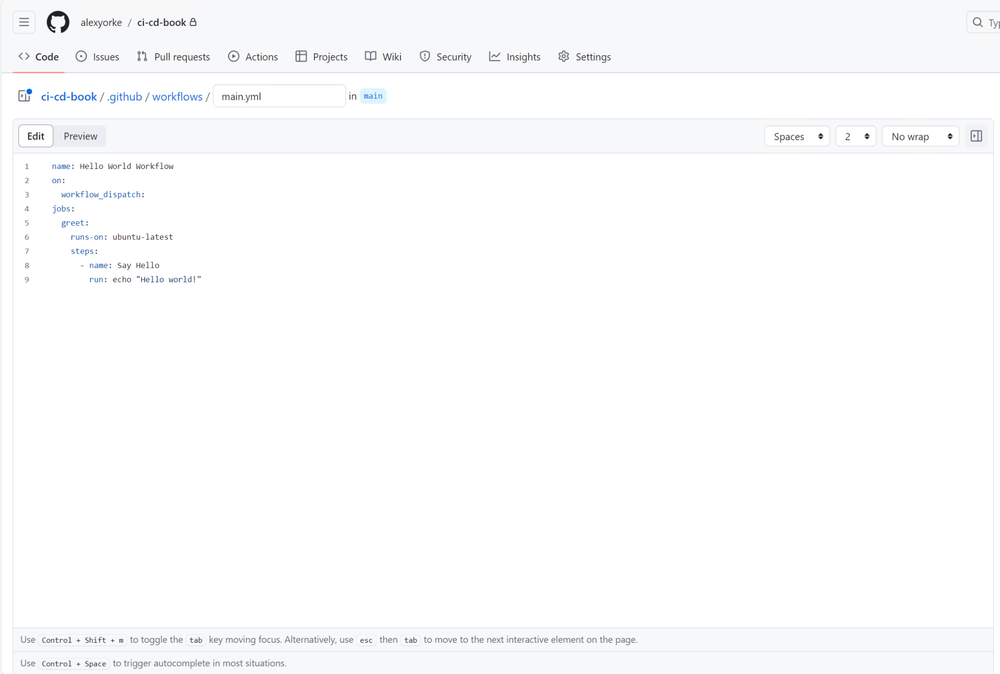
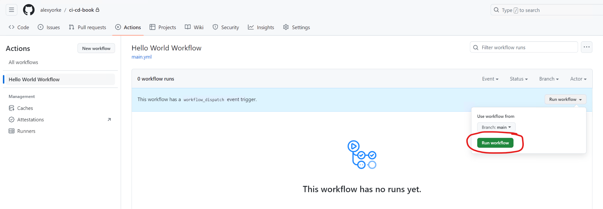
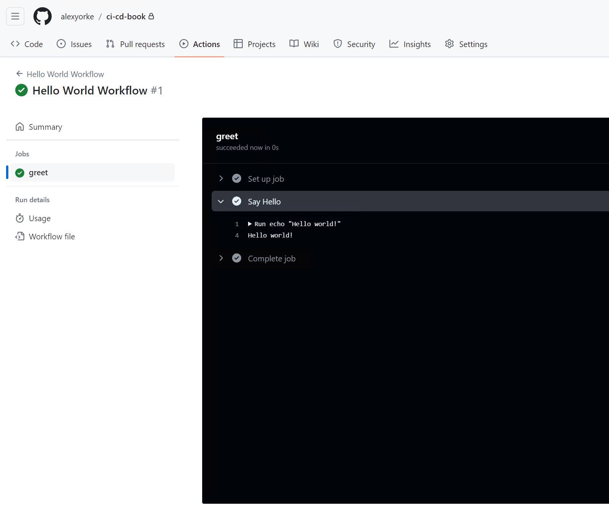
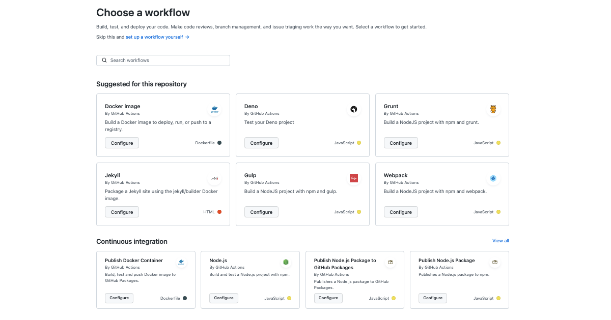
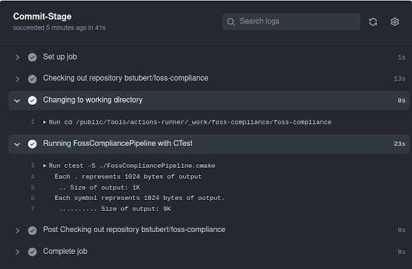

## Getting started with GitHub Actions

Throughout this guide, we will explore the key features of GitHub Actions and how to effectively structure workflow files in YAML to maximize the benefits of CI/CD. We'll start by creating a somewhat simple weather application, but make it more complex over time. This is designed to simulate a real world application.

GitHub is a company that has a product called "Actions" (sometimes referred to as "GitHub Actions") that is a set of build servers and software that runs GitHub Actions workflows. These YAML workflows are created by the developer and normally build, test, and lint the code using the GitHub Actions YAML syntax and run on the GitHub Actions build servers.

GitHub is a company, thus, it is not possible to install GitHub--it is not an application. Git is the version control system that can be installed.

If you need more information on the specific intricacies of GitHub Actions, please see the GitHub Actions documentation. [GitHub Actions documentation - GitHub Docs](https://docs.github.com/en/actions)

Let's build a pipeline that can do the following:

- Checkout the code (i.e., clone it onto the runner.)

- Build the code.

- Run automated tests, and linting.

- Publish artifacts to an artifact server, in this case, to GitHub, along with a versioning strategy that will help identify which artifacts you are publishing.

- Deployed the website to Azure.

# Workflow Structure

Here's an overview of how GitHub workflows are structured:

- 1\. **Events**: Workflows begin with events, such as pushes or pull requests, which trigger the workflow.

- 2\. **Jobs**: Workflows may contain multiple jobs, but we will focus on a single job for simplicity. Each job specifies an environment to run in, indicated by a string that corresponds to an operating system and a pre-configured image. This image includes pre-installed software, allowing us to get started quickly and reduce setup times and costs.

- 3\. **Steps**: Each job is composed of multiple steps. These steps can use either the `uses` or `run` command:

- \- **Uses**: This command utilizes actions provided by GitHub Actions, sourced from the GitHub Marketplace. These actions are pre-configured scripts that handle tasks like software installation, version management, or building.

- \- **Run**: This command executes shell commands specific to the operating system defined in the job's environment, using bash scripting for Linux, for example.

- 4\. **Artifacts**: Typically, workflows end with steps for uploading artifacts, though the initial steps may also involve downloading or preparing artifacts.

Below is an overview of a typical workflow structure:

Workflow
│
├── Events (e.g., push, pull_request)
│
├── Jobs
│ ├── Runs-on (Runner)
│ ├── Needs (Dependencies on other jobs)
│ ├── Steps
│ │ ├── Uses (Actions)
│ │ │ ├── Inputs
│ │ │ ├── Outputs
│ │ │ └── Environment (e.g., secrets, env variables)
│ │ └── Run (Shell commands)
│ ├── Environment Variables
│ ├── Secrets
│ ├── Services (Service Containers)
│ └── Artifacts
│ ├── Upload Artifact
│ └── Download Artifact
│
└── Workflow Commands (e.g., set-output, set-env)

If you want to get started right away, GitHub Actions has several templates for many different project types. Use a template to get started quickly.

#### Setting up error notifications

When your workflow fails, it means that continuous integration is no longer possible. Implement error notifications to alert your team when the build pipeline fails—especially for production workflows. Consider these notification methods:

- **Email Notifications:** Configure GitHub Actions to send emails upon failure.
- **Messaging Platform Integrations:** Integrate with platforms like Microsoft Teams, Slack, or Discord to receive instant alerts (including texts or phone calls).

Ensure your GitHub email settings are correctly configured to receive these notifications.
GitHub Actions is a CI/CD platform that automates software development tasks within GitHub repositories. It uses "workflow files," which are YAML-based instructions that define the steps of a CI/CD pipeline, similar to a project manager for your build scripts.

These workflows are triggered by specific events in your repository, like pushing code or creating a pull request. When triggered, they run on virtual build servers provided by GitHub, executing tasks such as building, testing, and deploying your application. These servers are ephemeral -- they're created for each workflow run and deleted afterward, ensuring a clean and consistent environment.

Workflows are organized into "jobs," each containing multiple "steps." Each step represents a discrete action, like running a script or using a pre-built action from the GitHub Marketplace.

Benefits of this structured approach:

- Clarity and Organization: Named steps improve readability and make it easier to track progress, debug issues, and set up notifications.

- Security and Isolation: Steps run in isolated environments, protecting sensitive information like secrets and environment variables.

- Efficiency and Automation: GitHub Actions provides features for parallelization, triggering, resource management, and secret management, simplifying complex tasks.

- Standardization and Collaboration: The workflow syntax promotes consistency across projects and teams, facilitating collaboration and knowledge sharing.

> 

[5 Things to Know About Pipe Scaffolding (supremepipe.com)](https://supremepipe.com/blog/pipe-scaffolding/)

CI server | macOS/Linux | Windows
-------------------------------------------------------------------------------------------------------- | ------------------------------------------------------------------ | --------------------------------------------------
name: CI | #!/bin/bash | @echo off
on: | echo "Starting CI process" | echo Starting CI process
push: | # Assuming Git and Node.js are already installed | REM Assuming Git and Node.js are already installed
jobs: | git clone <repository_url> | git clone <repository_url>
setup_and_test: | cd <repository_directory> | cd <repository_directory>
runs-on: ubuntu-latest | # Note: this depends on the NPM version installed on your computer | npm install
steps: | npm install | npm test
- name: Checkout code | npm test |
uses: actions/checkout@v2 | |
- name: Install dependencies | |
run: npm install # we will get into later as to why we shouldn't be running npm install, instead, npm ci | |
- name: Run tests | |
run: npm test | |

> In this example, we demonstrate how you can execute commands on your local computer to simulate what a build server does. You can effectively use your own laptop as a server, albeit with caveats mentioned earlier. As an exercise, consider installing the GitHub Actions agent on your computer. Then, set up a self-hosted runner and execute the build script on it. This process will allow you to recreate or emulate the actions performed by a build server, right from your local environment. See the appendix for more info.

## Aside

The script `echo hello world` is a Bash script. Note that while Bash is commonly used, some scripts might be written for `sh`, which has slight syntax differences. For Windows runners, remember that these execute PowerShell scripts—not Bash scripts. This guide does not cover PowerShell in detail, but if you are new to Bash, consider reading a beginner’s guide. Given Bash’s long-standing usage, it’s likely to remain relevant for some time.

The feedback loop for workflow changes can be slow—you typically need to edit, commit, and run the workflow on GitHub Actions to see the results. To streamline this process, consider these strategies:

1. **Simplify Workflow Steps:** 
 Ensure that workflow steps are simple enough to run locally. This improves speed and manageability. Use provider-agnostic scripts (e.g., PowerShell or Bash).

2. **Use Docker Containers:** 
 Create and use a Docker container that closely mirrors the GitHub Actions environment. This lets you test workflows locally in a similar setting.

3. **Utilize the `act` Library:** 
 The [`act`](https://github.com/nektos/act) library lets you run GitHub Actions locally. While it may not perfectly replicate the GitHub Actions environment, it works well for simpler scripts. See the appendix for more details.

## Aside end

Workflow files must be stored in the `.github/workflows` directory of your repository. This YAML file dictates the sequence of operations executed by GitHub Actions during the CI/CD process.

In order to run a workflow, you need a GitHub account and potentially a GitHub Enterprise organization. To create a new GitHub Enterprise repository, you first need to set up an account on GitHub and potentially get access to GitHub Enterprise, depending on your organization's setup. Here's how you can do it step-by-step:

### 1. Sign Up for GitHub

- Go to \[GitHub\](https://github.com/).

- Click on the "Sign up" button at the top right corner of the page.

- Fill in your details, including a username, email address, and password.

- Verify your account by following the email verification link sent to your email.

### 2. Join or Set Up GitHub Enterprise

- **If your organization already has GitHub Enterprise**: You will need an invitation to join from your organization's GitHub Enterprise admin. Once invited, you can log in using the credentials or SSO (Single Sign-On) method prescribed by your organization.

- **If you are setting up a new GitHub Enterprise**: You can start a trial or purchase it by visiting the \[GitHub Enterprise page\](https://github.com/enterprise). Setting up GitHub Enterprise usually requires more extensive IT involvement to handle the installation on cloud or on-premises infrastructure.

### 3. Create a New Repository

Once you have access to GitHub (and GitHub Enterprise if using):

- Click on your profile photo in the upper right corner, then click **Your repositories**.

- Click the green **New** button, or if you are on your organization's GitHub Enterprise account, you may need to select the organization context first.

- Enter a repository name, description (optional), and decide if the repository will be public or private.

- Configure other settings like adding a README file, .gitignore, or a license according to your project needs.

- Click **Create repository**.

### 4. Clone the Repository

- After creating your repository, clone it to your local machine to start working on the project. You can do this by opening your command line or terminal and running:


```bash
git clone https://github.com/username/repository-name.git
```


Replace `username` and `repository-name` with your GitHub username and the new repository's name.

### 5. Start Pushing Code

- After cloning the repository, you can start pushing your code to the GitHub repository by using:


git add .

```bash
git commit -m "Initial commit"
```

```bash
git push -u origin main
```


An exercise, try putting in the workflow described earlier in the doc GitHub workflow and see if you can figure out how to run it. It should just display Hello World and it doesn't require any code to build.

### Workflow Triggers and Patterns

Workflow triggers are ways to automatically trigger your pipeline. When the workflow is triggered, it receives a set of inputs, for example the branch that it was triggered on as well as the date and time.

We'll be using a trigger to automatically trigger when we make a pull request. This means that the pull request will be blocked until the pipeline passes.

These pipelines can also be brought on different branches and triggers, for example, any pushes to the main branch. For example, if you're practicing continuous deployment, you may want to automatically deploy changes that are pushed to the main branch. Therefore, you can add a trigger that will automatically run the workflow if there's a commit push to the main branch.

```
on:

pull_request:

push:
```

Just keep listing the items if you want to listen to more events. Note that the "push" event also accepts many options to narrow it down. It also ends with a colon because you can narrow it down with more filters.

Triggers are not isolated; they're evaluated as a set of rules within the workflow file under the `on:` key, where multiple events like `pull_request` and `push` can be listed. This setup allows the workflow to execute under various conditions but can be refined to ensure efficiency and relevance. The workflow runs when at least one of those events are triggered.

Order doesn't matter. I could write it like this, it still works:

```
on:

push:

pull_request:
```

**Aside start**

It's important to configure workflow triggers to respond only to relevant events, helping to prevent unnecessary runs and reduce costs. For example, a trigger set for "pull_request" events can automate tasks like code integration and deployment specifically when changes are proposed to a main branch. To avoid redundant executions in environments with active development, you should define triggers carefully by specifying branches, tags, or paths.There's some more information in the appendix about common files that are typically ignored when changed to prevent excessive pipeline runs.

**Aside end**

### Setting Up Your First Workflow

To create a basic "Hello world!" workflow in GitHub Actions, start by creating a new file named `main.yml` in the `.github/workflows` directory in your previously created branch and add the following content:

```
name: Hello World Workflow

on:

workflow_dispatch:

jobs:

greet:

runs-on: ubuntu-latest

steps:

- name: Say Hello

run: echo "Hello world!"
```



This example introduces the `workflow_dispatch` trigger, which allows you to manually start the workflow. This feature is particularly useful for debugging purposes. The workflow is set to execute on `ubuntu-latest`, a Linux-based runner that utilizes the Bash shell---a standard configuration for many GitHub Actions workflows.

Here are some tips for the workflow:

- Steps in a workflow are used to organize similar scripts or commands, grouping them together for logical execution. Each step in the workflow is executed sequentially, one after the other. To enhance the auditability of the workflow and simplify the debugging process, it is beneficial to keep each step as concise as possible. This approach not only clarifies the structure of the workflow but also makes it easier to identify and resolve issues within specific steps.

- Tips for the YAML syntax:

 - Indent with two spaces.

 - Use : to indicate options for a key.

 - Quote values to ensure they are interpreted as strings.

 - Validation: Use a YAML linter or language server to avoid syntax errors.

 - For more information see the sample web page called Learn YAML in X minutes.

Now commit this file and then push those changes to your branch. You should see the following screenshot.

You should see "Hello World Workflow" in the sidebar on GitHub. Run it and check the output.



After you've run it, then you should see the output.



---

### Workflow Name

Workflow Name | Description
-------------------- | ------------------------------------------------------------------------------------------------------------------------------------------------------------------------------------------------------------------------------------------------------------------------------------------------
Hello World Workflow | The workflow's name is "Hello World Workflow". You can find it because we set the **name** mapping to "Hello World Workflow". This name shows up in the sidebar of your repository. The **name** mapping specifies the name of the workflow. (If omitted, the workflow’s filename will be used.)

---

### Triggers

Trigger | Description
------------------ | ------------------------------------------------------------------------------------------------------------------------------------------------------------------------------------------
on: | The **on** mapping specifies the list of triggers when this workflow runs. "workflow_dispatch" indicates that this workflow is manually triggered, so you can use GitHub’s UI to start it.
workflow_dispatch: | (No additional details provided)

---

### Jobs

For now, everything goes in a single job called **all**.

Key | Description
------------------------ | -------------------------------------------------------------------------------------------------------------------------------------------------------------------------------------------------------------------------------------------------------------------------------------------------------------------------------------------------------------------------------------------------------------------------------------------------------------------------------------------------------------------------------------------------------------------------------------------------------------------------------------------------------------------------------------------------------
runs-on: "ubuntu-latest" | The **runs-on** attribute in your workflow file defines the container environment where your job executes. This choice determines the operating system and the pre-installed software available. You should choose an operating system that your developers are using when they test the application. For example, if the vast majority of developers use Windows, then you should use a Windows runner instead. Since GitHub Actions is designed to be cross-platform, maintaining consistency across different environments is important. If multiple team members use different operating systems, different build tools might be used—so it’s crucial that everyone uses the same operating system.

Popular options:

- **ubuntu-latest (Linux):** Supports bash and cross-platform scripts (e.g., Node.js).
- **Windows runners:** For Windows-specific builds and PowerShell/CMD scripts.
 Considerations:
- **Platform compatibility:** Choose a runner that supports your required tools and scripts.
- **Pre-installed software:** Review the available software to avoid unnecessary installation steps.
 For this guide, we'll use **ubuntu-latest** with bash scripts. |

---

### Steps

Step | Details
----------------------- | --------------------------------------------------------------------------------------------------------------------------------------------------------------------------------------------------------------------------------------------------------------------------------------
- name: "Checkout code" | **Step 1:** Uses `actions/checkout@v2` to check out the repository. This action handles repository authentication (useful for private repositories) and checks out the correct branch associated with the workflow trigger, setting the working directory to the repository’s content.
- name: Say Hello | **Step 2:** Runs the command `echo "Hello world!"` to display a greeting message.

---

Beyond the basic setup, templates in GitHub Actions offer a foundation for best practices and standards. This advantage is particularly significant for teams or individuals new to CI/CD or those transitioning to GitHub Actions from other systems. The templates can be easily customized and extended, allowing developers to adjust the workflows to fit their specific project needs while maintaining the integrity and efficiency of the initial setup.



#### Steps

In a GitHub Actions workflow, each task is organized into steps. These steps are detailed in the workflow file and can include various actions, such as running scripts or utilizing user-created actions available in the GitHub Marketplace.

Scripts within these steps can span multiple lines. The scripting language used depends on the operating system specified in the workflow's `runs-on` attribute. For instance, if you're using the `ubuntu-latest` runner, the default scripting language is Bash because it's based on Linux. However, you can use other scripting languages provided their interpreters are installed on the runner. Similarly, for runners using Windows, the default scripting language is CMD, though you can switch to PowerShell or others as needed.

#### What is "actions/checkout@v2"?

This is called an action, and can be written in many different programming languages, but usually TypeScript/JavaScript. Actions can do many things, such as installing software, changing configuration, downloading files, etc. This action automatically clones the branch associated with this pipeline. For more information on what this action does, visit its documentation page for options on how to configure it.

- Warning: actions can be authored by those other than GitHub. Be careful when referencing actions by their tag as this allows the developer to push any arbitrary code to that tag, which could cause security issues (i.e., they can run any arbitrary code in your repository.) Only use actions from those you trust.

- Be careful not to use too many actions (only when they are necessary), because they are difficult to run locally on your own computer because they use GitHub's Workflow Engine that, at the time of this writing, does not have the ability to be called from a desktop application. This means that it might be hard to run the action locally to see if it is correct and therefore developers will have a slow feedback loop.

- [GitHub - nektos/act: Run your GitHub Actions locally 🚀](https://github.com/nektos/act) works for most actions.

- To debug your CI/CD pipelines effectively, consider setting up a temporary self-hosted GitHub agent. This allows you to run builds and inspect the application and build server outputs in detail. You can also integrate "sleep" steps into your workflow to pause execution at key points for thorough examination of the process and file system.

#### What is a Pipeline?

A pipeline is like a project manager for your build scripts. It orchestrates and automates the steps needed to build, test, and deploy your software.

Key Functions:

- Workflow Orchestration: Runs build scripts in a defined order across different environments (e.g., Windows, Linux).

- Parallel Execution: Improves efficiency by running tasks concurrently when possible.

- Status Monitoring: Provides insights into build progress, individual steps, and error troubleshooting.

- Build Server Management: Selects appropriate build servers for specific tasks.

Benefits of Pipelines:

- Increased Efficiency: Automates and streamlines the build process.

- Improved Reliability: Ensures consistent builds across environments.

- Enhanced Visibility: Provides clear insights into build status and errors.

- Faster Feedback Loop: Enables developers to quickly identify and fix issues.

Pipeline Runs:

- Each execution of a workflow is called a pipeline run.

- Provides insights into pipeline status and allows for cancellation if needed.

- Can be configured to send notifications to developers on failures or other events.

Pipeline Status:

- Green Pipeline: Indicates a successful build. However, ensure your build script is meaningful and actually verifies code quality.

- Red Pipeline: Signals a build failure. Investigate and fix the issue to unblock software delivery.

- Remember: A pipeline is only as good as the build scripts it runs. Ensure your scripts perform relevant tasks and tests to guarantee code quality.



[A Basic Continuous Integration Pipeline with GitHub Actions -- Burkhard Stubert (embeddeduse.com)](https://embeddeduse.com/2022/06/06/a-basic-continuous-integration-pipeline-with-github-actions/)

[Github Actions or Jenkins? Making the Right Choice for You \| by Viduni Wickramarachchi \| Bits and Pieces (bitsrc.io)](https://blog.bitsrc.io/github-actions-or-jenkins-making-the-right-choice-for-you-9ac774684c8)

#### What is a build server?

A build server is a dedicated machine or cluster that automates the software build process, ensuring consistency and generating build artifacts for production. Triggered by events like code changes or pull requests, it clones the code, executes build scripts in an ephemeral environment, and provides a single point of truth for build results.

Build servers offer several advantages over local builds:

- Consistency: Eliminates discrepancies between developer environments.

- Reliability: Provides a stable and controlled build environment.

- Centralization: Acts as a central point of reference for build status.

- Build servers are typically disposable and replaceable, existing in pools, and can be hosted in the cloud or on-premise. They remain idle until triggered by a CI/CD system.

#### Helpful tips and best practices

- You might find it helpful to use an IDE Plugin, such as Github Workflows plugin in the IntelliJ IDEA IDE to author the workflow files. This is because the syntax can be fussy.

- Try to keep it to one command per step. It helps make the flow a bit more logical. Why can't I put everything in a single step? In theory, you could, but this would make it very difficult to know which step failed--you'd have to open up the step and check the logs. Notifications to stakeholders commonly include the failed step, so this is a useful debugging tool and helps you segment the logs for faster debugging. They're also needed for matrix builds, but we'll get to that later.

- Space out your steps by an empty line

- If the script starts getting long (i.e., more than a few lines), consider making it a separate script file, and then calling it in the runner.

- It's important to use the OS that you're developing on, because you have to be able to run those build scripts locally. So, if you have bash scripts on your CI server but can't run them locally (for whatever reason), then this means that the environments can't really be reproducible, because you have to ensure parity between the scripts on your computer and the CI. There are pros and cons though, as macOS cannot run cmd scripts for example.

- Remember that the dash means a new step. For example, the name key is prefixed with dash and this represents a new step.

- **It's good to give steps names, otherwise they might not be clear what they're doing. Names are optional, however.**

- It's very important that you keep this workflow formatted. Therefore, tools like yamllint are very useful. Poor indenting can make it super, super difficult to know what's wrong.

- If you're really stuck, look at a reference workflow file (that is properly formatted) to get your bearings.

- Normally, you'd want to set the runs-on to your development environment, assuming that that is the same environment where you are deploying to. If you need to run on multiple environments, you can use matrix builds (an advanced topic.)

#### Build notifications

Webhooks are a mechanism for one system to notify another system of events or updates in real-time. In the context of continuous integration (CI), webhooks are essential for facilitating automation and communication between various tools and services in the CI/CD pipeline. For example, if a build fails, then a webhook can be called, which can "send" a message to another service, such as Teams, Slack, and many others.

Webhooks are widely supported among many different integration providers.

- Build notifications are important because stakeholders must know if the build pipeline is failing, as it is the only route to deliver changes to production.

- Consider the audience for your build notifications. Normally, fixing a broken build is a shared team effort, so create a DL (Distribution List or a Distribution Group) or group with relevant team members. Avoid including individuals like the CEO.

- Set up immediate email/Slack notifications for pipeline failures through your CI/CD's integrations or webhooks.

- Note that not all pipelines require build notifications. Only those blocking the path to production, such as main branch pipelines, need them.

- Configure notifications to alert stakeholders impacted by broken builds using suitable channels like Teams, text messages, or emails, triggered only during failures.

### Security

- Continuous Integration and Continuous Delivery (CI/CD) aim to streamline the development process by swiftly moving changes from a developer's environment to production. However, this rapid process can inadvertently introduce security risks, allowing malicious code to infiltrate production should an attacker gain access to a compromised account. This means that an attacker can easily push code to production--a two-edged sword. Therefore, having a good review system in place, along with 2FA (two factor authentication, requires that employees use their phone or other device to log in), dual-approval (two employees must approve of the changes before they go into production), dependency scanning, security scanning on code via SAST (static analysis), secret management, branch protection to limit who can and can't push to master, and YubiKeys can potentially limit or negate the damage done by attackers. Make sure to use proper identity management techniques by your provider, and don't share accounts.

- While CI/CD pipelines often run in isolated containers or virtual machines, this isolation isn't a bulletproof shield. Isolation prevents interference with other systems on the host, but it doesn't safeguard the contents within or shield them from potential internet threats. If, for instance, the CI/CD pipeline fetches a malicious resource, such as a malicious package, it could contaminate the build artifacts, propagating to customers, the production environment, or other artifacts.

- Moreover, CI/CD pipelines often possess secrets, usually in the form of environment variables or temporary files. If malicious scripts exploit these, they can access external resources by exporting the token, potentially racking up costs or jeopardizing sensitive data.

- Notably, hardcoding application credentials is risky. Even if they speed up prototyping, these hard coded secrets can be exposed, especially in open-source scenarios, leading to unauthorized access and potential misuse. And while storing API keys in a secure location might seem like a solution, at some point, these keys exist in plaintext, making them vulnerable.

- CI/CD is aimed at making it super easy to deploy to production, but not everyone should be deploying to production, mainly hackers. The answer isn't just about the choice between long-lived SSH keys or temporary tokens, as highlighted in the provided StackOverflow post. It's about a holistic approach to CI/CD security. Tools like YubiKeys provide an extra layer of security, but they aren't silver bullets. Physical devices, while helpful, can be lost or stolen. Thus, backup authentication methods and proactive monitoring are essential.

- Moreover, SMS-based two-factor authentication (2FA) isn't entirely secure due to risks of SIM swapping and SMS interception. In this realm, requiring multiple engineers to approve critical actions, leveraging platforms like Azure PIM, Google Cloud Identity, or AWS SSO, can add another layer of safety.

- When it comes to codebase and artifact access, only authorized individuals should have the rights. Furthermore, continuously monitoring the server side to ensure no unusual requests are made is pivotal. Secrets, API keys, or any form of authentication should be kept out of the codebase. Instead, leverage tools like KeyVault to store and access these secrets securely. Also, periodically run static security analysis tools to detect and rectify any exposed secrets in the codebase.

- Shifting left on security implies embedding security considerations from the start of the development process, rather than retrofitting them later. It's about ensuring that security is integrated from the onset and that reactive measures are minimized. After all, in the dynamic landscape of CI/CD, prevention is always better than cure.

#### Popular security static analysis tools

Open-Source Tools

- FindBugs with FindSecBugs Plugin: A static code analysis tool for Java that can identify security vulnerabilities with the FindSecBugs plugin.
- Checkmarx: Although primarily a commercial tool, Checkmarx does offer a limited free version that performs static code analysis for multiple languages.
- Bandit: Focuses on Python codebase and is designed to find common security issues.
- Brakeman: A static analysis tool for Ruby on Rails applications.
- SonarQube: Offers various language plugins and detects many types of vulnerabilities. The Community Edition is free.
- ESLint with Security Plugin: A widely-used linting tool for JavaScript that can also be used for security checks with the right set of plugins.
- Flawfinder: Scans C and C++.
- Cppcheck: Another static analysis tool for C/C++ codebases.
- YASCA (Yet Another Source Code Analyzer): Supports multiple languages including Java, C/C++, and HTML, but focuses primarily on web vulnerabilities.

Commercial Tools

- Checkmarx: A leading SAST tool that supports multiple programming languages and is designed for enterprise use.
- Veracode: Offers a static analysis service as part of a larger application security suite.
- Fortify Static Code Analyzer: Provided by Micro Focus, it covers multiple languages and offers integration with IDEs and CI/CD tools.
- IBM AppScan: Focuses on identifying vulnerabilities in web and mobile applications, supporting multiple programming languages.
- Kiuwan: Offers a broad range of language support and integrates with various IDEs and CI/CD tools.
- Synopsys Coverity: Supports multiple languages and offers CI/CD integration.

#### Integrating with External Services and Tools

Sometimes, your build pipeline might need to connect to other services because it doesn't have all of the information it needs inside of the repository. This is because there are external APIs, artifact repositories, secret managers, etc. that can't be part of the repository.

Why would you want to connect to external services, isn't everything I need in my repository? There are some things that can't be in your repository, because they are integrations, APIs, or managers that don't have a "physical" presence.

#### Security Reasons

Sensitive information, like API keys, database credentials, and other secrets, should never be stored directly in your repository. It's a security risk. Instead, these secrets are typically stored in specialized tools called secret managers (like HashiCorp's Vault, AWS Secrets Manager, or Azure Key Vault). When your pipeline needs to access a database or an external API, it will first fetch the necessary credentials from these managers. This ensures that sensitive information remains secure and doesn't accidentally get exposed or leaked.

#### Artifact Management

In many CI/CD pipelines, especially in large and complex projects, compiled code or built artifacts need to be stored or fetched. These artifacts are stored in artifact repositories like JFrog Artifactory or Nexus Repository. Connecting to these repositories can help fetch dependencies or store new ones post-build.

#### Integration and End-to-End Testing

Modern applications often rely on a myriad of microservices. When testing, it's crucial to ensure that these services work well together. For this, your pipeline might need to connect to service stubs, mocks, or even real services in a staging environment to perform integration or end-to-end tests.

Setup would depend on your CI software. You may need to connect a service to it.

After that, the secrets are normally available via environment variables in your pipeline. Typically, connecting to a service will pass along the inherited identity from the pipeline to the service, thereby authenticating you to it. Sometimes, you will need to manage these secrets manually.

#### Exercises

Set up a very simple pipeline. This pipeline should initially not be attached to PRs but instead run after a commit is merged. This is because there might be many mistakes while you set up the pipeline, and it might add an unnecessary blocker to those trying to merge. The pipeline should be as simple as possible and should just build the code and then run the simple test suite. Don't worry about publishing build artifacts, it should only build the code and return a status regarding if the build succeeded or failed. Make sure that the test suite runs and confirm in the logs that the test name and status show up correctly so as to diagnose any failing tests. Try to use a build template to build your application, and make sure that the template reflects the build script as closely as possible.

Set up the continuous integration server (or build server) to compile and run the code. Using the information derived from the planning stage, set up the build server to compile and build the code as a baseline. Developers will perform changes on the codebase, and should have sufficient tooling on their workstation to test the changes. This tooling should match what is run on the continuous integration system. It is important that developers have a stable copy on their workstation so that they can perform changes to the code because otherwise it would be overwritten by other developers' work. It is important that the tooling on the developer's machines matches the tooling on the build server because the build server's artifacts will be what is deployed. There should be sufficient tooling on the continuous integration system to make sure that there is a reasonable level of confidence that the changes are good. Choose activities that are prime for automation and are difficult for humans to do, such as compiling code, checking (tests), etc.

Continuously review and refine: Continuously review and refine the documented process. Encourage feedback from the team for improvements.
