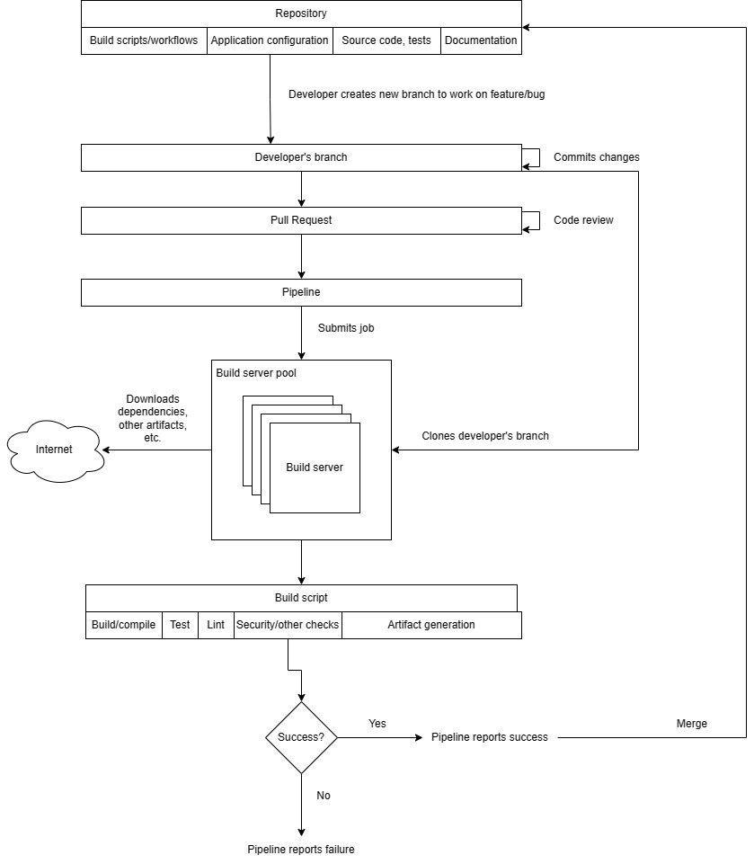
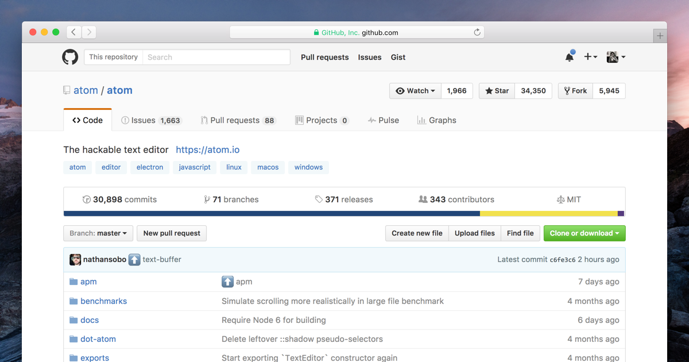
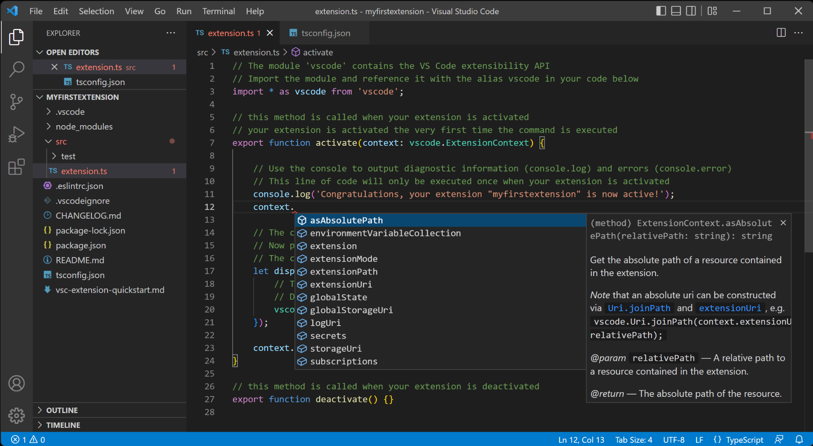
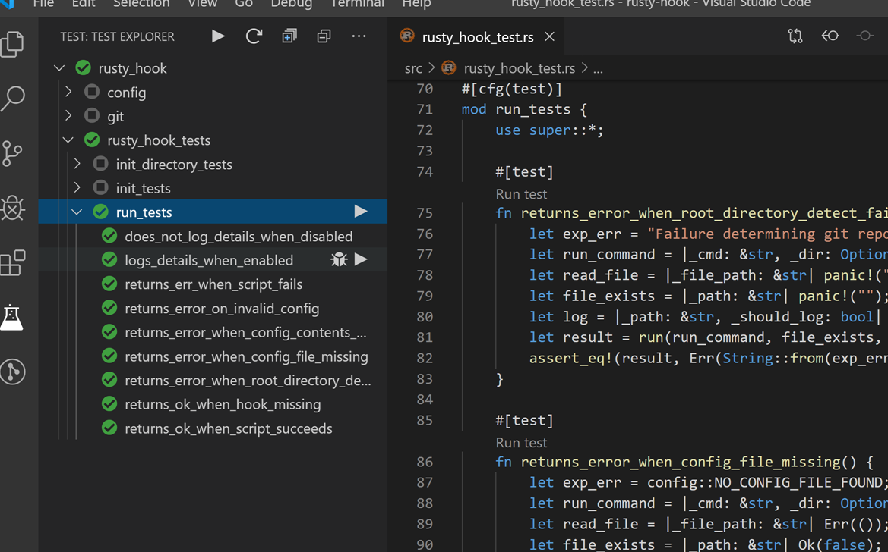
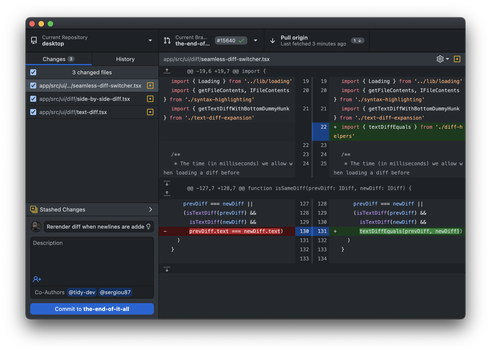
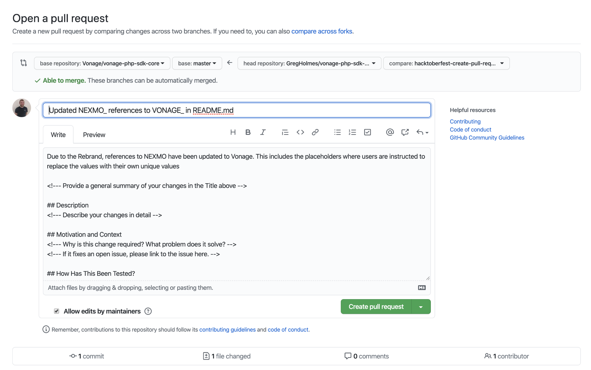

## Getting started with the workflow {#getting-started-with-the-workflow .unnumbered}

In order to have a good understanding of how CI/CD works, it's important to have a good idea of how everything fits in together. Here's the overall process, at a very high level view, from working on a feature to getting it out into production.

| **Development Stage**    | **Sub-Stage**                | **Description**                                                                                       |
| ------------------------ | ---------------------------- | ----------------------------------------------------------------------------------------------------- |
| Planning & Design        | Define Work Item             | Identify and document features, tasks, or bugs to be addressed. Example                               |
|                          | Prioritization & Scheduling  | Decide on the priority of the work item and when it will be addressed. Example                        |
| Development              | Code Implementation          | Writing the actual code and implementing features or bug fixes. Example                               |
|                          | Local Testing & Verification | Run unit tests and perform manual testing to verify code behavior on a local dev environment. Example |
| Code Submission          | Create Pull Request (PR)     | Submit the code for review. Example                                                                   |
|                          | PR Awaiting Review           | Time period the code waits to be reviewed. Example                                                    |
| Code Review              | Peer Code Review             | Team members review the code for quality, functionality, and style. Example                           |
|                          | Feedback Incorporation       | Apply changes based on code review feedback. Example                                                  |
| Build & Integration (CI) | Build Initialization         | Setup for build environment and dependencies. Example                                                 |
|                          | Core Build Process           | Compilation, linking, and creation of executable files. Example                                       |
|                          | Security & Compliance Scan   | Scan for security vulnerabilities and compliance issues. Example                                      |
| Automated Testing (CI)   | Test Initialization          | Setup for testing in an isolated environment. Example                                                 |
|                          | Execute Automated Tests      | Run automated test suites. Example                                                                    |
| Deployment (CD)          | Canary Deployment            | Deploy to a subset for monitoring and testing. Example                                                |
| (Coming up next)         | Monitor & Validate           | Monitor and validate new features. Example                                                            |
|                          | Full Production Deployment   | Roll out to the entire production environment. Example                                                |

Developers create short-lived branches for their work:

- This isolates their changes from the main codebase (\"trunk\") and allows collaboration with other developers.Short lived in this context refers to just the minimal amount of time needed to work on that particular task and no more.This means that the tasks have to be broken down sufficiently as well as broken down in such a way where the tasks are easy to complete and don\'t interfere necessarily with other commits. They\'re also testable as well, capable of showing that they can have the capacity to be integrated. You can look at the appendix For more information on how to break down tasks into such a way that makes them.To show that they\'ve been integrated successfully.

- Branches can be created locally or through GitHub\'s UI.

Pull requests (PRs) are used to merge code into the trunk:

- Developers create PRs when they\'re ready to integrate their changes.They create the PR from their branch.

- This triggers a pipeline that builds, tests, and runs the code to ensure quality.The pipeline and its trigger must be set up by developers beforehand. By default it does not do this.

- PRs require review and approval before being merged.Normally to approvers are required, but it depends on your team.At least one approver should approve.

Merging PRs updates the trunk:

- This makes the changes available to all developers.

- Developers need to pull the latest changes into their branches to stay up-to-date.This is not a requirement as when you create the PR it will automatically merge their branch into the trunk when building.However, it\'s recommended that developers pull their latest changes to keep up to date because the merge might be different than what they tested locally, potentially introducing the possibility of bugs.

Branch Management:

- Short-lived branches are typically deleted after merging.

- Long-lived branches are useful for experiments and large refactorings, such as migrating frameworks (e.g., Spring to Hibernate). However, these situations are infrequent. Most development (90-95%) utilizes short-lived branches to ensure continuous integration, cohesion, and comprehensive testing.

- Descriptive branch names, including developer IDs (e.g., \"username/feature-name\"), improve organization and maintenance. This convention aids in automatic categorization within popular CI/CD platforms like Azure DevOps, grouping branches into logical directories.

Build Server:

- The build server clones the developer\'s branch associated with the PR and builds the code.In this case the build server is provided to you by GitHub Actions, but you can also use a self hosted runner yourself.

- This ensures that the changes are compatible with the existing codebase.It\'s important to write good tests as well as making sure that the bell script is up to date to make sure that the pipeline sufficiently instills confidence in your changes. The build pipeline is only as useful as the effort and criteria that you put into it. It is not magical.

#### What is a repository? {#what-is-a-repository .unnumbered}

- A repository is a way to store a collection of files that are used in the build process, and should include all files that allow the application to be built, including configuration files, database migrations, tests, etc. Developers work off of a branch, which is a snapshot of the repository. Each repository is usually a deployable unit, and normally should not include other projects unless they are part of the same application or must be deployed together. It is managed with a VCS (e.g., Git.)

- However, it should not include environment-specific files, secrets (such as passwords), API keys, or files specific to a single developer's environment because these are typically injected at runtime, and should not be part of the application, as they could be erroneously leaked to production.Normally injected at runtime. Do not inject it in your continuous integration and development server.

- Also, if a single developer's settings are in the repository, it's not much use for the other developers and could cause confusion.

> {width="6.103274278215223in" height="3.202237532808399in"}

### Typical development scenario using VCS {#typical-development-scenario-using-vcs .unnumbered}

A developer works on code using their IDE, on their development branch, from their repository as shown in this screenshot. **This is the code repository as discussed earlier.** VS Code is a free IDE that is open source.

> {width="6.130208880139983in" height="3.370417760279965in"}

[[TypeScript Programming with Visual Studio Code]{.underline}](https://code.visualstudio.com/docs/languages/typescript)

While git can be easily used on the command line, sometimes developers prefer a GUI-based approach. This can be especially helpful for those who are new to git. Some applications can help with this, such as "GitHub Desktop".

While the developer is coding, they normally run **unit tests or integration tests in their local environment, which is part of having a fast feedback loop**. These tests exist as part of the repository. This provides them confidence for their changes. If they find a broken or failing test, then they would fix it on their development workstation before proceeding, because otherwise the pipeline would fail and they wouldn't be able to merge their code. Developers are responsible for writing and maintaining tests.

> {width="6.078125546806649in" height="3.7851793525809274in"}

[[Rust Test Explorer - Visual Studio Marketplace]{.underline}](https://marketplace.visualstudio.com/items?itemName=swellaby.vscode-rust-test-adapter)

For instance, consider a repository opened in GitHub Desktop. It\'s a tool to visualize and interact with a Git repository, showing individual changes and their details. While this isn\'t a tutorial on Git, it\'s worth noting that any VCS with the capability to track and manage changes suffices; it doesn\'t have to be Git. The choice depends on your team\'s preferences and needs. Here is a screenshot of GitHub Desktop:

> {width="5.544329615048119in" height="3.993108048993876in"}

[[https://github.com/desktop/desktop]{.underline}](https://github.com/desktop/desktop) Some other GitHub Desktop-like tools are SourceTree, GitKraken, Tower, and TortoiseGit.

---

**SourceTree** – Free for Windows and Mac.

- Offers a visual representation of branches and commits.
- Integrated with Bitbucket and GitHub.
- Can be slow and occasionally buggy.
- Somewhat steeper learning curve for beginners.

---

**GitKraken** – Intuitive UI, great for beginners.

- Cross-platform (Windows, Mac, Linux).
- Supports GitFlow.
- Free version has limitations; Pro version is paid.
- Some users report performance issues.

**Tower** – Clean UI and efficient performance.

- Offers advanced features like single-line staging.
- Good integration with multiple services.
- No Linux version.
- More expensive compared to other tools.

**TortoiseGit** – Integrates directly into Windows Explorer.

- Free and open source.
- Mature and well-maintained.
- Windows only.
- UI might not be as modern or intuitive as other tools.
- Requires separate Git installation.

---

After developers are done, they then create a PR. This shows the developer's changes and allows other developers to comment on them (i.e., code review.)

#### What is a pull request? {#what-is-a-pull-request .unnumbered}

A pull request (or a change request) is a request from a developer to merge changes from their branch into the repository. For example, when a developer is ready to integrate their changes, they would create a pull request. The pull request allows others to comment on the developer's changes and also triggers the build pipeline to validate their changes. Since a developer needs to create a pull request before merging, this means that the confidence-instilling checks can run.

After the pull request is merged, then the changes become part of the "main" branch in the repository. This means that they can be deployed, or other developers can integrate on top of their work.

Here are some key characteristics of a good pull request:

- **Clear Title: The title should be concise and describe the changes at a high level. Someone should be able to get an idea of what the PR is about just by reading the title.**

- **Descriptive Description: A PR description should provide context. It should answer:**

- **- What changes are being made?**

- **- Why are these changes necessary?**

- **- How have these changes been tested?**

- **- Are there any related issues or PRs?**

- **Small and Focused: Ideally, a PR should be small and address a single issue or feature. This makes it easier to review and understand. Large PRs can be daunting for reviewers.**

- **Includes Tests: If the project has a testing framework, the PR should include tests that cover the new functionality or bug fixes. This ensures that the changes work as expected and prevents regressions.**

- Follows Code Style and Conventions: The PR should adhere to the project\'s coding standards and conventions to maintain consistency.

- Updated Documentation: If the changes introduce new features or modify existing ones, the PR should also update related documentation.

- Comments on Complex or Ambiguous Code: If the changes involve complex logic or hacks to address specific edge cases, they should be accompanied by comments explaining the rationale.

- **Includes Relevant Assets: If the PR has UI changes, including screenshots, gifs, or videos can be very helpful for reviewers.**

- Has Been Self-reviewed: Before submitting, the author should review their own PR. This can catch many small issues like typos, console logs, or forgotten debug statements.

- Passes Continuous Integration: If the project uses CI tools, the PR should pass all checks (like building without errors, passing tests, lint checks, etc.)

- Addresses Feedback: After receiving feedback, the PR author should make the necessary changes and might need to clarify if something isn\'t clear. A good PR evolves through collaboration.

- Links to Issue: If the PR addresses an open issue, it should link to or mention that issue. This provides context and allows for tracking the resolution of bugs or features.

> {width="6.607607174103237in" height="4.142659667541557in"}

[[How To Create a Pull Request With GitHub Desktop (vonage.com)]{.underline}](https://developer.vonage.com/en/blog/how-to-create-a-pull-request-with-github-desktop)

#### Testing and automated testing in the pipeline {#testing-and-automated-testing-in-the-pipeline .unnumbered}

Software testing is crucial for ensuring that applications meet quality standards, function correctly, and deliver a positive user experience. It\'s a vital part of CI/CD because it helps developers catch bugs early and build confidence in their code changes. When the build pipeline runs, it runs your automated tests. If the automated tests fail, then therefore the build pipeline will fail as well. This is important, because this tells the developer that their changes cannot be merged (i.e., integrated and available to other developers) because something is wrong.

There are two main categories of testing:

- Automated Testing (\"Checking\"): These tests are predefined and can be run by computers. They are essential for verifying functionality and performance.

- Manual Testing: This involves human judgment and focuses on aspects like usability, aesthetics, and user experience that are difficult to automate.

Checking is like a demonstration. Imagine a chemistry teacher in front of an eager class. The teacher says, "Watch this!" and mixes two chemicals together. Then, everything changes color and makes a pop. The teacher already knew what was going to happen, and in this case demonstrated that fact in front of a class: the chemicals were going to change color, and make a pop. Or, say someone enters in 1+1 in the calculator. There is an expectation that it will always be "2".

Now, contrast this with the other side of testing: tacit knowledge. You have to write a set of rules to determine if a website is designed well. It's not very easy to write a set of rules, or instructions for someone to determine that. But, it is easy to figure out using our human brains: we try to use the website, and if we are having issues, then we know that it's not usable. But we can't create a document that describes every possible facet in great detail for every possible situation of what usable means. It's highly subjective and complex.

Types of Testing:

- Unit Testing: Verifies individual components of code.

- Integration Testing: Checks how different units of code work together.

- Functional Testing: Tests the application against business requirements.

- System Testing: Examines the fully integrated software product.

- End-to-End Testing: Simulates real-user scenarios.

- Acceptance Testing: Determines if the software is ready for release.

- Performance Testing: Assesses speed, response time, and stability.

- Stress Testing: Evaluates how the system performs under extreme conditions.

- Security Testing: Identifies vulnerabilities.

- Usability Testing: Evaluates user-friendliness.

- Regression Testing: Ensures new changes don\'t break existing functionality.

- Smoke Testing: Identifies major failures early on.

- Exploratory Testing: Involves less structured exploration of the software.
