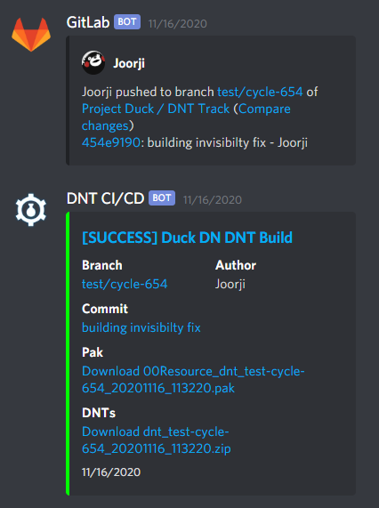

## How to prioritize things in your repo {#how-to-prioritize-things-in-your-repo .unnumbered}

Prioritization is key:

- Focus on high-impact tasks like fixing critical Dependabot alerts, updating the base image, and addressing performance bottlenecks in your pipeline.

- Delegate or automate low-priority tasks like removing inactive user accounts, linting, and code formatting.

Proactive maintenance:

- Subscribe to GitHub\'s Deprecation Archives and Changelog to stay ahead of breaking changes.

- Regularly review and consolidate workarounds in your scripts for efficiency.

- Maintain a stable, modular application with good code health and test coverage.

Dependency management:

- Understand the risks and benefits of upgrading transitive dependencies.

- Choose a strategy for updating dependencies (always latest or pinned versions).

- Consider using the latest packages for security fixes, balancing reproducibility.

Workflow optimization:

- Expect to revise your workflow as dependencies evolve.

- Use caching, branch/file ignores, and selective test disabling for efficiency.

- Analyze historical PR comments to identify recurring issues and proactively address them.

Remember: Automate what you can, delegate when possible, and always prioritize tasks for maximum impact.

Determining the \"top 5\" most useful patterns from the \"Busy Person Patterns\" can vary based on individual needs and contexts. However, commonly encountered scenarios in busy schedules might make the following patterns particularly valuable: warning this is creative commons licensed

Prioritize: This is fundamental for effective time management. By prioritizing tasks based on urgency and importance, you can ensure that the most critical tasks are addressed first, which is crucial in a busy schedule.

Just Start: Procrastination can be a significant barrier to productivity. This pattern encourages starting a task, even with incomplete information, which can be particularly useful in overcoming initial inertia and making progress.

Contiguous Time Blocks: In an era of constant interruptions, dedicating uninterrupted time to a task can significantly improve focus and efficiency, especially for complex or demanding tasks.

Delegate: This pattern is key in workload management, especially for those in leadership roles or working within teams. Delegating tasks effectively can help manage your workload and also empower others by entrusting them with responsibilities.

Batch the Simple Stuff: By grouping similar small tasks, you can handle them more efficiently, freeing up time for more significant tasks. This pattern is particularly useful for managing the multitude of minor tasks that can otherwise fragment your day.

### Secret management {#secret-management .unnumbered}

This guide provides strategies for storing, accessing, and managing secrets within your GitHub Actions workflows.

### **Storing Secrets in GitHub:** {#storing-secrets-in-github .unnumbered}

1.  **GitHub UI:**

    - Navigate to your repository\'s \"Settings\" -\> \"Secrets\" -\> \"Actions\".

    - Click \"New repository secret\".

    - Provide a name (using uppercase letters and underscores, e.g., DOCKER_USERNAME) and value for your secret.

    - Click \"Add secret\".

2.

3.  **Accessing Secrets in Workflows:**

    - Use the \${{ secrets.SECRET_NAME }} syntax within your workflow files.

4.

### **Challenges of GitHub-Stored Secrets:** {#challenges-of-github-stored-secrets .unnumbered}

- **Local Testing:** Using GitHub secrets directly in scripts hinders local testing because you can\'t easily swap out environment variables.

- **Key Rotation:** GitHub secrets don\'t have expiration dates, so you need to manually rotate keys like NPM tokens when they expire.

### **Strategies for Improved Secret Management:** {#strategies-for-improved-secret-management .unnumbered}

**1. Parameterization:**

- Pass secrets as command-line arguments or environment variables to your scripts. This allows flexibility for both CI and local execution.

**2. External Secret Management (e.g., Azure Key Vault):**

- Store secrets in a secure key vault service (like Azure Key Vault).

- Authenticate against the key vault within your workflow.

- Fetch secrets on demand using a service principal.

- **Advantages:**

  - No need for manual token rotation.

  - Short-lived access tokens enhance security.

  - Centralized auditing and management.

-

- **Consider:** Granular access control to prevent unnecessary exposure of secrets to all workflow steps.

**3. Service Principal Authentication:**

- Leverage service principals to authenticate directly to required services at the beginning of your script.

- Obtain short-lived access tokens for specific resources.

- **Advantages:**

  - Enhanced security through short-lived tokens.

  - Reduced management overhead.

  - Potential for using the GitHub repository\'s identity for increased security.

- **General Recommendations:**

- **Minimize Secret Scope:** Only expose secrets to the workflow steps that require them.

- **Principle of Least Privilege:** Grant minimal permissions to service principals.

- **Docker Registry Authentication:** Explore authenticating via environment variables or dedicated secrets for Docker registries instead of passing passwords via stdin.

- **Secret Rotation:** Establish a regular process for rotating secrets, whether managed in GitHub or an external vault.

By implementing these strategies, you can improve the security and manageability of secrets within your GitHub Actions workflows.

1\. **Correct usage of secrets**:

Most workflows have been updated to correctly use GitHub Secrets, which are encrypted environment variables created in a repository\'s settings. The correct syntax is `\${{ secrets.SECRET_NAME }}`. For example:

```yaml
- name: Deploy

run: surge ./build myproject.surge.sh \--token \${{ secrets.SURGE_TOKEN }}
```

In the above example, `SURGE_TOKEN` is a secret that\'s used to authenticate with the Surge.sh service for deploying applications.

2\. **Properly passing credentials for publication**:

Credentials for package repositories and external services need to be handled securely. `TWINE_USERNAME` and `TWINE_PASSWORD` for Twine, used to upload packages to PyPI, or `NPM_TOKEN` for npm, are set in the workflow file:

```yaml
- name: Publish package

run: twine upload dist/\*

env:

TWINE_USERNAME: \_\_token\_\_

TWINE_PASSWORD: \${{ secrets.PYPI_API_TOKEN }}
```

Here, the `PYPI_API_TOKEN` is used as a password to publish the package to PyPI securely.

3\. **Updating reference to GitHub token**:

The GitHub token is used to authenticate various actions requiring GitHub API access, such as pushing changes or creating releases. The correct passing of this token is crucial:

```yaml
- name: Create GitHub release

uses: actions/create-release@v1

env:

GITHUB_TOKEN: \${{ secrets.GITHUB_TOKEN }}
```

4\. **Correct reference to repository or branch names**:

Conditional steps based on the branch name or other git references are important to ensure that deployments and other actions only happen from the correct branches or tags.

```yaml
if: github.ref == \'refs/heads/master\' \|\| github.ref == \'refs/heads/staging\'
```

In this case, the deployment step is set to run only when commits are made to the `master` or `staging` branches.

5\. **Properly handling SSH and deploy keys**:

SSH keys are used to securely connect to remote servers and perform actions like deployments. Handling SSH keys correctly in workflows is crucial to security.

```yaml
- name: Deploy Project

uses: easingthemes/ssh-deploy@v2.1.5

env:

SSH_PRIVATE_KEY: \${{ secrets.DEPLOY_KEY }}
```

6\. **Fixing incorrect usage of `set-env`**:

With `set-env` being deprecated, the new format for setting environment variables is now `echo \"name=value\" \>\> \$GITHUB_ENV`.

```yaml
- run: echo \"AWS_BUCKET=mybucket\" \>\> \$GITHUB_ENV
```

7\. **Securing Docker login**:

Securely logging into Docker registries is critical for pushing and pulling images.

```yaml
- name: Login to DockerHub

run: echo \${{ secrets.DOCKER_PASSWORD }} \| docker login -u \${{ secrets.DOCKER_USERNAME }} \--password-stdin
```

9\. **Correcting API tokens and keys**:

Maintaining the integrity of API tokens for external services is crucial. Tokens should be stored as secrets and referenced correctly in workflow files.

```yaml
- name: Upload coverage to Codecov

uses: codecov/codecov-action@v1

with:

token: \${{ secrets.CODECOV_TOKEN }}
```

### Webhooks {#webhooks .unnumbered}

When working within an organization or individually, you\'re likely familiar with tools like Slack, Discord, Teams, or Azure. These can be integrated to perform tasks such as deployments directly from GitHub. To do this effectively, you can set up workflows that must be triggered remotely, often through the use of webhooks.

A webhook is an HTTP endpoint provided by GitHub that can trigger actions within your repository. These actions can be initiated by a third-party service, such as Slack, Discord, Microsoft Teams, or even Lync. Essentially, this allows you to integrate your familiar platforms directly with GitHub. For instance, you could configure Discord to allow users to click a button or send a message to a bot. This bot, in turn, would have the capability to trigger specific workflows in your repository with custom data.

One practical application of this is deploying directly through Discord. This method taps into what is known as ChatOps, which integrates operational tasks with chat applications that teams are already using daily. ChatOps facilitates real-time tracking and management of operations right within the chat environment.

For example, if a build fails, you can set up the system to automatically notify stakeholders through various channels supported by webhooks. This could include sending messages through Teams, Slack, Discord, emails, text messages, or even phone calls. Webhooks are incredibly versatile and can be configured to interact with nearly any service that accepts them, thereby enhancing the flexibility and responsiveness of your operations.

This integration ensures that stakeholders are kept informed in the most effective way possible, improving communication and response times across your projects.

### Deployment Pipeline Activation

The entire deployment pipeline can be activated by a single webhook call. However, for more complex workflows that involve multiple conditional steps, you might need to manage this process more finely. This involves using filters to selectively trigger specific steps based on certain conditions, similar to using filters in an email service to sort incoming emails.

+----------------------------------------------------------------------------------------------------------------------------------------------------------------------------------------------------------------------------------------------------------------------------------------------------------------------------------------------------+
| To send a notification to Microsoft Teams when a build fails on the main branch, it\'s best to use official actions or direct HTTP requests to the Teams webhook from GitHub Actions, avoiding third-party actions unless necessary. Below, I\'ll guide you on setting up a workflow using GitHub Actions\' native capabilities for HTTP requests. |
| |
| ### Step 1: Set Up Microsoft Teams Incoming Webhook |
| |
| First, you need to set up an incoming webhook in Microsoft Teams: |
| |
| 1\. Go to the channel where you want the notifications. |
| |
| 2\. Click on the three dots (more options) and choose **Connectors**. |
| |
| 3\. Find and configure the **Incoming Webhook**, give it a name, and copy the provided URL. |
| |
| ### Step 2: Create the GitHub Actions Workflow |
| |
| Create a new YAML file in the `.github/workflows` directory of your repository, such as `notify_teams_on_failure.yml`. Here's how to configure it: |
| |
| `` yaml |
| |
| name: Notify Teams on Build Failure |
| |
| on: |
| |
| push: |
| |
| branches: |
| |
| \- main |
| |
| jobs: |
| |
| build-and-notify: |
| |
| runs-on: ubuntu-latest |
| |
| steps: |
| |
| \- name: Checkout code |
| |
| uses: actions/checkout@v2 |
| |
| \- name: Build project |
| |
| run: echo \"Build commands go here\" \# Replace this with your actual build command |
| |
| id: build |
| |
| \- name: Notify Teams on failure |
| |
| if: failure() \# This condition makes the step run only if the previous step fails |
| |
| uses: actions/github-script@v6 |
| |
| with: |
| |
| script: \| |
| |
| const webhookUrl = \'\${{ secrets.TEAMS_WEBHOOK_URL }}\'; |
| |
| const message = `{ |
| |
| \"@type\": \"MessageCard\", |
| |
| \"@context\": \"http://schema.org/extensions\", |
| |
| \"themeColor\": \"0076D7\", |
| |
| \"summary\": \"Build failure notification\", |
| |
| \"sections\": \[{ |
| |
| \"activityTitle\": \"Build Failed\", |
| |
| \"activitySubtitle\": \"Build failed on the main branch\", |
| |
| \"facts\": \[{ |
| |
| \"name\": \"Repository:\", |
| |
| \"value\": \"\${{ github.repository }}\" |
| |
| }, { |
| |
| \"name\": \"Commit:\", |
| |
| \"value\": \"\${{ github.sha }}\" |
| |
| }\], |
| |
| \"markdown\": true |
| |
| }\] |
| |
| }`; |
| |
| await axios.post(webhookUrl, JSON.parse(message), { |
| |
| headers: { |
| |
| \'Content-Type\': \'application/json\' |
| |
| } |
| |
| }); |
| |
|  `` |
| |
| ### Explanation of the Workflow: |
| |
| \- **Trigger**: The workflow is triggered by pushes to the `main` branch. |
| |
| \- **Jobs and Steps**: |
| |
| \- **Checkout code**: Checks out your repository under `\$GITHUB_WORKSPACE`, so it can access it. |
| |
| \- **Build project**: Replace the echo statement with your build command. The `id: build` is for reference but not used explicitly here. |
| |
| \- **Notify Teams on failure**: Uses `actions/github-script` to execute JavaScript code. It makes an HTTP POST request to the Microsoft Teams webhook URL with a custom message formatted as a MessageCard. |
| |
| ### Setting Secrets: |
| |
| You should store your Microsoft Teams webhook URL securely: |
| |
| 1\. Go to your repository on GitHub. |
| |
| 2\. Navigate to **Settings** \> **Secrets** \> **New repository secret**. |
| |
| 3\. Name it `TEAMS_WEBHOOK_URL` and paste your webhook URL as the value. |
| |
| This workflow configuration ensures a Teams message is sent only when a build fails on the main branch, integrating development updates directly into your communication tools, thereby enhancing the visibility of critical build statuses. |
+====================================================================================================================================================================================================================================================================================================================================================+
+----------------------------------------------------------------------------------------------------------------------------------------------------------------------------------------------------------------------------------------------------------------------------------------------------------------------------------------------------+

And this is a way where you can trigger a workflow based on a web hook. So for example you would be a Microsoft Teams or Slack or wherever and then you click a button and then the workflow with initiate. You can also pass extra information to the workflow as well, so for example extra data that you want the workflow.Having GitHub, they could do custom things.

+---------------------------------------------------------------------------------------------------------------------------------------------------------------------------------------------------------------------------------------------------------------------------------------------------+
| Integrating a webhook inside Discord to initiate a build to production and setting up security measures involves several steps, including configuring Discord, setting up a server to handle the webhook, and ensuring proper access controls. Here's a detailed guide on how to accomplish this: |
| |
| ### Step 1: Setting Up a Discord Bot |
| |
| 1\. **Create a Discord Bot**: |
| |
| \- Go to the Discord Developer Portal. |
| |
| \- Create a new application and name it. |
| |
| \- Go to the "Bot" tab and click "Add Bot". |
| |
| 2\. **Invite the Bot to Your Server**: |
| |
| \- Under the OAuth2 tab, select "URL Generator". |
| |
| \- Choose "bot" in scopes and select permissions (e.g., send messages, manage messages). |
| |
| \- Use the generated URL to invite the bot to your Discord server. |
| |
| ### Step 2: Creating a Server to Handle Webhook Calls |
| |
| You'll need a server that can receive commands from Discord and trigger actions on GitHub. This server will act as a middleman between Discord and GitHub. |
| |
| **Example with Node.js and Express**: |
| |
| `` javascript |
| |
| const express = require(\'express\'); |
| |
| const axios = require(\'axios\'); |
| |
| const discord = require(\'discord.js\'); |
| |
| const client = new discord.Client(); |
| |
| const TOKEN = \'YOUR_DISCORD_BOT_TOKEN\'; |
| |
| const GITHUB_TOKEN = \'YOUR_GITHUB_PERSONAL_ACCESS_TOKEN\'; |
| |
| const GITHUB_REPO = \'https://api.github.com/repos/yourusername/yourrepo/dispatches\'; |
| |
| client.login(TOKEN); |
| |
| client.on(\'message\', async (message) =\> { |
| |
| if (message.content.startsWith(\'!deploy\')) { |
| |
| // Security check: Ensure only authorized users can trigger |
| |
| if (\![\'allowed_user_id1\', \'allowed_user_id2\'\].includes(message.author.id)) { |
| |
| return message.reply(\'You are not authorized to initiate deployments.\'); |
| |
| } |
| |
| try { |
| |
| await axios.post(GITHUB_REPO, { |
| |
| event_type: \'deploy-production\' |
| |
| }, { |
| |
| headers: { |
| |
| Authorization: `token \${GITHUB_TOKEN}`, |
| |
| Accept: \'application/vnd.github.everest-preview+json\' |
| |
| } |
| |
| }); |
| |
| message.channel.send(\'Deployment to production initiated!\'); |
| |
| } catch (error) { |
| |
| console.error(\'Failed to initiate deployment:\', error); |
| |
| message.channel.send(\'Failed to initiate deployment.\'); |
| |
| } |
| |
| } |
| |
| }); |
| |
| const app = express(); |
| |
| app.listen(3000, () =\> console.log(\'Server running on port 3000\')); |
| |
|  `` |
| |
| ### Step 3: Configuring GitHub Actions |
| |
| Create a GitHub Actions workflow that listens for the `deploy-production` event. |
| |
| **Example GitHub Action**: |
| |
| `yaml |
| |
| name: Production Deployment |
| |
| on: |
| |
| repository_dispatch: |
| |
| types: \[deploy-production\] |
| |
| jobs: |
| |
| deploy: |
| |
| runs-on: ubuntu-latest |
| |
| steps: |
| |
| \- name: Checkout code |
| |
| uses: actions/checkout@v2 |
| |
| \- name: Deploy to production |
| |
| run: echo \"Deploying to production\...\" |
| |
| \# Add your deployment scripts here |
| |
| ` |
| |
| ### Security Considerations |
| |
| 1\. **Token Security**: Secure your Discord bot token and GitHub personal access token. Do not hard-code them in your source code. Use environment variables or secret management tools. |
| |
| 2\. **User Authentication**: In the script, ensure that only authorized users can trigger the deployment by checking their user IDs against a list of allowed IDs. |
| |
| 3\. **Permissions**: Limit the bot's permissions on Discord. Only give it necessary permissions, like reading messages and sending messages. |
| |
| 4\. **Exposure**: By using a webhook, you expose part of your deployment process to an external platform (Discord). Make sure the communication between Discord and your server is secure, and consider using HTTPS for your server. |
| |
| 5\. **Error Handling**: Implement robust error handling in your server script to manage failures in calling the GitHub API or handling Discord commands. |
| |
| By following these steps, you can successfully integrate a webhook inside Discord to control production builds, while also keeping a check on security aspects to ensure that only authorized users can initiate these builds. |
+===================================================================================================================================================================================================================================================================================================+
+---------------------------------------------------------------------------------------------------------------------------------------------------------------------------------------------------------------------------------------------------------------------------------------------------+



### Reporting, code coverage, etc. {#reporting-code-coverage-etc. .unnumbered}

- How do I process code coverage reports? Should I bother with them? How do I compile and aggregate test reports?

- Coverage is the measure of how much the code is covered by tests, usually unit tests.You have to make sure that you understand the limitations and benefits of coverage, otherwise it seeks to become a useful metric. More information, look at Test Coverage Paradox.

+-----------------------------------------------------------------------------------------------------------------------------+
| These are popular integrations based on actual workflow data (aggregated) |
| |
| https://docs.coveralls.io/api-introduction |
| |
| https://docs.codeclimate.com/docs/finding-your-test-coverage-token |
| |
| https://docs.sonarcloud.io/advanced-setup/ci-based-analysis/github-actions-for-sonarcloud/ |
| |
| https://docs.codecov.com/docs |
| |
| So I should consider showing how I can integrate these tools into the pipeline and what they do, how the results work, etc. |
+=============================================================================================================================+
+-----------------------------------------------------------------------------------------------------------------------------+

+------------------------------------------------------------------------------------------------------------------------------------------------------------------------------+
| ## **Setting up SonarCloud with GitHub Actions: A Step-by-Step Guide** {#setting-up-sonarcloud-with-github-actions-a-step-by-step-guide .unnumbered} |
| |
| This guide walks you through integrating SonarCloud code analysis into your GitHub Actions workflow, enabling automated code quality checks with every push or pull request. |
| |
| **Step 1: Generate a SonarCloud Token** |
| |
| 1. Log in to your SonarCloud account. |
| |
| 2. Navigate to \"My Account\" \> \"Security\". |
| |
| 3. Generate a new token. |
| |
| 4. Copy the token value; you\'ll need it in the next step. |
| |
| **Step 2: Store the Token as a GitHub Secret** |
| |
| 1. Go to your GitHub repository. |
| |
| 2. Click \"Settings\" \> \"Secrets\" \> \"Actions\". |
| |
| 3. Click \"New repository secret\". |
| |
| 4. Name the secret SONAR_TOKEN. |
| |
| 5. Paste the SonarCloud token you copied in Step 1 into the \"Value\" field. |
| |
| 6. Save the secret. |
| |
| **Step 3: Define SonarCloud Properties (Project-Specific)** |
| |
| You\'ll need to specify these properties for SonarCloud to identify your project. The location of these properties varies depending on your project type. |
| |
| - **Java (Maven):** pom.xml |
| |
| - **Java (Gradle):** build.gradle |
| |
| - **.NET:** Within the SonarScanner command line arguments |
| |
| - **Other:** Create a sonar-project.properties file in your repository\'s root |
| |
| **Inside these files, set the following:** |
| |
| sonar.projectKey=your-project-key |
| |
| sonar.organization=your-organization-key |
| |
| sonar.host.url=https://sonarcloud.io |
| |
| content_copyUse code [[with caution]{.underline}](https://support.google.com/legal/answer/13505487). |
| |
| - Replace your-project-key and your-organization-key with your actual values from SonarCloud. |
| |
| **Step 4: Create the GitHub Actions Workflow File** |
| |
| 1. Create a file named .github/workflows/build.yml in your repository\'s root. |
| |
| **Choose the Workflow Configuration** based on your project type:\ |
| **a) Single Project Workflow:\ |
| ** name: SonarCloud Analysis |
| |
| on: |
| |
| push: |
| |
| branches: |
| |
| \- main |
| |
| pull_request: |
| |
| types: \[opened, synchronize, reopened\] |
| |
| jobs: |
| |
| sonarcloud: |
| |
| name: SonarCloud Scan |
| |
| runs-on: ubuntu-latest |
| |
| steps: |
| |
| \- uses: actions/checkout@v3 |
| |
| with: |
| |
| fetch-depth: 0 |
| |
| \- name: SonarCloud Scan |
| |
| uses: SonarSource/sonarcloud-github-action@master |
| |
| env: |
| |
| SONAR_TOKEN: \${{ secrets.SONAR_TOKEN }} |
| |
| content_copyUse code [[with caution]{.underline}](https://support.google.com/legal/answer/13505487).Yaml\ |
| **b) Monorepo Workflow (Multiple Projects):\ |
| ** name: SonarCloud Monorepo Analysis |
| |
| on: |
| |
| push: |
| |
| branches: |
| |
| \- main |
| |
| \# Add path filters if needed (e.g., - \'project1/**\') |
| |
| pull_request: |
| |
| types: \[opened, synchronize, reopened\] |
| |
| jobs: |
| |
| sonarcloudScan1: |
| |
| name: Project 1 Scan |
| |
| runs-on: ubuntu-latest |
| |
| steps: |
| |
| \- uses: actions/checkout@v3 |
| |
| with: |
| |
| fetch-depth: 0 |
| |
| \- name: SonarCloud Scan |
| |
| uses: SonarSource/sonarcloud-github-action@master |
| |
| env: |
| |
| SONAR_TOKEN: \${{ secrets.SONAR_TOKEN }} |
| |
| with: |
| |
| projectBaseDir: project1/ \# Path to project 1 |
| |
| sonarcloudScan2: |
| |
| name: Project 2 Scan |
| |
| runs-on: ubuntu-latest |
| |
| steps: |
| |
| \# \... (Similar to sonarcloudScan1, but with projectBaseDir: project2/) |
| |
| content_copyUse code [[with caution]{.underline}](https://support.google.com/legal/answer/13505487).Yaml\ |
| **c) C/C++ Project Workflow:\ |
| **This workflow simplifies the process by automatically installing necessary tools.\ |
| name: SonarCloud C/C++ Analysis |
| |
| on: |
| |
| \# \... (Trigger events same as above) |
| |
| jobs: |
| |
| sonarcloud: |
| |
| name: SonarCloud Scan |
| |
| runs-on: ubuntu-latest |
| |
| steps: |
| |
| \- uses: actions/checkout@v3 |
| |
| with: |
| |
| fetch-depth: 0 |
| |
| \- name: SonarCloud Scan |
| |
| uses: SonarSource/sonarcloud-github-action@master |
| |
| env: |
| |
| SONAR_TOKEN: \${{ secrets.SONAR_TOKEN }} |
| |
| 2. content_copyUse code [[with caution]{.underline}](https://support.google.com/legal/answer/13505487).Yaml |
| |
| **Step 5: Commit and Push Your Changes** |
| |
| Commit your updated project configuration files and the .github/workflows/build.yml file to your repository. This will trigger your first SonarCloud analysis. |
| |
| **Step 6: View the Analysis Report** |
| |
| 1. Go to your SonarCloud project dashboard. |
| |
| 2. You\'ll see the results of your code analysis, including code smells, bugs, security vulnerabilities, and code coverage. |
| |
| **Important Notes:** |
| |
| - **Reusable Workflows:** For reusable workflows, use the secret: inherit feature to pass the SONAR_TOKEN securely. |
| |
| - **Detailed Configuration:** For advanced configuration options, refer to the official SonarCloud documentation and the sonar-project.properties file. |
| |
| - **Language-Specific Setup:\*\* For languages not explicitly mentioned, check the SonarCloud documentation for specific setup instructions. |
+==============================================================================================================================================================================+
+------------------------------------------------------------------------------------------------------------------------------------------------------------------------------+
