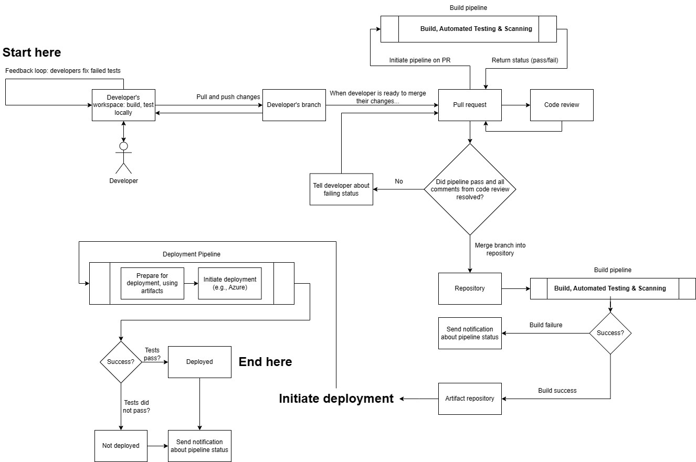
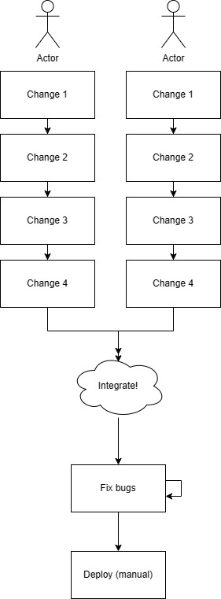
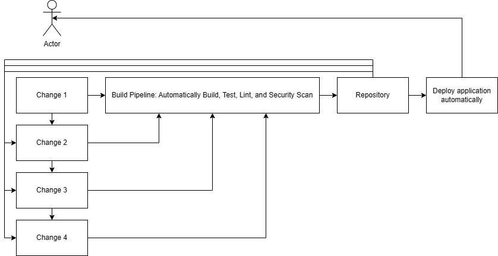
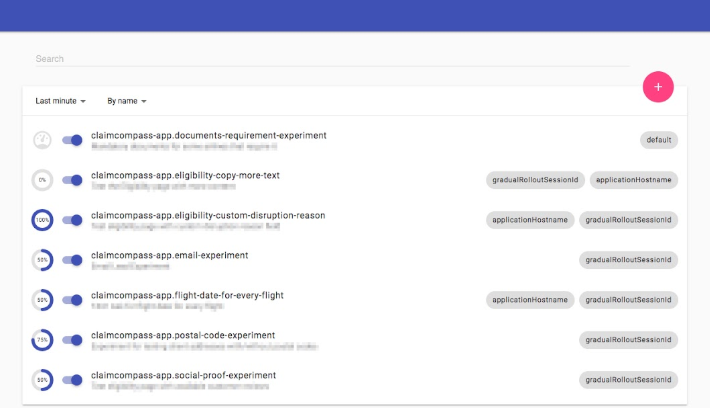
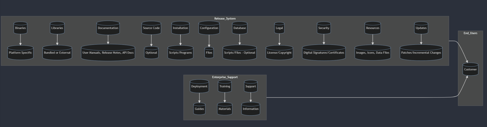
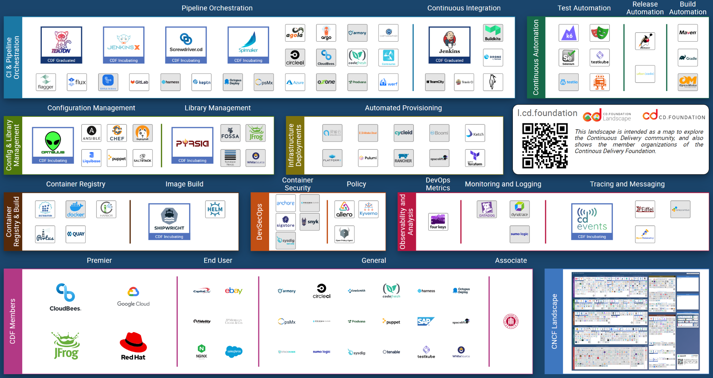

## Introduction {#introduction .unnumbered}

Many developers and organizations embark on their journey with Continuous Integration and Continuous Deployment (CI/CD) full of optimism, yet the real-life experiences of countless developers reveal that the path to mastering CI/CD is fraught with complications, unexpected setbacks, and sometimes overwhelming obstacles. As we strip away the buzz and the lofty claims about CI/CD revolutionizing development, we often find developers entangled in tedious manual setups, scrambling to manage breakdowns in production, hindered by team silos, and grappling with complex, fragile systems.

> **Note:** This book is currently in beta. As such, you may encounter content that is still being refined, sections that are being reorganized, or explanations that will be expanded in future updates. We welcome your feedback as we continue to improve and develop this resource.

This book is an endeavor to peel back the layers of CI/CD, moving beyond mere automation and frequent code merging. We aim to guide you through the intricacies of what CI/CD truly entails and how to implement it effectively using GitHub Actions as a practical example. While the theory of CI/CD promises streamlined operations and faster deployments, the reality involves navigating through a myriad of challenges that can stymie even the most determined teams.

### What is CI/CD?

#### Continuous Integration (CI) {#continuous-integration-ci .unnumbered}

**Integration is the act of constantly merging your changes with other developers', and vice-versa. It's the act of combining multiple changes, from multiple developers, into a single, cohesive whole, regularly.** All developers work on a shared codebase. The product owner or another person (internally) should be able to use your app, or another team can demo their feature--it might not be finished but the application still works as intended.

#### Continuous Deployment (CD) and Continuous Development (CD) {#continuous-deployment-cd-and-continuous-development-cd .unnumbered}

**Continuous Deployment** (often confused with Continuous Delivery) is the practice where every change that passes the automated tests and other confidence-inducing procedures is **automatically deployed** into the production environment with little to no human intervention.

**Continuous Delivery**, on the other hand, ensures that the code is always in a deployable state, but **it may not be deployed to production automatically. Instead, it might require manual approval.** It provides the business with the opportunity but not the obligation to deploy at any point. Continuous delivery is not simply an automated pipeline for on-demand deployment. For example, code in long-lived feature branches necessitates retrieving specific versions or bug fixes that require complex version control, which can disrupt other work. Or, the build requires a special ceremony, such as complex testing, an implicit contract with another service that has to be deployed in a certain order, manually run scripts, manual checks, etc. This indicates the code base is not always deployable, thus not fully meeting continuous integration principles. This also includes necessary automated testing to ensure its capacity to be deployed continuously.

Deployments are technical events managed by engineering, releasing (making those features usable by customers) is both an engineering and business thing.

#### CI/CD {#cicd .unnumbered}

CI/CD aims to avoid \"integration hell\" by ensuring continuous integration and either continuous delivery or deployment. Work is constantly merged into the main/master branch after it has been verified via code review and the continuous integration pipeline. This involves practices like trunk-based development, where all developers work on a shared branch, promoting constant integration and minimizing merge conflicts.

> **Aside:** Some companies deploy 100 times a day, but more deploys aren't inherently better—they simply indicate a robust, automated process. Continuous deployment automatically releases every quality-approved change, reducing the gap between versions. This means smaller changesets, easier bug identification, and faster rollbacks, all of which help minimize profit loss. Ultimately, frequent deploys reflect strong operational practices and many quality measures, not a superior app.

A misunderstanding of CI/CD is that it's just a build pipeline that continually builds the software. CI/CD requires both technical and cultural shifts, including:

- Smaller work units: Breaking down features into independently deployable and testable components. This allows the features to be continually deployed, or behind a feature flag, while other features are being worked on. If all features are large and are on their own feature branch, then this defeats the point of CI/CD as the feature has not yet been _integrated_, that is, it does not co-exist with the rest of the application. Other developers are unable to build around it, and feature flagging is not possible. Idea transmission is still possible, and it is a myth that developers do not communicate with each other if not practicing CI/CD.

- Modular codebase: Facilitating localized changes without impacting the entire application. This allows other developers to not be blocked while a parallel feature is in development.

- Focus on rapid feedback: Prioritizing quick delivery of changes and gathering customer insights. If there is no need for fast customer feedback or to test changes, then moving to CI/CD becomes less important.

> Some cases, such as rewriting the app to use another framework, may require feature branching or interrupting others' work.

Here is what the software development process looks like when using CI/CD. Note that many of these processes are automated.

###  {#section .unnumbered}

### Why is CI/CD important? {#why-is-cicd-important .unnumbered}

There are many reasons why a company or a project may use CI/CD. Core Benefits:

- Faster Development and Deployment: CI/CD enables rapid deployment of small changes, accelerating development and deployment cycles, allowing businesses to be more agile and responsive to customer needs.

- Improved Code Quality: Continuous integration, automated testing, and code review practices built into CI/CD processes lead to higher-quality code and more reliable software.

- Increased Collaboration and Transparency: CI/CD encourages collaboration between developers, operations, and QA teams, fostering shared understanding and transparency throughout the development lifecycle.

- Decoupling of Integration, Deployment, and Release: CI/CD separates these stages, allowing for flexibility in releasing features and testing in production without impacting users.

- Enhanced Confidence in Changes: Automated testing and build pipelines provide developers with a higher level of confidence in their code, reducing the risk of introducing bugs.

- Improved Estimation Accuracy: By deploying frequently, teams gain a better understanding of the development process, leading to more accurate estimations.

- Streamlined Workflow: Automation eliminates manual processes, smoothing workflows, and allowing developers to focus on core development tasks.

- Support for Experimentation and Innovation: Feature flags enable controlled experimentation and incremental rollouts, allowing teams to test new features and gather feedback without risking the entire application.

Despite these benefits, several challenges can hinder successful CI/CD implementation:

- Zero-Downtime Deployments: Achieving seamless deployments while managing resources and data integrity requires strategies like blue-green deployments, canary releases, and feature flags.

- Database Schema Impacts: Even small code changes can disrupt database schemas, necessitating schema migration tools and a disciplined approach to database management.

- Central Point of Failure: CI/CD creates a central point of failure that demands constant vigilance. Maintaining a \"green\" pipeline requires rigorous testing, code review, and ongoing maintenance to ensure stability and compliance. Do not rubber stamp PRs.

- Culture Shift: CI/CD requires a shift in mindset, emphasizing collaboration, shared responsibility, and open communication across teams. This will exaggerate any communication issues, if they exist.

- Continuous Learning: Teams must invest in ongoing training, keeping their skills up-to-date with evolving CI/CD technologies and security best practices.

- Clear Objectives: A lack of clarity regarding CI/CD goals can lead to resistance and misaligned expectations. It\'s crucial to define objectives, communicate the value proposition, and secure stakeholder buy-in.

CI/CD is not a magic bullet. It demands discipline, commitment to quality, and a proactive approach to addressing technical and organizational challenges. However, when implemented effectively, it can significantly accelerate development, enhance software quality, and empower teams to deliver value more efficiently.

### Traditional software development {#traditional-software-development .unnumbered}

Traditional software development is a methodology that is difficult to define because there\'s multiple definitions of what traditional means. This usually means before continuous integration and development was widely popularized, for example prior to 2010.

Traditional Development:

- Teams often work in silos with limited visibility into each other\'s work. This does not mean that team members do not communicate with each other, rather, the act of _integration_ is delayed.

- Slow feedback loops and long development cycles are common.

- Manual integration and deployment processes are complex and resource-intensive.

- Late-stage testing limits opportunities for early customer feedback.

CI/CD Development:

- Promotes continuous collaboration and transparency through practices like trunk-based development.

- Enables rapid feedback loops and iterative development with frequent integrations and deployments.

- Automates builds, tests, and deployments, freeing developers to focus on core tasks.

- Allows controlled feature rollouts and early customer feedback through feature flags.

> 
>
> 

#### The build server or build pipeline {#the-build-server-or-build-pipeline .unnumbered}

A build server is a dedicated computer or virtual machine that automates tasks such as building, testing, linting, and conducting security scans, preparing code for deployment or integration. It acts as a quality gatekeeper, running CI/CD workflows before code is deployed or merged into the main branch. The build server doesn\'t inherently perform tasks but executes the instructions specified in the workflow file by developers. Anything can be run on a build server, since it\'s just a virtual machine.

Build servers are used instead of developer workstations because:

- Security: These servers handle sensitive resources like company source code and secrets. It is crucial to secure them to prevent unauthorized access and protect against lateral attacks. Simply storing them on a developer's machine means that other software could use the secrets, the secrets are transmitted over other mediums, etc.

- Consistency and Isolation: Each server, agent, or VM should operate independently to minimize the impact of potential compromises. The agent only runs for a fixed amount of time, then is erased. Developer machines are long-lived, and could have lots of software unnecessary for building the application.

#### Automation {#automation .unnumbered}

Automation is essential for CI/CD, streamlining tasks like builds, deployments, and testing. This saves time, improves efficiency, and ensures consistency and reliability, crucial for frequent deployments. However, over-automation can be detrimental, especially for tasks requiring human judgment or adaptability.

The key is to find the right balance, automating repetitive tasks while retaining human oversight for critical decision-making and complex scenarios. Robust error handling and clear guidelines for human intervention are crucial for successful automation.

[[researchgate.net/profile/Kevin-Hoff-3/publication/272887576_Trust_in_Automation_Integrating_Empirical_Evidence_on_Factors_That_Influence_Trust/links/57952ba008aec89db7a8cf4f/Trust-in-Automation-Integrating-Empirical-Evidence-on-Factors-That-Influence-Trust.pdf]{.underline}](https://www.researchgate.net/profile/Kevin-Hoff-3/publication/272887576_Trust_in_Automation_Integrating_Empirical_Evidence_on_Factors_That_Influence_Trust/links/57952ba008aec89db7a8cf4f/Trust-in-Automation-Integrating-Empirical-Evidence-on-Factors-That-Influence-Trust.pdf)

Trust in automation: Part I. Theoretical issues in the study of trust and human intervention in automated systems. Ergonomics, 37(11), 1905--1922 \| 10.1080/00140139408964957

A model for types and levels of human interaction with automation. IEEE Transactions on Systems, Man, and Cybernetics - Part A: Systems and Humans, 30(3), 286--297 \| 10.1109/3468.844354

#### Testing, code review, and quality assurance {#testing-code-review-and-quality-assurance .unnumbered}

Testing and quality assurance are crucial for CI/CD, ensuring software quality and confidence in deployments. While both automated and manual testing play vital roles, they address different aspects:

- Automated Testing: This process verifies functionality and performance through predefined tests, similar to controlled experiments, providing rapid feedback on code changes. Imagine a chemistry teacher at the front of a classroom, mixing two chemicals and instructing students to watch closely. This scenario serves as an example of a **demonstration** because the outcome is known beforehand, akin to how these tests predictably assess the impacts of changes in the code.

- Manual Testing: Leverages human judgment for evaluating usability, aesthetics, and user experience, crucial for aspects difficult to automate.Humans should not be doing the checking aspect.Rather, automated testing should be responsible for that.

- CI/CD emphasizes automation but doesn\'t eliminate the need for manual testing. Instead, it allows testers to focus on higher-level tasks requiring human expertise. Maintaining a balance between automated and manual testing is key for efficient, high-quality software development.

- Skipping quality assurance in CI/CD can be tempting due to the fast-paced nature, but it\'s essential for ensuring customer satisfaction and protecting the business\'s reputation.It is additionally very tempting because the lack of automation will not show up for quite some time.

> **Aside:** fire QA, right?! Well, no. QA shifts left, and instead prioritizes testing PRs (which have a smaller scope and smaller changeset.) Since checking (testing an outcome that is known) is done mostly via unit tests, QA can use their human-ness to evaluate the product for quality, usability, functionality, and exploration testing. When a feature is developed under a feature flag, QA can test it in the pre-production environment (feature flag enabled for them), allowing developers to get early feedback.

#### Rapid Feedback Loops {#rapid-feedback-loops .unnumbered}

The essence of CI/CD lies in maintaining business agility through a fast feedback loop. This allows companies, especially startups and small businesses, to rapidly experiment, identify what works, and make quick improvements.

Rapid feedback loops are a multi-pronged approach:

- Streamlined Local Testing: Developers need easily accessible local testing environments mirroring production. Tools like hot reloading and ephemeral test environments with simple provisioning are crucial.

- Efficient Build Pipeline: Aim for a build time under 15-20 minutes with automated processes, notifications for failures, and minimal manual intervention.This period of time is arbitrary. However, if the build time is too long, then there\'s a possibility of frustrating developers as well as not being able to quickly react to feedback from your customers.You will also make it more difficult to quickly push changes should there be a production outage.

- Timely Code Reviews: Prioritize prompt and thorough PR reviews (ideally within a day) with constructive feedback and a focus on code readability.

- Regular Deployments: Embrace semi-regular deployments to accelerate feedback loops and customer value delivery (refer to DORA metrics).

- Comprehensive Monitoring & Alerting: Implement robust monitoring in all environments to detect issues early. Define a severity matrix for appropriate stakeholder notifications, escalating critical incidents promptly.

#### Infrastructure as Code and modularity {#infrastructure-as-code-and-modularity .unnumbered}

To achieve continuous integration and efficient deployments, it\'s essential to structure applications so that small changes are manageable. This involves both the application itself and its underlying infrastructure. If making small changes is cumbersome, integration becomes challenging, as larger updates can span multiple components, increasing both the testing burden and the associated risks.

- Independent Modules: Structure applications with clear boundaries between components. This facilitates isolated changes and reduces testing complexity. This isn't the fact that you must adopt microservices, rather it\'s just structuring your code to be a modular approach. Modularity leads to smaller, more manageable changes, simplifying testing and increasing development speed.

- Version-Controlled Infrastructure: Treat infrastructure configurations like code, storing them in version control systems for tracking, reverting, and collaboration.Your application. This could be terraform templates or ARM templates.

- Eliminate configuration inconsistencies between development, testing, and production, preventing \"snowflake servers\" and ensuring reliable deployments.

#### Feature Flags {#feature-flags .unnumbered}

Feature flags are for **experimentation and release. They separate the act of deploying (moving the code to production, managed by engineering) and the act of making the changes usable by customers (commonly associated with a marketing event from the business's side.)** They are remote-controlled conditional statements that allow the selective activation or deactivation of application functionalities across different environments (development, integration, pre-production, production) without needing a redeployment. These flags can be toggled within seconds or minutes and can be set based on criteria like geographic location, IP address, or user type, facilitating targeted and gradual feature rollouts.

What exactly constitutes a feature or needs to be released via a feature flag is up to the product managers and the business. Usually not everything is behind a feature flag, for example, logging statements, refactors, package upgrades\*, security fixes\*, bug fixes, or small changes like typo fixes.

Typically, developers can enable these feature flags by themselves. Here's an example of an application in development, and it shows a special development overlay that allows developers to toggle feature flags.



[[Implementing feature flags in React with Unleash - Case Study (claimcompass.eu)]{.underline}](https://www.claimcompass.eu/blog/en/feature-flags-in-react-with-unleash/)

Feature flags need not be complicated or require third-party software. You can get started with a simple JSON file with a list of key/value pairs that is outside of the deployment system, but still accessible by your app. This does not require any subscription to a feature flag service. They can also be embedded in your application, for example, in a config file. This approach limits flexibility, however, as a redeployment is needed to change the config file.

This approach is beneficial for trunk-based development, where changes are incremental. Developers can merge new features behind feature flags, allowing others to activate these flags for testing selectively.

Feature flags also enable controlled risk-taking. For example, a promising feature might be released to a small user segment (e.g., 1%) to evaluate performance and gather feedback, minimizing risks of broader release.

**Branches versus Feature Flags:**

Branches provide isolated workspaces for developers, supporting multiple application versions or development paths. However, unlike branches that delay integration, feature flags allow for integration while controlling feature activation.

**Limitations:**

Feature flags should not be used to restrict feature access (for example, paid features), as they are often visible and modifiable on the client-side. They are better suited for testing, phased rollouts, and controlled changes.

**Maintenance:**

Proper feature flag management is crucial. Unused flags should be removed to avoid clutter and potential confusion. Limiting the number of active feature flags helps reduce code complexity and ease debugging.

Summary table,

| Aspect                  | Branching                                                                                                                                                           | Feature Flags                                                                                                                                                                                |
| ----------------------- | ------------------------------------------------------------------------------------------------------------------------------------------------------------------- | -------------------------------------------------------------------------------------------------------------------------------------------------------------------------------------------- |
| What It Is              | Managing and isolating code changes in separate lines of development.                                                                                               | Tools for remotely controlling the visibility of new features in the production environment.                                                                                                 |
| Main Actions            | Changes stay within the branch. To make changes visible, merge, copy, squash, or rebase onto a production-bound branch (like trunk/master).                         | Allowing code changes to exist in production without being visible to everyone. Can be enabled for specific users or scenarios.                                                              |
| Visibility to Customers | Changes are not visible to customers unless the branch is deployed to production. Testing in environments like test, dev, experimental is possible.                 | Feature flags are crucial in managing what customers see in production. They hide or reveal new features based on their status.                                                              |
| Specific Considerations | Recommended to deploy the main or trunk branch to production, especially in TBD (trunk-based development). Branches are ideal for testing and isolated development. | Feature flags should be used judiciously, as overuse can complicate application maintenance. They are intended to be temporary and should not replace good branching and merging strategies. |

#### Version Control System (VCS) {#version-control-system-vcs .unnumbered}

Version control systems are crucial for continuous integration and development because they track changes, **simplifying the integration process**. For instance, if you have two versions of a document, merging them into one requires a detailed comparison of each word. This task involves identifying and understanding changes. Version control automates this process, significantly reducing the likelihood of errors associated with manually tracking changes. This automation ensures smooth and accurate integration of code changes, forming a cohesive whole.

VCSes show that work has been integrated because it is considered a central source of truth. Multiple copies of the application with different versions mean that there isn't a single source of truth, therefore, we can't know if our changes have been integrated.

VCSs enhance auditability, allowing developers to easily trace back to see when and why code was altered. This is particularly important from a security perspective to ensure that only authorized changes are made. For example, if unauthorized changes occur, they can be quickly identified and reverted.

#### Culture and communication, collaboration {#culture-and-communication-collaboration .unnumbered}

While CI/CD tools automate integration and deployment, successful implementation requires more than just technology. It demands a fundamental shift in organizational culture and project management.

CI/CD thrives on:

- **Collaboration and Communication:** Teams must work closely, sharing information and coordinating efforts to ensure smooth integration and deployment.

- **Rapid Iteration:** Frequent code merges, small feature updates, and continuous feedback loops are essential for maximizing the benefits of CI/CD.

- **Strategic Project Management:** Breaking down features into manageable, independently testable units facilitates continuous integration and deployment without disrupting the entire application.

Ignoring the human element of CI/CD can lead to challenges:

- **Batched Changes and Integration Conflicts:** Infrequent code merges increase the risk of complex integration issues.

- **Delayed Feedback:** Waiting to test in production hinders rapid iteration and learning.

- **Siloed Information and Debugging Difficulties:** Poor communication can lead to significant debugging challenges.

CI/CD is not a one-time setup. It requires ongoing maintenance, pipeline updates, and continuous learning to adapt to evolving practices. Effective testing, code reviews, and organizational support for these processes are vital for maintaining a smooth development cycle.

### Continuous Deployment/Continuous Delivery {#continuous-deploymentcontinuous-delivery .unnumbered}

Infrastructure as Code (IaC) represents a transformative approach in managing and provisioning computing resources, utilizing machine-readable definition files rather than traditional physical hardware setups. This automation-focused methodology enhances the setup, configuration, and management of infrastructure, promoting rapid deployments, efficient resource utilization, and consistent, reliable environments. IaC is mainly declarative, targeting the desired end state of the infrastructure while the underlying tooling manages the execution. This is crucial in Continuous Deployment (CD) pipelines where IaC templates are automatically deployed in the cloud, ensuring each deployment is consistent, reproducible, and easily reversible. This aligns with principles like idempotency, immutability, and composability---key for maintaining interoperable and stable components.

The benefits of adopting IaC are extensive, including consistent infrastructure deployments across environments, enhanced reproducibility, and robust version control which acts as a single source of truth. Such structured deployments reduce configuration drifts between different environments such as QA/dev and production, speeding up the feedback loop for developers and boosting security measures. Tools such as Terraform offer cloud-agnostic deployment options, whereas AWS CloudFormation, Azure Resource Manager, and Google Cloud Deployment Manager cater to specific cloud environments. Additionally, open-source tools like Ansible and traditional configuration management tools like Chef and Puppet provide further automation capabilities, ensuring thorough enforcement of system states.

Historically, server management was a manual process involving system administrators physically logging into servers to apply changes, a method prone to errors and inconsistencies, especially in complex server environments. This labor-intensive process made replicating servers difficult, often requiring extensive documentation and manual reconfiguration. Before the adoption of IaC, administrators relied on shell scripts to manage and synchronize server configurations, though these scripts were limited in handling complex scenarios effectively. The rise of configuration management tools in the mid-to-late 2000s, such as CFEngine, Puppet, and Chef, began to address the issue of \"snowflake servers\"---highly customized servers difficult to replicate from scratch. Despite the advancements, many continued using shell scripts and command-line tools for their simplicity and familiarity. Today, IaC practices, exemplified by Terraform and other cloud-specific tools, have largely superseded these older methods, providing scalable, reliable, and repeatable server environment setups.

Here\'s a snippet of a simple Terraform configuration that demonstrates how to create an AWS infrastructure:

```
provider "aws" {
  region = "us-west-1"
}

resource "aws_vpc" "sample_vpc" {
  cidr_block = "10.0.0.0/16"
  ... // Additional configurations
}

resource "aws_subnet" "sample_subnet" {
  vpc_id     = aws_vpc.sample_vpc.id
  cidr_block = "10.0.1.0/24"
  ... // Additional configurations
}

resource "aws_instance" "sample_ec2" {
  ami           = "ami-0c55b159cbfafe1f0"
  instance_type = "t2.micro"
  subnet_id     = aws_subnet.sample_subnet.id
  ... // Additional configurations
}

```

> 

### Providers and hosting {#providers-and-hosting .unnumbered}

Providers fall into two overlapping categories: CI/CD tooling and application hosting infrastructure. You can mix and match—for example, use GitHub Actions for CI/CD while hosting your application on AWS, Azure, or Google Cloud. Sticking with a provider you already have a contract with can streamline integration with your security policies.

**CI/CD Tools:**

- **GitHub Actions:** Built into GitHub for automated build, test, and deployment workflows.
- **GitLab CI/CD:** An integrated solution with built-in CI/CD and version control.
- **Jenkins:** A flexible, open-source automation server with a vast plugin ecosystem.
- **CircleCI:** A cloud-based service known for ease of integration, Docker support, and parallel builds.
- **Azure DevOps:** A comprehensive suite covering planning, coding, building, and deploying.
- **Bamboo (Atlassian):** Integrates with Jira and Bitbucket, ideal for enterprises using Atlassian tools.
- **Travis CI:** A hosted service that integrates well with GitHub and Bitbucket.

**Infrastructure Providers:**

- **AWS:** Offers comprehensive cloud services with CI/CD tools like CodePipeline and CodeBuild.
- **Azure:** Provides robust hosting alongside Azure Pipelines and other DevOps services.
- **Google Cloud Platform:** Features Cloud Build and strong support for containerized workflows.
- **IBM Cloud:** Delivers end-to-end DevOps toolchains integrated with popular tools.
- **DigitalOcean:** A straightforward platform that supports Kubernetes and common CI/CD integrations.

> 

### Terminology

This book is somewhat focused on GitHub Actions, but tries to provide a provider-agnostic view. Some of the terms might be a bit different depending on your CI/CD provider. Here is a table that helps clarify.

| Definition                                                                  | Generic Term  | Jenkins            | GitHub Actions       | GitLab CI/CD    | CircleCI              |
| --------------------------------------------------------------------------- | ------------- | ------------------ | -------------------- | --------------- | --------------------- |
| **Build Step**: A single CI/CD task (e.g. compile, test, deploy).           | Build Step    | Build Step         | Job                  | Job             | Job                   |
| **Environment**: The runtime setup (OS, tools, variables, network).         | Environment   | Node               | Runner               | Runner          | Executor              |
| **Workflow**: A series of tasks defining the build process.                 | Workflow      | Pipeline           | Workflow             | Pipeline        | Workflow              |
| **Trigger**: An event (commit, PR, schedule) that starts the pipeline.      | Trigger       | Build Trigger      | Event                | Trigger         | Trigger               |
| **Secrets**: Sensitive data (passwords, tokens, keys) used securely.        | Secrets       | Credentials        | Secrets              | Variables       | Environment Variables |
| **Container**: An isolated package with code, runtime, and tools.           | Container     | Agent/Docker Agent | Container            | Docker Executor | Docker                |
| **Configuration**: Files specifying build settings (e.g. YAML).             | Configuration | Jenkinsfile        | .github/workflows/\* | .gitlab-ci.yml  | .circleci/config.yml  |
| **Artifacts**: Files produced by the build (binaries, docs, containers).    | Artifacts     | Build Artifacts    | Artifacts            | Artifacts       | Artifacts             |
| **Cache**: Stored build data (dependencies, compiled code) for faster runs. | Cache         | Workspace          | Cache                | Cache           | Cache                 |
| **Parallelism**: Running multiple tasks concurrently to speed builds.       | Parallelism   | Parallel Builds    | Matrix Builds        | Parallel Matrix | Parallel Jobs         |
| **Build Status**: Indicator of build success or failure.                    | Build Status  | Build Status       | Build Status         | Build Status    | Build Status          |

### Further readings {#further-readings .unnumbered}

[[Continuous Delivery: Reliable Software Releases through Build, Test, and Deployment Automation: Humble, Jez, Farley, David: 9780321601919: Books - Amazon.ca]{.underline}](https://www.amazon.ca/Continuous-Delivery-Reliable-Deployment-Automation/dp/0321601912/ref=sr_1_1?crid=2H71BL6NRSX7Q&keywords=continuous+delivery&qid=1698110152&sprefix=continuous+delivery%2Caps%2C132&sr=8-1)

[[Continuous Integration: Improving Software Quality and Reducing Risk: Duvall, Paul, Matyas, Steve, Glover, Andrew: 9780321336385: Books - Amazon.ca]{.underline}](https://www.amazon.ca/Continuous-Integration-Improving-Software-Reducing/dp/0321336380/ref=sr_1_1?crid=3VS7DPPXR40T8&keywords=continuous+integration&qid=1698110160&sprefix=continuous+integration%2Caps%2C123&sr=8-1)

[[The Phoenix Project: A Novel about IT, DevOps, and Helping Your Business Win: Kim, Gene, Behr, Kevin, Spafford, George: 9781942788294: Books - Amazon.ca]{.underline}](https://www.amazon.ca/Phoenix-Project-DevOps-Helping-Business/dp/1942788290/ref=sr_1_1?crid=969HQYQJ3ROE&keywords=%22The+Phoenix+Project%22&qid=1698110264&sprefix=the+phoenix+project+%2Caps%2C128&sr=8-1)

[[The DevOps Handbook: How to Create World-Class Agility, Reliability, and Security in Technology Organizations: Kim, Gene, Debois, Patrick, Willis, John, Humble, Jez, Allspaw, John: 9781942788003: Books - Amazon.ca]{.underline}](https://www.amazon.ca/DevOps-Handbook-World-Class-Reliability-Organizations/dp/1942788002)
