## Programming a somewhat complicated weather application {#programming-a-somewhat-complicated-weather-application .unnumbered}

This section explores CI/CD through the practical lens of building a sophisticated weather application. We\'ll dissect key features and demonstrate structuring a CI/CD pipeline using GitHub Actions.

Imagine wearing a project manager\'s hat and envisioning potential features for our weather application:

- \- Displaying precipitation data for user-specified locations

- \- Zoom functionality for map visualization

- \- Backend database for storing updated weather information

- \- REST API to serve data to the front-end

- \- Geolocation service to convert addresses to coordinates

- \- Caching mechanisms for performance optimization

- \- Historical precipitation data for a comprehensive user experience

- \- Pipeline feasibility for regenerating weather map tiles

**Key Features and Development Strategy:**

1\. **Interactive World Map:** Our primary interface is a world map, designed to be interactive, allowing users to zoom into specific areas without reloading the entire map. We will be using the public open street map server for now but will show how you can self host it, including load balancing strategies.

2\. **Weather Forecast Integration:** We will integrate real-time weather forecasting, beginning with current temperature displays at specific locations. This involves creating map overlays to show temperature variations across regions simultaneously.First, however, we\'re just going to get the temperature of our location.

3\. **Enhanced Map Visualization:** The map will also display various weather parameters, such as wind speeds and temperature gradients. Given the potential for high user traffic, especially in densely populated areas like India, implementing load balancing and data compression strategies, such as vector tile maps, will be crucial.

5\. **Usage Analytics:** Collecting data on user interactions with the map will provide insights to refine backend processes and enhance data visualization and user engagement on the platform.

**Application Hosting and User Engagement:**

\- User features will include account creation and subscription to event forecasts. A backend batch job will manage notifications through a queuing system, supporting large-scale user notifications with email tracking.

{width="5.463542213473316in" height="4.118670166229221in"}

[[Interactive weather maps - OpenWeatherMap]{.underline}](https://openweathermap.org/weathermap?basemap=map&cities=false&layer=temperature&lat=30&lon=-20&zoom=3)

Here\'s an overview of our application architecture.

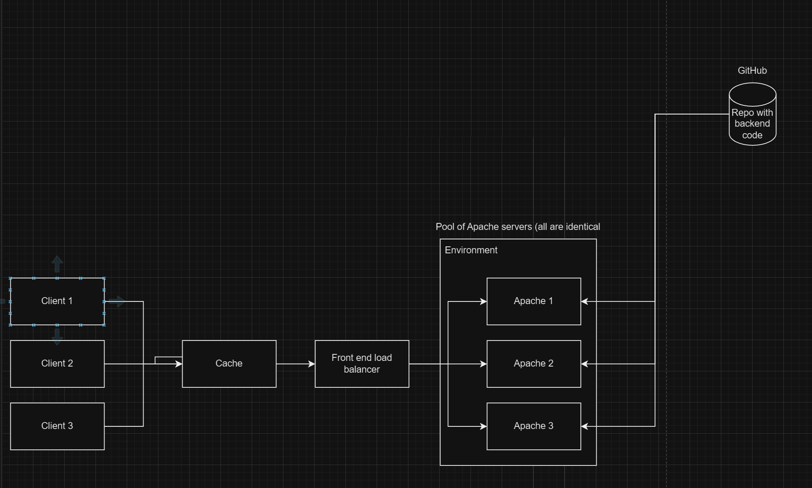{width="5.432292213473316in" height="3.259375546806649in"}

Creating a new weather application using React involves several steps, from setting up your development environment to deploying the application. This book is not, of course, about how to learn React, so I won\'t be going into very much detail about how this React code actually works.

The first step is to provision a local development environment, enabling a quick feedback loop. This ensures immediate testing of changes, such as adding text to a weather application and seeing updates appear almost instantly in the React application.

You will have four different environments, each with a commonly used abbreviation. We will name some of the resource groups using these abbreviations as suffixes.

---

**Environment Number** **Full Name** **Common Abbreviation**

---

1 Local Development Local or Dev

2 Integration INT

3 Pre-production PPE

4 Production Prod

---

Naming conventions

There are a lot of things that you will need to name, such as pipelines, and other resources. Therefore, it is helpful to use a consistent naming scheme to make it easier to identify those resources.

[[Define your naming convention - Cloud Adoption Framework \| Microsoft Learn]{.underline}](https://learn.microsoft.com/en-us/azure/cloud-adoption-framework/ready/azure-best-practices/resource-naming)

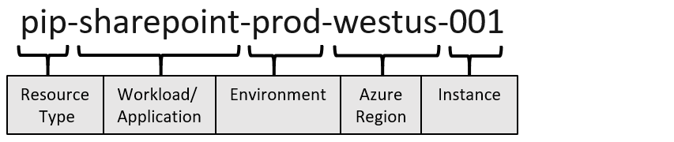{width="8.885416666666666in" height="1.875in"}

Let's call the resource type CDP and the workload is our weather application.

It should therefore be prefixed with cdp-weather-web-prod

This provides a nice name we can use later and helps us inventory and group our resources, making it clear which resource is assigned to what.

\### Step 1: Set Up Your Development Environment

1\. **Install Node.js and npm:**

\- Visit \[Node.js\'s website\](https://nodejs.org/) and download the installer for your operating system. This will also install npm (Node Package Manager) which is essential for managing JavaScript packages.

\- To verify the installation, run \`node -v\` and \`npm -v\` in your terminal or command prompt. **This should display the current versions of Node.js and npm installed. Keep a note of this as you\'ll need it for later.**

2\. **Install a Code Editor:**

\- A code editor will help you to write your code more efficiently. \[Visual Studio Code\](https://code.visualstudio.com/) is a popular choice among developers because it supports JavaScript and React out of the box, along with many useful extensions.

\### Installing Git

**Windows:**

1\. **Download the Installer:**

\- Visit the official Git website: \[Git Downloads\](https://git-scm.com/downloads).

\- Click on \"Windows\" to download the latest version of Git for Windows.

2\. **Run the Installer:**

\- Once the download is complete, open the installer.

\- Proceed through the installation wizard. You can accept the default settings, which are suitable for most users. However, you may choose to customize the components to install, the default editor for Git, and other options depending on your preference.

3\. **Verify Installation:**

\- Open Command Prompt (cmd) and type \`git \--version\`. This command will display the installed version of Git if the installation was successful.

**macOS:**

1\. **Install using Homebrew (recommended):**

\- First, install Homebrew by opening Terminal and running:

\`\`\`

/bin/bash -c \"\$(curl -fsSL https://raw.githubusercontent.com/Homebrew/install/HEAD/install.sh)\"

\`\`\`

\- Once Homebrew is installed, install Git by typing:

\`\`\`

brew install git

\`\`\`

2\. **Verify Installation:**

\- In the Terminal, type \`git \--version\` to confirm that Git is installed.

**Linux:**

1\. **Install Git:**

\- Open a terminal.

\- For Debian/Ubuntu based distributions, use:

\`\`\`

sudo apt-get update

sudo apt-get install git

\`\`\`

\- For Fedora, use:

\`\`\`

sudo dnf install git

\`\`\`

\- For other distributions, use the package manager accordingly.

2\. **Verify Installation:**

\- Type \`git \--version\` in the terminal to check the installed version.

\### Installing GitHub Desktop (optional)

**Windows and macOS:**

1\. **Download GitHub Desktop:**

\- Visit the GitHub Desktop download page: \[GitHub Desktop\](https://desktop.github.com/).

\- Click on the download link for Windows or macOS, depending on your operating system.

2\. **Install GitHub Desktop:**

\- **Windows:**

\- After downloading, run the GitHub Desktop setup file.

\- Follow the installation instructions to complete the setup.

\- **macOS:**

\- Open the downloaded \`.dmg\` file and drag the GitHub Desktop application to your Applications folder.

3\. **Verify Installation:**

\- Open GitHub Desktop. The application should launch and prompt you to log in with your GitHub credentials.

4\. **Setup GitHub Desktop:**

\- After logging in, you can configure GitHub Desktop to connect with your GitHub repositories. You can clone existing repositories, create new ones, or add local repositories.

When you install Git, it typically comes with a tool called Git Credential Manager, which helps with authentication. If you\'re working in an interactive shell, you might see a pop-up from this tool when you try to access a repository. In a more basic command prompt environment, without a graphical interface, you\'ll need to follow specific instructions for accessing GitHub repositories. These instructions could involve pasting a link into a web browser or registering a device, using OAuth for authorization.

While you have the option to use a personal access token (PAT) for authentication, it\'s generally not recommended due to security risks, such as potential leaks and the extended lifespan of tokens. If you must use a PAT, consider setting its expiration to one week or less and arranging for it to be renewed periodically to enhance security.

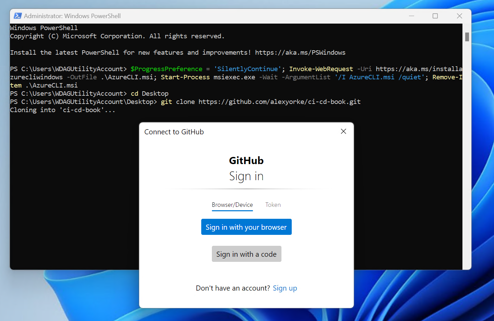{width="6.588542213473316in" height="4.2932972440944885in"}

First, ensure that you have cloned your GitHub repository to your local machine. Haven\'t made a repository yet? Then create one by creating a GitHub account and then creating a new repository, then cloning it locally.

Once you have the repository locally, create and switch to a new branch. You could name this branch something indicative of its purpose, such as \"initial-commit\" or \"first-commit.\" Here's how you can do this using Git commands:

\`\`\`bash

git checkout -b initial-commit

\`\`\`

This command creates a new branch named \"initial-commit\" and checks it out, so you can start adding your changes to this branch. Do all of the following commands within the repository.

Run the following commands in that repository.

\### Step 2: Create a New React Application

Make sure that you have at least NPM 10.8.0 installed. You can update it by typing npm install -g npm@10.8.0 or whatever the latest version is.

1\. **Use Create React App:**

\- Open your terminal or command prompt.

\- Run the following command to create a new React application named \`weather-app\`:

\`\`\`bash

npx create-react-app weather-app

\`\`\`

\- This command sets up a new React project with all the necessary build configurations.

2\. **Navigate into your project directory:**

\- Change into the newly created project directory with \`cd weather-app\`.

\### Step 3: Run the React Application

\- Inside the project directory, start the development server by running:

\`\`\`bash

npm start

\`\`\`

\- This command runs the app in development mode. Open \`http://localhost:3000\` to view it in the browser. The page will reload if you make edits.

\### Step 4: Integrate Weather Data

1\. **Choose a Weather API:**

\- For real-time weather data, you can use APIs like \[OpenWeatherMap\](https://openweathermap.org/) or \[WeatherAPI\](https://www.weatherapi.com/). You will need to sign up and obtain an API key.

2\. **Install Axios:**

\- While you can use the native \`fetch\` API, Axios makes it easier to perform API requests. Install Axios by running:

\`\`\`bash

npm install axios

\`\`\`

We need to access a weather API, but we\'re faced with a challenge regarding how to securely handle the API key. Storing the key directly in our code is not an option as it poses a security risk. If the key were to be leaked, it would be difficult to track and audit its usage.

To manage this securely for now, we will store the API key locally in a file named .env.local, which contains environment-specific data. Our React application will be configured to read from this .env file, allowing it to make calls to the API endpoint locally during development.

Later, we will explore solutions for safely using the API key in a production environment, ensuring it remains secure while accessible to the application.

**Aside**

\### Understanding the Build Process:

\- **Compiled Files**: The files in the \`dist\` folder are the result of the compilation process. For example, if you\'re using a framework like React, the \`npm run build\` command transforms React code into plain JavaScript. This is necessary because browsers cannot interpret React code directly; they only understand JavaScript.

\- **Deployment Preparation**: The \`dist\` folder contains the compiled version of your application, which is what you will deploy. This folder holds all the static files required to run your application on any standard web server.

\### Why Compilation Matters:

The compilation step is crucial because it translates code from development frameworks (like React) into a format that can be executed by a web browser, typically JavaScript, HTML, and CSS. This process ensures compatibility across different environments and optimizes performance for production.

**Aside end**

First create a .env.local file in the weather-app folder.

Replace the content of the dot env file with this.

REACT_APP_WEATHER_API_KEY=your_actual_api_key_here

Then make sure to add the .env.local file to your .gitignore file. Do not commit the .env.local file.

3\. **Create a Component to Fetch Weather Data:**

\- In the \`src\` folder, create a new file called \`Weather.js\`.

\- Use Axios to fetch weather data from your chosen API and display it. Here's a simple example using OpenWeatherMap:

\`\`\`jsx

import React, { useState, useEffect } from \'react\';

import axios from \'axios\';

function Weather() {

const \[weather, setWeather\] = useState(null);

useEffect(() =\> {

const fetchWeather = async () =\> {

try {

const apiKey = process.env.REACT_APP_WEATHER_API_KEY;

const response = await axios.get(\`http://api.openweathermap.org/data/2.5/weather?q=London&appid=\${apiKey}\`);

setWeather(response.data);

} catch (error) {

console.error(\"Error fetching weather\", error);

}

};

fetchWeather();

}, \[\]);

return (

\<div\>

{weather ? (

\<div\>

\<h1\>{weather.name}\</h1\>

\<p\>Temperature: {weather.main.temp}°C\</p\>

\<p\>Condition: {weather.weather\[0\].description}\</p\>

\</div\>

) : (

\<p\>Loading weather\...\</p\>

)}

\</div\>

);

}

export default Weather;

\`\`\`

\### Step 5: Include the Weather Component in Your App

\- Open \`src/App.js\`.

\- Import and use your \`Weather\` component:

\`\`\`jsx

import React from \'react\';

import Weather from \'./Weather\';

function App() {

return (

\

\<header className=\"App-header\"\>

\<h1\>Weather App\</h1\>

\<Weather /\>

\</header\>

\</div\>

);

}

export default App;

\`\`\`

You will then have to restart the application to pick up the changes in the .env.local file.

To test your application locally, begin by running the following commands in your terminal:

1\. **Build the Application**:

\`\`\`bash

npm run build

\`\`\`

This command compiles your application and outputs the build files to the \`dist\` folder. Inside, you\'ll find several new files, including an \`index.html\` file, potentially some CSS files, and JavaScript files.

2\. **Start the Application**:

\`\`\`bash

npm run start

\`\`\`

When you run the application, you should see that the API key has been successfully injected into the URL. In my case, since I didn't add my API key yet, there is an error.

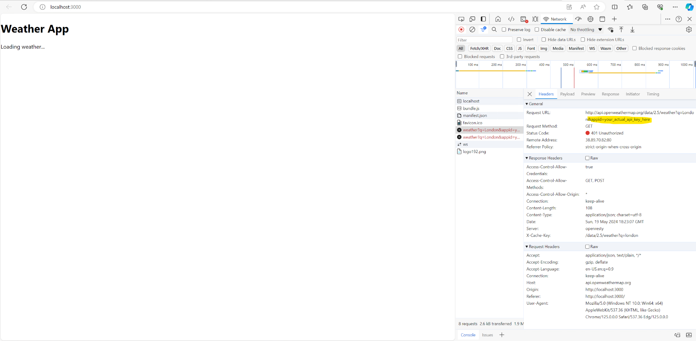{width="8.461674321959755in" height="4.15455271216098in"}

Using the API key in production as we currently do is not ideal because it is exposed to the public. This exposure will lead to unauthorized use, resulting in significant charges or DDoS attack, meaning that our API quota will be exceeded. Fortunately, we\'re currently using a free version of the API, which limits the financial risk but not the operational risk; excessive fake requests could still deny legitimate users access.

**Aside**

**Important Security Note Regarding GitHub:**

When you commit an API key to a public GitHub repository, GitHub's secret scanning tool detects and invalidates exposed API keys for about 30 to 40 different providers within minutes. However, this window is sufficient for attackers to compromise your key before it's invalidated, leading to potential security breaches and loss of provider trust. It\'s crucial to never commit API keys to public repositories to avoid these risks. For more details on GitHub\'s secret scanning and best practices, you can refer to GitHub\'s documentation on secret scanning [[About secret scanning - GitHub Docs]{.underline}](https://docs.github.com/en/code-security/secret-scanning/about-secret-scanning#about-secret-scanning-alerts-for-users)

**End aside**

To securely store and manage these API keys, you can utilize Azure Key Vault. By integrating Azure Key Vault, you can inject API keys at runtime through custom endpoints, ensuring secure key management.

If you have an existing API consider using the Azure API Management Service. This service acts as a wrapper for existing APIs, adding valuable features such as authentication, rate limiting, quota management, and URL rewriting. In particular, we will leverage the URL rewriting capability to automatically append the API key and secret from the Key Vault to requests on our backend. This will hide the API key from the public URL and prevent it from being mis-used. Note that an attacker could still call our API multiple times to initiate a DDoS on our API Key, but we will get into rate limiting later.

Here\'s how to set this up using Azure API Management Service:

1\. **Create a New API Management Service**: Begin by creating a new resource group, for instance, named \'CI-CD-Book-int\' in the East US region. Name the resource as desired, such as \'My API Management Service\', and fill in the organization name and administrative email according to your requirements. Choose the \'Developer\' pricing tier.

2\. **Manage Identity**: In the \'Manage Identity\' tab, enable the system-assigned managed identity to allow your API Management Service access to the Azure Key Vault. This setup requires configuring Azure Role-Based Access Control (RBAC) rules to establish the necessary permissions.

3\. **Installation**: Once all settings are configured, proceed to the \'Review + Install\' tab and initiate the creation of your API Management Service.

5\. **Configure API and Testing**: In the API Management Service:

\- Go to \'APIs\' and create a new HTTP API, such as a \'Get Weather\'.

\- The endpoint is just "/".

\- Initially, use \`https://httpbin.org\` for testing to ensure the setup is correct.

\- Select "Test" tab and then "Send". You should get a 200 OK response containing the content of the httpbin website homepage.

6\. **Key Injection and Endpoint Configuration**: Adjust the backend settings to append the API key to incoming requests:

\- Modify the service URL to \`http://httpbin.org/anything\` and save the changes.

In the below example, use the pretend API key listed below. This is because we are just testing our endpoint with a public server and we don't want to leak our actual API key.

Add the following policy to the inbound request:

\<!\--

\- Policies are applied in the order they appear.

\- Position \<base/\> inside a section to inherit policies from the outer scope.

\- Comments within policies are not preserved.

\--\>

\<!\-- Add policies as children to the \<inbound\>, \<outbound\>, \<backend\>, and \<on-error\> elements \--\>

\<policies\>

\<!\-- Throttle, authorize, validate, cache, or transform the requests \--\>

\<inbound\>

\<base /\>

\<set-backend-service base-url=\"https://httpbin.org/anything\" /\>

\<set-query-parameter name=\"api-key\" exists-action=\"override\"\>

\<value\>12345678901\</value\>

\</set-query-parameter\>

\</inbound\>

\<!\-- Control if and how the requests are forwarded to services \--\>

\<backend\>

\<base /\>

\</backend\>

\<!\-- Customize the responses \--\>

\<outbound\>

\<base /\>

\</outbound\>

\<!\-- Handle exceptions and customize error responses \--\>

\<on-error\>

\<base /\>

\</on-error\>

\</policies\>

At select save, then go back to the Test tab and then we run the request. You should get the following response or something very similar to it.

This is the expected response:

{

\"args\": {

\"api-key\": \"12345678901\"

},

\"data\": \"\",

\"files\": {},

\"form\": {},

\"headers\": {

\"Accept\": \"\*/\*\",

\"Accept-Encoding\": \"gzip,deflate,br,zstd\",

\"Accept-Language\": \"en-US,en;q=0.9,en-CA;q=0.8\",

\"Cache-Control\": \"no-cache, no-store\",

\"Host\": \"httpbin.org\",

\"Ocp-Apim-Subscription-Key\": \"986369bd5e1943aaac81cd4e87bde4f0\",

\"Referer\": \"https://apimanagement.hosting.portal.azure.net/\",

\"Sec-Ch-Ua\": \"\\\"Microsoft Edge\\\";v=\\\"125\\\",\\\"Chromium\\\";v=\\\"125\\\",\\\"Not.A/Brand\\\";v=\\\"24\\\"\",

\"Sec-Ch-Ua-Mobile\": \"?0\",

\"Sec-Ch-Ua-Platform\": \"\\\"Windows\\\"\",

\"Sec-Fetch-Dest\": \"empty\",

\"Sec-Fetch-Mode\": \"cors\",

\"Sec-Fetch-Site\": \"cross-site\",

\"X-Amzn-Trace-Id\": \"Root=1-66497521-4a028b2a52bd9d212f00e4db\"

},

\"json\": null,

\"method\": \"GET\",

\"origin\": \"154.5.165.200,13.91.254.72, 51.8.19.165\",

\"url\": \"https://httpbin.org/anything?api-key=12345678901\"

}

To ensure proper setup, start by creating a new Azure Key Vault and add a fake API key initially. This approach helps verify system functionality without exposing your real API key, especially since HttpBin is not secure for testing on a public website. Once you confirm that the system works as expected with the fake key, replace it with the actual API key. Additionally, update the endpoint to point to the actual weather API. Finally, conduct an end-to-end test by sending a sample request to see if everything is functioning correctly.

Here's how to do that.

**Setting Up a New Azure Key Vault**

1\. **Create the Key Vault**:

\- Navigate back to your resource group, specifically the CI-CD-Book-int one.

\- Click on \"Create New Azure Resource\", search for \"Key Vault\", and select it.

\- Name your Key Vault as \"CI_CD_Book_KV\" and leave the default settings intact.

\- Proceed to create the vault by clicking on \"View and Create\", then \"Create\".

2\. **Configure Access Permissions**:

\- After creation, go to \"Access Control (IAM)\" on the left-hand side of the Key Vault.

\- Click \"Add Role Assignment\", search for \"Key Vault Administrator\", and add yourself by selecting your user profile.

\- Review and confirm the role assignment.

3\. **Manage Secrets**:

\- Once access is granted, navigate to the \"Secrets\" tab within the Key Vault.

\- Click on \"Generate or Import\" to create a new secret. For instance, name it \"weather-API-key\" and set its value to \"5934672295\", then create the secret.

**Integrating Key Vault with API Management Service**

1\. **Link the Key Vault to API Management**:

\- In your API Management Service, locate the \"Named Values\" option under the subscriptions section.

\- Add a new named value titled \"weather-api-key\" with the type set to \"Key Vault\".

\- Select the \"CICD Key Vault\" and link the \"weather-API-key\" as the secret.

\- Set the identity as the system assigned managed identity and save your changes.

\- Confirm when prompted about adding the Key Vault secret User role to the IAM of this KV.

2\. **Update API Policy**:

\- Navigate to \"APIs\", select the \"Weather API\", and go to \"Get Weather\".

\- Edit the policy using the policy editor. Insert the named value by typing \"{{weather-api-key}}\" into the appropriate field to dynamically insert the API key into API requests.

\- Save your changes.

Now, update the policy to the following:

\<!\--

\- Policies are applied in the order they appear.

\- Position \<base/\> inside a section to inherit policies from the outer scope.

\- Comments within policies are not preserved.

\--\>

\<!\-- Add policies as children to the \<inbound\>, \<outbound\>, \<backend\>, and \<on-error\> elements \--\>

\<policies\>

\<!\-- Throttle, authorize, validate, cache, or transform the requests \--\>

\<inbound\>

\<base /\>

\<set-backend-service base-url=\"https://httpbin.org/anything\" /\>

\<set-query-parameter name=\"api-key\" exists-action=\"override\"\>

\<value\>{{weather-api-key}}\</value\>

\</set-query-parameter\>

\</inbound\>

\<!\-- Control if and how the requests are forwarded to services \--\>

\<backend\>

\<base /\>

\</backend\>

\<!\-- Customize the responses \--\>

\<outbound\>

\<base /\>

\</outbound\>

\<!\-- Handle exceptions and customize error responses \--\>

\<on-error\>

\<base /\>

\</on-error\>

\</policies\>

Now, you can use your base URI instead of calling the API directly. In my case, this is mine: [[https://my-api-management-service.azure-api.net]{.underline}](https://my-api-management-service.azure-api.net). In the React code, replace the call to the weather API endpoint with this URL.

You should be able to send a sample request to our API in the API Management service and you should be able to get a response back from the weather application.

After you've verified that everything is working, commit all changes and push to your branch.

If you\'re using a different cloud provider and don\'t have an API management service you can develop a custom application using C# or any other programming language of your choice. This application would consume the Key Vault at runtime through a managed identity. This method grants you greater control over the response processing and other aspects of API interaction because you are directly manipulating the code.

#### Tests {#tests .unnumbered}

We are going to refactor the code a bit more to make it more modular. While it is possible to say that we are making it more testable, testing isn't a means to an end. Currently, the weather is loaded via useEffect. This is not very modular and couples the act of retrieving the weather with how it is rendered. If you want to change a single thing about the weather, then you have to change how it is displayed. This makes it difficult for multiple people to work on the application, as well as with feature flags because it is coupled to how it is displayed.

Let's do a small refactor and see how we can write some tests.

+-----------------------------------------------------------------------------------------------------------------------------------------------------------------------------------------------------------------------------------------------------------------+
| To write effective tests for the \`Weather\` component and to make the application more testable, we need to structure our code in a way that is easier to isolate and verify individual parts. Here are some improvements and test examples for the component: |
| |
| \### Improving Code Structure for Testing |
| |
| 1\. **Decouple Data Fetching from Component Rendering:** |
| |
| Extract the logic that fetches data from the API into a separate function or custom hook. This separation makes it easier to test the fetching logic independently from the component\'s rendering logic. |
| |
| 2\. **Use Environment Variables Judiciously:** |
| |
| Ensure environment variables are used properly and securely, especially when building and testing. For production builds, consider server-side fetching or secure client-side API key handling mechanisms. |
| |
| 3\. **Error Handling:** |
| |
| Add more robust error handling and loading state management to improve user experience and make testing these states easier. |
| |
| \### Refactored Component Code |
| |
| Here's an example of how you could refactor the \`Weather\` component to make it more testable: |
| |
| \`\`\`jsx |
| |
| import React, { useState, useEffect } from \'react\'; |
| |
| import axios from \'axios\'; |
| |
| // Data fetching logic extracted to a custom hook |
| |
| function useWeather(apiKey) { |
| |
| const \[weather, setWeather\] = useState(null); |
| |
| const \[loading, setLoading\] = useState(true); |
| |
| const \[error, setError\] = useState(null); |
| |
| useEffect(() =\> { |
| |
| async function fetchWeather() { |
| |
| try { |
| |
| const response = await axios.get(\`http://api.openweathermap.org/data/2.5/weather?q=London&appid=\${apiKey}\`); |
| |
| setWeather(response.data); |
| |
| setLoading(false); |
| |
| } catch (error) { |
| |
| setError(error); |
| |
| setLoading(false); |
| |
| } |
| |
| } |
| |
| fetchWeather(); |
| |
| }, \[apiKey\]); |
| |
| return { weather, loading, error }; |
| |
| } |
| |
| function Weather() { |
| |
| const apiKey = process.env.REACT_APP_WEATHER_API_KEY; |
| |
| const { weather, loading, error } = useWeather(apiKey); |
| |
| if (loading) return \<p\>Loading weather\...\</p\>; |
| |
| if (error) return \<p\>Error fetching weather\</p\>; |
| |
| return ( |
| |
| \<div\> |
| |
| \<h1\>{weather.name}\</h1\> |
| |
| \<p\>Temperature: {weather.main.temp}°C\</p\> |
| |
| \<p\>Condition: {weather.weather\[0\].description}\</p\> |
| |
| \</div\> |
| |
| ); |
| |
| } |
| |
| export default Weather; |
| |
| \`\`\` |
| |
| \### Writing Tests |
| |
| Here are some test examples using Jest and React Testing Library: |
| |
| \`\`\`javascript |
| |
| import { render, screen, waitFor } from \'@testing-library/react\'; |
| |
| import axios from \'axios\'; |
| |
| import Weather from \'./Weather\'; |
| |
| jest.mock(\'axios\'); |
| |
| describe(\'Weather Component\', () =\> { |
| |
| test(\'renders weather data successfully\', async () =\> { |
| |
| const mockWeatherData = { |
| |
| data: { |
| |
| name: \'London\', |
| |
| main: { temp: 15 }, |
| |
| weather: \[{ description: \'Cloudy\' }\] |
| |
| } |
| |
| }; |
| |
| axios.get.mockResolvedValue(mockWeatherData); |
| |
| render(\<Weather /\>); |
| |
| await waitFor(() =\> expect(screen.getByText(\'London\')).toBeInTheDocument()); |
| |
| expect(screen.getByText(\'Temperature: 15°C\')).toBeInTheDocument(); |
| |
| expect(screen.getByText(\'Condition: Cloudy\')).toBeInTheDocument(); |
| |
| }); |
| |
| test(\'shows loading initially\', () =\> { |
| |
| render(\<Weather /\>); |
| |
| expect(screen.getByText(\'Loading weather\...\')).toBeInTheDocument(); |
| |
| }); |
| |
| test(\'handles errors in fetching weather\', async () =\> { |
| |
| axios.get.mockRejectedValue(new Error(\'Failed to fetch\')); |
| |
| render(\<Weather /\>); |
| |
| await waitFor(() =\> expect(screen.getByText(\'Error fetching weather\')).toBeInTheDocument()); |
| |
| }); |
| |
| }); |
| |
| \`\`\` |
| |
| \### Additional Considerations |
| |
| \- For production, consider implementing a backend service to handle API requests. This service can secure your API keys and manage the data before sending it to the frontend. |
| |
| \- Implement continuous integration (CI) to run these tests automatically when changes are made to the codebase. |
| |
| This structured approach enhances testability, security, and maintainability of the application. |
+=================================================================================================================================================================================================================================================================+
+-----------------------------------------------------------------------------------------------------------------------------------------------------------------------------------------------------------------------------------------------------------------+

If you were to run npm run test locally, you should see that all tests pass.

Now that we verified our changes locally, we can now set up the pipeline to see if those changes can be verified with a pipeline instead.

### Introduction to GitHub Actions and Workflows {#introduction-to-github-actions-and-workflows .unnumbered}

GitHub is a company that has a product called "Actions" (sometimes referred to as "GitHub Actions") that is a set of build servers and software that runs GitHub Actions workflows. GitHub Actions are essentially workflows, and also have build servers to run said workflows. These workflows are created by the developer and normally build, test, and lint the code using the GitHub Actions YAML syntax and run on the GitHub Actions build servers. These workflows have a specific syntax. They are authored in YAML, but its schema is called "GitHub Actions".

GitHub actions cannot host your website.There\'s another product called GitHub Pages which is primarily for static website hosting which you could use. However, we\'ll just stick with Azure just to keep things simple for now.

If you need more information on the specific intricacies of GitHub Actions, please see the GitHub Actions documentation. [[GitHub Actions documentation - GitHub Docs]{.underline}](https://docs.github.com/en/actions)

Let's build a pipeline that can do the following:

- Checkout the code (i.e., clone it onto the runner.)

- Build the code.

- Run automated tests, and linting.

- Publish artifacts to an artifact server, in this case, GitHub, along with a versioning strategy that will help identify which artifacts you are publishing.

- Deployed the website to Azure.

As you can see above, we\'ve already done the first three steps that the pipeline does locally except for linting--we haven't set that up yet.

Here\'s a concise overview of how GitHub workflows are structured:

- 1\. **Events**: Workflows begin with events, such as pushes or pull requests, which trigger the workflow.

- 2\. **Jobs**: Workflows may contain multiple jobs, but we will focus on a single job for simplicity. Each job specifies an environment to run in, indicated by a string that corresponds to an operating system and a pre-configured image. This image includes pre-installed software, allowing us to get started quickly and reduce setup times and costs.

- 3\. **Steps**: Each job is composed of multiple steps. These steps can use either the \`uses\` or \`run\` command:

- \- **Uses**: This command utilizes actions provided by GitHub Actions, sourced from the GitHub Marketplace. These actions are pre-configured scripts that handle tasks like software installation, version management, or building.

- \- **Run**: This command executes shell commands specific to the operating system defined in the job\'s environment, using bash scripting for Linux, for example.

- 4\. **Artifacts**: Typically, workflows end with steps for uploading artifacts, though the initial steps may also involve downloading or preparing artifacts.

+-----------------------------------------------------------------------+
| Workflow |
| |
| │ |
| |
| ├── Events (e.g., push, pull_request) |
| |
| │ |
| |
| ├── Jobs |
| |
| │ ├── Runs-on (Runner) |
| |
| │ │ |
| |
| │ ├── Needs (Dependencies on other jobs) |
| |
| │ │ |
| |
| │ ├── Steps |
| |
| │ │ ├── Uses (Actions) |
| |
| │ │ │ ├── Inputs |
| |
| │ │ │ ├── Outputs |
| |
| │ │ │ └── Environment (e.g., secrets, env variables) |
| |
| │ │ │ |
| |
| │ │ └── Run (Shell commands) |
| |
| │ │ |
| |
| │ ├── Environment Variables |
| |
| │ │ |
| |
| │ ├── Secrets |
| |
| │ │ |
| |
| │ ├── Services (Service Containers) |
| |
| │ │ |
| |
| │ └── Artifacts |
| |
| │ ├── Upload Artifact |
| |
| │ └── Download Artifact |
| |
| │ |
| |
| └── Workflow Commands (e.g., set-output, set-env) |
+=======================================================================+
+-----------------------------------------------------------------------+

\`\`\`

**Aside start**

The script echo hello world is a bash script. It\'s important to note that while Bash is commonly used, some scripts might be written for \`sh\`, a different shell with slight syntax differences. For users operating on Windows runners, be aware that these runners execute PowerShell scripts, not Bash scripts. This guide does not cover PowerShell extensively, but if you are new to Bash and plan to use it extensively, it might be beneficial to read a beginner\'s guide to Bash. Given its long-standing usage, Bash is likely to remain relevant for some time.

You might have noticed that the feedback loop for making changes to the workflow and seeing the results can be slow. Typically, you need to make edits, commit them, and then run the workflow on GitHub Actions to observe the output. To streamline this process, there are a few strategies you can employ:

1\. **Simplify Workflow Steps**: Ensure that the steps in your workflow are simple enough that they can be executed locally. This makes the whole process faster and more manageable.To use.Provider agnostic scripts, for example PowerShell scripts or bash scripts.

2\. **Use Docker Containers**: Create and use your own Docker container that mirrors the environment on GitHub Actions as closely as possible. This allows you to locally run and test your workflows in an environment that closely resembles the production setting on GitHub Actions.

3\. **Utilize the \'act\' Library**: The \'act\' library enables you to run your GitHub Actions locally. While \'act\' doesn't replicate the GitHub Actions environment perfectly, it\'s generally sufficient for simpler scripts.You could find some more information in the appendix on more information on how to set this up.

#### Setting up error notifications {#setting-up-error-notifications .unnumbered}

When it comes to handling errors in your workflow, encountering a syntax error provides a good opportunity to implement error notifications. These notifications are crucial for alerting your team about failures in the build pipeline. Such alerts are essential to maintaining confidence in the build artifacts, especially in production pipelines. While a failed build in a pull request might not warrant notifying the entire team---notifications should be configured for the main or production pipelines to ensure critical issues are addressed promptly.

**Setting Up Notifications**:

\- **Email Notifications**: Configure GitHub Actions to send email notifications to a designated recipient when the workflow fails.

\- **Integration with Messaging Platforms**: You can also integrate the workflow with messaging platforms such as Microsoft Teams, Slack, Discord, and others. Numerous plugins and services are available that notify you through instant messaging or even text messages and phone calls when a build fails.

Setting up email notifications for a failed GitHub Actions workflow involves a few steps within the GitHub platform, using the available features to send alerts when certain conditions are met. Here's how you can set this up:

Step 1: Verify Email Settings in GitHub

Before setting up notifications, ensure that your GitHub email settings are configured to receive notifications:

- Go to GitHub: Open your browser and navigate to GitHub.

- Navigate to Settings: Click on your profile picture at the top right corner, then select Settings.

- Access Notifications: From the sidebar, click on Notifications.

- Configure Email Settings: Ensure that the email under \"How you receive notifications\" is correct and that \"Email\" is checked. Also, check that you have \"Includes failed workflows\" under \"GitHub Actions\" to receive notifications for failed workflows.

- To rerun that failing workflow, then you should receive an e-mail that indicates that it is failed.Now I\'d like you to revert that commit to its initial state where the workflow was successful, because we\'re going to modify it somewhere.

**Aside end**

### Making the pipeline build and test our code {#making-the-pipeline-build-and-test-our-code .unnumbered}

The pipeline just prints hello world and It doesn\'t instill any confidence in the build artifacts. Let\'s change it to do things that are a bit more useful, such as writing some of these steps that we\'ve run locally, such as installing the dependencies, building the project, as well as testing the project. Edit the main dot yaml file and fill in the following contents.

name: Build client app

on:

workflow_dispatch:

pull_request:

types: \[opened\]

push:

branches:

\- main \# This trigger for the main branch means that if there is a push to the main branch in the workflow on the main branch will run.Since the workflow dispatch is also a trigger, this means that you can run the workflow manually, which is very useful for debugging purposes.

jobs:

build-and-deploy: \# A single job called build and deploy which is To run everything for now.

runs-on: ubuntu-latest

steps:

\- uses: actions/checkout@v2 \# The case that we are using a GitHub Action.Looking into what it GitHub action is a little bit later on.In this case, this GitHub Action is cloning our code.

\- name: Set up Node.js

uses: actions/setup-node@v2 \# Another GitHub action that installs.A version of Node specified by.The.Configuration options that it receives. In this case, the action is set up to receive a configuration called No version. We\'re passing in the version 14 to it. The ADV 2 specifies the version of a workflow and not the version of node.

with:

node-version: \'14\' \# Specify your Node.js version, fill it in from the previous step

\- name: Install dependencies

run: npm ci

\- name: Build the project

run: npm run build

\- name: test the project

run: npm run test

The workflow consists of a single job that includes several steps:

1\. **Checkout Step**: Uses \`actions/checkout@v2\` to clone the repository onto the runner and changes the current working directory to the root of the repository.

2\. **Node Version Setup**: Alters the node environment to use version 14, adjusting the path without removing the existing version of node.

3\. **Dependency Installation**: Executes commands like \`npm ci\` to install dependencies, similar to what would be done locally.

4\. **Build and Test**: Runs \`npm run build\` and \`npm run test\`, mirroring local development operations. However, it\'s important to note that the build server is wiped clean after these processes, leaving no artifacts for deployment except for possible log files.

In our current setup, the build pipeline automatically deletes itself upon completion, which unfortunately means any artifacts created during the build are also lost. To address this, we must selectively determine which parts of our application we want to deploy and save these as artifacts.

Fortunately, GitHub Actions provides a solution through the \`actions/upload-artifact\` action. This action enables us to create and automatically upload artifacts to GitHub's artifact repository. The artifacts are compressed during the upload, facilitating efficient storage and retrieval. Moreover, they can be accessed and downloaded later, even from other actions for example, during deployment or manually.

**Aside:** If your workflow involves multiple artifacts from different parts of the build, you can replicate this action as needed to publish various artifacts. It\'s crucial to name your artifacts clearly and systematically, as they will need to be identified and retrieved in subsequent steps of your workflow or future builds. Normally artifacts are associated with a build number or commit hash.

Add this code to the end of your workflow.

\- uses: actions/upload-artifact@master

with:

name: my-artifact

path: path/to/artifact

And your application\'s artifacts path may not be the same one that is used in this React application. Look in the appendix in this book to find out where the most common artifact paths are for most programming languages and project types.

Here is what the workflow looks like with all the steps together.

jobs:

all:

runs-on: "ubuntu-latest"

steps:

\- name: "Checkout code"

uses: "actions/checkout@v2"

\- name: "Install dependencies"

run: npm install

\- name: "Run tests"

run: npm test

\- name: "Publish artifacts"

uses: actions/upload-artifact@v3

with:

name: my-artifact-and-version

if-no-files-found: error \# important because if there are no artifacts, then something is wrong

path: \${{ github.workspace }}/output \# this path is wrong

If you need to upload more than one artifact, simply duplicate the action and run it again, as many times as you need. You have to publish artifacts because the runner will be discarded, including everything on it. Publishing them as artifacts allows them to be retained.

I would like you to push that commit to your branch with the new workflow and create a pull request on that branch.The build should run Importantly, will not let you merge unless the pipeline is finished and also complete.

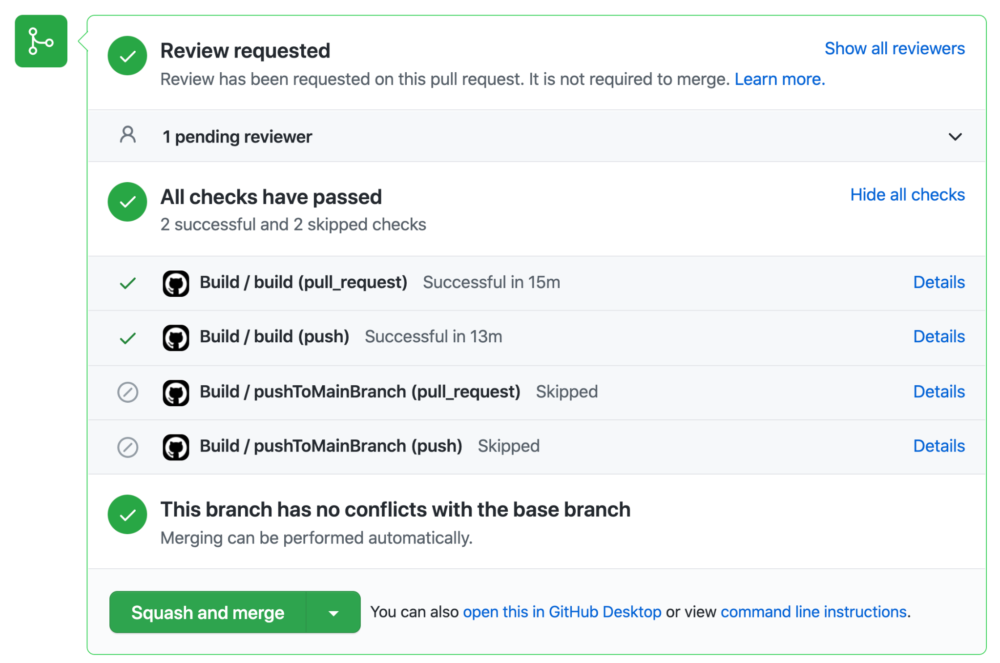{width="7.073176946631671in" height="4.690124671916011in"}

**Aside start**

**Note: some projects are not "compiled" in the traditional sense (i.e., interpreted), so they don't necessarily generate output files (for example, Python.)** In this case, the source code would probably be the artifacts (except for some files that might not be part of the build, such as some configuration files, .editorconfig, .gitignore, etc.)

Important Security Note: When using Actions from the GitHub Actions marketplace, you might notice a label like \"V2\" next to the action\'s name. This label represents a git tag associated with that action. For example, the \"actions/checkout@v2\" refers to version 2 of the checkout action from the \"actions\" repository. Using such tags can be convenient as it allows the action developer to update the code---such as introducing new features or fixing bugs---without users needing to manually update their workflows.

However, there are significant security risks. Since git tags are mutable, they can be changed. If a malicious user were to delete and recreate a repository, they could push harmful code and assign it to these commonly used tags. Even the same repository can be tagged the same tag but different codes for each tag. This means that the supposed \"V2\" tag could point to a malicious commit.

To mitigate these risks, consider two precautions:

1\. Minimize the use of actions from public repositories where possible.

2\. Instead of using a version tag, reference actions by the specific commit hash. While it\'s theoretically possible to replicate a commit hash in a different repository, it is highly unlikely and would be much more secure than using mutable tags.

**Aside end**

When you modify code, such as changing text in a React application, commit and push the changes, then wait for the workflow to complete. You will find artifacts from the pipeline run that can be downloaded and verified without needing React installed. This process ensures the deployed artifacts function correctly.

To manually access and download artifacts from a GitHub repository, follow these steps:

1\. **Navigate to Your Repository**: Log into your GitHub account and go to the repository where your workflow runs.

2\. **Access Actions**: In the repository, click on the \"Actions\" tab. This tab displays a list of all the workflow runs associated with the repository.

3\. **Select a Workflow Run**: Click on the specific workflow run you are interested in. This action will open a detailed page for that run.

4\. **Find Artifacts**: On the workflow run detail page, look for a section titled \"Artifacts\" at the bottom of the page. This section lists all the artifacts generated during the run.

5\. **Download Artifacts**: Click on the name of the artifact you want to download. GitHub will compile all the files into a single ZIP file and automatically start the download.

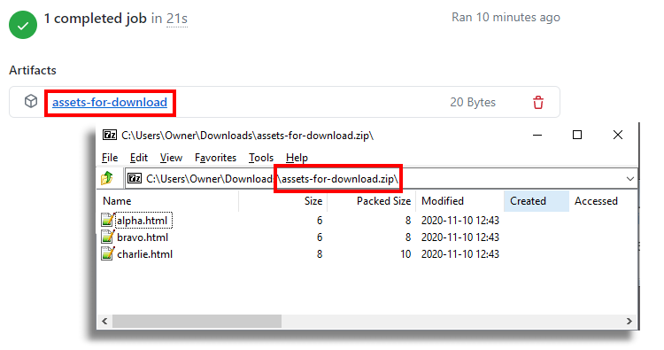{width="7.8125in" height="4.114583333333333in"}

### Deployment and Release Strategies {#deployment-and-release-strategies .unnumbered}

Deployment involves transferring build artifacts from your artifact repository to a server accessible to customers. In the previous step, we uploaded the app artifacts, and we will now create a deployment pipeline to deploy them. It\'s important to note that deployment does not necessarily mean visibility to customers; for instance, features might be hidden behind feature flags and only activated when needed, existing within the client\'s functional domain.

It is crucial not to rebuild artifacts once they are created. Rebuilding artifacts undermines confidence in the CI pipeline, as it suggests a lack of certainty about what is being deployed, potentially leading to unstable releases. Developers rely on the stability of these artifacts to trust the changes made.

Initially, we used the portal to manually create resources, which I mentioned during the introduction. Although this method helps understand the setup process, it\'s challenging to track changes manually. To improve this, we are planning to implement infrastructure as code using Bicep templates in Azure, which are more manageable and readable compared to ARM templates.

To demonstrate, we\'ll first deploy using the portal to establish the initial setup. Subsequently, we will migrate to deploying with a Bicep template, which will automate the creation of the necessary architecture and infrastructure to deploy the website. This step-by-step approach not only helps in understanding the deployment process through the UI but also sets the stage for a more efficient and scalable deployment strategy using Bicep templates.

Here are some options for deploying our static website application. Note that these methods may not apply to dynamic applications such as Java or Python web servers, which require a server to process requests and produce dynamic responses. Our current setup involves a client-side application that fetches data from a weather API. Later, we plan to integrate a backend as well.

Options:

- For simple web applications consisting primarily of static content like HTML, CSS, and JavaScript, utilizing a Content Delivery Network (CDN) is highly efficient. In this case, since there is no dynamic content that requires server-side execution, all we need is to serve the static files. To achieve this, we can use a storage account coupled with a CDN. This setup ensures that the content is delivered quickly to the user, as everything is downloaded and executed directly in the web browser without the need for Docker containers or similar technologies.

- For server-side applications that include backend logic, it\'s beneficial to use Docker containers or other server infrastructure. These applications require server-side execution, so as we expand our web application with backend services, Docker becomes invaluable. Containers can be published to a registry, facilitating version control and deployment. This setup allows for more complex applications that need to process data on the server before sending it to the client.

Deploying a simple static website using an Azure Storage Account and a Content Delivery Network (CDN) can be a more cost-effective and scalable option, especially for serving static content like HTML and JavaScript files globally. Here's a guide on how to set this up:

\### Step 1: Install Azure CLI

Before you start, ensure that the Azure CLI is installed on your computer. If not installed yet, download and install it from the \[official Azure CLI page\](https://docs.microsoft.com/en-us/cli/azure/install-azure-cli).

\### Step 2: Log in to Azure

Open your terminal or command prompt and log in to your Azure account using the following command:

\`\`\`bash

az login

\`\`\`

\### Step 3: Create a Storage Account

\- **Navigate to Storage Accounts**: In the Azure portal, click on \"Create a resource\" and search for \"Storage Account\".

\- **Set Up Basic Details**:

\- Choose a subscription and select the existing resource group.

\- Enter a unique name for your storage account.

\- Select a region close to your target audience to minimize latency.

\- Choose \"Standard\" performance, which is adequate for static content.

\- Select \"StorageV2 (general purpose v2)\" for the account type, as it supports static website hosting.

\- **Review and Create**: Review your settings and create the storage account.

\### Step 4: Enable Static Website Hosting

\- **Configure Static Website**:

\- After your storage account is created, go to its overview page.

\- Navigate to the \"Static website\" settings under the \"Data management\" section.

\- Enable static website hosting by selecting \"Enabled\".

\- Specify \"index.html\" as the index document name and \"404.html\" as the error document path.

Make sure to disable storage account key access.This is important because Georgia county keys can be used to access your BLOB container from almost anywhere with.A weak form of authentication. This is just essentially a password. We\'re gonna be using something instead called a managed identity or a Federated credential.

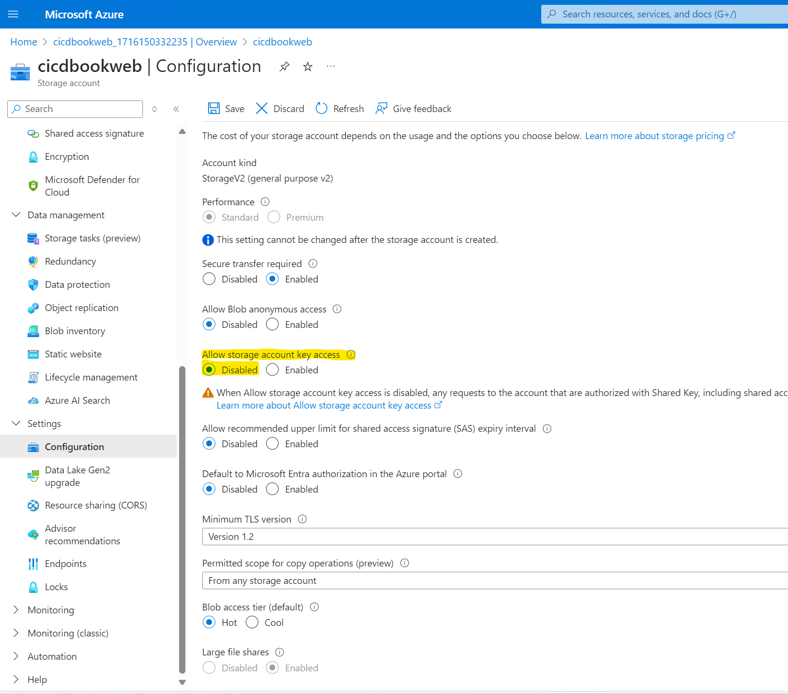{width="10.706964129483815in" height="9.42763888888889in"}

In the Storage account, navigate to either the Access Management tab or the Access Control (IAM) tab. Add yourself as a Storage Account Contributor and a Storage Blob Data Contributor at the storage account level.

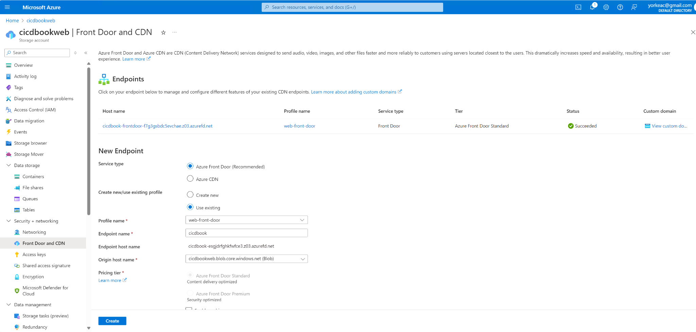{width="10.151042213473316in" height="4.857432195975503in"}

Sample HTML file with just some trivial contents, for example the text Hello world.

\#### Example:

To upload an HTML file named \`index.html\` from your local machine to the \'\$web\` container in your storage account, use:

\`\`\`bash

az storage blob upload \--account-name cicdbookweb \--container-name '\$web' \--name index.html \--file /local/path/to/index.html

\`\`\`

\### Step 7: Verify Upload

Confirm that your file has been successfully uploaded to the blob container:

\`\`\`bash

az storage blob list \--container-name cicdbookweb \--output table

\`\`\`

\### Step 8: Set Up Azure CDN for Faster Content Delivery

\- **Create a CDN Profile**:

\- Go to the Azure portal, click on "Create a resource", find and select "CDN".

\- Choose or create a CDN profile and select a pricing tier (Standard Microsoft is recommended).To defaults and click.Next.

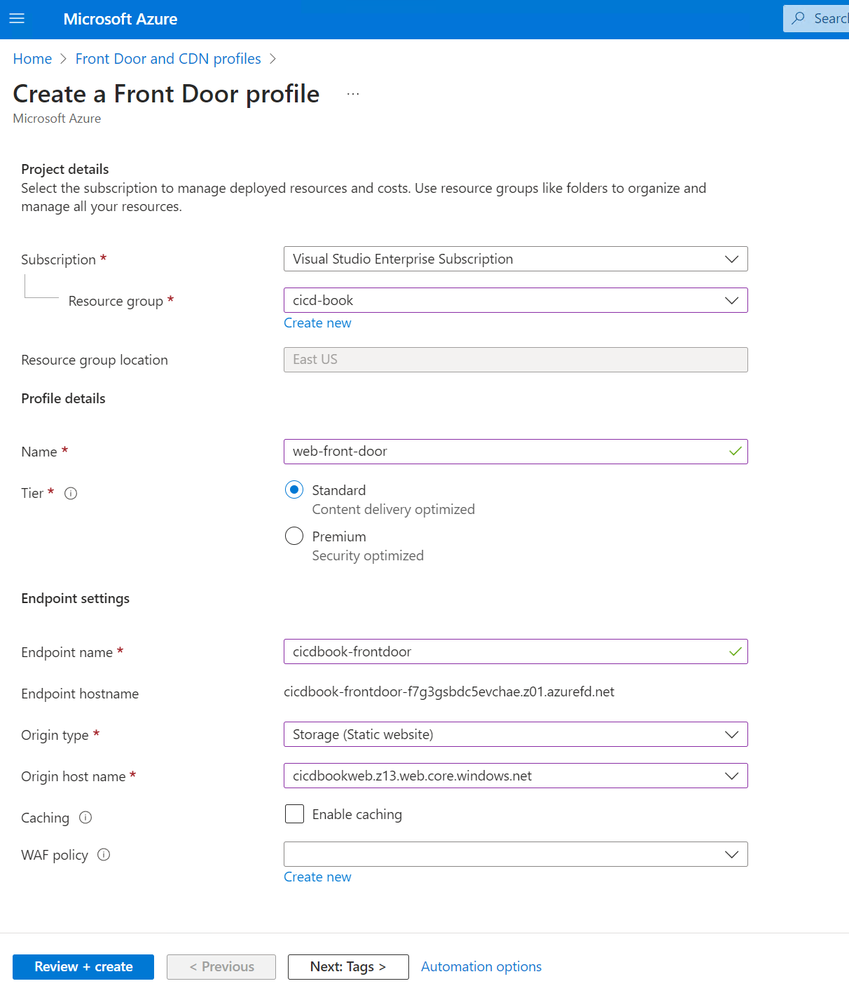{width="5.42397419072616in" height="6.381673228346457in"}

\- **Deployment**: Note that it may take some time for the CDN to propagate globally.

Select review plus create.

\### Step 9: Access Your Deployed Site

\- **Site URL**:

\- Once the CDN is fully deployed, use the CDN endpoint URL to access your website, available in the CDN endpoint settings in the Azure portal.

\- If you have configured a custom domain, use that URL instead.

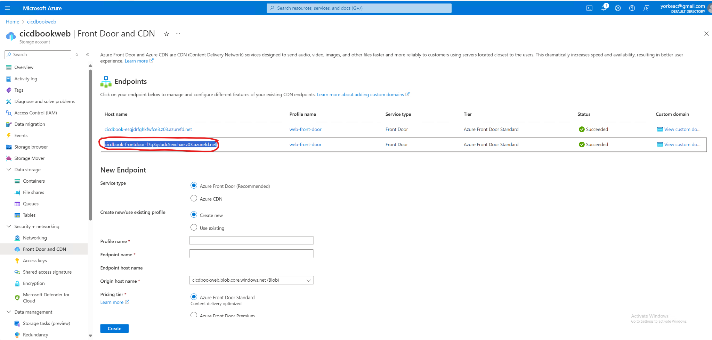{width="9.005208880139982in" height="4.304735345581802in"}

You navigate to the host and the previous screenshot that you should see your sample HTML file.

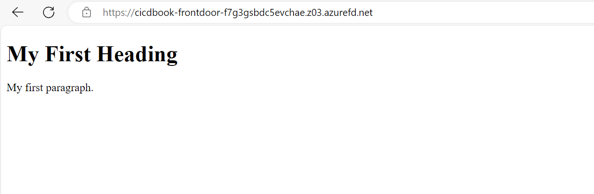{width="8.76562554680665in" height="2.8666152668416447in"}

Create a new workflow at .github/workflows/deploy.yml and insert the following content:

\- Add a GitHub Actions workflow file to handle deployment:

\`\`\`yaml

name: Deploy to Azure Storage

on:

push:

branches:

\- main

jobs:

download-and-deploy:

runs-on: ubuntu-latest

steps:

\- name: Checkout Repository

uses: actions/checkout@v2

\- name: Download Artifacts

uses: actions/download-artifact@v2

with:

name: your-artifact-name \# Specify your artifact name here

path: path/to/artifacts \# Specify path to download the artifacts to

\- name: Deploy to Azure Blob Storage

uses: Azure/azure-cli@v1.1.0 \# Using official Azure CLI action for deployment

with:

inlineScript: \|

az storage blob upload-batch -s path/to/artifacts -d \$web \--connection-string \${{ secrets.AZURE_STORAGE_CONNECTION_STRING }}

az storage blob sync -s path/to/artifacts -d \$web \--connection-string \${{ secrets.AZURE_STORAGE_CONNECTION_STRING }}

env:

AZURE_STORAGE_CONNECTION_STRING: \${{ secrets.AZURE_STORAGE_CONNECTION_STRING }}

\`\`\`

\- **Secure Your Workflow**:

\- Store your Azure storage connection string in GitHub Secrets to keep it secure.

Now if you go to the URL corresponding to the Azure CDN, potentially after 5 or 6 minutes for the CDN refresh, you should see your React application along with the weather app.

This approach works fairly well for simple projects, but it can become complex when managing multiple workflows. Currently, we have two distinct workflows: one that automatically deploys when changes are pushed to the main branch, and another that runs on pull requests to ensure confidence in the artifacts. The challenge arises in tracking which version or application is in production due to these separate workflows. It becomes unclear, for instance, after a pull request is merged into the main branch, which environment the application is currently in or if it\'s ready for QA.

To address this, GitHub offers features like jobs and environments that help structure workflows more clearly. These tools enable you to track your application\'s progression through its entire lifecycle in a visible and organized manner. This is crucial when multiple team members are committing to pull requests, potentially creating chaos without a clear order. Implementing structured workflows ensures you can easily identify which version is being tested and what is moving to the next stage.

### Jobs and environments {#jobs-and-environments .unnumbered}

Before we explore GitHub workflows, it\'s essential to understand the basics like jobs and environments. These elements are critical for structuring effective workflows, especially as we deploy our weather application. A clear grasp of these elements ensures that the workflow accurately reflects the application\'s current stage---whether it\'s integration, pre-production, or production. This clarity is vital for tracking feature releases and maintaining transparency about the status of ongoing changes.

Let's start with jobs.

Jobs in workflows are crucial for managing transitions between different stages and incorporating manual approval processes. Each job operates as an independent unit within a workflow, running on its own virtual machine or container and consisting of multiple steps. This independence allows for clear demarcation points where manual approvals can be inserted, with the ability to pause for up to 30 days without any ongoing computation.

Now, what are environments?

Environments in GitHub Actions enhance the deployment process by grouping jobs into distinct stages. This grouping not only helps in managing the deployment process more effectively but also conserves resources by pausing the workflow between stages, providing a unified and controlled view of the deployment pipeline.

Environments are particularly useful in complex workflows where multiple stages are involved, such as moving from integration to pre-production and then to production, facilitating a seamless transition and effective management throughout the deployment process.

**Aside start**

Workflow Structure and Naming:

- Use concise job names (ideally under 18 characters) for clear visibility in the GitHub interface.

- Structure workflows strategically to maximize parallelism. For example, separate build and deploy stages can run concurrently.

Example Workflow:

- Our workflow employs two jobs: \"build\" and \"deploy\". \"Build\" handles tasks like software compilation, while \"deploy\" manages security scans and deployment. Artifacts from \"build\" are passed to \"deploy,\" ensuring isolated environments.

Efficient Deployment Strategies:

- Splitting workflows: Deploy to staging in one workflow, then trigger a separate workflow for production deployment after review.

- Creating separate jobs for each task can introduce overhead and complicate environment variable management by requiring broader scoping, potentially increasing security risks. It also involves repeatedly uploading and downloading artifacts, adding complexity. Additionally, while jobs can be parallelized, this may not always align with your script\'s structure. Organizing a script into multiple jobs can obscure the workflow\'s overall structure, making it difficult to understand dependencies and parallelization opportunities.

- Jobs allow for precise scoping of environments to specific tasks. For instance, if you have a production environment variable like a GitHub PAT, you can restrict its access to only the necessary steps. By assigning this variable to a particular job, such as deployment, you prevent unrelated jobs, like a \"prepare cache\" step that doesn\'t require production credentials, from accessing it. This ensures that production credentials are confined to the relevant job, enhancing security.

**Aside end**

Let's get this set up and show how you can use jobs and environments to create a pipeline to production, including manual approval stages.

+-----------------------------------------------------------------------+
| jobs: |
| |
| build: |
| |
| runs-on: "ubuntu-latest" |
| |
| name: "Build" \# this is optional |
| |
| steps: |
| |
| \- name: "Checkout code" |
| |
| uses: "actions/checkout@v2" |
| |
| \- name: "Install dependencies and build" |
| |
| run: \| |
| |
| npm install |
| |
| npm run build |
| |
| test: |
| |
| runs-on: "ubuntu-latest" |
| |
| steps: |
| |
| \- name: "Checkout code" |
| |
| uses: "actions/checkout@v2" |
| |
| \- name: "Install dependencies and test" |
| |
| run: \| |
| |
| npm install |
| |
| npm test |
+=======================================================================+
+-----------------------------------------------------------------------+

That workflow is displayed as follows.

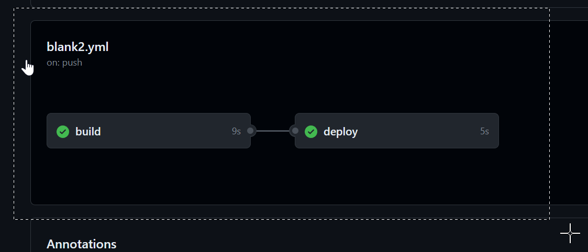{width="5.971965223097113in" height="2.5665671478565177in"}

No steps in the "deploy" job start until the "build" job is complete. This is because the "deploy" job has a "needs" on the build job.

There are few reasons why this is helpful. First, it is very clear from a glance which job(s) have succeeded and which were not executed. For example, if the build step failed, then the deploy wouldn't have succeeded. You can click on build to see its logs, just for its steps. The other reason is it is clear of the status of the deployment, and where the build currently exists. So, for example, say you do a deployment, then everyone can see that it is in the staging phase, and has not yet been deployed to production yet.

If we make a bunch of jobs, and a bunch of dependencies (e.g., needs), then it will be getting a bit more complex. When we start to create more complex workflows, jobs will be a way to help group related tasks together, and to provide them with dependencies.

- 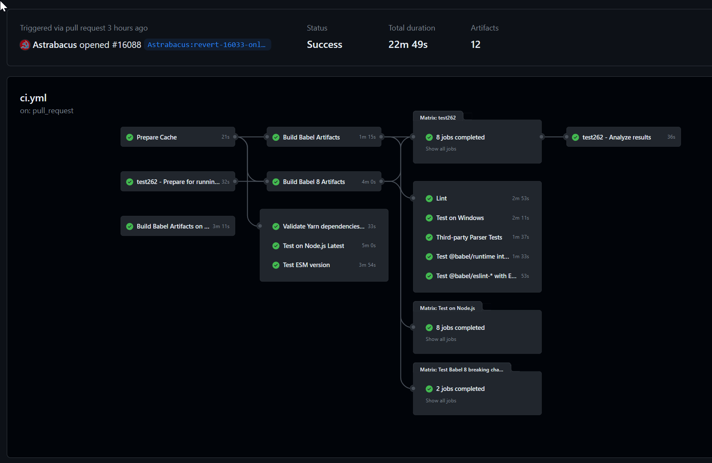{width="6.5in" height="4.236111111111111in"}

- [[Revert \"Only evaluate own String/Number/Math methods\" · babel/babel@9ec1cb5 (github.com)]{.underline}](https://github.com/babel/babel/actions/runs/6761970399)

This workflow setup allows you to specify inputs and set the release type. For instance, if you wish to deploy commits from your main branch to the staging environment, you can manually input this, ensuring deployment stops at staging. Alternatively, you can deploy directly to production, though it will pass through each environment requiring manual approvals. You must configure these approvals and designate who has the authority to advance to the next step, such as requiring manager approval to move from staging to production.

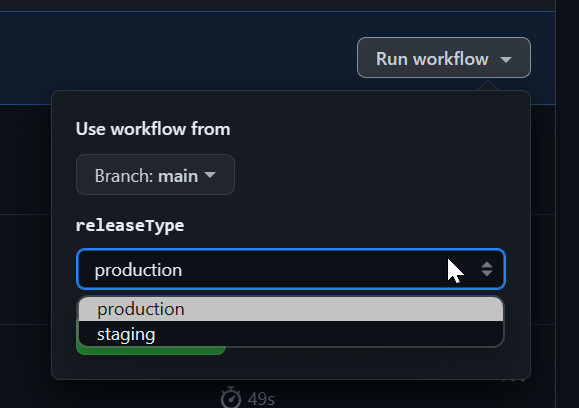{width="6.03125in" height="4.25in"}

You can select which environment you'd like as well.

run-name: Pipeline run by @\${{ github.actor }} looks very useful for tracking release progress

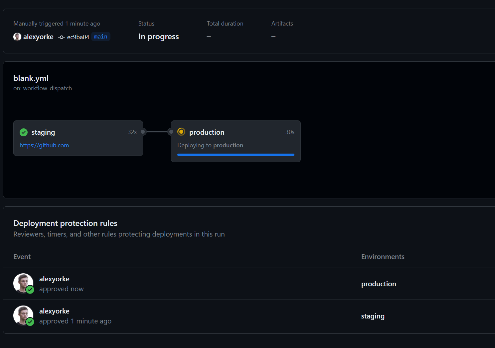{width="6.5in" height="4.583333333333333in"}

If you try to start another instance of this workflow while it is running, then it will queue up and not run concurrently. This is important because otherwise you might have two scripts trying to deploy to production at the same time, which would cause a race condition (bad.)

You might want something like this,

\- name: Display Release Version

run: echo \"Deploying Release Version \$RELEASE_VERSION\"

Which can indicate which release is currently being deployed and where they are at.

You need GitHub Enterprise to set up pre-deployment checks (i.e., getting someone to approve before the next stage continues.) Since you are only allowed to specify five people per approval, then you can use teams (e.g., create a QA team, and a developer team) which should only use up two slots, but allow for more people to theoretically approve.

A typical scenario is to get QA to approve before it moves to the next stage. Let's show how to set up this sample scenario.

\### Step 1: Define Environments in Your Repository

First, you need to set up environments in your GitHub repository where you can specify protection rules including manual approvals.

1\. **Navigate to Your Repository Settings**:

\- Open your GitHub repository, go to \"Settings\" \> \"Environments\" (found in the sidebar under \"Security\").

2\. **Create a New Environment**:

\- Click on \"New environment\".

\- Name your environment (e.g., \`staging\`, \`production\`).

\- Click \"Configure environment\".

3\. **Set Up Protection Rules**:

\- Under \"Environment protection rules\", you can add required reviewers who must approve deployments to this environment.

\- Add the GitHub usernames of the individuals or teams who should approve deployments. For example, you can add a "QA team" that consists of a few people, and tey either all hae to approve or a single person has to approve.

\- You can also specify other settings, such as wait timers or IP address restrictions if needed.

\- Click \"Save protection rules\".

\### Step 2: Update Your GitHub Actions Workflow

After setting up your environments with required approvals, you need to modify your GitHub Actions workflow to use these environments.

1\. **Edit Your Workflow File**:

\- Go to your repository\'s \`.github/workflows\` directory.

\- Open the YAML file for the workflow you want to add manual approvals to.

2\. **Add the Environment to Workflow Jobs**:

\- Identify the job(s) in your workflow that should require approval before they run. Add the \`environment\` key to those jobs, specifying the name of the environment you configured.

Here's an example snippet:

\`\`\`yaml

jobs:

deploy:

runs-on: ubuntu-latest

environment:

name: production

url: \${{ steps.deploy.outputs.url }} \# Optional: This can show a URL in the GitHub deployment

steps:

\- name: Checkout code

uses: actions/checkout@v2

\- name: Setup Node

uses: actions/setup-node@v2

with:

node-version: \'14\'

\- name: Install dependencies

run: npm install

\- name: Build and Deploy

id: deploy

run: \|

npm run build

echo \"::set-output name=url::http://example.com\" \# Simulated deployment output

\`\`\`

\### Step 3: Commit and Push Changes

After editing your workflow file:

\- Commit the changes: Provide a commit message that clearly states you've added environment protections with manual approvals.

\- Push the commit to your branch.

\### Step 4: Trigger the Workflow

Push or merge a commit that triggers the modified workflow. If the workflow accesses a job that uses the protected environment:

\- The job will pause, and GitHub will require the specified approvers to review and approve the run.

\- Go to the \"Actions\" tab of your repository to see the pending approval.

\### Step 5: Approve the Workflow

\- Authorized reviewers can go to the \"Actions\" tab, click on the workflow run, and then click \"Review deployments\".

\- They can then approve or reject the deployment.

\### Step 6: Monitor the Deployment

After approval, watch the workflow continue its execution. If you provided an output URL in the environment configuration, GitHub would link the deployment to this URL for easy access.

### Creating releases and "checkpoints" {#creating-releases-and-checkpoints .unnumbered}

In application development, a \"release\" marks the deployment stage where features become accessible to customers. This concept is crucial for tracking project progress, customer engagement, feature usage, and security updates. Releases also allow reverting to previous versions, though upgrading is generally preferred.

Managing releases can be complex. Determining version numbers, categorizing changes (major/minor), and meticulously documenting updates across files, documentation, what might break external libraries and customers, what changed and how to interpret those changes, and dependencies can be challenging. Manual processes are prone to errors, like forgetting version updates. This might also involve publishing your package to various repositories, all of which have their own requirements and the metadata must be correct to ensure compatibility with the developers.

GitHub Actions simplifies release management by tagging commits, auto-generating changelogs, and even refining commit messages into cohesive release notes, all within the deployment pipeline. You have to use one of the scripts or GitHub Actions below to do these releases as they do not occur automatically. Pre-release designations help track updates before production deployment.

There are two main ways to do versioning. One way is called SemVer (semantic versioning) which consists of a major, minor, and build number. This is commonly used when developing APIs and libraries, as developers should be made aware of breaking changes.

The other way is an evergreen strategy, which involves using a continuous version, for example the git hash or the date. This is usually used for consumer facing applications, like Teams or Skype. There are some exceptions, for example, when considering a major redesign, you might use a major version (e.g., Teams v2.) When was the last time you thought about Chrome's version number? It sort of auto-updates using an ever-green version strategy.

There's many different actions and libraries that you can use to create versions. It's recommended to use a pre-built solution as managing version numbers and incrementing them can become complex quickly.

Interesting: [[Release Flow: How We Do Branching on the VSTS Team - Azure DevOps Blog (microsoft.com)]{.underline}](https://devblogs.microsoft.com/devops/release-flow-how-we-do-branching-on-the-vsts-team/)

Here are just a few.

- [**[https://stackoverflow.com/a/69123272/220935]{.underline}**](https://stackoverflow.com/a/69123272/220935)

- https://github.com/GitTools/GitVersion

- https://github.com/conventional-changelog/standard-version

- https://github.com/semantic-release/semantic-release

- https://github.com/dotnet/Nerdbank.GitVersioning

- https://github.com/adamralph/minver

- https://github.com/conventional-changelog/conventional-changelog

- https://github.com/googleapis/release-please

- https://github.com/changesets/changesets

- [[https://github.com/release-it/release-it]{.underline}](https://github.com/release-it/release-it)
