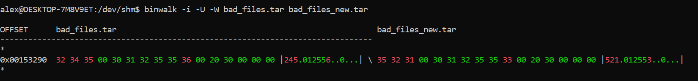

## Security and reproducibility {#security-and-reproducibility .unnumbered}

**Add Git Credential Manager here too and say to use OAuth instead of PATs**

### Setting up security policies {#setting-up-security-policies .unnumbered}

- Security is very important when working with continuous integration repositories. This is because continuous integration has an achilles heel: it makes it very easy to get changes to production, which means that attackers can also make malicious changes to production easily. Therefore, it is important that you have strong security policies to make sure that only authorized users are able to access the repository and to perform certain actions. This means that one has to prevent a single unauthorized account from doing bad changes.

- Right now, each developer has an identity. This means that if a developer's account is compromised, then the damage can be tracked and the account can be disabled or reset.

- Make sure that a PR requires at least two approvers in order to be merged (not including the person who authored the PR.) These policies are usually managed by your CI/CD software. Of course, if there is only a single person on the team (or two people), then it might not make sense for two people to approve.

​// Start of Selection

### Useful References

- [Security best practices - Azure DevOps | Microsoft Learn](https://learn.microsoft.com/en-us/azure/devops/organizations/security/security-best-practices?view=azure-devops)
- [Use Azure Key Vault secrets in GitLab CI/CD | GitLab](https://docs.gitlab.com/ee/ci/secrets/azure_key_vault.html)
- [Security hardening for GitHub Actions - GitHub Docs](https://docs.github.com/en/actions/security-guides/security-hardening-for-github-actions)

After reviewing the information from Azure DevOps, GitLab, and GitHub Actions, we can combine the similar points and extract general themes as follows:

### 1. **Authentication and Access Control**

- **User and Admin Access**: Always grant the least required permissions. Use systems like Microsoft Entra Privileged Identity Management (PIM) for Azure or ID Tokens for OpenID Connect (OIDC) Authentication in GitLab for tighter access controls.

- **Tokens and Service Accounts**: Use tokens like the GITHUB_TOKEN in GitHub, service principals in Azure, and ID tokens in GitLab with specific scopes. Service accounts should have limited privileges and zero interactive sign-in rights. PATs (Personal Access Tokens) should be scoped, time-limited, and securely stored.

- **Cross-repository Access and Service Connections**: Scope access strictly to necessary resources, using service connections or authentication tokens, and avoid broad permissions.

### 2. **Pipeline and Workflow Security**

- **Pipeline Construction and Execution**: Use templates in Azure Pipelines, manage definitions with YAML, and enforce code review policies. In GitLab, make use of project-level secure files. Ensure jobs, like in GitHub Actions, run on specific branches only and sanitize inputs in build scripts.

- **Runner Impact and Management**: Understand the potential risks with compromised runners (e.g., in GitHub Actions). Utilize hardening measures, and if self-hosting runners, ensure they're isolated and grouped properly. Consider ephemeral runners for added security.

- **Secret Management**: Store secrets securely, using tools like Azure KeyVault, HashiCorp Vault in GitLab, or avoid logging them in pipeline variables. Use specific CI/CD variables for third-party integrations.

### 3. **Third-Party Integrations and Tools**

- **Integration Best Practices**: Disable outdated or insecure methods, like Azure Classic service connections or PAT-based GitHub authentication. When integrating GitHub with Azure DevOps, avoid personal accounts.

- **Tooling and Automated Checks**: Use tools like OpenSSF Scorecards in GitHub to detect supply chain risks, and consider tools for downloading secure files in GitLab or checking software bills of materials (SBOM) in GitHub runners.

### 4. **Auditing and Monitoring**

- **Logging and Error Checks**: Monitor service account activity, utilize security logs for account activities, and audit logs for organization activities (especially in platforms like GitHub). In GitLab, use error messages and administrative tools for diagnosing issues.

- **Repository and Branch Monitoring**: Implement repository-specific security policies, disable potentially insecure features like repository forking in Azure, and monitor production build definitions for potential credential leaks.

### 5. **Deployment and Service Configuration**

- **Service Connection Scope**: In Azure DevOps, specifically scope service connections to necessary resources. Avoid generic contributor rights and use purpose-specific team accounts.

- **Environment Distinction**: Maintain a clear boundary between test environments and production. Ensure production secrets are kept separate and securely stored.

By consolidating similar points across the three platforms (Azure DevOps, GitLab, and GitHub Actions), these general themes provide an overarching perspective on best security practices in DevOps environments.

### {#section-11 .unnumbered}

The integration of security into the development and deployment lifecycle is an essential part of modern software practices. The term "DevSecOps" has emerged to emphasize this integration, underscoring the importance of security throughout the DevOps lifecycle. When it comes to books about CI/CD and even broader software development topics, there are several security-related areas that are often underemphasized or overlooked:

1. **Shift-Left Security**  
   The idea behind "shifting security left" is to integrate security considerations and checks earlier in the development process. While some CI/CD books might touch on automated testing or code quality checks, they may not delve into integrating security scanning tools, static analysis for security vulnerabilities, or dependency checks in the early stages of the pipeline.

2. **Secrets Management**  
   Handling API keys, database credentials, certificates, and other secrets is critical in CI/CD pipelines. Many books might not detail best practices for secrets management, like using secret managers (e.g., HashiCorp Vault, AWS Secrets Manager) or how to rotate and revoke secrets.

3. **Immutable Infrastructure**  
   The concept of immutability, where infrastructure is never modified after it's deployed (and is instead replaced), can enhance security. This approach reduces the attack surface and ensures consistency. Many books might not discuss the security benefits of this method in detail.

4. **Container Security**  
   As containerized applications and microservices architectures become more popular, securing containers is paramount. This includes scanning container images for vulnerabilities, ensuring containers run with minimal permissions, and using trusted base images. Many books might not go into the intricacies of container security.

5. **Infrastructure as Code (IaC) Security**  
   IaC tools like Terraform or CloudFormation have their vulnerabilities. Some books might not discuss how to secure IaC scripts, best practices for code reviews, or the importance of scanning IaC for misconfigurations.

6. **Runtime Application Self-Protection (RASP)**  
   RASP solutions provide real-time application security, detecting and blocking attacks in real-time. The integration of RASP into CI/CD might be an overlooked topic in many beginner books.

7. **DAST and SAST**  
   Dynamic Application Security Testing (DAST) and Static Application Security Testing (SAST) are methodologies for identifying vulnerabilities in running applications and source code, respectively. Their integration into CI/CD pipelines can be crucial but might not be thoroughly covered.

8. **Incident Response in CI/CD**  
   How to handle security incidents, particularly in a CI/CD context (like rolling back insecure deployments or patching in a CI/CD model), can be a topic that's glossed over.

9. **Supply Chain Attacks**  
   Ensuring the integrity of software components, packages, and dependencies is critical to prevent supply chain attacks. Some books might not delve into the importance of verifying component integrity or the risks of using outdated or compromised packages.

10. **Compliance and Auditing**  
    In regulated industries, compliance with security standards is mandatory. How to ensure and validate compliance in a CI/CD model might not always be explored in depth.

Given the importance of security in today's software landscape, those interested in CI/CD should seek out resources that give due attention to security considerations. If a general CI/CD book doesn't cover security in depth, consider complementing it with resources specifically focused on DevSecOps and security best practices in the context of modern software development and deployment.

- [[https://stackoverflow.com/a/49552383/220935]{.underline}](https://stackoverflow.com/a/49552383/220935) for using the job token instead of long-lived ssh keys to clone repo

- [[Automatic token authentication - GitHub Docs]{.underline}](https://docs.github.com/en/actions/security-guides/automatic-token-authentication) github auth token, don't use ssh keys pls

### Why is security important?

- Why care about CI/CD security? Isn't it all containerized and isolated anyway?

- The goal of CI/CD is about making it super easy to move changes from a developer's workstation and into production as quickly as possible. This means that malicious code can also make its way to production easily.

- The issue is that isolation can only go so far. Isolation is between other containers or VMs on the host, but does not protect the contents inside of the VM. This means that unauthorized users may run code or have it added to the build artifacts. It also does not prevent isolation from the internet, that is, if the pipeline downloads a malicious resource, then it can run it in the pipeline, and infect the build artifacts.

- Unauthorized users could create branches that contain malicious code that is run on the CI. This could cause intellectual property to be leaked, such as the contents of the source code on the CI pipeline being uploaded to another server. This is because it is usually possible to change the build script.

- This is of special importance because the pipeline usually contains secrets, injected through environment variables or added to temporary files in the machine. Malicious scripts may gain access to these credentials and can provision other VMs and resources outside of the pipeline. For example, using API keys.

- The exact process to set up YubiKeys and other devices varies depending on the device used, therefore, the instructions won't be provided in great detail here. However, I will go over an outline. The general thread is that engineers are issued a physical device that they can use to log in. The device does not usually store passwords and should not be considered a password manager. Engineers should contact the server administrator immediately if they suspect that their device has been lost or stolen. YubiKeys (and other devices) can't protect against every single possible threat, in fact, nothing can. Make sure that you have backup authentication methods in case your YubiKey is not available or it is lost (and you need to recover your account via the administrator.) YubiKeys can also be used on an individual level too to increase your security.

- How do I secure production? I already have 2FA set up and I get an SMS. Why is that considered insecure, I never let my phone out of my sight, right? Go into SMS attacks/SIM attacks.

- How do I make it so that another engineer has to approve someone else's request to access production systems outside of the CD pipeline? All major cloud providers support this scenario. It might be called "Azure Privileged Identity Management (PIM)", "Google Cloud Identity Platform", or "AWS SSO". For other cloud providers, see their RBAC (Role Based Access Control) or permissions pages to see if they support this scenario.

- Start with security when you start with your stories/tasks, don't re-engineer after-the-fact. Add tests for security.

- Only authorized users should have access to the codebase to download artifacts.

- Security monitoring on server side, making sure that application does not make strange HTTP requests.

- Keep secrets out of codebase

- SBOMs (secure bill of materials)

- Many application security scanning tools

- Secret scanning

- There might be unintentional security vulnerabilities in your application, such as embedding passwords inside of the build artifacts that are then published to customers.

- Packages used on CI servers may have security vulnerabilities, some which may have not been reported yet. Some genuine packages may have security vulnerabilities.

- This has happened on numerous occasions. For example, the removed packages from npm.

- Malicious use of resources. Even if nothing infects the build artifacts, or remains undetected, it can use excessive CPU and make the builds take longer. This can cost the organization money and resources.

- Expose security telemetry to developers ([[Pragmatic Pipeline Security - James Wickett - YouTube]{.underline}](https://www.youtube.com/watch?v=Po66ANjYbHA)) for example seeing attacks and being able to mitigate them if they are surfaced

- [[OWASP Top 10 CI/CD Security Risks \| OWASP Foundation]{.underline}](https://owasp.org/www-project-top-10-ci-cd-security-risks/)

  - CICD-SEC-1: attackers can push code to branch(es) (or artifact(s) that are used in production) that are then (auto-)merged and deployed to production.

  - CICD-SEC-2: production identities are not secured, or production lacks the right ACLs and gives too many people access.

  - CICD-SEC-3: a dependency is compromised in a package by an attacker publishing a malicious version or by typojacking a legitimate dependency.

  - CICD-SEC-4: changing the build script causes the pipeline to re-run, thus executing the attacker's code in the build script.

  - CICD-SEC-5: pipelines are highly privileged and usually contain many secrets/passwords/access to production systems; malicious code can take advantage of this if it executes on the pipeline runner.

  - CICD-SEC-6: credentials printed to logs, embedded in code, embedded in images, or are unrotated.

  - CICD-SEC-7: generic advice on securing CI/CD architecture.

  - CICD-SEC-8: 3rd party apps linked to your account are too permissive and request too many permissions.

  - CICD-SEC-9: make sure to check checksums of things downloaded, sign your code and artifacts.

  - CICD-SEC-10: make sure to have sufficient logging and auditing set up.

- Sandboxed does not mean intellectual property is safe

  - Anything can be uploaded to a server in the post-install scripts, how to check which packages have these scripts (or scripts in general) npm view js-common \--json \| jq .scripts

  - Use example of ransomware npm package as an example

  - [[https://stackoverflow.com/a/68865402/220935]{.underline}](https://stackoverflow.com/a/68865402/220935) can help identify which package's install scripts are causing issues (disable each type of script, re-run build and verify)

- [[FOSDEM 2023 - The 7 key ingredients of a great SBOM (archive.org)]{.underline}](https://web.archive.org/web/20230604142619/https://fosdem.org/2023/schedule/event/sbom_key_ingredients/)

- Best practices, such as not including API keys in your CI pipeline because they can be slowly dispersed throughout the organization and shared amongst multiple people, and might not obey the same security policies as the rest of the code.

- Static code analysis for security issues, as well as malware within the pipeline itself (e.g., malicious packages published to npm.)

- Make sure that only authorized people have access to the pipeline and can push stuff to it

- If running an open-source project, make sure that people can't submit PRs and run cryptominers and such

- Make the runners stateless to prevent secrets from being written to disk for long periods

- Don't print passwords to the console or API keys as those are written to the logs (which are stored for a long time)

- Signing the application does not mean that the build is reproducible. The fact that the build is reproducible is different from signing, because you can sign malware.

- Authentication data is hardcoded (in clear) under VCS (BP29)

  - " "Authentication data is hardcoded (in clear) under VCS" bad smell (BP29), is considered still relevant by our survey participants since it is mainly related to security issues"

  - Hardcoded application credentials are a security risk, because these credentials can be read by other developers. These credentials will then exist unencrypted on harddrives, meaning they can be part of backups, spread, or be read by other programs on the machine. Developers may use the credentials to do testing, even though those credentials should not be used for that purpose.

  - If working on an open-source application, credentials will be immediately taken advantage of if they are pushed to a public repository. While there are security scanners that usually revoke the credentials, this in and of itself makes it an inconvenience.

  - It also makes the application unportable because the credentials must be manually changed.

  - Counterpoints:

    - Rapid prototyping or test applications can hardcode their credentials, because setting up the necessary infrastructure can be time consuming. It may also require service connections and other boilerplate work that reduce the velocity.

/// Start of Selection

- [Sabotage: Code added to popular NPM package wiped files in Russia and Belarus | Ars Technica](https://arstechnica.com/information-technology/2022/03/sabotage-code-added-to-popular-npm-package-wiped-files-in-russia-and-belarus/)

## Malicious Code in Open-Source Software Targets Russia and Belarus

### Overview

A developer inserted malicious code into the popular open-source package, node-ipc, targeting computers in Russia and Belarus. This act stirred controversy within the open-source community and raised concerns regarding the safety of free software.

### Key Points

1. **The Software Affected**

   - The software, node-ipc, enhances other open-source code libraries with remote interprocess communication and neural networking capabilities.
   - As a dependency, node-ipc is automatically downloaded and integrated into other libraries, such as Vue.js CLI, which receives over 1 million weekly downloads.

2. **Malicious Action**

   - The author of node-ipc introduced a version of the library that identified and sabotaged computers in Russia and Belarus, countries involved in the invasion of Ukraine.
   - This malicious version identified developers based on their IP addresses. If the IP address was traced back to Russia or Belarus, the version would delete files and replace them with a heart emoji.
   - To hide this malicious code, the author, Brandon Nozaki Miller, encoded the changes, making it challenging for users to detect the issue by visual inspection.

3. **The Fallout**

   - Liran Tal, a researcher at Snyk, pointed out that this act represents a significant security risk for any system using the affected npm package if geolocated to Russia or Belarus.
   - Tal highlighted that the node-ipc author manages 40 other libraries, raising concerns about potential malicious activity in those libraries as well.
   - Many in the open-source community criticized the author’s actions, raising questions about trust and the implications of such aggressive actions on the author’s reputation and stake in the developer community.

4. **Protestware Emergence**

   - The malicious node-ipc update is an example of what’s being termed “protestware.”
   - Other open-source projects have also released updates protesting Russia’s actions in the war.
   - This incident underscores the potential risks when individual developers can significantly impact many applications through open-source contributions.

5. **Past Incidents**

   - In January, another incident occurred when a developer’s update to two JavaScript libraries, with over 22 million downloads, caused over 21,000 dependent applications to malfunction.

6. **Resolution**

   - After the discovery of the malicious code, the developer released updates to remove it from node-ipc versions 10.1.1 and 10.1.2.
   - Snyk advises developers to cease using the compromised package or use an npm package manager to override the affected versions.

7. **Snyk’s Statement**
   - While Snyk supports Ukraine, they emphasized that such intentional abuse damages the global open-source community, leading them to flag the affected node-ipc versions as security vulnerabilities.

-

### Secure resource and Managed Secrets and Key Management Service

#### How to store keys in KeyVault

#### How to get keys in pipeline

#### Using service principals

- When you open your door to your house, you use a key which is a proxy for authenticating you to access the house (through authorization.) When using an API, you can use an API key, which is similar. It authenticates you to the service, and the API's backend authorizes you to make requests. The issue with this approach is that it is not tied to an identity, that is, whoever has the key is the person who is allowed to make the requests. This is not good because many people can use the same key, or someone can steal it. They are also difficult to rotate, as doing so requires scanning your entire codebase, rotating them, and replacing them.

- Run a static security analysis tool to find secrets currently in the codebase, and then rotate them. Once they are committed then it is too late, it is not possible to erase it because it exists in logs and has violated its RBAC boundary.

- How do I know if a secret has been previously committed to the source code? Use [[https://stackoverflow.com/a/48739656/220935]{.underline}](https://stackoverflow.com/a/48739656/220935) to search through the commits. Note that you may want to try other permutations, such as base64 encoding the string (locally) and doing other forms of fuzzy matching. If it has been committed, then it is recommended that you rotate it.

- If you are approving PRs, then it might be useful to have a proof-of-presence (or YubiKey) to show that there is something physically present approving the PRs. This should minimally slow down the development (it takes about 30 seconds or less to authenticate.) Make sure that these work across VMs/screen sharing etc.

- I don't need to know or see what the keys are. A better approach is to dynamically inject them into the environment at runtime, using a secure key provider that stores them in a vault. When requesting them, the provider should authenticate and authorize me to access the keys.

- The issue with this approach however is that the keys are still available to the application, and the application may accidentally log the keys, or a hacker may inject malicious code into the pipeline to access the keys. Additionally, developers may have to copy the keys locally to do testing and may unintentionally leak them. Since there are no ACLs on the keys, anyone with the keys can still use them and waste resources.

- A better approach is to not use keys at all, or, to never allow the user access to see the key.

- What does shifting left on security mean? It means avoiding reactive approaches for security. Security in pipelines usually takes a very reactive approach rather than a proactive approach. For example, secret scanning checks for keys that exist in the source code. I don't think there should even be the possibility of having a key generated by an app for an API. These should be managed identities or identities of some kind that are created in the pipeline's environment through a service connection. There are no tokens or anything to manage, and no secret keys that might have the opportunity to be released to the world. There should, in theory, be nothing for the security token static analysis to report because the tokens do not exist in the source code because there are no tokens to manage and no tokens are provided to the user (e.g., API keys.) Everything is given to the pipeline at runtime with limited lifetimes, and the tokens are revoked once the pipeline finishes.

- The issue with storing API keys in source code is that the keys are no longer subject to RBAC. They can exist wherever the source code exists, which may mean that they unintentionally cross security boundaries.

- If someone compromises your API key, then they can use it anywhere until it's rotated. It is also difficult to determine who has access to it, because requests are just made using the same key, so there isn't a form of identity. Cloud services re-use the same IPs (including pipelines), thus, this makes the challenge of finding out if the key was compromised more difficult.

- You could consider using usernames, but this merely means that a username has to be specified with the key in order to use it. This effectively makes the key longer, but it's trivial to get the username.

- Storing the key in a secure location helps, but the key still exists in plaintext. It might be behind authentication, for example. It's still injected in plaintext and passed to the API, so your program still has to see it. It might be injected into environment variables, which allows attackers to view it. It doesn't matter how secure you store it, whether it's in an HSM, at the end of the day, it's in plaintext.

- A better solution would be to use token-based auth, and authenticate against an identity. It is still possible for attackers to retrieve the token and authenticate against your API. However, you now know precisely when and where the token was compromised, and will know that it expires in a few hours (or less), compared to an API key that might exist anywhere for any length of time.

- Think about what would happen if the API key was released. Would they be able to run up costs? Or, is it restricted to a certain rate limit? Would it be an annoyance, or could they access customer data?

- You'd want to have firewalls in your pipeline to prevent data exfiltration as well. Although this might make it painful to try to set up new dependencies or software that require external resources so it could inhibit development. If the pipeline doesn't need to access external resources, or at least often, then it might make sense to add a firewall with some exceptions. Why can't things be packaged for offline access?

### Role-based access control (RBAC)

#### Permissions

#### Who to give permissions to

- Auditing permissions

  - Team doesn't need writable tokens if they're just going to download packages (writes should require special perms unless everyone is publishing packages.) Easy to request perhaps.

  - Try to make permission sets for different scenarios. This will avoid giving people arbitrary permissions, and also help understand what people are capable of. It also makes it easy to "undo" a particular permission scenario by just removing that scenario instead of trying to manually identify which permissions were in use for this scenario (as they might overlap.)

#### Lifecycle management

- Assign permissions to a group or team, rather than to individual employees, to ensure continuity even if someone leaves the company. This might be iffy if the group has a lot of permissions because then anyone can easily get access.

### Popular security static analysis tools

- Open-Source Tools

- FindBugs with FindSecBugs Plugin: A static code analysis tool for Java that can identify security vulnerabilities with the FindSecBugs plugin.

-

- Checkmarx: Although primarily a commercial tool, Checkmarx does offer a limited free version that performs static code analysis for multiple languages.

-

- Bandit: Focuses on Python codebase and is designed to find common security issues.

-

- Brakeman: A static analysis tool for Ruby on Rails applications.

-

- SonarQube: Offers various language plugins and detects many types of vulnerabilities. The Community Edition is free.

-

- ESLint with Security Plugin: A widely-used linting tool for JavaScript that can also be used for security checks with the right set of plugins.

-

- Flawfinder: Scans C and C++.

-

- Cppcheck: Another static analysis tool for C/C++ codebases.

-

- YASCA (Yet Another Source Code Analyzer): Supports multiple languages including Java, C/C++, and HTML, but focuses primarily on web vulnerabilities.

-

- Commercial Tools

- Checkmarx: A leading SAST tool that supports multiple programming languages and is designed for enterprise use.

-

- Veracode: Offers a static analysis service as part of a larger application security suite.

-

- Fortify Static Code Analyzer: Provided by Micro Focus, it covers multiple languages and offers integration with IDEs and CI/CD tools.

-

- IBM AppScan: Focuses on identifying vulnerabilities in web and mobile applications, supporting multiple programming languages.

-

- Kiuwan: Offers a broad range of language support and integrates with various IDEs and CI/CD tools.

-

- Synopsys Coverity: Supports multiple languages and offers CI/CD integration.

-

- GitLab Ultimate: Built-in SAST in their Ultimate plan. It supports many languages and is integrated directly into the GitLab CI/CD pipeline.

### Commit signing

- I have not had a user-friendly experience with commit signing, but I'm hoping that tools have evolved since then and it is easier to do.

- Is there a way to easily debug common issues with commit signing? Maybe by trying to sign a file manually with your key and verify that it works? Is there an exe that git uses internally to sign the commits?

- [[amazon.ca/Yubico-YubiKey-NFC-Authentication-USB/dp/B07HBD71HL]{.underline}](https://www.amazon.ca/Yubico-YubiKey-NFC-Authentication-USB/dp/B07HBD71HL?th=1)

- 

## Signing commits using a YubiKey and Git

Signing commits using a YubiKey and Git involves several steps, but it provides an added layer of security to your Git workflow. A YubiKey is a hardware security module (HSM) that can store private keys securely, making it harder for malicious actors to access them. By following the steps below, you’ll be able to sign your Git commits using the private key stored on your YubiKey:

1. **Prerequisites**:

   - Ensure you have a YubiKey that supports OpenPGP.
   - Install GnuPG (`gpg`).
   - Install Git.

2. **Set Up GnuPG with YubiKey**:
   a. Insert your YubiKey and check if GnuPG recognizes it:

   ```bash
   gpg --card-status
   ```

   b. If it's a new YubiKey, you might need to generate a new key pair:

   ```bash
   gpg --card-edit
   admin
   generate
   ```

3. **Configure Git to Use GPG**:
   a. Tell Git about GPG:

   ```bash
   git config --global gpg.program $(which gpg)
   ```

   b. Get your GPG key ID (usually the last 8 characters):

   ```bash
   gpg --list-secret-keys
   ```

   You should see output that looks like:

   ```
   sec rsa4096/1234ABCD1234ABCD 2022-01-01 [SC]
   ```

   In this case, `1234ABCD1234ABCD` is the key ID.

   c. Tell Git to use this GPG key for signing:

   ```bash
   git config --global user.signingkey 1234ABCD1234ABCD
   ```

4. **Automatically Sign All Commits**:
   If you want to sign all commits by default in every Git repository on your computer, run:

   ```bash
   git config --global commit.gpgsign true
   ```

5. **Signing a Commit**:
   If you haven’t enabled automatic signing, you can sign individual commits using the `-S` flag:

   ```bash
   git commit -S -m "Your commit message"
   ```

6. **Verify Signed Commits**:
   To verify the signed commit:

   ```bash
   git log --show-signature
   ```

   This will show if the commit was signed and if the signature was valid.

7. **Pushing and Working Remotely**:
   When you push your signed commits to platforms like GitHub or GitLab, they should recognize and display the "Verified" badge next to each signed commit, confirming its authenticity.

8. **Using Pinentry for Passphrase Prompting**:
   If you’re using the passphrase for your GPG key and working in a GUI environment, you might need `pinentry` to be set up correctly for passphrase prompting.

   Check your `gpg-agent.conf` (often located in `~/.gnupg/gpg-agent.conf`) and ensure it has the appropriate pinentry program set, for example:

   ```
   pinentry-program /usr/bin/pinentry-gtk-2
   ```

   Restart `gpg-agent` after making changes:

   ```bash
   gpgconf --kill gpg-agent
   ```

**Remember, while signing commits vouches for the integrity of the commit (i.e., that it has not been tampered with), it does not attest to the quality or safety of the code within the commit. Always review code carefully, regardless of its signature status.**

---

If you do not have a YubiKey, you can use GPG with keys stored securely somewhere on your computer.

---

## Commit Signing with GPG (Without a YubiKey)

Commit signing in Git adds an extra layer of integrity checks to your project by showing that a commit was made by a particular individual and has not been tampered with. This is accomplished using GPG (GNU Privacy Guard) to sign your commits. Here are step-by-step instructions:

### Step 1: Install GPG

- **Linux**: You can install GPG using the package manager for your specific Linux distribution. For Ubuntu/Debian:
  ```
  sudo apt-get update
  sudo apt-get install gnupg
  ```
- **macOS**: If you have Homebrew installed, you can run:
  ```
  brew install gnupg
  ```
- **Windows**: Download and install it from the [official website](https://gnupg.org/download/).

### Step 2: Generate a GPG Key Pair

Open your terminal and enter the following command:

```
gpg --full-gen-key
```

You will be asked for the kind of key you want, its size, and the duration the key should be valid. Generally, the default settings are good enough. Finally, you’ll be asked for your user ID (email) and a passphrase.

### Step 3: List GPG Keys

Run the following command to list the GPG keys for which you have both a public and private key pair:

```
gpg --list-secret-keys --keyid-format LONG
```

### Step 4: Add GPG Key to Git Config

From the list of GPG keys, copy the GPG key ID you’d like to use. It’s the part after the `/` in the `sec` row. Next, set that GPG key in your Git configuration:

```
git config --global user.signingkey [your-key-id-here]
```

### Step 5: Enable Automatic Commit Signing

You can configure Git to sign all commits by default for a repository or globally. To enable it for all repos, use:

```
git config --global commit.gpgsign true
```

For a single repo, navigate to the repository directory and run:

```
git config commit.gpgsign true
```

### Step 6: Add GPG Key to GitHub/GitLab/Other

1. To get the GPG public key, use:
   ```
   gpg --armor --export [your-key-id-here]
   ```
2. Copy the GPG key, beginning with `-----BEGIN PGP PUBLIC KEY BLOCK-----` and ending with `-----END PGP PUBLIC KEY BLOCK-----`.
3. Add this key to your GitHub/GitLab account.
   - On GitHub, go to Settings → SSH and GPG keys → New GPG key.
   - On GitLab, go to User Settings → GPG Keys → Add Key.

### Step 7: Tell Git About Your GPG Key (Optional)

If you are using different key pairs or your machine doesn’t pick the right one, you can set the GPG program and the signing key for each repo or globally.

For each repo, navigate to its directory and run:

```
git config user.signingkey [your-key-id-here]
```

Or globally:

```
git config --global user.signingkey [your-key-id-here]
```

### Step 8: Verify Your Commits

After these steps, your commits should be signed, and you can verify them with:

```
git log --show-signature
```

This should show that your commits are GPG signed.

That’s it! You’ve now set up GPG signing for your Git commits. This adds a layer of security to your project, ensuring that your commits are verified as coming from you.

### Introduction to Reproducible Builds

#### What is determinism and nondeterminism?

- Deterministic builds are builds that generate identical build artifacts when given the same inputs in the same environment.

- Non Determinism thus is the opposite of deterministic, which means that the output could be unpredictable.

#### What causes non deterministic behavior?

- Non-determinism can be caused by several sources, such as filesystem inodes, threading, I/O accesses, different payloads after downloading software, datetimes, modification dates, intentional non-determinism (e.g., guids.) Usually, modification dates, dates in general, and things that are intentionally non-deterministic (such as guids/ids) are the most common sources. To fix non-determinism, you must make something deterministic. Therefore, make the modification dates the same (or don't package the modification date), and make sure that the inputs are the same each time. For example, if your application is creating artifacts to be put in a tar file, and they are of a different order each time, then instead order them by something that is deterministic, such as their filename. This will prevent issues with re-ordering in the archives. This has a very large scope, because you have to understand file formats and go very deep into the build process to make things deterministic. This requires a lot of time and energy, and in some cases you may have to do a lot of debugging, as some scripts may interact with other scripts in different ways that can't be easily Google'd because they are specific to your setup.

- Sources of non-determinism

  - [[Real Time Linux Summit - YouTube]{.underline}](https://www.youtube.com/watch?v=IBUlUYJrVSQ)

    1.  memory cache, tlb misses, SMI's (from BIOS)

  - Configuration files: Often changed and can lead to errors if not managed correctly.

  - I/O operations: Frequent in CI/CD processes, potential for errors.

  - File system operations: Common, can lead to issues.

  - Access to external services: Calls to databases, other services are frequent.

  - Networking: Network-related issues are relatively common.

  - Use of environment variables: Often used and can be misconfigured.

  - System time: Time differences can affect synchronization and scheduling.

  - Time-related functions: Used for delays, timeouts, etc.

  - Creating tars/zips, different versions of software: Specific to deployment tasks, less likely to be an issue in builds.

  - OS scheduling policies: Can affect the order of job processing.

  - Memory allocation: Depending on the tasks, could be an issue.

  - Non-deterministic thread scheduling: Multithreading is common but the OS scheduler may not always behave as expected.

  - Race conditions: Likely if improper synchronization in concurrent settings.

  - Context switching: Likely to happen but usually well-handled.

  - Signal handling: Used less frequently, but still possible.

  - CPU cache: Even less likely, specific to certain types of jobs.

- This might be as innocuous as changing the date inside of an executable to the time it was built, or something that changes the actual code itself, such as a simple bit flip. These would normally appear as small changes to the executable code. But bit flips can have dire consequences, especially if they are done maliciously.

- Concurrency is only possible when tasks are interleaved, dictated by the OS scheduler. Given that the OS scheduler is not deterministic, therefore, tasks may not be deterministic.

  - This is different from data races, where outputs might be overwritten or whose order matters.

  - For example, if a program that sums numbers doesn't care which array element was populated first, as long as the final array output contains the right elements. This can speed up processes on multi-core processors, which is why concurrency is normally used.

- An OS isn't meant to be deterministic, in fact, that might slow it down. This is because some operations may take less time due to the nature of the data, or the priority of some other tasks.

- There are other forms of nondeterminism that don't relate specifically to concurrency. When writing files, they could have any inode and aren't guaranteed to be in a specific order. File listing operations don't care what order they are, and so go through the files as-is. Unfortunately, since they are not sorted, this means that the outputs could be different, and therefore the data could be processed differently. Linux has an I/O scheduler that's not super related but batches up changes so that it is more efficient to write them to disk, maybe briefly mention that.

- There are multiple layers of nondeterminism, filesystems, listings of files, threading, cores, network, delays, interruptions, other tasks, scheduling, etc.

- To what extent should builds be reproducible on developers' machines if the CI server is reproducible?

#### Reproducible & Deterministic Builds

- "A build is reproducible if given the same source code, build environment and build instructions, any party can recreate bit-by-bit identical copies of all specified artifacts" - [[Definitions --- reproducible-builds.org]{.underline}](https://reproducible-builds.org/docs/definition/)

- It works on my computer! Why doesn't it work on yours? Having predictability and consistency is of paramount importance for single developers, and those who work on teams because you have to be able to run your program and get the same output to make sure it is working correctly. The term was not yet coined at this stage, and was rather a function of just developing software and the ability to not be chaotic. The ability to recreate the same outputs is of critical importance, otherwise it is unclear what the output should be, and whether the program is working correctly. If other developers are unable to reproduce the build (i.e., even the ability to generate viable build artifacts), then they can't integrate their changes.

- Reproducible builds go a step further and ensure that the actual binaries/build artifacts are identical on a bit-for-bit level (or a strong hash.)

- Reproducibility can be thought of like a supply chain inside of a supply chain. If you look at the entire software development process, you can model it as a supply chain. For example, there are a set of inputs (e.g., packages), some transformation/development in the middle, and then output(s), such as build artifacts. A CI/CD pipeline is like a mini-supply chain. It takes a set of inputs (e.g., your package), builds it through a few steps, and then produces output(s). Each step in that chain may or may not be reproducible. For example, say that you're compiling some code, it generates some EXEs for example (which are reproducible), and then another step stamps the current timestamp in the file. This would mean that the second step in the process is not reproducible.

- Reproducible builds are deterministic builds, but across different environments that may or may not have the same exact environment, but the dependencies are the same. For example, different locales, timezones, filesystems, etc. but the commands to create the build are identical, and the versions are identical.

- When we start talking about reproducibility, we are going further than merely being able to have developers build and run the client application on their computer and all of the features working as intended. It is about having the underlying build artifacts being identical on the filesystem.

- Reproducibility is a gradient as it is not possible to know for sure if something is truly reproducible forever. For example, the kernel could change, there could be a one in a million race condition, etc. It depends on the effort required to make the build match a hash. If the hash is agreed upon for multiple parties, then it can be accepted as the truth.

- Stronger version of reproducible builds: cryptographic signing

#### Importance of Reproducible Builds

- You want to have some level of reproducibility, otherwise it might not be clear what software you're shipping or if the testing has the capacity to be done correctly (given it could be done on different versions.)

- Why reproducible builds are important, one bit flip can change app behavior for example

- The goal is reproducibility is to ensure the binaries/build artifacts are identical between different builds, as even one bit could cause a completely different program behavior. This behavior could be malicious. It's possible that a single bit might not do anything, or it could. Another goal is to prevent bugs due to the build software. For example, if it's creating a different binary each time, is there an internal threading issue/bug in the compiler/build script that might be unintentionally changing the program's behavior, thus, it is not possible to instill confidence in it due to the fact that the application is different each time? It is also important when you are building source code from the source, because it shows that the package has not been modified in transit from the developer's machine and you can trust the source code to some extent. If building using multiple different computers and different compilers, it prevents a malicious compiler from inserting code into the compiled program. This is because all compilers would have to be infected with the code, thus, making the attack much more complex. Theseus\'s ship analogy here on what is considered the same program.

- Why reproducible builds? What problems does it solve?

  - Security. If the build artifacts are different every time, then there might be something injecting something in the source code or binary.

  - Improving collaboration and trust in software supply chain

    1.  Shows, to some degree, that a build can be re-created in the future (for example, if there needs to be patches or to reproduce a bug), and also if the compiler is sane (i.e., if it doesn't contain malware, although this is debatable.)

  - To show that the source code can match the binaries. This is important because binaries do not have to correspond to their sources (i.e., if you publish a binary and claim to bundle its sources but it contains malicious software, there is no way of knowing.) The other consumers of your package can't verify it for security flaws as easily.

  - Theseus\'s ship analogy, to what extent is software the same if the output is different? Two pieces of software can run identically if their binaries are not the same, but adopting Kantian philosophy can be helpful because it allows no room for deviation. This means it is difficult for an attacker to sneak in malicious code.

- increased debuggability

- can bisect the pipeline easier

- security (a hacker can't inject something that wasn't there before)

- reliability (the same build is built on the dev machine as is on the ci)

- Builds do not have to be 100% identical to be functionally identical. However, having them 100% identical means there is no interpretation or possibility that the code has to do with non-determinism.

- Also if customers report bugs in the software, you have to be able to reproduce them locally (with the source code) to rebuild the software product at that point in time

- Reproducibility isn't all about security, it is about re-creating the same application. This is very important because in order to use the application or to test it, you have to have something that is able to be reproduced. Developers will be unable to make sure that their features work as intended if they cannot run the application in the same way as other people on the team, and it will be unclear what version of the application is shipped to customers. This can make diagnosing bugs very difficult, including rollbacks/roll forwards, because a different version of the application is built each time. A bug might not exist in one copy of the application, and it will be impossible to recreate it from scratch because it is not reproducible.

- Reproducible builds go a bit farther than merely having the build artifacts being generated and run. It is still possible for build artifacts to differ, even if the VMs are stateless and contain the same filesystem/input files. For example, build software may use random ids or timestamp files, causing them to be different. Two applications may produce identical output, pass all of the tests, but still might not be reproducible or deterministic. There might be slight differences in their code, that, when run, might produce the same output but it contains different instructions or different metadata.

- Even if the file is on a trusted source and might not be compromised (but see Handbrake as a counterexample), it could have a silent version change (or a DNS takeover) and the file will change. This means that the inputs/process is different, potentially causing the build to be non-reproducible.

/// Start of Selection

[media.ccc.de - Reproducible Builds](https://media.ccc.de/v/31c3_-_6240_-_en_-_saal_g_-_201412271400_-_reproducible_builds_-_mike_perry_-_seth_schoen_-_hans_steiner#t=2178)

[Wayback Machine (archive.org)](https://web.archive.org/web/20020315061729/http://www.pine.nl/advisories/pine-cert-20020301.patch)

[NVD - CVE-2002-0083 (nist.gov)](https://nvd.nist.gov/vuln/detail/CVE-2002-0083)

# Case Study: Understanding the Importance of Source and Binary in CI/CD Pipelines

## Background

The subject of this case study aims to delve into the intricate relationship between source code and its compiled binary, highlighting the avenues through which bugs and vulnerabilities can be introduced. The study presents real-world examples, one dating back to 2002 in the OpenSSH server, and conducts a demonstration using a kernel mode rootkit.

## The OpenSSH Vulnerability

A bug was identified in 2002 in the OpenSSH server. This bug stemmed from a 'fencepost error'—an off-by-one error—where the programmer mistakenly used the "greater than" condition instead of "greater than or equal to." Upon fixing, this seemingly significant vulnerability turned out to be a difference of just a single bit in the binary. The root cause was identified by comparing assembly and compilation outputs of the vulnerable and the fixed versions.

### Key Finding:

A single bit can make the difference between having a remotely exploitable bug and not having one. The study emphasizes the importance of getting the conditions right in the source code because even a small error can lead to catastrophic outcomes.

## The Kernel Mode Rootkit Demo

To further the argument, a kernel mode rootkit was written to demonstrate the potential risks during the compilation process. The rootkit altered what source code was read during compilation without changing the actual files on the disk. This meant that standard file integrity checks like SHA-1 sum would report the source code as unaltered, while in reality, a compromised version of the code was being compiled.

### Key Finding:

This demo emphasized that the trust we put in our compilers and build environments can be misplaced. Even if the source code on disk is correct, malicious actors can intervene during the compilation process to produce compromised binaries.

## Implications and Recommendations

1. **Critical Code Review**: Even a small mistake in the code can lead to severe vulnerabilities; therefore, rigorous code reviews are vital.

2. **Binary Analysis**: Going beyond source code, a close inspection of the binary could add another layer of security.

3. **Integrity Checks**: Trusting the build environment is not enough; integrity checks must be more sophisticated and include in-process monitoring.

## Conclusion

This case study stresses the need for increased vigilance at both the source and binary levels to minimize the risks of introducing vulnerabilities in a CI/CD pipeline. From small syntactic errors to rootkits affecting the compilation process, the risks are real and varied, and comprehensive security measures are the need of the hour.

---

### Concrete Examples of Non-Determinism in a Sample Program

```csharp
// example of non-determinism
async Task<Task> DoWork(int id)
{
    await Task.Delay(TimeSpan.FromSeconds(1));
    Console.WriteLine(id);
    return Task.CompletedTask;
}

var tasks = new List<Task>();

for (int i = 0; i < 10; i++)
{
    tasks.Add(DoWork(i));
}

await Task.WhenAll(tasks.ToArray());

// produces different output depending on when you run it
```

Sleep is only sleeping for a second; however, it is not exactly a second each time. This is probably jitter, which is not really related to non-determinism.

```csharp
// example of jitter
async Task DoWork(int id)
{
    await Task.Delay(TimeSpan.FromSeconds(Random.Shared.Next(0, 5)));
    Console.WriteLine(id);
    return;
}

for (int i = 0; i < 10; i++)
{
    await DoWork(i);
}
```

- How do I make my builds deterministic?

  - First, check if your builds are already deterministic. Run your build process on a few different computers running the same build tools and compare the hashes of the outputs. You can use diffoscope for this.

  - Managing build environments: It\'s important to ensure that the environment in which builds are run is as consistent as possible across different machines. This can involve using virtual environments, containers, or other tools to isolate builds from the host system.

    - If everything is different, which build is considered the standard?

      1.  Get everyone's exact build process steps, just collect steps/workflows. You may have to get screenshots in case there is version info or any potential miscommunications

      2.  Look at each step and question its purpose and why it is required. If it is not required or does not make sense, flag it for investigation. Look into best practices, depending on your application.

      3.  Combine all workflows.

      4.  Lock all deps, including transitive dependencies. For example, use a package-lock.json file or yarn.lock for JavaScript projects.

      5.  Use a new process, and troubleshoot if anyone is not able to reproduce it correctly.

      6.  Store all deps in a centralized read only location

      7.  Use reproducible build options for your build tool.

    - Auto-updates: This can be tricky to manage, as it can be difficult to know what version of a dependency is being used, especially if it is being updated automatically.

    - Managing build logs: This can be helpful in troubleshooting issues with reproducibility, by comparing the logs of different builds.

    - Storing and tracking build information: This can be useful for maintaining a historical record of builds, and for troubleshooting issues with reproducibility.

    - Python pipenv package has a pip.lock file or a similarly-named file that allows for repro'able builds. Also nix is popular.

    - Using deterministic packaging tools: Some packaging tools, such as nix or guix, use deterministic build processes that produce the same output for the same input, even across different machines. This can help ensure that builds are reproducible.

    - Take all of those inputs that generate those file(s) or event(s) and then check if those are firing in a deterministic way.

    - Ordering/sorting can help make things deterministic.

    - Be careful not to go too far, only the final outputs themselves need to be deterministic. For example, internal workings of your application, as long as they are read sequentially, don't need to be single threaded. This will slow things down a lot.

    - Double check calls to specific APIs to diagnose issues where calls that are returned do not align. For example, random numbers and date/time. Start logging outputs, and then if those outputs, when re-run, don't align, then log their dependencies, and continue until the source is found. You may want to assign each log an ID, and then sort the logs afterwards. Then, you can determine where the problem lies by cross-checking the logs.

    - It is difficult to eliminate all forms of nondeterminism, and this isn't really related to thread safety, as something could be thread safe but still nondeterministic. Adding elements to a thread-safe collection is thread safe, but reading them back is not.

    - Auto log all return values from all functions? TTD from Microsoft might help if snapshots can be compared.

    - Trying to make things too deterministic (when it is not needed) can slow down the program.

    - To support reproducible and deterministic builds, you have to version everything because the inputs have to be the same. The best way to do this is to have everything pre-installed in a docker image, and then just upgrade it when you want to upgrade a dependency. This does require extra management, however, so there is a tradeoff.

  - How much nondeterminism is needed?

    - Verifying digital signatures only on JAR files [[media.ccc.de - Reproducible Builds]{.underline}](https://media.ccc.de/v/31c3_-_6240_-_en_-_saal_g_-_201412271400_-_reproducible_builds_-_mike_perry_-_seth_schoen_-_hans_steiner#t=2178)

    - Software BOMs might help with this

    - Builds (should) according to the talk [[media.ccc.de - Reproducible Builds]{.underline}](https://media.ccc.de/v/31c3_-_6240_-_en_-_saal_g_-_201412271400_-_reproducible_builds_-_mike_perry_-_seth_schoen_-_hans_steiner#t=2860) be reproducible irrespective of a kernel (e.g, BSD, Linux, Ubuntu, etc.) because this would mean an attacker would have to make a backdoor in all of those kernels for a change to be unnoticed

  - DSC powershell for Windows could be useful

  - [[Deterministic.js]{.underline}](https://deterministic.js.org/)

  - Higher level concept of reproducibility is quality, as you can imagine an assembly line creating products, if they are all misshapen then quality control cannot accurately assess the quality, and customers might not be happy. There isn't a threshold or understanding of what the product should be thus it cannot be evaluated against quality standards. Creating a prototype vs. an assembly line?

### Tools and Strategies for Debugging and Diagnosis

- Important to know what is and is not relevant to determinism, and which determinism is applicable

  - The rate at which packets arrive when downloading a file doesn't matter, as long as the file is intact. The rate at which the packets arrive may be nondeterministic, but this nondeterminism is irrelevant. However, it may be relevant in another context (i.e., VoIP where the rate of packets matters, but whether they are intact is less important, as long as the receiver can hear it.) Both delays are non-deterministic in those examples, however, the importance of latency is much higher in the latter case. If the packets arrive somewhat nondeterministically in VoIP, then it can be fixed, in TCP, well, they can arrive nondeterministically but then they are re-ordered prior to application delivery. So here there are multiple layers, some which are irrelevant.

  - You have to be aware of all of the layers of nondeterminism, but must use an executive decision-making process to understand which layers are important at which time.

  - Also depends on the extent that two objects are the same, and whether this counts against something being non-deterministic. For example, do the file(s) or resource(s) have to match precisely? The common definition is yes, they must match exactly (so that there is no interpretation for error.)

- Excluding files that are not part of the final artifact

  - For example, generated files or log files which are not essential for the final build (files that can be removed and the app will still function normally)

- Going too far in terms of reproducibility

  - Debugging symbols may require that the assembly has a unique uuid, make sure not to stamp on a fake one just to make the build always reproducible (there are better ways)

  - Make sure application still works after doing changes

  - Understand impact of changes and what other things depend on those metadata items

  - Makefiles for example depend on modification dates (I think) to determine if the build should be re-run. Setting the modification dates to the same might interfere with that.

  - Symbol servers might not be able to identify which assembly belongs to which exe

- When to change the environment vs. changing yourself?

  - If your app can't possibly know what the next step will be, then change the environment. For example, a file compressor nondeterministically adds files to an archive. It would not make sense to make the file compressor detect that it is compressing this app and do something special.

  - If your app requires the environment to change its behavior, then change the app. For example, LC_ALL variable defines the locale. If the app must be in different locales, then the app can't have a fixed LC_ALL variable because it has to be built for different languages.

- Verifying

  - Run the pipeline more often to spot failure trends if something is truly unrepro'able when running just a few times

  - Version everything and use package managers when possible (or hashes of packages/installers/versions)

  - tar -W (verify after archiving) important because corruption could cause irreproducibility

    - disable tar remote files and maybe globs in files because I can rsh into my server by default which is weird

  - Making everyone use the same OS could be better for reproducibility but might not be possible. This means that more effort has to be put into the build system (or vice-versa.)

  - If the builds do look ok, then take more and more samples and compare them

#### Troubleshooting reproducibility issues

- When aiming for reproducible builds, it\'s essential to check for consistency at various stages of the build process, not just the end. This approach aids in pinpointing issues if any arise.

- Take, for instance, the compilation of a program. Once compiled, you can cross-check the build artifacts to see if they\'re consistent across multiple builds. However, other steps like encryption or digital signing might introduce inconsistencies. To handle such scenarios:

  - 1\. **For Encryption:** After encrypting, decrypt the application and compare it with the original. If they match, it\'s likely reproducible unless there\'s an issue with the decryption tool.

  - 2\. **For Signing:** Remove the digital signature and then verify the application\'s consistency.

  - 3\. **For Obfuscation:** Use a consistent seed, preferably derived from the application\'s state before obfuscation. However, this depends on your security strategy and the capabilities of the library you\'re using.

- If you receive inconsistent artifacts from a third-party:

  - \- Determine the reason. Are they providing updated versions, has their server been compromised, or are they delivering different versions for tracking reasons?

  - \- Engage in discussions with the software provider. If they\'re not cooperative, consider switching to a different supplier.

  - As a workaround, store the build artifacts you obtain and use those for subsequent builds. This ensures that unexpected changes don\'t occur in between builds.

- Step 0: teams

  1.  If you're on a team, then get each team member to build the software 10 times (preferably on different days of the week) and then submit all artifacts to a central repository. Label each one by their name.

  2.  Use diffoscope to diagnose whose machines are having issues. For example, check if each developer's build is reproducible, or if they are not reproducible cross-section wise. Put artifacts on a central repository exactly as-is (for example, if delivered as a dmg, tar.gz, zip, etc. even if it is an uncompressed folder.) If each developer can reproduce the build, but together they have different builds, then this could signal different build tool versions or frameworks. If each developer can't build reproducibility on their own machine, then this could be both framework issues, or something with the application build process itself. If there's only a handful of developers who cannot match the team, then it might be because of their environment. Try using containers to standardize the deployment and deps. If there are groups of developers whose builds match, then there might be an environmental issue.

  3.  To track down the issue, make sure each developer's frameworks are exactly the same. You will have to get versions of all tools, frameworks, OSes, patches, etc.

  4.  You may have to play peekaboo with your archives.

  - If you save the hash of the file after it is downloaded, then you can theoretically find the same file if the file disappears from the internet

  - [[Rule of three (statistics) - Wikipedia]{.underline}](<https://en.wikipedia.org/wiki/Rule_of_three_(statistics)>)

- Step 1: attempt to find the non-reproducible layer(s)

  - Rationale: Digitally signing multiple identical artifacts could give different hashes (I think) so look inside of the container when doing the comparison. The reproducibility issues may occur at any layer(s)

  - [[onekey-sec/unblob: Extract files from any kind of container formats (github.com)]{.underline}](https://github.com/onekey-sec/unblob)

    1.  sudo docker run -it \--rm \--pull always -v \~/extract:/data/output -v \~/files:/data/input ghcr.io/onekey-sec/unblob:latest /data/input/test.bin

  - If it's a compressed file, decompress it

  - Recursively compare all files, and repeat if needed

  - Disable any code obfuscators or protectors

  - Keep hashes of all files on the filesystem and compare them together if the build changes (thus checking if they are part of the dependencies)

  - Pictures are made of pixels but they can be the same except for one pixel, compare them using image comparison tools (jpegs are more complicated because one pixel can affect others)

  - [[Pseudorandom Number Sequence Test Program (fourmilab.ch)]{.underline}](https://www.fourmilab.ch/random/) for guessing if a file is compressed, encrypted, or both

  - Pick higher-level tools when necessary. For example, comparing two PDFs could mean to convert them to text first, then compare them. Or convert them to an image and compare them.

  - Go to the file layout manual and check if there is overlap with changes in the file with what the diffs show

  - Do a three-way or four-way diff to determine if there is a pattern to the changes

  - If in doubt, try to change things and see if it fixes it or changes other parts of the file

  - 

  - 

  - 

  - 

  - This corresponds to the [[tar (computing) - Wikipedia]{.underline}](<https://en.wikipedia.org/wiki/Tar_(computing)>) modification date section in the header (plus header checksum) that is different. This means that the file has a different modification date. Look into why that is the case and if tar has any options to disable modification dates.

  -

+----------------------------------------------------------------------------------------------------------------------------------+
| .\\fq \'.. \| select(scalars and in_bytes_range(0x123))\' test.tar |
| |
| \|00 01 02 03 04 05 06 07 08 09 0a 0b 0c 0d 0e 0f 10 11 12 13 14 15\|0123456789abcdef012345\| |
| |
| 0x108\| 61 6c 65 78 00 00 00 00 00 00 00 00 00 00 00 00 00 00 00 00 00\| alex\...\...\...\...\.....\|.files\[0\].uname: \"alex\" |
| |
| 0x11e\|00 00 00 00 00 00 00 00 00 00 00 |
+==================================================================================================================================+
+----------------------------------------------------------------------------------------------------------------------------------+

1.  fq does have a way to diff binary files, however it says that the tar file I'm using is broken (although it is ok.) I may have to use binwalk to find the offset, then use fq to figure out what is at that offset. [[fq/usage.md at master · wader/fq · GitHub]{.underline}](https://github.com/wader/fq/blob/master/doc/usage.md)

- Step 2: adjusting your focus on comparing a layer

  1.  Focusing too low means looking at unknown binaries that have a bunch of meaningless changes

  2.  Focusing too far means that there was a change, but it could be anything

  3.  Using the "file" command to identify what file it should be (or is)

  4.  Try decompiling a binary into IL code or source code, maybe instructions to reduce diff size and see what changed

  5.  For example, it could be a GUID or a line of code from a library that caused the entire binary to change

  6.  Instead of publishing a single file, try publishing a debug or release build that contains all of the libraries as separate files. This will help narrow down which file is different.

  7.  Filesystem metadata is (usually) the cause

  8.  Some files might be hiding (e.g., resource forks or invisible files) that are only visible when the file is compressed

  9.  If the entire file changed, and it isn't possible to go in it deeper, then try to run it multiple times and see if there is a pattern

  10. Is the file digitally signed or encrypted? This would cause the entire file to change if even one byte changes.

  11. For Docker, [[docker: extracting a layer from a image - Stack Overflow]{.underline}](https://stackoverflow.com/questions/40575752/docker-extracting-a-layer-from-a-image) extract each layer and then do diffoscope on the tar files (assuming that tar files don't need to be composed first). The issue is that the layers themselves are diffs (so I'd need to diff the cumulative sum)

- Step 3: intra-layer comparison tips

  1.  If the files are identical, but only change when zipped, then the archiver is doing something to the files

  2.  Try compressing with just store and see if the issue persists (files might be re-ordered.) you can use the hex edit tool to view file contents and see if they are rearranged or if there are any patterns.

- Non-reproducible debugging steps (meta-non-reproducibility)

  1.  Filesystem ordering (inodes, etc.) can cause files to be ordered differently

  2.  Locale settings

  3.  Datetime settings

  4.  Last modified dates

  5.  Non-deterministic simulations (e.g., Monte carlo), use a fixed seed instead

  6.  Adaptive compression algorithms (e.g., zstd --adapt I think)

  7.  File system fragmentation (when compressing entire filesystem as a blob)

  8.  It's like a forensic metadata search in a way

  9.  Appending files to tar files may cause them to become silently overwritten when decompressing, making things weird

  10. More ram (or less) can impact the compressor's dictionary size, which could change how files are compressed (better or worse)

  11. Save as much system info for each container after each build

  12. Middle ground: adding a deterministic flag?

  13. Files that are renamed between builds (e.g., webpack dist bundles) might be very similar or the same. Make sure to compare them.

  14. [[https://stackoverflow.com/a/64606251/220935]{.underline}](https://stackoverflow.com/a/64606251/220935) for deterministic Jest tests

  15. strace -f -t -e trace=file ./node_modules/.pnpm/node_modules/.bin/jest \--maxConcurrency=1 -w 1 2\>&1 \| grep -F \'/dev/urandom\' -B 5 run it on chunks of tests individually and see where randomness is introduced

  16. strace while the debugger is active and then pause program execution when /dev/urandom is hit? hmmmm

  17. Use jest.seed instead of Math.random for testing (so that it can be fixed through CI to a predetermined random value)

  18. [[diffoscope: in-depth comparison of files, archives, and directories]{.underline}](https://diffoscope.org/) can show where, but the how is important as well

- Additional troubleshooting tips

  1.  Use strace to determine which files are being used

  2.  strace -xx -yy -e read,openat -o output.log bash -c \'cd .. && ls\'

  3.  grep -oP \'openat\\(\[A-Z\_\]+, \\\"\\K(\[\\\\x0-9a-f\]+)\' strace_output.log

  4.  Also need command to programmatically parse read calls (output is in hex) so need to decode it

  5.  Code obfuscation and/or encryption can cause the artifacts to appear completely different each time. Make sure that the intermediate stages are reproducible before encryption. However, since the encryption layer can't in and of itself be verified, there is a level of trust required at that stage (e.g., The encryption process inserts untrusted code.) Deterministic obfuscation (e.g., a seed?)

      1.  "Code equivalence verifier" but still in research phase

  6.  Take hashes of all of those files that are being read and then if they are different then there is potentially issues with library versions

  7.  Does it use the network? Those files can change by themselves.

  8.  What creates the file? For example, a database might be created by a SQL script and then data is inserted. Could the data be inserted in a different order?

  9.  Record hashes of each artifact component individually (in addition to the entire artifact) so that if you lose the artifact, then you will be able to troubleshoot building its constituents if the entire artifact has to be re-built

  10. Take a hash of all files at each step in the process, then run your build multiple times on multiple VMs or computers. You can then horizontally compare the hashes and find out which dependency or file changed, and then determine if that file is relevant to your build process. It will help reduce uncertainty when some of the inputs are different and which step is responsible.

  11. Real-world examples and case studies

  12. [[OllyDbg v1.10]{.underline}](https://www.ollydbg.de/)

  13. [[microsoft/Detours: Detours is a software package for monitoring and instrumenting API calls on Windows. It is distributed in source code form. (github.com)]{.underline}](https://github.com/microsoft/Detours)

  14. xdelta3?

  15. [[API Monitor: Spy on API Calls and COM Interfaces (Freeware 32-bit and 64-bit Versions!) \| rohitab.com]{.underline}](http://www.rohitab.com/apimonitor)

  16. [[GitHub - codilime/veles: Binary data analysis and visualization tool]{.underline}](https://github.com/codilime/veles)

      1.  This would be useful if you have no idea where the pattern exist in your file, or if there are certain patterns that exist at certain points in the file (e.g., the top)

  17. Take hashes of the intermediate build outputs themselves (e.g., when a program is writing to a file, take the hash of what it is writing and then log the hash.) Then, you can compare the hashes between runs and the ordering of the logging to check if there are threading issues.

  18. xdelta3 shows copied binary segments (e.g., files were concatenated non-deterministically)

```md
+--------------------------------------------------------------------------------------------------------+
| alex@DESKTOP-7M8V9ET:/mnt/c/users/Alex Yorke/Desktop$ xdelta3 printdelta test1-3-2-4_to_3-4-1-2.delta |
| |
| VCDIFF version: 0 |
| |
| VCDIFF header size: 41 |
| |
| VCDIFF header indicator: VCD_APPHEADER |
| |
| VCDIFF secondary compressor: lzma |
| |
| VCDIFF application header: test3-4-1-2.data//test1-3-2-4.data/ |
| |
| XDELTA filename (output): test3-4-1-2.data |
| |
| XDELTA filename (source): test1-3-2-4.data |
| |
| VCDIFF window number: 0 |
| |
| VCDIFF window indicator: VCD_SOURCE VCD_ADLER32 |
| |
| VCDIFF adler32 checksum: 18C50DDD |
| |
| VCDIFF copy window length: 40000 |
| |
| VCDIFF copy window offset: 0 |
| |
| VCDIFF delta encoding length: 31 |
| |
| VCDIFF target window length: 40000 |
| |
| VCDIFF data section length: 0 |
| |
| VCDIFF inst section length: 12 |
| |
| VCDIFF addr section length: 8 |
| |
| Offset Code Type1 Size1 @Addr1 + Type2 Size2 @Addr2 |
| |
| 000000 019 CPY_0 10000 S@10000 |
| |
| 010000 035 CPY_1 10000 S@30000 |
| |
| 020000 019 CPY_0 10000 S@0 |
| |
| 030000 051 CPY_2 10000 S@20000 |
+========================================================================================================+
+--------------------------------------------------------------------------------------------------------+
```

19. Windows-specific tips

    1.  Process Monitor

        1.  Tools \> File Summary \> By Folder, select your build folder, then start clicking on files to see which process modified them. Then, record names of all processes and filter events by those processes to see what libraries they are reading, registry keys, potentially other installed software, missing files, etc.

    2.  Clone the entire computer as a VHD and then do build there to see if it is reproducible (this is only if you're out of options or if the build is so complicated that it requires this level of isolation.) Also isolates potential issues with hardware if run on another machine.

20. Environment vars

    1.  PATH, LD_LIBRARY, etc

21. tar

    1.  --sort flag, -W, and

22. Different architectures and OSes

    1.  Difficult problem and doesn't have good solutions yet

- If you cannot ssh into CI pipeline, then copy entire env to a VM and then do the build there (and check why it is failing), might be difficult with workspaces (but you could try calling binaries directly), at least narrows down the issue a bit more (plus more debugging tools because it's not a container)

- For external dependencies, try to periodically archive the offline installer if one exists. If there isn't, or the installer downloads external deps, then do [[https://askubuntu.com/a/857845/23272]{.underline}](https://askubuntu.com/a/857845/23272) (mksqshfs) on the system after it has installed the deps, compress the filesystem and back it up. This will keep everything exactly as-is (you may also want to run a test script prior to the backup to make sure that the deps are all installed and working.)

- tar depends on ordering, so files with new inodes (e.g., ones sponge'd over top of each other) will be archived in a different order (even though the archives are reported to be the same)

- diffoscope output can be confusing if files are re-ordered

  1.  alex@DESKTOP-7M8V9ET:\~\$ diffoscope \--force-details test.tar test2.tar

  2.  \-\-- test.tar

  3.  +++ test2.tar

  4.  ├── file list

  5.  │ @@ -1,2 +1,2 @@

  6.  │ \--rw-r\--r\-- 0 alex (1000) alex (1000) 2537924 2023-01-11 05:24:43.000000 sample2.data

  7.  │ -rw-r\--r\-- 0 alex (1000) alex (1000) 2537924 2023-01-11 05:09:02.000000 sample.data

  8.  │ +-rw-r\--r\-- 0 alex (1000) alex (1000) 2537924 2023-01-11 05:24:43.000000 sample2.data

  9.  strace -D -t -f -y -e open,read,write -P /root/test/4019 tar -cf archive.tar test get call that modified file

  ```{=html}
  <!-- -->
  ```

  1.  RepTrace can do it on linux [[send (ohiolink.edu)]{.underline}](https://etd.ohiolink.edu/apexprod/rws_etd/send_file/send?accession=case1595524817828183&disposition=inline)

```{=html}
<!-- -->
```

- What should I do if the software/dep that I use doesn't generate reproducible artifacts (and can't be fixed?)

  - Go back to your original goals for generating reproducible artifacts. For example, if it is for security, do you know for certain that the different artifacts could be infected with a virus? Build artifacts using a dedicated internet-isolated VM if concerned about viruses on a cloud provider, take a hash of the artifact, then download and compare. Use an artifact when building and that will become the trusted artifact to use.

  - If it is for going back in time and being able to rebuild the software, can the artifacts or build process be isolated with lots of documentation on how to build them? Store the artifacts really well with versions.

  - Consider isolating the artifact build procedure from the rest of the build, use hermetic from facebook if possible, contact the vendor for deterministic build support.

  - It is not possible to have a fully deterministic build if there are non-deterministic dependencies. Consider switching tool

- Misc tips

  - If you're still having issues, check build logs (and compare them) to see if there are errors or warnings for example

    1.  Docker can't help you forever because it depends on CPU, memory, CPU type, kernel, etc. which are not fully isolated from the host. The host can change and mess up those timings.

    2.  lsof for linux or sysinternals for windows to check which process was using a file

    3.  Try building it on different versions of an OS. This can help produce more artifacts that could be easier to diff (or find similar changes)

### Challenges

- When one tries to prioritize build reproducibility, it's a bit abstract because something that is reproducible does not mean that it is fully reproducible 100% of the time. For example, a threading issue that only appears once every a million builds would be unlikely to appear, even if running the build multiple times. Therefore, you have to assess your risk tolerance and what you are hoping to get out of reproducible builds. To make your builds reproducible, it depends on the project. One KPI to use is to determine how many build artifacts (that you are publishing) are different in-between builds, and how much they are different. This provides a somewhat stochastic indicator on the progress of how to make the build more reproducible. This would be an approximate indicator because the low-hanging fruit to fix the reproducibility issues are likely to be easier, and could fix much of the changes in many of the files. The last bit might be more complex and could require build script changes. Some of the trade-offs are dedicating time and resources into making sure that the build continues to be reproducible. If you want a build that is reproducible from the developers' machines and CI, then they will likely have to have a local copy of CI to build on themselves (e.g., a docker container) and potentially the same OS. This could increase costs and complexity. It also depends on the level of reproducibility required. If the build artifacts change by an-appreciable amount (for example, the modification date is different each time and then this is reflected as a different file after the file is compressed), then one might have a certain sense of confidence that the application is reproducible.

- When we look at the tradeoffs for efficiency and flexibility, one may seek to reduce sources of non-determinism such as threading. This means that if two threads are working together (such as creating files), this means that the files could be created in a different order, thus, causing a chain reaction of issues down the line. A quick approach would be to reduce or eliminate threading to increase reproducibility, which would mean that an application would not receive the advantage of having multiple threads to do work in parallel. (Amdal's law.) It could also make it more difficult to change the build script, because one would have to test it multiple times on multiple different environments to make sure that the build was still reproducible. This would mean that the time to make changes would be slower and developers might be apprehensive that they might break the build's reproducibility.

- Some of the costs when implementing reproducible builds are the act of having to run the build multiple times (to make sure that it is reproducible.) This can cost time and resources. It may have to be run multiple times periodically to make sure that it is reproducible, and some scripts may have to be set up to make sure that the artifacts from multiple builds are the same. To mitigate these costs, make sure that you correctly assess how much risk you're willing to take, and ask your compiler maintainers to support reproducible builds which might help reduce some variability. If you do not need to be ultra confident that your build is reproducible, running it a few times could be useful to gain a somewhat good understanding that the build is reproducible and you don't need to run it hundreds of times.

- Version control is useful for helping with reproducibility because you can go back to a certain point in time and re-create those artifacts.

- The cost of reproducibility

  - Extra maintenance, cost, time, troubleshooting, tooling, version pinning, extra scripts, extra environment changes, docs, training

  - Useful if software is critical, needs to be audited, or has strict security requirements. Or, if you need to test a previous version of some software (rebuild it) to verify a behavior or potential security flaw

### Setting goals

- Set metrics, such as the amount of data diff between files that are different and then optimize from there. This might be highly variable, however. You may want to use another number that is more consistent (such as the number of files.)

  - Unreliable build -\> Inconsistent -\> Non-deterministic -\> repeatable -\> reproducible -\> deterministic -\> guaranteed build

  - For metrics, you want to quickly go through your entire program and turn it into stages. From there, you can verify if each stage has been fixed or doesn't appear to have any reproducibility problems. Some of the stages can be interlinked, so might be difficult to estimate work.

### Sources

- [[On business adoption and use of reproducible builds for open and closed source software (springer.com)]{.underline}](https://link.springer.com/content/pdf/10.1007/s11219-022-09607-z.pdf) sources in introduction are very good

- How does portability fit in with reproducibility?

- [[Towards Build Verifiability for Java-based Systems (arxiv.org)]{.underline}](https://arxiv.org/pdf/2202.05906.pdf) page 7 sources of non-determinism

- [[framingsbom_20191112.pdf (ntia.gov)]{.underline}](https://ntia.gov/files/ntia/publications/framingsbom_20191112.pdf) general info on sboms

- [[Identifying Bugs in Make and JVM-Oriented Builds (arxiv.org)]{.underline}](https://arxiv.org/pdf/2005.06881.pdf) convert BuildFS into pseudo-code that other people can use

- [[truecrypt-acsac14.pdf (concordia.ca)]{.underline}](https://users.encs.concordia.ca/~mmannan/publications/truecrypt-acsac14.pdf) "explainable build process"

- [[truecrypt-acsac14.pdf (concordia.ca)]{.underline}](https://users.encs.concordia.ca/~mmannan/publications/truecrypt-acsac14.pdf) section 3.3 useful

- [[COFF - OSDev Wiki]{.underline}](https://wiki.osdev.org/COFF) to find out what is inside exe file headers,

- This sort of overlaps with testing (non-determinism) because non-deterministic tests make it difficult to debug whether the application is actually working.

- Differences between Idempotency, impure deterministic, and pure deterministic

- [[eellak/build-recorder (github.com)]{.underline}](https://github.com/eellak/build-recorder)

- [[GitHub - VIDA-NYU/reprozip: ReproZip is a tool that simplifies the process of creating reproducible experiments from command-line executions, a frequently-used common denominator in computational science.]{.underline}](https://github.com/VIDA-NYU/reprozip)

- [[GitHub - polydawn/repeatr: Repeatr: Reproducible, hermetic Computation. Provision containers from Content-Addressable snapshots; run using familiar containers (e.g. runc); store outputs in Content-Addressable form too! JSON API; connect your own pipelines! (Or, use github.com/polydawn/stellar for pipelines!)]{.underline}](https://github.com/polydawn/repeatr)

- [[GitHub - rerun/rerun: Core rerun. See also]{.underline}](https://github.com/rerun/rerun) [[http://github.com/rerun-modules]{.underline}](http://github.com/rerun-modules) ??

- https://hal.science/hal-03196519/file/SW-2020-12-0293.R1_Zacchiroli.pdf

- 10.1145/3373376.3378519 DetTrace

- 10.1109/ISSREW51248.2020.00044

- [[https://journals.plos.org/ploscompbiol/article/file?id=10.1371/journal.pcbi.1008316&type=printable]{.underline}](https://journals.plos.org/ploscompbiol/article/file?id=10.1371/journal.pcbi.1008316&type=printable)

- 10.1109/MS.2018.111095025

- [[https://www.researchgate.net/profile/Duc-Ly-Vu/publication/359878507_Towards_Understanding_and_Securing_the_OSS_Supply_Chain/links/6254748ecf60536e2354f615/Towards-Understanding-and-Securing-the-OSS-Supply-Chain.pdf]{.underline}](https://www.researchgate.net/profile/Duc-Ly-Vu/publication/359878507_Towards_Understanding_and_Securing_the_OSS_Supply_Chain/links/6254748ecf60536e2354f615/Towards-Understanding-and-Securing-the-OSS-Supply-Chain.pdf)

- [[https://www.digidow.eu/publications/2020-poell-bachelorthesis/Poell_2020_BachelorThesis_SOAP.pdf]{.underline}](https://www.digidow.eu/publications/2020-poell-bachelorthesis/Poell_2020_BachelorThesis_SOAP.pdf)

- [[https://swc.rwth-aachen.de/docs/bachelor-master-theses/2022-004_BT_Strangfeld/2022-004%20BT%20Strangfeld%20-%20Thesis%20Report.pdf]{.underline}](https://swc.rwth-aachen.de/docs/bachelor-master-theses/2022-004_BT_Strangfeld/2022-004%20BT%20Strangfeld%20-%20Thesis%20Report.pdf) chapter 3

- [[https://link.springer.com/content/pdf/10.1007/s10664-022-10117-6.pdf]{.underline}](https://link.springer.com/content/pdf/10.1007/s10664-022-10117-6.pdf) 7.4 mitigation measures

- [[https://people.freebsd.org/\~emaste/AsiaBSDCon-2017-Reproducible-Builds-FreeBSD.pdf]{.underline}](https://people.freebsd.org/~emaste/AsiaBSDCon-2017-Reproducible-Builds-FreeBSD.pdf)

- 10.1145/3460319.3464797

- [[https://link.springer.com/article/10.1007/s11219-022-09607-z]{.underline}](https://link.springer.com/article/10.1007/s11219-022-09607-z)

- [[DIRENV-STDLIB 1 "2019" direnv "User Manuals" \| direnv]{.underline}](https://direnv.net/man/direnv-stdlib.1.html#codeuse-node-ltversiongtcode)

- [[json-stable-stringify - npm (npmjs.com)]{.underline}](https://www.npmjs.com/package/json-stable-stringify)
